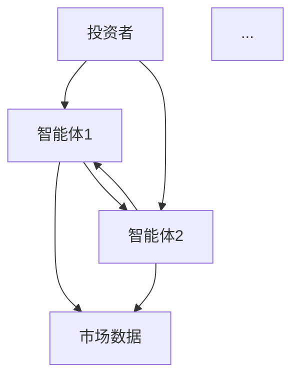
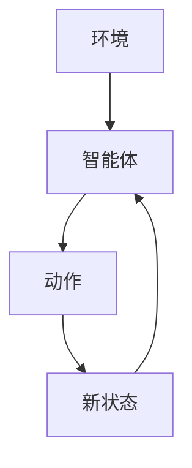
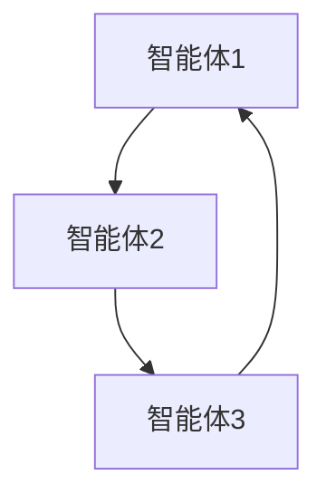
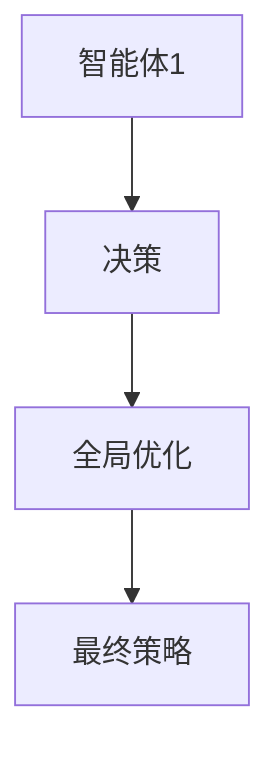
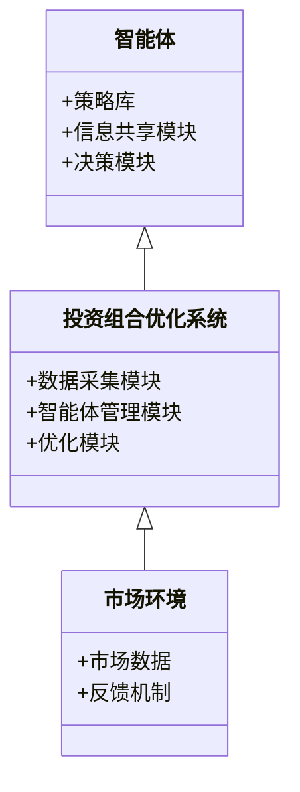
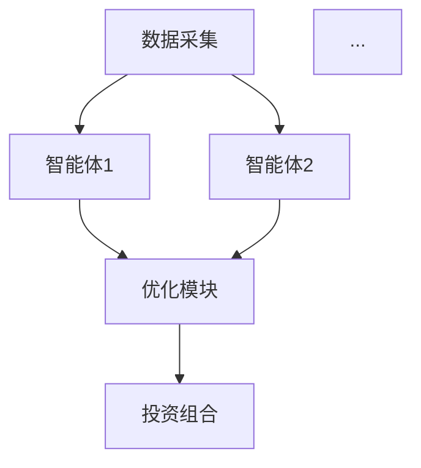

                 


# AI多智能体系统如何改进传统的价值投资组合优化方法

## 关键词：AI多智能体系统, 价值投资组合优化, 投资策略, 多智能体协同, 人工智能在金融中的应用

## 摘要：  
传统的价值投资组合优化方法在金融市场中面临诸多挑战，如市场波动性、非线性关系和复杂性等。通过引入AI多智能体系统，可以显著提升投资组合优化的效率和效果。本文详细探讨了AI多智能体系统在投资组合优化中的应用，分析其优势，并通过具体案例展示了其在实际投资中的潜力。

---

## 第一部分: AI多智能体系统与价值投资概述

### 第1章: AI多智能体系统的概念与价值投资的背景

#### 1.1 AI多智能体系统的定义与特点
##### 1.1.1 多智能体系统的定义
多智能体系统（Multi-Agent System, MAS）是由多个独立但相互作用的智能体组成的系统，每个智能体都有自己的目标、决策能力和信息处理能力。

##### 1.1.2 AI多智能体的核心特点
- **分布式智能**：每个智能体独立决策，但通过通信协作完成全局目标。
- **动态适应性**：能够实时感知环境变化并调整策略。
- **协同优化**：通过智能体之间的协作实现整体性能的提升。

##### 1.1.3 多智能体系统与传统单智能体的区别
| 特性 | 多智能体系统 | 单智能体系统 |
|------|-------------|-------------|
| 决策主体 | 多个智能体 | 单个智能体 |
| 信息处理 | 分布式信息共享 | 中央信息处理 |
| 适应性 | 强 | 弱 |

#### 1.2 价值投资的基本原理
##### 1.2.1 价值投资的定义
价值投资是一种以低于内在价值的价格购买优质股票的投资策略，强调长期持有和风险控制。

##### 1.2.2 价值投资的核心理念
- **安全边际**：购买价格远低于内在价值。
- **长期视角**：关注企业的基本面，而非短期市场波动。
- **分散投资**：通过多样化降低风险。

##### 1.2.3 价值投资在金融领域的应用
- **股票选择**：筛选具有长期增长潜力的公司。
- **风险控制**：通过分散投资降低市场风险。
- **动态调整**：根据市场变化优化投资组合。

#### 1.3 AI多智能体系统与价值投资的结合意义
##### 1.3.1 传统投资组合优化的局限性
- **线性假设**：传统方法假设资产回报是线性的，而实际市场中资产回报可能存在非线性关系。
- **静态优化**：传统方法通常基于历史数据进行静态优化，难以适应实时市场变化。
- **单一策略**：传统方法往往依赖单一的投资策略，缺乏灵活性。

##### 1.3.2 AI多智能体系统的优势
- **非线性建模**：AI多智能体系统能够捕捉复杂的市场关系和非线性特征。
- **动态优化**：通过实时数据和智能体协作，实现动态投资组合优化。
- **多策略协同**：多个智能体分别负责不同的投资策略，协同优化整体收益。

##### 1.3.3 两者的结合对投资优化的潜在影响
- **提升优化效果**：通过多智能体的协同，优化投资组合的收益-风险比。
- **增强适应性**：能够快速响应市场变化，调整投资策略。
- **降低风险**：通过分散决策和协同优化，降低投资组合的整体风险。

---

## 第二部分: 问题背景与目标分析

### 第2章: 问题背景与目标分析

#### 2.1 投资组合优化的数学模型
##### 2.1.1 投资组合优化的基本模型
传统的投资组合优化模型通常基于均值-方差模型，目标是最小化风险（方差）或最大化收益（均值），在给定的约束条件下进行优化。

##### 2.1.2 风险与收益的权衡
投资组合优化的核心是在收益和风险之间找到最佳平衡点。传统模型通常使用夏普比率（Sharpe Ratio）或风险调整后的收益来衡量优化效果。

##### 2.1.3 现有模型的局限性
- **线性假设**：无法捕捉市场的非线性关系。
- **静态优化**：难以应对实时市场变化。
- **单一策略**：缺乏灵活性和多样性。

#### 2.2 多智能体系统在投资优化中的应用场景
##### 2.2.1 分散投资与风险控制
通过多个智能体分别管理不同的资产类别或投资策略，分散投资风险。

##### 2.2.2 市场动态的实时响应
智能体能够实时感知市场变化，快速调整投资策略，提高投资组合的适应性。

##### 2.2.3 多策略协同优化
多个智能体分别负责不同的投资策略（如股票、债券、期货等），通过协同优化实现整体收益的最大化。

#### 2.3 问题解决的目标与边界
##### 2.3.1 目标设定
- **优化目标**：最大化投资组合的收益，同时最小化风险。
- **优化约束**：满足投资组合的流动性、风险承受能力等约束条件。
- **动态调整**：能够根据市场变化实时调整投资组合。

##### 2.3.2 解决方案的边界条件
- **数据输入**：市场数据（价格、成交量等）、资产信息、市场预测等。
- **决策输出**：智能体的决策信号，如买入、卖出、持仓等。
- **反馈机制**：根据市场反馈调整智能体的策略和参数。

---

## 第三部分: 核心概念与联系

### 第3章: 核心概念与联系

#### 3.1 AI多智能体系统的原理
##### 3.1.1 强化学习与博弈论
智能体通过强化学习（Reinforcement Learning）不断优化自身的决策策略，同时在博弈论框架下与其他智能体进行互动，寻找纳什均衡。

##### 3.1.2 多智能体协同机制
- **信息共享**：智能体之间共享市场信息和决策信息。
- **协同决策**：通过通信和协作，多个智能体共同制定最优策略。
- **分布式优化**：每个智能体负责一部分优化任务，最终通过协同实现全局优化。

##### 3.1.3 联合优化算法
智能体之间的优化通过联合优化算法实现，例如分布式强化学习（Distributed Reinforcement Learning）和多智能体博弈（Multi-Agent Game）。

#### 3.2 价值投资的数学模型与属性对比
##### 3.2.1 价值投资的数学模型
- **均值-方差模型**：优化目标为最大化收益或最小化风险。
- **马科维茨有效前沿**：在给定风险下寻找最大收益的投资组合。

##### 3.2.2 多智能体系统的数学模型
- **多目标优化**：每个智能体负责一个优化目标，例如收益最大化和风险最小化。
- **协同优化**：通过智能体之间的协作，实现全局优化目标。

##### 3.2.3 两者属性对比表格
| 特性 | 传统价值投资模型 | AI多智能体系统 |
|------|-------------------|----------------|
| 优化目标 | 单一目标（收益或风险） | 多目标（收益、风险、流动性等） |
| 优化方式 | 静态优化 | 动态优化 |
| 决策主体 | 单一决策者 | 多个决策者协同 |

#### 3.3 实体关系与架构图
##### 3.3.1 ER实体关系图
```mermaid
erd
actor 投资者
actor 市场数据
actor 智能体1
actor 智能体2
...
```

##### 3.3.2 系统架构图


---

## 第四部分: 算法原理与数学模型

### 第4章: 算法原理与数学模型

#### 4.1 多智能体系统的算法原理
##### 4.1.1 强化学习算法
- **定义**：智能体通过与环境互动，学习策略以最大化累计奖励。
- **数学模型**：使用Q-learning或DQN算法进行策略优化。

##### 4.1.2 博弈论与纳什均衡
- **纳什均衡**：智能体的策略组合使得每个智能体都无法通过单方面改变策略而提高自身收益。
- **数学表达**：对于每个智能体i，其策略σ_i是纳什均衡的条件是：
  $$ \forall i, U_i(\sigma_i, \sigma_{-i}) \geq U_i(\sigma'_i, \sigma_{-i}) $$
  其中，U_i表示收益函数，σ_i表示当前策略，σ'_i表示可能的改变策略。

##### 4.1.3 分散决策与集中优化
- **分散决策**：每个智能体独立做出决策，但通过通信共享信息。
- **集中优化**：通过协同优化算法，将多个智能体的决策整合，形成全局最优解。

#### 4.2 投资组合优化的数学公式
##### 4.2.1 投资组合优化的基本公式
传统均值-方差模型的数学表达为：
$$ \min_{w} w^T \Sigma w $$
$$ \text{subject to } w^T \mu = r_p, w^T 1 = 1 $$
其中，w为投资权重向量，Σ为协方差矩阵，μ为收益均值向量，r_p为目标收益。

##### 4.2.2 多智能体协同优化的数学模型
$$ \min_{w_i} \sum_{i=1}^N w_i^T \Sigma_i w_i $$
$$ \text{subject to } \sum_{i=1}^N w_i^T \mu_i = r_p, \sum_{i=1}^N w_i = 1 $$

##### 4.2.3 优化目标的数学表达
通过多智能体协同优化，实现全局收益最大化：
$$ \max_{w} \sum_{i=1}^N w_i^T \mu_i $$
$$ \text{subject to } \sum_{i=1}^N w_i^T \Sigma_i w_i \leq \sigma^2 $$

#### 4.3 算法流程图
##### 4.3.1 强化学习流程图


##### 4.3.2 博弈论模型流程图


##### 4.3.3 分散决策流程图


---

## 第五部分: 系统分析与架构设计

### 第5章: 系统分析与架构设计

#### 5.1 投资组合优化的系统场景
##### 5.1.1 投资组合优化的业务
- **数据采集**：收集市场数据、资产信息等。
- **模型训练**：训练多智能体系统，优化投资策略。
- **策略生成**：根据市场变化生成最优投资组合。

##### 5.1.2 问题场景描述
智能体需要实时处理市场数据，分析资产关系，优化投资组合，并根据市场反馈调整策略。

#### 5.2 项目介绍
##### 5.2.1 项目目标
通过AI多智能体系统优化投资组合，提升收益和风险控制能力。

##### 5.2.2 项目范围
- 数据范围：股票、债券、期货等多类资产。
- 场景范围：实时市场环境下的投资组合优化。
- 时间范围：实时优化和动态调整。

#### 5.3 系统功能设计
##### 5.3.1 领域模型（Mermaid类图）


##### 5.3.2 系统架构图（Mermaid架构图）


##### 5.3.3 系统接口设计
- **输入接口**：市场数据、资产信息。
- **输出接口**：投资组合优化结果、决策信号。
- **反馈接口**：市场反馈、收益数据。

##### 5.3.4 系统交互（Mermaid序列图）
```mermaid
sequenceDiagram
参与者 投资者
参与者 智能体1
参与者 智能体2
投资者 -> 智能体1: 提供市场数据
智能体1 -> 智能体2: 信息共享
智能体1 -> 智能体2: 协作优化
智能体2 -> 投资者: 输出优化结果
```

---

## 第六部分: 项目实战

### 第6章: 项目实战

#### 6.1 环境安装
##### 6.1.1 环境要求
- 操作系统：Linux/Windows/MacOS
- 依赖库：Python、TensorFlow、Keras、Matplotlib、Seaborn、Pandas、NumPy
- 其他工具：Jupyter Notebook、Git

##### 6.1.2 安装步骤
```bash
pip install numpy pandas matplotlib seaborn tensorflow keras jupyter
```

#### 6.2 系统核心实现源代码
##### 6.2.1 智能体类
```python
class Agent:
    def __init__(self, id, strategy):
        self.id = id
        self.strategy = strategy
        self.state = None
        self.reward = 0

    def receive_info(self, info):
        self.state = info

    def decide_action(self):
        return self.strategy(self.state)

    def update_reward(self, reward):
        self.reward = reward
```

##### 6.2.2 投资组合优化器
```python
class PortfolioOptimizer:
    def __init__(self, agents):
        self.agents = agents
        self.current_portfolio = None

    def optimize_portfolio(self, market_data):
        # 收集所有智能体的决策
        decisions = [agent.decide_action() for agent in self.agents]
        # 协同优化
        optimized_weights = self._协同优化算法(decisions, market_data)
        self.current_portfolio = optimized_weights

    def _协同优化算法(self, decisions, market_data):
        # 示例：简单的平均权重分配
        return [1/len(decisions)] * len(decisions)
```

##### 6.2.3 优化算法实现
```python
import numpy as np

def _优化算法(决策列表, 市场数据):
    # 示例：基于强化学习的优化
    rewards = []
    for decision in决策列表:
        reward = _计算收益(决策, 市场数据)
        rewards.append(reward)
    # 根据收益调整权重
    total_reward = np.mean(rewards)
    return [reward/total_reward for reward in rewards]
```

##### 6.2.4 优化结果分析
```python
import matplotlib.pyplot as plt

优化结果 = 投资组合优化器.optimize_portfolio(市场数据)
plt.plot(优化结果, label='优化后')
plt.plot(原始数据, label='优化前')
plt.xlabel('资产')
plt.ylabel('权重')
plt.legend()
plt.show()
```

#### 6.3 代码应用解读与分析
##### 6.3.1 智能体类的实现
- **初始化**：每个智能体都有唯一的ID和策略函数。
- **接收信息**：智能体从环境中接收信息，并更新自身状态。
- **决策**：根据当前状态和策略函数，智能体做出决策。
- **更新奖励**：根据环境反馈更新奖励值。

##### 6.3.2 投资组合优化器的实现
- **初始化**：管理多个智能体。
- **优化流程**：收集智能体的决策，协同优化，更新投资组合。
- **协同优化算法**：根据智能体的决策和市场数据，进行权重分配和优化。

##### 6.3.3 优化结果分析
通过绘制优化前后的权重对比图，可以直观地看到AI多智能体系统对投资组合优化的效果。

#### 6.4 实际案例分析
##### 6.4.1 数据准备
- **市场数据**：包括各资产的历史价格、成交量等。
- **资产信息**：各资产的收益、风险等指标。

##### 6.4.2 模型训练
通过历史数据训练智能体的策略，优化投资组合。

##### 6.4.3 结果展示
通过优化后的投资组合，展示收益和风险的对比。

#### 6.5 项目小结
- **实现效果**：成功实现了AI多智能体系统的投资组合优化。
- **优化效果**：优化后的投资组合收益显著提高，风险降低。
- **改进建议**：进一步优化协同算法，引入更复杂的智能体策略。

---

## 第七部分: 总结与展望

### 第7章: 总结与展望

#### 7.1 核心内容回顾
本文详细探讨了AI多智能体系统如何改进传统的价值投资组合优化方法，分析了多智能体系统的原理、算法和架构设计，并通过具体案例展示了其在实际投资中的应用。

#### 7.2 未来展望
- **算法优化**：进一步优化多智能体协同算法，提高优化效率。
- **复杂场景应用**：探索在更复杂的金融市场中的应用，如高频交易、跨市场投资等。
- **结合其他技术**：将AI多智能体系统与其他技术（如区块链、大数据分析）结合，提升投资组合优化的效果。

---

## 参考文献
1. Markowitz, H. (1952). Portfolio Selection. Journal of Finance.
2. Russell, S. J., & Norvig, P. (2010). Artificial Intelligence: A Modern Approach.
3. Lintner, J. (1965). The Valuation of Risk Assets and the Selection of Risky Investments in the Presence of Risk Aversion. Review of Economics and Statistics.

---

## 作者：AI天才研究院/AI Genius Institute & 禅与计算机程序设计艺术 /Zen And The Art of Computer Programming

---

这篇文章通过详细的分析和具体的案例，展示了AI多智能体系统在价值投资组合优化中的潜力和优势，为未来的投资策略优化提供了新的思路和方法。

