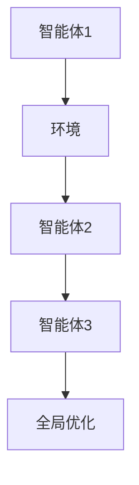
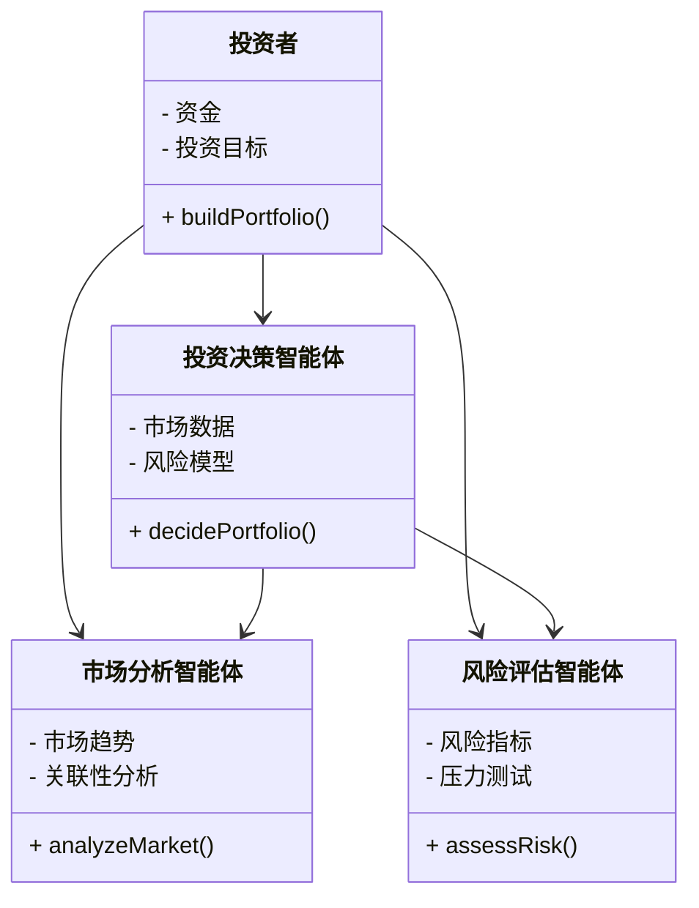
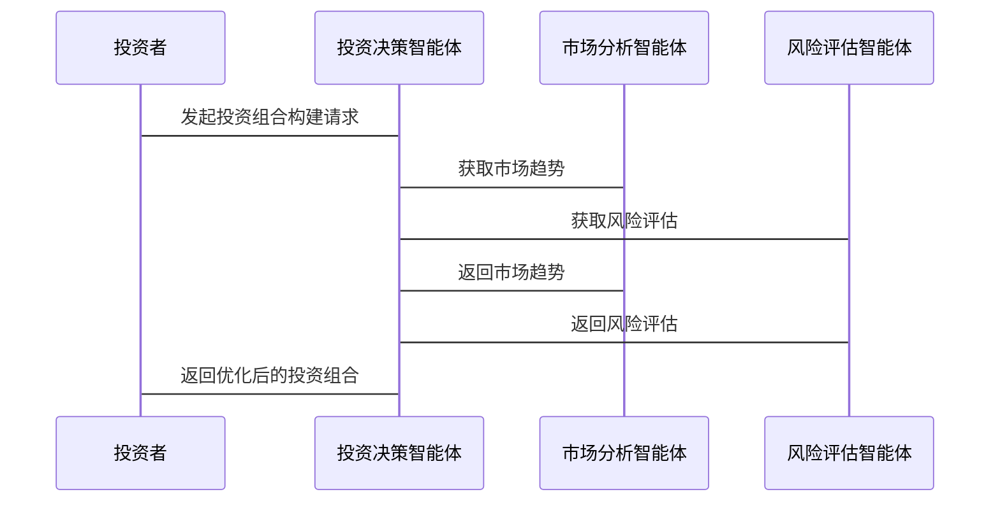

                 


# AI多智能体系统如何改进传统的价值投资组合构建方法

> 关键词：AI多智能体系统，投资组合优化，强化学习，分布式计算，金融建模，风险管理

> 摘要：  
传统的价值投资组合构建方法在金融市场中面临诸多挑战，包括复杂性、不确定性以及数据量的爆炸式增长。本文探讨了AI多智能体系统如何通过协作学习和分布式计算的优势，优化投资组合构建过程。通过分析多智能体系统的原理、算法实现及其在投资组合优化中的应用场景，本文揭示了AI多智能体系统在提升投资组合构建效率和效果方面的巨大潜力。

---

# 第1章: 价值投资组合构建的背景与挑战

## 1.1 价值投资组合构建的定义与传统方法

### 1.1.1 价值投资组合构建的核心概念
投资组合构建是金融领域中的核心任务，旨在通过合理配置不同资产（如股票、债券、基金等）来实现风险与收益的最佳平衡。传统的价值投资方法通常依赖于历史数据分析、市场趋势分析以及经验判断，以确定最优的资产配置策略。

### 1.1.2 传统价值投资组合构建的流程与方法
传统投资组合构建的流程大致如下：
1. **数据收集**：收集历史市场数据、资产收益数据等。
2. **资产选择**：根据历史表现和风险特征选择优质资产。
3. **风险评估**：评估各资产的风险水平（如波动率、相关性等）。
4. **优化配置**：通过数学模型（如均值-方差优化）确定最优的资产权重。
5. **监控与调整**：定期监控市场变化并调整投资组合。

### 1.1.3 传统方法的优缺点分析
- **优点**：方法成熟，易于理解和实现。
- **缺点**：  
  - 依赖历史数据，可能无法捕捉市场突变（如金融危机）。
  - 单一的优化目标可能导致次优解。
  - 对市场数据的实时性要求高，传统方法难以应对高频交易的需求。

---

## 1.2 投资组合构建中的关键问题

### 1.2.1 风险与收益的平衡
投资组合构建的核心目标是在给定风险水平下最大化收益，或在给定收益下最小化风险。然而，传统方法往往过于简化，难以捕捉复杂的市场动态。

### 1.2.2 资产配置与市场波动
市场波动性是影响投资组合表现的重要因素。传统方法通常假设资产收益符合正态分布，但在实际市场中，极端事件（如“黑天鹅”）往往对投资组合造成重大影响。

### 1.2.3 数据驱动与模型选择
传统方法依赖于统计模型（如CAPM、APT等），但这些模型在实际应用中存在诸多限制，尤其是在数据质量和数量不足的情况下。

---

# 第2章: AI多智能体系统的基本原理

## 2.1 AI多智能体系统的定义与特点

### 2.1.1 多智能体系统的定义
多智能体系统（Multi-Agent System, MAS）是指由多个智能体（Agent）组成的分布式系统，每个智能体都能独立感知环境、做出决策并进行交互。

### 2.1.2 AI多智能体系统的独特优势
- **分布式计算**：多个智能体协同工作，避免单点故障。
- **自主决策**：每个智能体基于自身信息做出决策，提高系统的灵活性。
- **协作优化**：通过智能体之间的协作，实现全局最优。

### 2.1.3 多智能体系统与传统单智能体系统的对比
| 特性 | 单智能体系统 | 多智能体系统 |
|------|--------------|-------------|
| 决策中心化 | 是          | 否         |
| 系统灵活性 | 低          | 高         |
| 容错性   | 低          | 高         |

---

## 2.2 AI多智能体系统在金融领域的应用前景

### 2.2.1 金融领域的复杂性与多智能体系统的契合
金融市场的复杂性要求投资组合构建系统具备高度的适应性和实时性。AI多智能体系统通过分布式计算和协作学习，能够更好地应对市场变化。

### 2.2.2 多智能体系统在投资组合构建中的潜在价值
- **实时数据处理**：多个智能体协同处理高频数据，提高决策速度。
- **风险分散**：通过分布式决策，降低单一智能体的决策风险。
- **动态优化**：智能体实时调整策略，适应市场变化。

---

# 第3章: AI多智能体系统的协作机制与算法

## 3.1 多智能体系统的协作机制

### 3.1.1 信息共享与协调
智能体之间通过共享信息（如市场数据、风险评估）进行协调。信息共享可以通过分布式数据库或消息队列实现。

### 3.1.2 分层决策与任务分配
多智能体系统通常采用分层架构，高层智能体负责任务分配和整体协调，低层智能体负责具体执行。

### 3.1.3 竞争与合作的平衡
在多智能体系统中，智能体之间需要在竞争与合作之间找到平衡，以实现全局最优。

---

## 3.2 基于强化学习的多智能体协作算法

### 3.2.1 强化学习的基本原理
强化学习（Reinforcement Learning, RL）是一种通过智能体与环境交互来学习策略的方法。智能体通过试错不断优化其行为策略，以最大化累积奖励。

### 3.2.2 多智能体协作的挑战与解决方案
- **挑战**：智能体之间的协作需要解决通信开销、策略同步等问题。
- **解决方案**：采用分布式强化学习算法（如分布式AC（Actor-Critic）算法），通过智能体之间的协作实现全局优化。

### 3.2.3 算法流程图


---

## 3.3 投资组合优化的数学模型

### 3.3.1 传统优化模型
$$ \text{目标函数：} \quad \min_{w} \frac{1}{2}w^T \Sigma w $$
$$ \text{约束条件：} \quad \sum_{i=1}^n w_i = 1 $$
$$ \quad \quad \quad \quad w_i \geq 0 \quad \forall i $$

### 3.3.2 多智能体协作下的优化模型
$$ \text{目标函数：} \quad \min_{w} \frac{1}{2}w^T \Sigma w - \sum_{i=1}^m \alpha_i w_i $$
$$ \text{约束条件：} \quad \sum_{i=1}^n w_i = 1 $$
$$ \quad \quad \quad \quad w_i \geq 0 \quad \forall i $$

---

# 第4章: 系统分析与架构设计

## 4.1 系统功能需求分析

### 4.1.1 投资组合构建的核心功能
1. **数据采集**：实时采集市场数据。
2. **资产分析**：分析各资产的风险和收益特征。
3. **优化配置**：基于多智能体协作算法优化投资组合。
4. **监控与调整**：实时监控市场变化并调整投资组合。

### 4.1.2 系统架构图


---

## 4.2 系统架构设计

### 4.2.1 分层架构设计
- **数据层**：负责数据的采集、存储和管理。
- **智能体层**：包括多个智能体，负责具体的分析和决策。
- **协调层**：负责智能体之间的协作和任务分配。

### 4.2.2 系统交互流程


---

# 第5章: 项目实战

## 5.1 环境安装与配置

### 5.1.1 系统环境
- 操作系统：Linux/Windows
- 编程语言：Python 3.8+
- 库依赖：TensorFlow、Keras、NumPy、Matplotlib

### 5.1.2 安装依赖
```bash
pip install tensorflow keras numpy matplotlib
```

---

## 5.2 核心实现代码

### 5.2.1 多智能体协作算法实现
```python
import numpy as np
import tensorflow as tf
from tensorflow.keras import layers

class Agent:
    def __init__(self, state_space, action_space):
        self.model = self.build_model(state_space, action_space)
        self.optimizer = tf.keras.optimizers.Adam(learning_rate=0.001)
    
    def build_model(self, state_space, action_space):
        model = tf.keras.Sequential([
            layers.Dense(64, activation='relu', input_dim=state_space),
            layers.Dense(action_space, activation='linear')
        ])
        return model
    
    def act(self, state):
        prediction = self.model.predict(np.array([state]))[0]
        return prediction.argmax()
    
    def update(self, state, action, reward, next_state):
        target = reward + 0.98 * np.max(self.model.predict(np.array([next_state]))[0])
        target = target.reshape((-1, 1))
        self.model.fit(np.array([state]), target, epochs=1, verbose=0)
```

---

## 5.3 实际案例分析

### 5.3.1 数据准备
```python
import pandas as pd
data = pd.read_csv('market_data.csv')
```

### 5.3.2 模型训练
```python
agents = [Agent(state_space, action_space)]
for epoch in range(100):
    for agent in agents:
        state = get_current_state(data)
        action = agent.act(state)
        reward = compute_reward(data, action)
        next_state = get_next_state(data)
        agent.update(state, action, reward, next_state)
```

---

## 5.4 系统优化与调优

### 5.4.1 参数调整
- 调整强化学习的奖励机制。
- 优化神经网络的结构和超参数。

### 5.4.2 系统性能监控
- 监控系统的运行效率。
- 定期评估投资组合的表现。

---

# 第6章: 总结与展望

## 6.1 系统总结

### 6.1.1 AI多智能体系统的优缺点
- **优点**：  
  - 高效性：通过分布式计算提高处理速度。  
  - 精准性：多个智能体协作优化投资组合。  
- **缺点**：  
  - 复杂性：系统设计和维护难度较高。  
  - 成本：需要大量的计算资源。

### 6.1.2 最佳实践 Tips
- 在实际应用中，建议结合市场专家的意见，对AI多智能体系统的决策进行验证。
- 定期更新智能体的模型和参数，以适应市场的变化。

---

## 6.2 展望与未来方向

### 6.2.1 研究方向
- 探索更高效的多智能体协作算法。
- 研究多智能体系统在更复杂金融场景中的应用。

### 6.2.2 未来技术发展趋势
- 结合区块链技术，提高系统的安全性和透明性。
- 利用边缘计算，提升系统的实时性和响应速度。

---

# 作者：AI天才研究院/AI Genius Institute & 禅与计算机程序设计艺术 /Zen And The Art of Computer Programming

---

通过本文的系统分析和详细讲解，我们展示了AI多智能体系统在价值投资组合构建中的潜力和优势。希望本文能够为金融领域的从业者和技术研究人员提供有价值的参考和启发。

