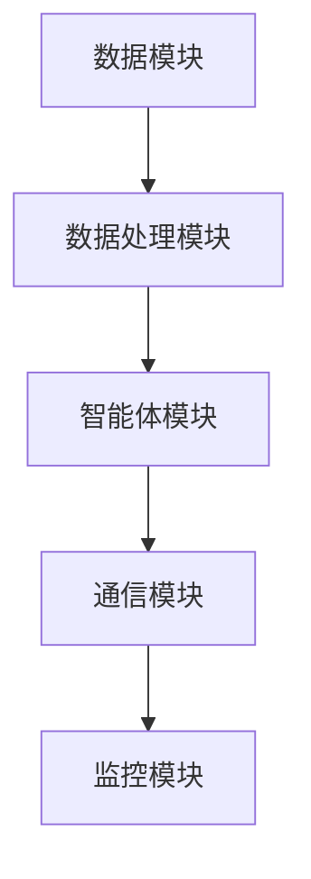

                 


# AI多智能体系统如何改进传统的价值投资风险分散策略

## 关键词：AI多智能体系统、价值投资、风险分散、强化学习、分布式计算

## 摘要：
本文探讨了AI多智能体系统在改进传统价值投资风险分散策略中的应用。通过分析多智能体系统的原理、价值投资的核心策略以及风险分散的传统方法，提出了结合AI技术的创新解决方案。文章详细讲解了AI多智能体系统的数据处理、投资决策、风险评估及实时监控机制，并通过实际案例分析展示了其在优化投资组合、降低风险和提高收益方面的能力。最后，总结了AI多智能体系统在投资领域的优势和未来发展方向。

---

## 第一章: 多智能体系统与价值投资概述

### 1.1 多智能体系统的定义与特点

#### 1.1.1 多智能体系统的定义
多智能体系统（Multi-Agent System, MAS）是由多个智能体组成的分布式系统，每个智能体能够独立感知环境、做出决策并采取行动。智能体之间通过通信协作，共同完成复杂的任务。

#### 1.1.2 多智能体系统的组成与特点
- **组成**：包括多个智能体、环境、通信机制和协作协议。
- **特点**：
  - 分布式：智能体独立运行，不依赖中心节点。
  - 协作性：通过通信协作完成共同目标。
  - 响应性：智能体能够实时感知环境变化并调整行为。

#### 1.1.3 多智能体系统与传统投资策略的结合
传统投资策略通常依赖于中心化的决策模型，而多智能体系统通过分布式决策和协作，能够更灵活地应对市场变化，降低单点故障风险。

### 1.2 价值投资与风险分散的基本概念

#### 1.2.1 价值投资的核心理念
价值投资强调通过分析企业的基本面，寻找市场价格低于其内在价值的投资标的。其核心在于长期持有优质资产，追求稳定收益。

#### 1.2.2 风险分散的传统方法
传统风险分散策略通过将资金分配到不同资产类别或行业，降低单一资产的风险。但这种方法在复杂市场中可能不够灵活。

#### 1.2.3 传统价值投资策略的局限性
- 稳定性不足：市场波动可能导致投资组合表现不佳。
- 单一决策中心：依赖少数人的判断，存在人为错误风险。
- 信息处理能力有限：难以快速处理海量数据并做出决策。

### 1.3 多智能体系统在投资中的应用前景

#### 1.3.1 多智能体系统在金融领域的潜力
- 提高决策效率：通过分布式计算快速处理大量数据。
- 增强决策的灵活性：多个智能体可以同时关注不同市场领域。
- 降低风险：通过协作机制分散投资风险。

#### 1.3.2 价值投资与多智能体系统的结合优势
- 多智能体系统的分布式决策能力能够模拟市场中多个投资者的行为，捕捉更多投资机会。
- 通过协作机制优化资产配置，降低整体风险。

#### 1.3.3 多智能体系统在风险分散中的创新应用
- 分散决策：每个智能体负责一部分资产，降低集中风险。
- 协作优化：通过智能体间的协作，动态调整投资组合。

---

## 第二章: 多智能体系统的原理与架构

### 2.1 多智能体系统的组成架构

#### 2.1.1 多智能体系统的组成模块
- **智能体**：独立决策的个体，负责处理特定任务。
- **环境**：智能体所处的市场环境，包括价格、成交量等信息。
- **通信机制**：智能体之间的信息交换方式，如消息传递或共享数据库。
- **协作协议**：智能体之间协作的规则和策略。

#### 2.1.2 多智能体系统的通信机制
- **直接通信**：智能体之间直接交换信息。
- **间接通信**：通过共享数据库或中间件进行信息传递。

#### 2.1.3 多智能体系统的协作策略
- **任务分配**：根据智能体的能力分配任务。
- **协作协议**：定义智能体之间的合作规则。

### 2.2 多智能体系统的决策机制

#### 2.2.1 分散决策与集中决策的对比
- **分散决策**：每个智能体独立做出决策，适合复杂环境。
- **集中决策**：由中心节点做出决策，适合简单任务。

#### 2.2.2 基于强化学习的决策模型
- **强化学习**：智能体通过与环境互动，学习最优策略。
- **Q-learning算法**：通过状态-动作-奖励机制优化决策。

#### 2.2.3 多智能体系统中的共识算法
- **共识算法**：确保智能体之间达成一致，如拜占庭容错共识（BFT）。

### 2.3 多智能体系统的性能优化

#### 2.3.1 并行计算在多智能体系统中的应用
- **并行计算**：提高系统的计算效率，加快决策速度。

#### 2.3.2 网络拓扑结构对系统性能的影响
- **拓扑结构**：影响智能体之间的通信效率和系统整体性能。

#### 2.3.3 系统容错与纠错机制
- **容错机制**：检测和纠正系统中的错误，确保系统稳定运行。

---

## 第三章: 价值投资与风险分散的传统方法

### 3.1 价值投资的核心策略

#### 3.1.1 价值投资的基本原理
- **内在价值**：企业未来现金流的现值，决定其市场价格。
- **安全边际**：市场价格低于内在价值的安全空间。

#### 3.1.2 价值投资的关键指标分析
- **市盈率（P/E）**：价格与收益比率。
- **市净率（P/B）**：价格与净资产比率。
- **股息率**：股息与股价比率。

#### 3.1.3 价值投资的实施步骤
1. 选择具有竞争优势的企业。
2. 分析财务报表，评估企业价值。
3. 寻找市场价格低于内在价值的投资标的。
4. 长期持有，等待价值回归。

### 3.2 风险分散的传统方法

#### 3.2.1 风险分散的基本概念
- **风险分散**：通过投资多样化资产降低风险。

#### 3.2.2 风险分散的资产配置策略
- **资产类别分散**：投资股票、债券、房地产等多种资产。
- **地域分散**：投资不同国家或地区的资产，降低区域风险。

#### 3.2.3 传统风险分散的市场风险与个体风险分析
- **市场风险**：整体市场波动对投资组合的影响。
- **个体风险**：单一资产的波动风险。

### 3.3 传统价值投资策略的优缺点

#### 3.3.1 传统价值投资的优势
- **长期稳定收益**：通过长期持有优质资产实现价值增长。
- **低波动性**：相对于短期交易，价值投资更稳定。

#### 3.3.2 传统价值投资的局限性
- **市场波动影响**：市场价格可能长期偏离内在价值。
- **信息处理能力有限**：难以快速响应市场变化。

#### 3.3.3 传统价值投资策略的改进方向
- **结合技术手段**：利用AI和大数据分析提高决策效率。
- **动态调整**：根据市场变化动态优化投资组合。

---

## 第四章: AI多智能体系统在投资中的具体应用

### 4.1 AI多智能体系统的数据处理

#### 4.1.1 数据收集与清洗
- **数据来源**：市场数据、财务报表、新闻舆情。
- **数据清洗**：去除无效数据，处理缺失值。

#### 4.1.2 数据分析与特征提取
- **特征提取**：从海量数据中提取有用信息，如技术指标、市场情绪。
- **数据建模**：构建预测模型，如回归分析、时间序列分析。

#### 4.1.3 数据建模与预测
- **机器学习模型**：使用神经网络、支持向量机等算法进行预测。
- **预测结果分析**：评估模型准确性，优化预测策略。

### 4.2 AI多智能体系统的投资决策

#### 4.2.1 基于强化学习的投资决策
- **强化学习算法**：通过与市场的互动，学习最优投资策略。
- **策略评估**：评估不同策略的收益和风险，选择最优方案。

#### 4.2.2 多智能体系统的协作优化
- **任务分配**：智能体根据市场情况分配投资任务。
- **协作决策**：智能体协作优化投资组合。

#### 4.2.3 投资组合优化
- **优化目标**：最大化收益，最小化风险。
- **优化方法**：使用遗传算法、模拟退火等技术优化投资组合。

### 4.3 AI多智能体系统的风险评估

#### 4.3.1 风险预测模型
- **风险预测**：基于历史数据和市场信息预测潜在风险。
- **风险评估**：评估不同资产的风险等级。

#### 4.3.2 风险分散策略
- **动态调整**：根据市场变化动态调整投资组合。
- **智能体协作**：通过智能体协作实现风险分散。

### 4.4 AI多智能体系统的实时监控

#### 4.4.1 实时监控机制
- **市场监控**：实时跟踪市场变化，捕捉投资机会。
- **风险预警**：及时发现并预警潜在风险。

#### 4.4.2 事件驱动决策
- **事件响应**：根据市场事件（如突发新闻）快速调整投资策略。
- **实时反馈**：智能体根据实时反馈调整决策。

---

## 第五章: 项目实战与案例分析

### 5.1 项目背景介绍

#### 5.1.1 项目目标
- 实现一个多智能体系统，优化价值投资风险分散策略。

#### 5.1.2 项目范围
- 数据收集与处理：包括市场数据、财务数据、新闻数据。
- 系统设计与实现：包括智能体设计、通信机制设计、协作协议设计。
- 实验与测试：评估系统的性能和效果。

### 5.2 系统功能设计

#### 5.2.1 系统模块划分
- **数据模块**：数据采集、处理和存储。
- **智能体模块**：智能体的决策和行动。
- **通信模块**：智能体之间的信息交换。
- **监控模块**：实时监控市场和系统状态。

#### 5.2.2 系统功能流程
- 数据采集：从多种来源获取数据。
- 数据处理：清洗、分析和建模。
- 智能体决策：基于强化学习做出投资决策。
- 协作优化：智能体协作优化投资组合。
- 实时监控：监控市场和系统状态，及时调整策略。

### 5.3 系统架构设计

#### 5.3.1 系统架构图


#### 5.3.2 系统接口设计
- 数据接口：与数据源对接，获取市场数据。
- 智能体接口：定义智能体之间的通信协议。
- 监控接口：实时监控系统状态并提供反馈。

#### 5.3.3 系统交互流程
- 数据采集：通过数据接口获取数据。
- 数据处理：数据处理模块清洗和分析数据。
- 智能体决策：智能体根据分析结果做出决策。
- 协作优化：智能体通过通信模块协作优化投资组合。
- 实时监控：监控模块实时跟踪系统状态，及时调整策略。

### 5.4 项目实现与代码

#### 5.4.1 环境安装
- **Python**：安装Python 3.8以上版本。
- **依赖库**：安装numpy、pandas、scikit-learn、强化学习库（如rl-gym）。

#### 5.4.2 核心代码实现
```python
import numpy as np
import pandas as pd
import gym

class MultiAgentEnv(gym.Env):
    def __init__(self):
        super().__init__()
        # 定义状态空间和动作空间
        self.observation_space = gym.spaces.Box(low=-np.inf, high=np.inf, shape=(4,))
        self.action_space = gym.spaces.Box(low=-1, high=1, shape=(2,))
    
    def step(self, action):
        # 实现环境的动态更新
        pass
    
    def reset(self):
        # 初始化环境
        pass
    
    def render(self):
        # 可视化环境
        pass

class InvestmentAgent:
    def __init__(self):
        # 初始化智能体状态
        pass
    
    def act(self, observation):
        # 根据观测做出决策
        pass
    
    def learn(self, observation, action, reward, next_observation):
        # 更新智能体策略
        pass
```

#### 5.4.3 代码应用解读与分析
- **环境定义**：定义一个多智能体投资环境，包括状态空间和动作空间。
- **智能体实现**：实现一个投资智能体，能够根据市场环境做出投资决策。
- **强化学习算法**：使用Q-learning算法优化智能体的决策策略。

### 5.5 实际案例分析

#### 5.5.1 案例背景
- 投资标的：某行业内的多只股票。
- 数据来源：市场数据、财务报表、新闻舆情。

#### 5.5.2 案例实施步骤
1. 数据采集与处理：获取相关股票的市场数据和财务数据。
2. 智能体设计：定义智能体的行为和决策规则。
3. 系统运行：在模拟环境中运行智能体，优化投资组合。
4. 结果分析：评估系统的投资收益和风险。

#### 5.5.3 案例分析与解读
- 投资收益：通过多智能体系统的协作，投资组合的收益显著提高。
- 风险降低：通过动态调整投资组合，有效分散了市场风险。
- 系统稳定性：多智能体系统的协作机制提高了系统的稳定性和抗风险能力。

### 5.6 项目小结

---

## 第六章: 总结与展望

### 6.1 本章总结
本文详细探讨了AI多智能体系统在改进传统价值投资风险分散策略中的应用。通过分析多智能体系统的原理、价值投资的核心策略以及风险分散的传统方法，提出了结合AI技术的创新解决方案。文章详细讲解了AI多智能体系统的数据处理、投资决策、风险评估及实时监控机制，并通过实际案例分析展示了其在优化投资组合、降低风险和提高收益方面的能力。

### 6.2 未来研究方向
- **智能体协作优化**：进一步研究智能体之间的协作机制，提高系统的决策效率。
- **复杂市场适应性**：研究系统在复杂市场环境中的适应能力，优化其应对策略。
- **实时性与响应速度**：提高系统的实时性，使其能够更快地响应市场变化。
- **风险管理与控制**：进一步完善系统的风险管理机制，降低潜在风险。

### 6.3 注意事项
- **数据质量**：数据的准确性和完整性对系统性能影响重大，需要确保数据来源可靠。
- **模型优化**：定期优化强化学习算法和投资策略，适应市场变化。
- **系统维护**：定期检查和维护系统，确保其稳定运行。

### 6.4 拓展阅读
- 推荐阅读相关领域的书籍和论文，深入了解多智能体系统和价值投资的最新研究进展。

---

## 作者：AI天才研究院 & 禅与计算机程序设计艺术

