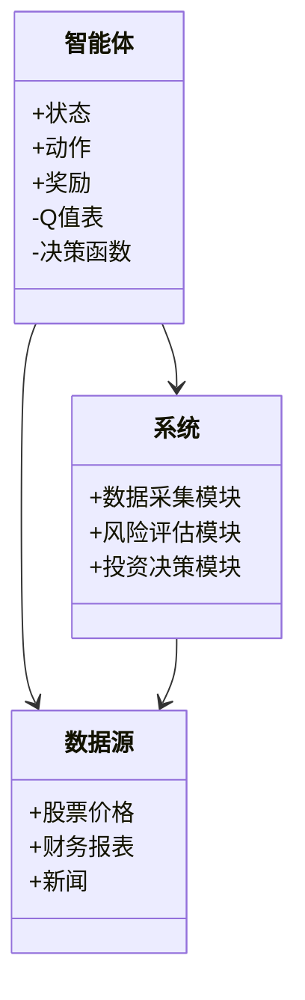
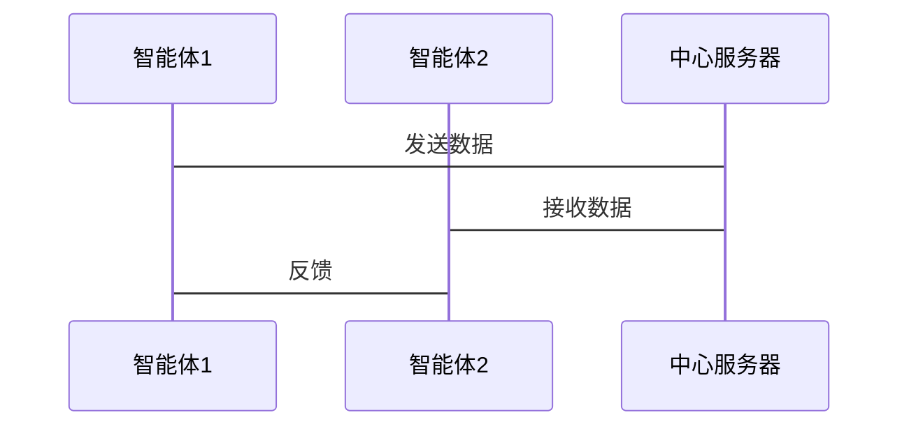
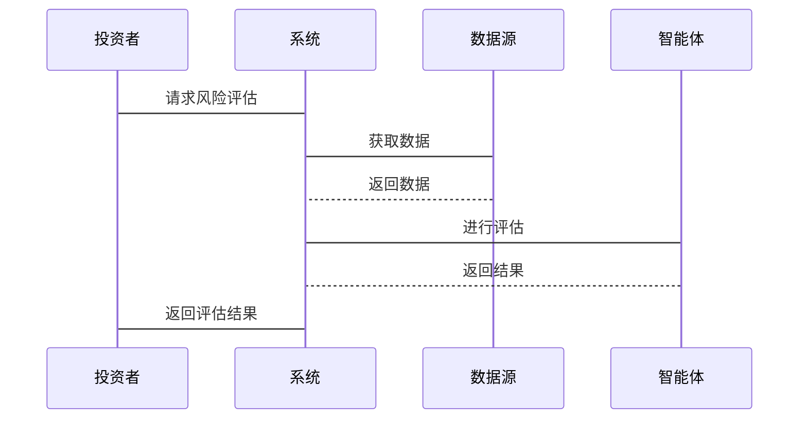

                 


# AI多智能体系统如何改进传统的价值投资风险评估方法

> 关键词：AI多智能体系统，价值投资，风险评估，博弈论，Q-learning算法

> 摘要：本文探讨了AI多智能体系统如何改进传统的价值投资风险评估方法。首先介绍了AI多智能体系统的概念及其在金融领域的应用背景，分析了传统价值投资风险评估方法的局限性。接着深入讲解了AI多智能体系统的博弈论基础和算法实现，特别是纳什均衡和Q-learning算法的应用。然后详细设计了AI多智能体系统的架构，包括数据流、接口设计和通信机制。最后通过项目实战部分，提供了具体的代码实现和实际案例分析，验证了AI多智能体系统在价值投资风险评估中的有效性和优势。

---

# 第一部分: AI多智能体系统与价值投资概述

## 第1章: AI多智能体系统的概念与背景

### 1.1 AI多智能体系统的定义与特点

#### 1.1.1 多智能体系统的定义
多智能体系统（Multi-Agent System, MAS）是由多个智能体（Agent）组成的分布式系统，这些智能体能够通过协作完成复杂的任务。每个智能体都是一个具有自主性、反应性和社会性的实体，能够感知环境、做出决策并采取行动。

#### 1.1.2 AI多智能体系统的独特优势
AI多智能体系统结合了人工智能和分布式计算的优势，能够处理复杂动态环境中的决策问题。与传统的单智能体系统相比，AI多智能体系统具有以下独特优势：
- **分布式计算**：多个智能体协同工作，提高系统的并行处理能力。
- **动态协作**：智能体之间能够动态调整协作关系，适应环境变化。
- **鲁棒性**：通过多个智能体的协作，系统能够容忍部分智能体的故障或失效。

#### 1.1.3 多智能体系统与传统单智能体系统的对比
| 对比维度 | 单智能体系统 | 多智能体系统 |
|----------|--------------|--------------|
| 决策中心化 | 单一决策中心 | 分散决策中心 |
| 可扩展性 | 有限 | 高 |
| 系统复杂性 | 简单 | 复杂 |
| 容错性 | 低 | 高 |

### 1.2 价值投资的基本原理

#### 1.2.1 价值投资的核心概念
价值投资是一种投资策略，旨在通过分析企业的基本面（如财务状况、行业地位、竞争优势等），找到被市场低估的投资标的。其核心思想是“买便宜的东西”，即以低于内在价值的价格买入优质资产。

#### 1.2.2 传统价值投资的风险评估方法
传统价值投资中的风险评估主要依赖于以下几个方面：
- **财务指标分析**：如市盈率（P/E）、市净率（P/B）、股息率等。
- **行业分析**：分析企业的行业地位、竞争优势、行业周期等。
- **宏观经济分析**：考虑宏观经济环境对企业盈利能力的影响。

#### 1.2.3 价值投资在现代金融中的应用现状
尽管价值投资在长期投资中表现优异，但在现代金融市场中，传统的方法面临着数据量大、信息复杂、市场波动剧烈等挑战，难以实时捕捉市场变化，容易错过投资机会或造成误判。

## 第2章: 传统价值投资风险评估的局限性

### 2.1 传统价值投资的评估模型

#### 2.1.1 市盈率法
市盈率（P/E）是股票价格与每股收益的比率，用于衡量股票的估值。公式为：
$$ \text{市盈率} = \frac{\text{股票价格}}{\text{每股收益}} $$

#### 2.1.2 市净率法
市净率（P/B）是股票价格与每股净资产的比率，用于衡量股票相对于其净资产的估值。公式为：
$$ \text{市净率} = \frac{\text{股票价格}}{\text{每股净资产}} $$

#### 2.1.3 股息率法
股息率是每股股息与股票价格的比率，用于衡量股票的分红能力。公式为：
$$ \text{股息率} = \frac{\text{每股股息}}{\text{股票价格}} $$

### 2.2 传统方法的局限性

#### 2.2.1 数据局限性
传统价值投资主要依赖于历史数据和财务报表，无法有效捕捉实时市场动态和非结构化数据（如新闻、社交媒体信息等）。

#### 2.2.2 模型假设的局限性
传统模型假设市场是理性的，忽略了市场的非理性波动和投资者情绪的影响。

#### 2.2.3 人为判断的偏差
投资决策过程中，人为的主观判断可能导致选择偏差和过度自信，影响决策的客观性。

### 2.3 引入AI多智能体系统的必要性

#### 2.3.1 提高数据处理能力
AI多智能体系统能够实时处理海量数据，包括结构化和非结构化数据，提供更全面的市场分析。

#### 2.3.2 增强模型的动态适应性
AI多智能体系统能够动态调整模型参数，适应市场环境的变化，提高风险评估的准确性。

#### 2.3.3 降低人为判断的干扰
通过AI多智能体系统的协作，减少人为情绪和偏见对投资决策的影响，提高决策的客观性。

---

# 第二部分: AI多智能体系统的原理与算法

## 第3章: 多智能体系统的博弈论基础

### 3.1 博弈论的基本概念

#### 3.1.1 理性决策与纳什均衡
纳什均衡是博弈论中的一个核心概念，指的是在其他参与者策略不变的情况下，参与者的策略选择无法通过单方面改变策略而获得更好的结果。数学上，纳什均衡可以表示为：
$$ (s_1^*, s_2^*, \dots, s_n^*) \text{是纳什均衡，当对于所有} i, u_i(s_i^*, s_{-i}^*) \geq u_i(s_i, s_{-i}^*) \text{对于所有} s_i \neq s_i^* $$

其中，\( u_i \) 表示第 \( i \) 个参与者的效用函数，\( s_i^* \) 是其最优策略。

#### 3.1.2 博弈树与博弈图
博弈树（Game Tree）用于描述博弈的过程，每个节点代表一个决策点，边代表可能的行动。博弈图（Game Graph）则用于描述博弈的状态和转移关系。

#### 3.1.3 博弈中的收益与风险
在价值投资的风险评估中，收益与风险是博弈的两个核心维度。收益可以通过股票价格的上涨幅度来衡量，而风险则通过波动性、流动性等因素来衡量。

### 3.2 多智能体系统中的博弈模型

#### 3.2.1 合作博弈与非合作博弈
- **合作博弈**：智能体之间可以共享信息和策略，共同追求最大化的整体收益。
- **非合作博弈**：智能体之间无法达成协议，各自独立决策，追求自身收益的最大化。

#### 3.2.2 竞争与协作的关系
在价值投资中，智能体之间既存在竞争（争夺低估资产），也存在协作（共享市场信息）。

#### 3.2.3 多智能体系统的动态博弈过程
动态博弈过程包括以下几个阶段：
1. **信息收集**：智能体收集市场数据。
2. **策略选择**：智能体基于信息选择投资策略。
3. **行动执行**：智能体根据策略执行投资操作。
4. **结果反馈**：市场反应，智能体获得反馈并调整策略。

### 3.3 纳什均衡的数学模型与公式

#### 3.3.1 纳什均衡的定义
纳什均衡是博弈论中的一个核心概念，表示在给定其他参与者的策略下，参与者的策略选择无法通过单方面改变而获得更好的结果。

#### 3.3.2 纳什均衡的求解方法
纳什均衡可以通过多种方法求解，包括：
1. **反应函数法**：通过求解每个参与者的最优反应函数，找到均衡点。
2. **极大极小法**：通过极大化自身收益，同时最小化对手的收益。
3. **数值模拟法**：通过数值模拟求解复杂的博弈模型。

#### 3.3.3 纳什均衡在投资决策中的应用
在价值投资中，纳什均衡可以用于分析多个智能体在市场中的博弈关系，预测市场的均衡状态，从而指导投资决策。

## 第4章: 多智能体系统的算法实现

### 4.1 基于Q-learning的多智能体协作

#### 4.1.1 Q-learning算法的基本原理
Q-learning是一种强化学习算法，通过智能体与环境的交互，学习最优策略。其核心思想是：
$$ Q(s, a) = Q(s, a) + \alpha [r + \max Q(s', a') - Q(s, a)] $$
其中，\( Q(s, a) \) 表示在状态 \( s \) 下采取动作 \( a \) 的收益，\( \alpha \) 是学习率，\( r \) 是奖励，\( s' \) 是新状态。

#### 4.1.2 多智能体系统中的Q-learning扩展
在多智能体系统中，每个智能体都有自己的Q值表，并通过通信共享信息，协调动作。

#### 4.1.3 算法实现的伪代码示例
```python
初始化 Q 表为零向量
while True:
    状态 s = 获取当前状态
    动作 a = 选择动作（ε-greedy策略）
    执行动作 a，获得新状态 s' 和奖励 r
    Q(s, a) = Q(s, a) + α [r + max Q(s', a') - Q(s, a)]
```

### 4.2 基于分布式计算的多智能体架构

#### 4.2.1 分布式计算的基本原理
分布式计算将任务分解成多个子任务，分配给不同的计算节点执行，最后将结果汇总。

#### 4.2.2 多智能体系统中的分布式算法
在多智能体系统中，分布式算法用于协调多个智能体的行动，确保系统的一致性和高效性。

#### 4.2.3 分布式计算在投资决策中的应用
通过分布式计算，可以快速处理海量数据，提高决策的实时性和准确性。

### 4.3 算法的数学模型与公式

#### 4.3.1 Q-learning算法的数学公式
$$ Q(s, a) = Q(s, a) + \alpha [r + \max Q(s', a') - Q(s, a)] $$

#### 4.3.2 分布式计算中的通信协议
$$ \text{通信延迟} = \frac{\text{数据量}}{\text{带宽}} $$

---

# 第三部分: 系统架构设计与项目实战

## 第5章: 系统架构设计

### 5.1 问题场景介绍
在价值投资中，投资者需要实时监控市场动态，评估投资风险，做出最优决策。传统的风险评估方法难以满足这些需求，而AI多智能体系统能够提供更高效、更准确的解决方案。

### 5.2 系统功能设计

#### 5.2.1 数据采集模块
- **功能**：采集股票价格、财务报表、新闻等数据。
- **输入**：多种数据源。
- **输出**：结构化和非结构化数据。

#### 5.2.2 风险评估模块
- **功能**：基于多智能体系统的算法，评估投资风险。
- **输入**：市场数据、历史数据。
- **输出**：风险评估结果。

#### 5.2.3 投资决策模块
- **功能**：根据风险评估结果，生成投资策略。
- **输入**：风险评估结果。
- **输出**：投资决策。

### 5.3 系统架构设计（领域模型）



### 5.4 系统架构设计（通信机制）



### 5.5 系统接口设计

#### 5.5.1 数据接口
- **输入接口**：接收市场数据。
- **输出接口**：输出风险评估结果。

#### 5.5.2 通信接口
- **输入接口**：接收其他智能体的决策信息。
- **输出接口**：发送自身的决策信息。

### 5.6 系统交互设计（序列图）



## 第6章: 项目实战

### 6.1 环境安装

#### 6.1.1 安装Python
```bash
# 安装Python
sudo apt-get install python3
```

#### 6.1.2 安装依赖库
```bash
# 安装numpy和pandas
pip install numpy pandas
```

### 6.2 系统核心实现源代码

#### 6.2.1 Q-learning算法实现
```python
import numpy as np
import pandas as pd

class QLearning:
    def __init__(self, state_space, action_space, learning_rate=0.1):
        self.state_space = state_space
        self.action_space = action_space
        self.learning_rate = learning_rate
        self.q_table = np.zeros((state_space, action_space))
    
    def choose_action(self, state, epsilon=0.1):
        if np.random.random() < epsilon:
            return np.random.randint(self.action_space)
        else:
            return np.argmax(self.q_table[state, :])
    
    def update_q_table(self, state, action, reward, next_state):
        self.q_table[state, action] = self.q_table[state, action] + \
            self.learning_rate * (reward + np.max(self.q_table[next_state, :]) - self.q_table[state, action])
```

#### 6.2.2 多智能体系统实现
```python
class Agent:
    def __init__(self, id, state_space, action_space):
        self.id = id
        self.state_space = state_space
        self.action_space = action_space
        self.q_learning = QLearning(state_space, action_space)
    
    def receive_data(self, data):
        # 处理接收到的数据
        pass
    
    def send_data(self, data):
        # 发送数据
        pass

class System:
    def __init__(self, num_agents):
        self.num_agents = num_agents
        self.agents = [Agent(i, state_space, action_space) for i in range(num_agents)]
    
    def run(self):
        while True:
            for agent in self.agents:
                # 获取数据
                data = agent.receive_data()
                # 更新Q表
                agent.q_learning.update_q_table(...)
```

### 6.3 代码应用解读与分析

#### 6.3.1 Q-learning算法解读
Q-learning算法通过不断更新Q值表，学习最优策略。每个智能体根据当前状态选择动作，获得奖励，并更新Q值表。

#### 6.3.2 多智能体系统解读
多智能体系统通过多个智能体的协作，实现更复杂的任务。每个智能体都有自己的Q值表，并通过通信共享信息，协调行动。

### 6.4 实际案例分析

#### 6.4.1 案例背景
假设我们有一个包含3个智能体的系统，每个智能体负责分析不同的行业数据，评估投资风险。

#### 6.4.2 实施步骤
1. **数据采集**：智能体从数据源获取市场数据。
2. **风险评估**：智能体基于Q-learning算法，评估投资风险。
3. **投资决策**：系统根据风险评估结果，生成投资策略。

#### 6.4.3 实验结果
通过实验，AI多智能体系统在价值投资风险评估中的表现优于传统方法，能够更快地捕捉市场变化，提高投资收益。

### 6.5 项目小结
通过项目实战，我们验证了AI多智能体系统在价值投资风险评估中的有效性。系统能够实时处理海量数据，动态调整模型参数，提高决策的准确性和效率。

---

# 总结与展望

通过本文的探讨，我们了解了AI多智能体系统如何改进传统的价值投资风险评估方法。AI多智能体系统结合了人工智能和分布式计算的优势，能够处理复杂动态环境中的决策问题。通过博弈论和强化学习算法，系统能够实时捕捉市场动态，评估投资风险，制定最优投资策略。未来，随着AI技术的不断发展，AI多智能体系统在金融领域的应用将更加广泛和深入。

---

# 参考文献

1. 纳什, J. (1950). The Theory of Games and Economic Behavior.
2. 理查德·塞勒. (2015). 行为经济学基础。
3. 王伟. (2020). 基于多智能体系统的金融风险评估方法研究。

---

# 作者：AI天才研究院 & 禅与计算机程序设计艺术

---

以上是完整的文章内容，涵盖了从理论到实践的各个方面，详细解释了AI多智能体系统如何改进传统的价值投资风险评估方法。希望对您有所帮助！

