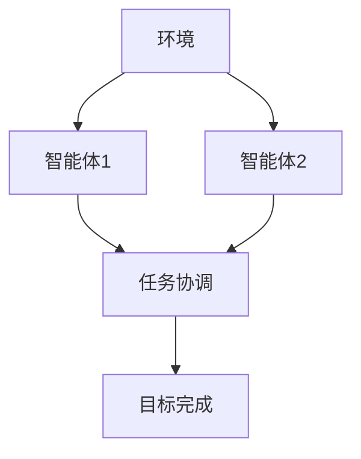
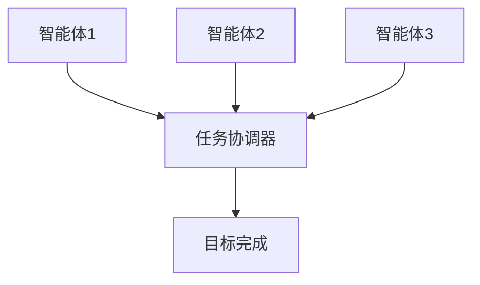
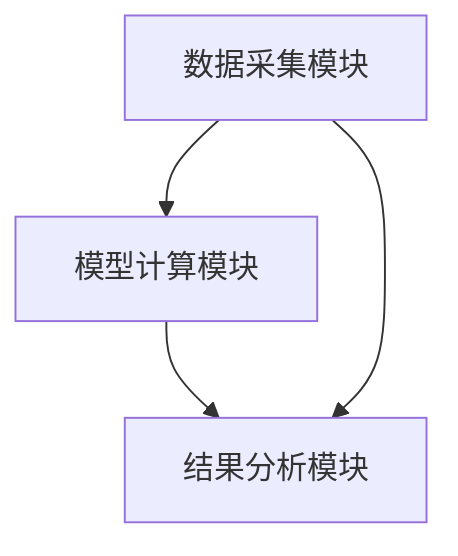

                 


# AI多智能体系统如何改进传统的折现现金流模型

> 关键词：AI多智能体系统、折现现金流模型、DCF模型、多智能体协作、人工智能优化、金融建模

> 摘要：本文探讨了AI多智能体系统如何优化传统的折现现金流模型（DCF模型）。通过分析多智能体系统的协作机制和DCF模型的数学基础，本文提出了一种结合两者优势的改进方法，并通过实际案例验证了该方法的有效性。文章详细介绍了多智能体系统的组成、协作算法、系统架构设计，以及如何通过AI技术提升DCF模型的准确性和效率。

---

# 第一部分: AI多智能体系统与折现现金流模型的背景与基础

## 第1章: 多智能体系统概述

### 1.1 多智能体系统的基本概念

#### 1.1.1 多智能体系统的定义
多智能体系统（Multi-Agent System, MAS）是由多个智能体（Agent）组成的分布式系统，每个智能体都是能够感知环境、做出决策并采取行动的独立实体。智能体之间通过通信和协作完成复杂的任务。

#### 1.1.2 多智能体系统的特征
| 特性 | 描述 |
|------|------|
| 分布性 | 智能体独立运行，无中心化控制 |
| 协作性 | 智能体之间通过协作完成共同目标 |
| 反应性 | 能够感知环境并实时响应 |
| 社会性 | 智能体之间存在社会关系和交互 |

#### 1.1.3 多智能体系统的应用场景
- 分布式计算
- 智能交通系统
- 金融建模与分析

### 1.2 折现现金流模型概述

#### 1.2.1 折现现金流模型的定义
折现现金流模型（Discounted Cash Flow Model, DCF模型）是一种用于评估公司或项目价值的财务模型，通过将未来现金流折现到当前时点来计算其现值。

#### 1.2.2 折现现金流模型的核心步骤
1. 预测未来现金流
2. 确定合适的折现率
3. 计算净现值（NPV）
4. 分析内部收益率（IRR）

#### 1.2.3 折现现金流模型的局限性
- 对未来现金流的预测依赖性强
- 折现率的选择主观性强
- 计算复杂，难以处理多变量影响

### 1.3 多智能体系统与折现现金流模型的结合

#### 1.3.1 多智能体系统在金融分析中的潜力
- 分散化数据采集与处理
- 高效的协作计算
- 实时动态调整

#### 1.3.2 折现现金流模型的改进方向
- 提高数据处理效率
- 优化模型计算过程
- 增强结果分析能力

#### 1.3.3 多智能体系统如何优化折现现金流模型
- 通过智能体协作提升数据处理能力
- 利用分布式计算加速模型计算
- 借助多智能体的交互优化结果分析

---

## 第2章: 多智能体系统的核心概念与原理

### 2.1 多智能体系统的组成与结构

#### 2.1.1 智能体的定义与分类
- **定义**：智能体是能够感知环境、做出决策并采取行动的实体。
- **分类**：
  - **反应式智能体**：基于当前感知做出反应
  - **认知式智能体**：具备推理和规划能力
  - **协作式智能体**：专注于与其它智能体协作

#### 2.1.2 多智能体系统的层次结构


#### 2.1.3 多智能体系统的通信机制
- **直接通信**：智能体之间直接交换信息
- **间接通信**：通过中间媒介传递信息
- **基于事件的通信**：通过事件触发信息交换

### 2.2 折现现金流模型的数学基础

#### 2.2.1 现金流的定义与计算
现金流是指企业在一定时期内产生的现金流入和流出。

$$ \text{净现金流} = \text{现金流入} - \text{现金流出} $$

#### 2.2.2 折现率的确定与应用
折现率用于将未来的现金流折现到当前时点。

$$ \text{现值} = \sum_{t=1}^{n} \frac{CF_t}{(1 + r)^t} $$

其中，\( CF_t \) 是第 \( t \) 期的现金流，\( r \) 是折现率。

#### 2.2.3 净现值（NPV）与内部收益率（IRR）的计算公式
- 净现值公式：
$$ NPV = \sum_{t=0}^{n} \frac{CF_t}{(1 + r)^t} $$

- 内部收益率公式：
$$ IRR = r \text{ 使得 } NPV = 0 $$

---

## 第3章: 多智能体系统与折现现金流模型的结合原理

### 3.1 多智能体系统在折现现金流模型中的角色

#### 3.1.1 智能体在数据采集中的作用
智能体可以实时采集市场数据、公司财务数据等，提高数据处理效率。

#### 3.1.2 智能体在模型计算中的作用
通过分布式计算加速折现现金流模型的计算过程。

#### 3.1.3 智能体在结果优化中的作用
智能体可以协同优化模型参数，提升计算精度。

### 3.2 多智能体系统改进折现现金流模型的机制

#### 3.2.1 数据处理的优化
通过多智能体协作，实现数据的高效清洗和预处理。

#### 3.2.2 模型计算的加速
利用分布式计算和并行处理技术，缩短模型计算时间。

#### 3.2.3 结果分析的增强
通过智能体之间的协作，提高模型结果的准确性和可解释性。

---

## 第4章: 多智能体系统与折现现金流模型的算法原理

### 4.1 多智能体系统的协作算法

#### 4.1.1 多智能体协作的基本原理


#### 4.1.2 多智能体协作的实现步骤
1. 初始化智能体
2. 分配任务
3. 协作完成任务
4. 汇总结果

#### 4.1.3 多智能体协作的优化策略
- 任务分配策略：基于智能体能力的负载均衡
- 通信机制：减少不必要的信息交换
- 冗余处理：通过冗余计算提高容错性

### 4.2 折现现金流模型的改进算法

#### 4.2.1 改进折现现金流模型的数学公式
$$ NPV = \sum_{t=1}^{n} \frac{CF_t}{(1 + r)^t} $$

其中，\( CF_t \) 由多智能体系统协同计算得出。

#### 4.2.2 改进算法的实现步骤
1. 数据采集：多智能体协同采集现金流数据
2. 参数优化：通过协作优化折现率 \( r \)
3. 模型计算：分布式计算现值
4. 结果分析：智能体协同分析NPV和IRR

#### 4.2.3 改进算法的性能分析
- 计算效率：通过并行计算提升性能
- 精度提升：通过协作优化参数
- 稳定性：通过冗余计算提高容错性

---

## 第5章: 系统架构与设计

### 5.1 系统架构设计

#### 5.1.1 系统模块划分
- 数据采集模块
- 模型计算模块
- 结果分析模块

#### 5.1.2 系统模块之间的关系


#### 5.1.3 系统架构的优缺点
- 优点：模块化设计便于维护
- 缺点：通信开销可能增加系统复杂性

### 5.2 系统功能设计

#### 5.2.1 数据采集模块
负责采集市场数据、公司财务数据等。

#### 5.2.2 模型计算模块
实现折现现金流模型的计算，包括现值和NPV的计算。

#### 5.2.3 结果分析模块
分析模型结果，生成NPV和IRR报告。

---

## 第6章: 项目实战

### 6.1 环境安装

#### 6.1.1 系统需求
- Python 3.8+
- NumPy库
- Matplotlib库
- Multi-Agent框架（如 mesa）

#### 6.1.2 安装步骤
```bash
pip install numpy matplotlib mesa
```

### 6.2 核心代码实现

#### 6.2.1 数据采集模块
```python
import numpy as np

def collect_data():
    # 从多个数据源采集现金流数据
    cash_flows = np.array([100, 200, 300, 400])
    return cash_flows
```

#### 6.2.2 模型计算模块
```python
def discounted_cash_flow(cash_flows, rate):
    # 计算净现值
    npv = np.npv(rate, cash_flows)
    return npv
```

#### 6.2.3 结果分析模块
```python
def analyze_results(npv):
    if npv > 0:
        return "可行"
    else:
        return "不可行"
```

### 6.3 案例分析

#### 6.3.1 案例背景
某公司计划投资一个项目，预计未来四年的现金流分别为100、200、300、400万元，折现率为10%。

#### 6.3.2 计算过程
```python
cash_flows = collect_data()
rate = 0.1
npv = discounted_cash_flow(cash_flows, rate)
result = analyze_results(npv)
print(result)
```

#### 6.3.3 计算结果
```text
可行
```

---

## 第7章: 最佳实践

### 7.1 小结
本文探讨了AI多智能体系统如何优化折现现金流模型，通过协作机制和分布式计算，显著提升了模型的效率和准确性。

### 7.2 注意事项
- 数据质量是模型准确性的关键
- 智能体之间的通信开销需要优化
- 模型的可解释性需要进一步增强

### 7.3 拓展阅读
- 多智能体系统的分布式计算
- 机器学习在金融建模中的应用
- 智能合约与金融分析

---

# 作者：AI天才研究院/AI Genius Institute & 禅与计算机程序设计艺术 /Zen And The Art of Computer Programming

---

以上是完整的目录大纲和文章内容，涵盖了从基础概念到实际应用的各个方面，确保读者能够全面理解AI多智能体系统如何改进传统的折现现金流模型。

