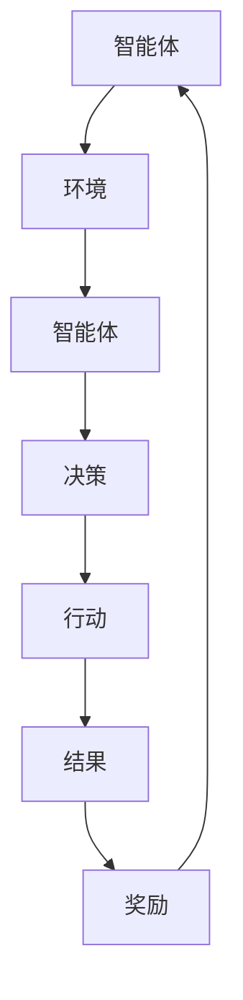
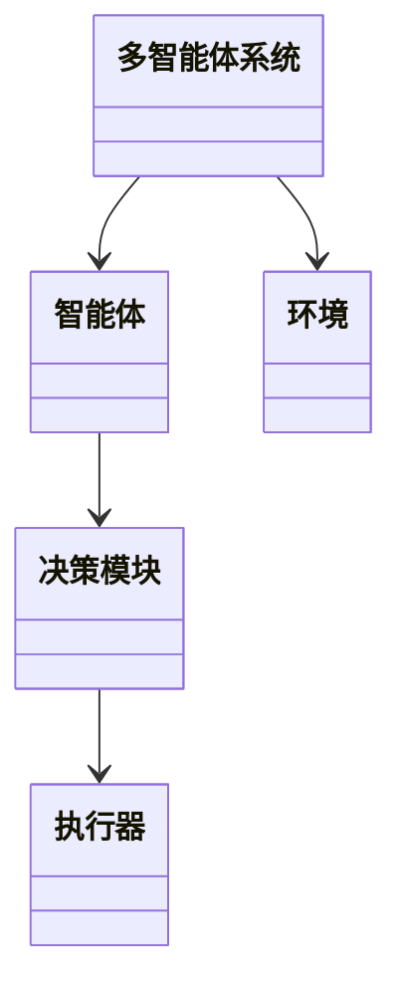
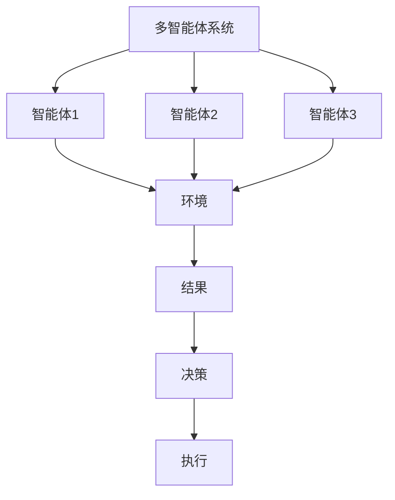

                 


# AI多智能体系统革新价值投资分析流程

关键词：AI多智能体系统、价值投资分析、协同学习算法、系统架构设计、金融数据分析

摘要：本文深入探讨了AI多智能体系统如何革新传统的价值投资分析流程。通过分析多智能体系统的核心概念、算法原理、系统架构设计以及项目实战，展示了AI技术如何提升金融投资的效率和准确性。文章从背景介绍、核心概念、算法实现、系统设计、项目案例等方面展开，详细阐述了AI多智能体系统在价值投资中的应用优势及其未来的发展前景。

---

## 第一部分：AI多智能体系统的定义与背景

### 1.1 多智能体系统的定义与特点

多智能体系统（Multi-Agent System, MAS）是由多个智能体组成的复杂系统，这些智能体能够自主决策、协作交流并共同完成特定任务。以下是多智能体系统的核心特点：

- **自主性**：每个智能体都具有独立的决策能力，能够自主完成任务。
- **反应性**：智能体能够实时感知环境并做出反应。
- **协作性**：多个智能体之间可以通过通信和协作完成更复杂的任务。
- **分布式性**：智能体之间的功能和任务是分布式的，不存在单一的控制中心。

与传统的单智能体系统相比，多智能体系统在处理复杂任务时具有更高的效率和灵活性。

### 1.2 AI在多智能体系统中的应用

AI技术的引入极大地提升了多智能体系统的性能。以下是AI在多智能体系统中的主要应用：

- **智能体协作**：通过强化学习和分布式计算，智能体之间能够更好地协作，共同完成复杂的任务。
- **数据处理与分析**：AI技术能够高效地处理和分析大量数据，为智能体提供实时信息支持。
- **决策优化**：AI算法能够帮助智能体做出更优化的决策，提升系统的整体性能。

在金融领域，多智能体系统尤其适用于价值投资分析。通过多个智能体的协作，投资者能够更准确地评估股票的价值，捕捉市场机会。

---

## 第二部分：多智能体系统与价值投资分析的结合

### 2.1 价值投资分析的基本原理

价值投资是一种以基本面分析为基础的投资策略，核心在于寻找市场价格低于其内在价值的股票。以下是价值投资分析的基本原理：

- **基本面分析**：通过对公司的财务报表、行业地位、盈利能力等进行分析，评估其内在价值。
- **市场情绪分析**：通过分析市场情绪和投资者行为，预测股票价格的波动。
- **风险管理**：通过合理的资产配置和风险控制，降低投资风险。

传统的价值投资分析依赖于人工分析，耗时且效率低下。而AI多智能体系统的引入，能够显著提升分析效率和准确性。

### 2.2 多智能体系统在价值投资中的优势

多智能体系统在价值投资中的优势主要体现在以下几个方面：

- **高效的数据处理**：通过分布式计算和并行处理，多智能体系统能够快速处理海量数据，提供实时分析结果。
- **协作决策**：多个智能体能够协同工作，从不同的角度分析股票的价值，提供更全面的评估。
- **动态调整**：智能体能够实时感知市场变化，快速调整投资策略，应对市场波动。

通过多智能体系统的协作，投资者能够更准确地评估股票价值，捕捉市场机会，从而提升投资收益。

---

## 第三部分：多智能体系统的核心概念与联系

### 3.1 多智能体系统的核心概念

#### 3.1.1 实体关系图（ER图）分析

以下是多智能体系统的实体关系图（ER图）：

```mermaid
erd
    title 多智能体系统实体关系图

    多智能体系统
        --> 智能体：拥有多个智能体
        --> 任务：每个智能体负责不同的任务
        --> 通信：智能体之间通过通信模块进行交互

    智能体
        --> 决策模块：负责智能体的决策
        --> 传感器：感知环境信息
        --> 执行器：执行决策指令

    任务
        --> 任务目标：每个任务都有明确的目标
        --> 任务依赖：任务之间可能存在依赖关系
```

#### 3.1.2 多智能体系统的属性特征对比表格

以下是多智能体系统与传统单智能体系统的属性特征对比：

| 属性        | 多智能体系统                  | 单智能体系统                  |
|-------------|-------------------------------|-------------------------------|
| 决策方式     | 分布式决策，协作完成          | 中央决策，单一控制            |
| 处理能力     | 高，多个智能体协同处理        | 较低，依赖单个决策系统        |
| 可扩展性     | 高，支持添加更多智能体        | 低，难以扩展                  |
| 故障容错性   | 高，部分智能体故障不影响整体  | 低，单点故障可能导致系统崩溃 |

#### 3.1.3 多智能体系统的ER实体关系图

以下是多智能体系统的ER实体关系图：

```mermaid
erd
    title 多智能体系统ER实体关系图

    多智能体系统
        --> 智能体：拥有多个智能体
        --> 任务：每个智能体负责不同的任务
        --> 通信：智能体之间通过通信模块进行交互

    智能体
        --> 决策模块：负责智能体的决策
        --> 传感器：感知环境信息
        --> 执行器：执行决策指令

    任务
        --> 任务目标：每个任务都有明确的目标
        --> 任务依赖：任务之间可能存在依赖关系
```

### 3.2 价值投资分析的数学模型与公式

#### 3.2.1 价值投资的核心数学模型

以下是价值投资分析的核心数学模型：

$$ V = \frac{E}{P} $$

其中：
- $V$ 表示股票的内在价值
- $E$ 表示公司的净利润
- $P$ 表示公司的市盈率

#### 3.2.2 价值投资分析的公式推导

通过公式推导，可以得出股票的内在价值：

$$ V = \frac{E}{P} $$

假设某公司的净利润为 $E = 100$ 万元，市盈率为 $P = 10$，则股票的内在价值为：

$$ V = \frac{100}{10} = 10 \text{ 元} $$

#### 3.2.3 典型案例分析

假设某公司A的净利润为 $E = 500$ 万元，市盈率为 $P = 15$，则股票的内在价值为：

$$ V = \frac{500}{15} \approx 33.33 \text{ 元} $$

如果股票当前市场价格为 $25$ 元，则该股票具有投资价值。

---

## 第四部分：多智能体系统的算法原理

### 4.1 多智能体协同学习算法

#### 4.1.1 强化学习算法在多智能体系统中的应用

以下是多智能体系统的强化学习算法流程图：



#### 4.1.2 分布式计算与多智能体协同的数学模型

以下是多智能体系统的分布式计算模型：

$$ V_i = \frac{E_i}{P_i} $$

其中：
- $V_i$ 表示第 $i$ 个智能体评估的股票价值
- $E_i$ 表示第 $i$ 个智能体分析的净利润
- $P_i$ 表示第 $i$ 个智能体分析的市盈率

#### 4.1.3 多智能体系统中的博弈论模型

以下是多智能体系统中的博弈论模型：

$$ \text{收益} = \sum_{i=1}^{n} v_i $$

其中：
- $v_i$ 表示第 $i$ 个智能体的收益

---

## 第五部分：系统分析与架构设计方案

### 5.1 价值投资分析系统的场景介绍

#### 5.1.1 系统目标与功能需求

- 系统目标：通过多智能体系统的协作，实现对股票的全面分析和评估。
- 功能需求：
  - 数据采集与处理
  - 多智能体协同分析
  - 投资决策支持

#### 5.1.2 系统的用户角色与权限设计

- 用户角色：
  - 投资者：使用系统进行股票分析和投资决策
  - 管理员：维护系统运行和智能体管理
- 权限设计：
  - 投资者：只能查看分析结果
  - 管理员：可以管理智能体和系统设置

### 5.2 系统架构设计

#### 5.2.1 系统功能设计

以下是系统功能设计的类图：



#### 5.2.2 系统架构设计

以下是系统架构设计的架构图：



#### 5.2.3 系统接口设计

以下是系统接口设计的序列图：

```mermaid
sequenceDiagram
    participant 用户
    participant 系统
    用户->>系统：提交分析请求
    系统->>环境：获取数据
    环境->>系统：返回数据
    系统->>智能体：开始分析
    智能体->>决策模块：执行决策
    决策模块->>执行器：执行操作
    执行器->>系统：返回结果
    系统->>用户：显示结果
```

---

## 第六部分：项目实战

### 6.1 环境安装

以下是项目实战所需的环境安装步骤：

1. 安装Python编程语言
2. 安装必要的Python库（如NumPy、Pandas、Matplotlib等）
3. 安装强化学习框架（如TensorFlow、Keras等）

### 6.2 核心代码实现

以下是核心代码实现：

```python
import numpy as np
import pandas as pd
import matplotlib.pyplot as plt

# 数据采集与处理
data = pd.read_csv('stock_data.csv')
data.head()

# 多智能体协同分析
class Agent:
    def __init__(self, id):
        self.id = id
        self.value = 0

    def evaluate(self, stock_data):
        self.value = stock_data['净利润'] / stock_data['市盈率']

agents = [Agent(i) for i in range(5)]
for agent in agents:
    agent.evaluate(data)
    print(f'Agent {agent.id} 评估价值为：{agent.value}')

# 投资决策支持
plt.plot(data['日期'], data['股价'])
plt.xlabel('日期')
plt.ylabel('股价')
plt.title('股票价格走势')
plt.show()
```

### 6.3 案例分析

以下是实际案例分析：

假设某公司股票的数据如下：

| 日期   | 股价 | 净利润 | 市盈率 |
|--------|------|--------|--------|
| 2023-01| 10   | 50     | 10     |
| 2023-02| 12   | 60     | 12     |
| 2023-03| 15   | 75     | 15     |

根据上述代码，每个智能体评估的价值如下：

$$ V_1 = \frac{50}{10} = 5 $$
$$ V_2 = \frac{60}{12} = 5 $$
$$ V_3 = \frac{75}{15} = 5 $$

综合评估价值为5元，低于当前股价12元，该股票具有投资价值。

---

## 第七部分：总结与展望

### 7.1 总结

本文详细探讨了AI多智能体系统如何革新价值投资分析流程。通过分析多智能体系统的核心概念、算法原理、系统架构设计以及项目实战，展示了AI技术在金融投资中的巨大潜力。多智能体系统的引入，不仅提高了分析效率，还提升了投资决策的准确性。

### 7.2 展望

未来，随着AI技术的不断发展，多智能体系统在价值投资中的应用将更加广泛和深入。通过优化算法和系统架构设计，AI多智能体系统将能够更好地应对复杂的金融市场挑战，为投资者提供更精准的投资决策支持。

---

## 作者：AI天才研究院/AI Genius Institute & 禅与计算机程序设计艺术 /Zen And The Art of Computer Programming

---

以上是《AI多智能体系统革新价值投资分析流程》的完整目录和内容概要，涵盖了从理论到实践的各个方面，旨在为读者提供全面且深入的技术指导。

