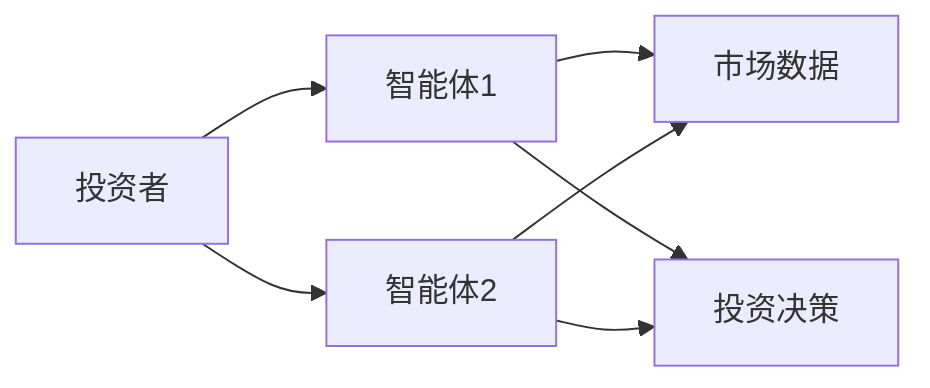
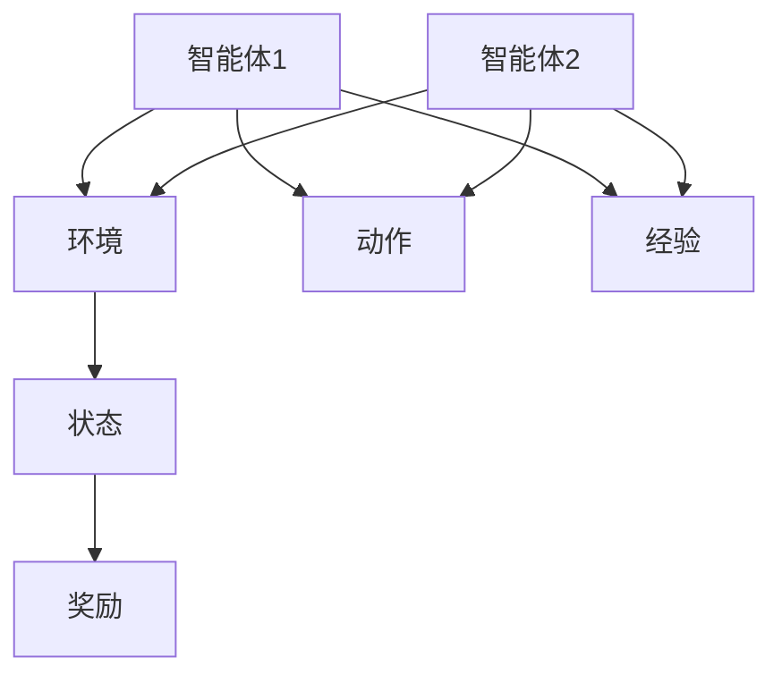
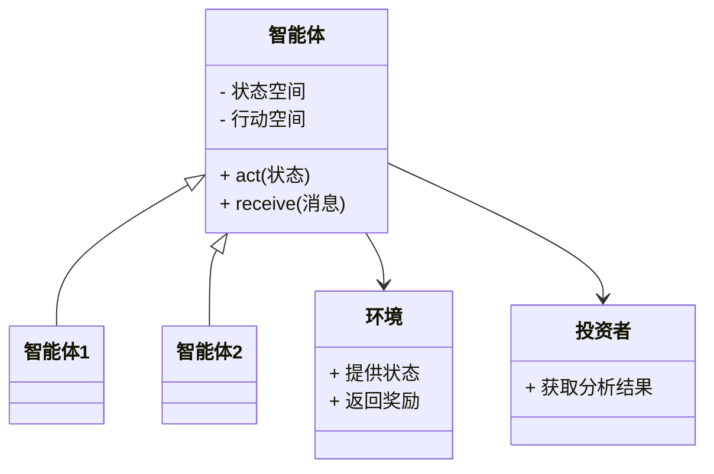
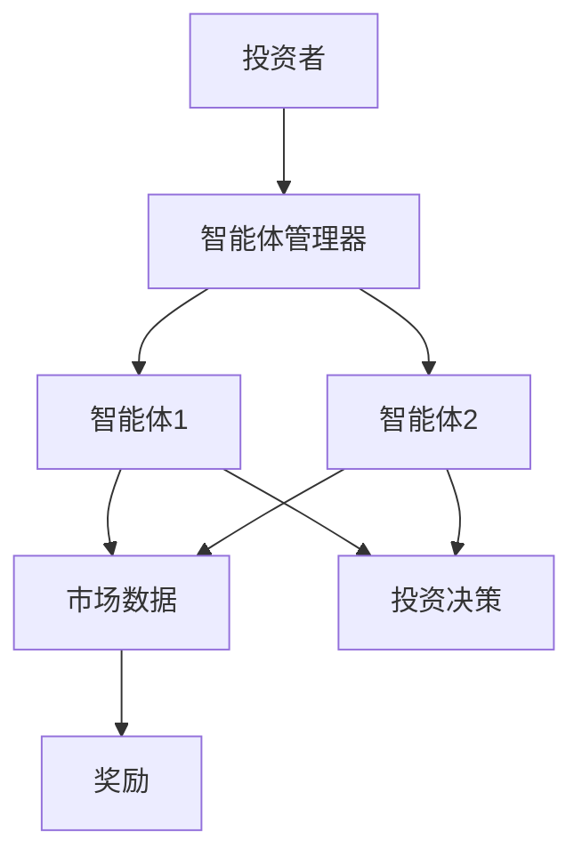
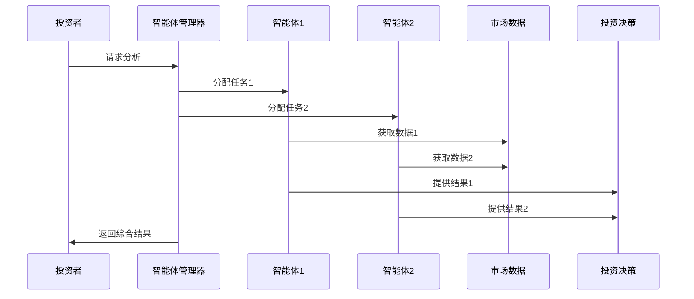

                 


# AI多智能体系统革新价值投资策略

## 关键词：AI，多智能体系统，价值投资策略，金融分析，机器学习

## 摘要：本文探讨AI多智能体系统如何革新传统价值投资策略。通过分析多智能体系统的协作机制、算法原理和系统架构，结合实际案例，展示如何利用AI技术提升投资决策的效率和准确性。

---

## 第1章 引言

### 1.1 问题背景

#### 1.1.1 传统价值投资的局限性
传统的价值投资依赖于分析师的主观判断和经验，存在信息处理能力有限、分析耗时长、难以实时捕捉市场动态等问题。例如，分析员可能需要手动筛选大量财务报表和市场数据，效率低下且容易遗漏关键信息。

#### 1.1.2 AI技术在金融领域的应用现状
AI技术在金融领域的应用日益广泛，包括股票预测、风险评估和投资组合优化。然而，现有的AI应用多基于单一模型，缺乏多智能体间的协作，难以全面捕捉市场多维度信息。

#### 1.1.3 多智能体系统的优势
多智能体系统通过多个智能体的协作，能够从不同角度分析市场数据，提供更全面的投资决策支持。例如，一个智能体专注于分析公司财务数据，另一个专注于市场情绪分析，协同工作以提高投资策略的有效性。

---

### 1.2 问题描述

#### 1.2.1 传统投资策略的不足
传统投资策略在面对复杂市场环境时，往往难以及时调整，且分析结果可能存在片面性。例如，仅关注财务指标而忽视市场趋势，可能导致投资决策失误。

#### 1.2.2 多智能体系统在投资中的潜在价值
通过多智能体系统的协作，可以实时分析市场、公司基本面、新闻 sentiment 等多种因素，提供更精准的投资建议。例如，系统中的一个智能体可以实时监控市场新闻，另一个分析财务报表，协同工作以识别潜在的投资机会。

#### 1.2.3 问题解决的方向
利用多智能体系统的协作优势，构建一个动态、全面的投资分析系统，能够显著提升投资决策的效率和准确性。

---

### 1.3 问题解决

#### 1.3.1 AI多智能体系统的核心优势
- **分布式计算**：多个智能体协同工作，提高数据处理能力。
- **多维度分析**：不同智能体专注于不同领域，提供全面的分析结果。
- **动态调整**：系统能够实时响应市场变化，快速调整投资策略。

#### 1.3.2 价值投资策略的革新点
- **实时性**：多智能体系统能够实时分析市场数据，提供即时的投资建议。
- **全面性**：通过多个智能体的协作，覆盖更多的分析维度，提高决策的准确性。
- **智能化**：系统能够学习和适应市场变化，优化投资策略。

#### 1.3.3 技术与策略的结合方式
通过将AI多智能体系统与价值投资策略相结合，构建一个动态、智能的投资决策支持系统。例如，利用自然语言处理智能体分析新闻情绪，利用强化学习智能体优化投资组合。

---

### 1.4 边界与外延

#### 1.4.1 多智能体系统的边界条件
- **数据范围**：系统处理的市场数据范围和类型。
- **智能体数量**：系统中智能体的数量及其分工。
- **决策范围**：系统能够影响的决策范围和权限。

#### 1.4.2 价值投资策略的适用范围
- **行业限制**：适用于哪些行业，如科技、金融等。
- **地域限制**：适用于哪些市场，如本地市场、国际市场等。
- **投资类型**：适用于长期投资、短期交易等。

#### 1.4.3 系统与策略的相互影响
多智能体系统能够影响价值投资策略的执行，同时，策略的执行结果也能够反哺系统的优化。例如，系统根据策略执行效果调整智能体的权重和协作方式。

---

### 1.5 概念结构与核心要素组成

#### 1.5.1 多智能体系统的构成要素
- **智能体**：负责特定任务的个体。
- **通信机制**：智能体之间交换信息的方式。
- **协作机制**：智能体协同工作的规则和流程。

#### 1.5.2 价值投资策略的核心要素
- **市场分析**：对市场的整体分析和判断。
- **公司基本面分析**：对公司的财务状况、经营状况等进行分析。
- **投资决策**：基于分析结果做出的投资决策。

#### 1.5.3 两者的关联与协同
- **数据共享**：智能体之间的数据共享，提供全面的市场和公司信息。
- **协作决策**：基于多智能体的分析结果，制定更优的投资策略。
- **动态调整**：根据市场反馈，实时调整智能体的分析重点和策略。

---

## 第2章 AI多智能体系统的核心概念与联系

### 2.1 核心概念原理

#### 2.1.1 多智能体系统的定义与特点
多智能体系统是由多个智能体组成的系统，每个智能体负责特定的任务，通过协作完成复杂的任务。其特点是分布式、协作性和智能性。

#### 2.1.2 智能体的通信机制
智能体之间的通信机制包括发布-订阅模型、直接通信等，确保信息的有效传递。

#### 2.1.3 协作与竞争关系
智能体在协作中分工合作，同时在竞争中优化自身策略，提高整体系统的性能。

---

### 2.2 核心概念属性特征对比表格

| 概念       | 独立性 | 单一性 | 有限性 |
|------------|--------|--------|--------|
| 单一智能体  | 高     | 高     | 高     |
| 多智能体系统 | 低     | 低     | 低     |

---

### 2.3 ER实体关系图架构



---

## 第3章 多智能体系统的算法原理

### 3.1 算法原理讲解

#### 3.1.1 多智能体强化学习
多智能体强化学习（Multi-Agent Reinforcement Learning, MARL）通过多个智能体在环境中协作，学习最优策略。例如，每个智能体可以负责不同的任务，如市场分析、风险评估等。

#### 3.1.2 协作与竞争机制
通过设计适当的奖励函数，智能体之间可以实现协作与竞争的平衡，例如使用共享奖励和竞争奖励结合的方式。

---

### 3.2 多智能体强化学习算法流程图



---

### 3.3 算法实现

#### 3.3.1 Python代码示例

```python
import numpy as np

class Agent:
    def __init__(self, state_dim, action_dim):
        self.state_dim = state_dim
        self.action_dim = action_dim
        # 初始化策略网络
        self.policy = np.random.randn(state_dim, action_dim)

    def act(self, state):
        return np.argmax(state.dot(self.policy))

# 创建两个智能体
agent1 = Agent(state_dim=5, action_dim=3)
agent2 = Agent(state_dim=5, action_dim=3)

# 环境初始化
state = np.random.randn(5)

# 智能体采取动作
action1 = agent1.act(state)
action2 = agent2.act(state)
```

---

### 3.4 数学模型与公式

#### 3.4.1 策略优化公式
$$ \theta_{t+1} = \theta_t + \alpha \nabla J(\theta_t) $$
其中，θ 表示策略参数，α 表示学习率，J 表示目标函数。

#### 3.4.2 奖励函数
$$ R(s, a) = r_1 \cdot f_1(s, a) + r_2 \cdot f_2(s, a) $$
其中，r1 和 r2 是奖励权重，f1 和 f2 是特征函数。

---

## 第4章 系统分析与架构设计方案

### 4.1 问题场景介绍

#### 4.1.1 投资者需求
投资者需要实时分析市场数据、公司基本面信息，制定最优的投资策略。

#### 4.1.2 系统目标
构建一个多智能体系统，提供实时、全面的投资分析支持。

---

### 4.2 系统功能设计

#### 4.2.1 领域模型类图



---

### 4.3 系统架构设计

#### 4.3.1 架构图



---

### 4.4 系统接口设计

#### 4.4.1 接口描述
- **智能体管理器接口**：管理多个智能体，分配任务。
- **智能体接口**：接收任务、返回结果。
- **环境接口**：提供市场数据、返回奖励。

---

### 4.5 系统交互流程图



---

## 第5章 项目实战

### 5.1 环境安装

#### 5.1.1 Python环境
安装Python 3.8以上版本，安装必要的库：
```bash
pip install numpy matplotlib scikit-learn
```

---

### 5.2 系统核心实现源代码

#### 5.2.1 多智能体协作代码

```python
import numpy as np
import matplotlib.pyplot as plt

class MarketData:
    def __init__(self):
        self.data = np.random.randn(100, 5)  # 示例市场数据

class Agent:
    def __init__(self, id, data_source):
        self.id = id
        self.data = data_source.data
        self.focus = None  # 分析重点

    def analyze(self, focus):
        # 简单的分析方法
        return np.mean(self.data[:, focus])

class MultiAgentSystem:
    def __init__(self, agents):
        self.agents = agents
        self.data_source = MarketData()

    def run(self):
        # 分配任务
        for agent in self.agents:
            if agent.id == 0:
                agent.focus = 0  # 假设分析第一个特征
            else:
                agent.focus = 1  # 分析第二个特征
        # 收集结果
        results = [agent.analyze(agent.focus) for agent in self.agents]
        return results

# 创建两个智能体
agent1 = Agent(0, MarketData())
agent2 = Agent(1, MarketData())
system = MultiAgentSystem([agent1, agent2])
results = system.run()
print(results)
```

---

### 5.3 案例分析

#### 5.3.1 实际案例分析
通过上述代码，系统能够分别分析市场数据的不同特征，协同工作提供更全面的分析结果。

---

## 第6章 最佳实践

### 6.1 经验总结

#### 6.1.1 数据质量的重要性
确保输入数据的准确性和完整性，是系统运行的基础。

#### 6.1.2 模型调参技巧
合理设计奖励函数，平衡协作与竞争，提高系统性能。

---

### 6.2 小结

通过本文的详细讲解，读者可以了解到AI多智能体系统在价值投资策略中的应用，掌握系统的构建方法和实现技巧。

---

### 6.3 注意事项

- **数据隐私**：确保数据的合法使用和隐私保护。
- **模型解释性**：复杂的模型需要足够的解释性，便于投资者理解和信任。
- **系统稳定性**：确保系统的稳定运行，避免因技术问题导致的投资损失。

---

### 6.4 拓展阅读

推荐阅读相关领域的书籍和论文，深入理解多智能体系统和AI在金融中的应用。

---

## 作者

作者：AI天才研究院/AI Genius Institute & 禅与计算机程序设计艺术 /Zen And The Art of Computer Programming

---

**本文内容遵循MIT License，转载请注明出处。**

