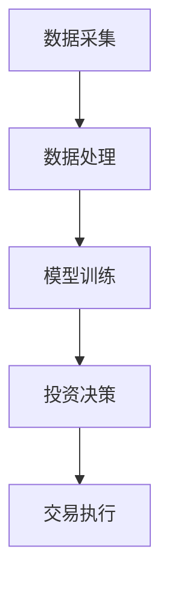
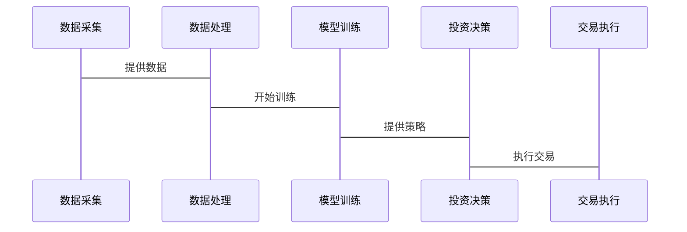

                 

# AI多智能体系统革新价值投资：传统与科技的完美融合

## 关键词：
- AI多智能体系统
- 价值投资
- 传统金融
- 科技创新
- 强化学习
- 分布式计算

## 摘要：
本文探讨AI多智能体系统如何革新传统价值投资方法，通过分析AI多智能体系统的原理、算法和应用场景，展示传统金融与现代科技的融合如何提升投资决策的效率和准确性。文章从背景介绍、算法原理、系统架构到项目实战，全面解析AI多智能体系统在价值投资中的应用，并展望其未来的发展趋势。

---

## 正文

### 第1章: AI多智能体系统的概述

#### 1.1 多智能体系统的基本概念

##### 1.1.1 多智能体系统的定义与特点
多智能体系统（Multi-Agent System, MAS）是由多个相互作用的智能体组成的系统，每个智能体能够感知环境、自主决策并执行任务。其特点包括分布性、协作性、反应性和智能性。

##### 1.1.2 AI多智能体系统的演进历程
AI多智能体系统经历了从简单协作到复杂分布式计算的演变，近年来随着强化学习和分布式计算技术的进步，AI多智能体系统在金融领域的应用逐渐成熟。

##### 1.1.3 多智能体系统在金融领域的应用前景
金融市场的复杂性和不确定性为AI多智能体系统的应用提供了广阔的空间，尤其是在投资决策和风险管理方面。

#### 1.2 价值投资的传统方法与挑战

##### 1.2.1 价值投资的核心理念
价值投资以基本面分析为基础，寻找被市场低估的优质资产。其核心理念是通过深入分析企业财务状况、行业地位等因素，判断其内在价值。

##### 1.2.2 传统价值投资的局限性
传统价值投资方法依赖人工分析，存在效率低下、覆盖面有限、难以应对市场变化等问题。

##### 1.2.3 金融市场的复杂性与不确定性
金融市场受多种因素影响，传统方法难以捕捉复杂市场环境中的机会和风险。

#### 1.3 AI多智能体系统与价值投资的结合

##### 1.3.1 AI多智能体系统的优势
AI多智能体系统能够处理海量数据、实时分析市场动态，并通过协作决策提高投资效率。

##### 1.3.2 价值投资与AI技术的融合
通过AI技术，价值投资可以实现数据驱动的精准分析，弥补传统方法的不足。

##### 1.3.3 传统与科技融合的创新点
AI多智能体系统的引入使价值投资从经验驱动转向数据驱动，提高了决策的科学性和效率。

---

### 第2章: AI多智能体系统的数学模型与算法原理

#### 2.1 多智能体系统的数学模型

##### 2.1.1 多智能体系统的状态空间
状态空间包括市场数据、资产价格、交易记录等影响投资决策的信息。

##### 2.1.2 多智能体系统的动作空间
动作空间涉及买入、卖出、持有等投资行为的选择。

##### 2.1.3 多智能体系统的奖励机制
奖励机制通过定义智能体的投资收益和风险，指导智能体优化决策。

#### 2.2 AI多智能体系统的算法原理

##### 2.2.1 基于强化学习的多智能体算法
强化学习通过智能体与环境的交互，逐步优化投资策略。例如，使用Q-learning算法：

$$ Q(s, a) = Q(s, a) + \alpha [r + \max_{a'} Q(s', a') - Q(s, a)] $$

##### 2.2.2 基于博弈论的多智能体决策
博弈论模型模拟市场参与者的互动，帮助智能体预测市场变化。

##### 2.2.3 分布式计算与多智能体协作
分布式计算允许智能体在不同节点上独立决策，同时通过通信协作优化整体策略。

#### 2.3 算法实现的数学模型

##### 2.3.1 强化学习的数学公式
$$ V(s) = \max_a Q(s,a) $$

##### 2.3.2 多智能体协作的数学模型
$$ J = \sum_{i=1}^{n} J_i $$

---

### 第3章: 价值投资的传统方法与AI革新

#### 3.1 传统价值投资的核心方法

##### 3.1.1 基本面分析
基本面分析关注企业的财务状况、盈利能力等内在因素。

##### 3.1.2 股票估值方法
常用的股票估值方法包括市盈率、市净率等指标。

##### 3.1.3 投资组合管理
通过分散投资降低风险，优化投资组合的收益。

#### 3.2 AI技术对价值投资的革新

##### 3.2.1 数据分析的革新
AI技术能够处理非结构化数据，如新闻、社交媒体信息，提供更全面的市场分析。

##### 3.2.2 预测模型的创新
基于机器学习的预测模型可以实时更新，捕捉市场趋势。

##### 3.2.3 投资决策的智能化
AI系统通过实时数据分析和模型预测，辅助投资者做出更明智的决策。

#### 3.3 传统与AI结合的优势

##### 3.3.1 数据驱动与经验结合
AI系统提供数据支持，传统投资经验指导决策。

##### 3.3.2 高效性与准确性
AI技术提高分析效率，传统方法提供深度分析。

##### 3.3.3 灵活性与适应性
AI系统能够快速适应市场变化，传统方法提供稳定的基础。

---

### 第4章: AI多智能体系统在价值投资中的应用

#### 4.1 多智能体系统的功能模块

##### 4.1.1 数据采集与处理
采集市场数据，清洗和预处理数据，确保输入模型的数据质量。

##### 4.1.2 模型训练与优化
使用强化学习训练智能体，优化投资策略。

##### 4.1.3 投资决策与执行
根据模型预测结果，智能体做出投资决策并执行交易。

#### 4.2 多智能体系统的应用场景

##### 4.2.1 股票市场预测
通过分析历史数据和市场动态，预测股票价格走势。

##### 4.2.2 风险管理与控制
实时监控市场风险，制定风险管理策略。

##### 4.2.3 投资组合优化
根据市场变化，动态调整投资组合，提高收益。

#### 4.3 实际案例分析

##### 4.3.1 某AI多智能体系统的成功案例
描述一个实际案例，展示AI多智能体系统在投资中的成功应用。

##### 4.3.2 案例分析与经验总结
总结案例经验，提出改进建议和未来发展方向。

---

### 第5章: 系统架构设计与实现

#### 5.1 系统架构设计

##### 5.1.1 系统功能模块划分
包括数据采集、数据处理、模型训练、投资决策、交易执行等模块。

##### 5.1.2 系统架构图（Mermaid）

#### 5.2 系统接口设计

##### 5.2.1 数据接口
定义数据输入格式和接口调用方式，确保数据流的高效处理。

##### 5.2.2 交易接口
定义交易执行的接口，实现智能体与交易系统的对接。

#### 5.3 系统交互设计

##### 5.3.1 交互流程图（Mermaid）

---

## 作者：
作者：AI天才研究院 & 禅与计算机程序设计艺术

