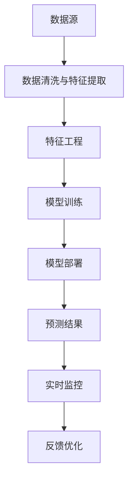
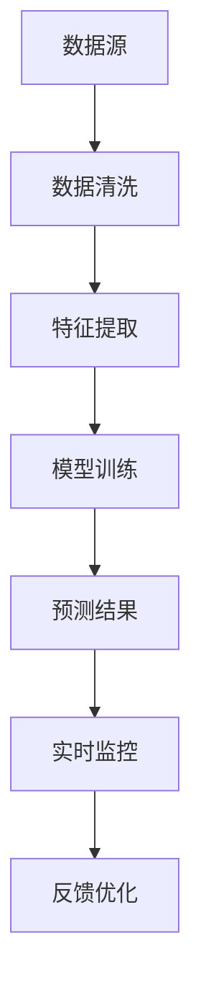

                 


# AI如何优化巴菲特的现金管理策略

> 关键词：AI，巴菲特，现金管理，投资策略，机器学习，风险管理，数据分析

> 摘要：本文探讨了人工智能如何优化巴菲特的现金管理策略。通过分析巴菲特的投资理念、现金管理原则以及AI在金融领域的应用潜力，结合具体算法和系统架构，详细阐述了AI在现金流预测、风险评估和资产配置优化中的应用，并通过项目实战展示了如何将AI技术落地应用于巴菲特的现金管理策略。

---

# 第一部分: 巴菲特现金管理策略与AI优化背景

## 第1章: 巴菲特现金管理策略概述

### 1.1 巴菲特投资理念与现金管理

#### 1.1.1 巴菲特的价值投资理论

沃伦·巴菲特的价值投资理论是基于企业的内在价值进行长期投资。他强调企业基本面分析，包括企业的盈利能力、财务状况和行业地位等。以下是巴菲特价值投资理论的核心要素：

- **长期投资**：巴菲特倡导长期持有优质资产，避免频繁交易。
- **安全边际**：在购买股票时，价格应低于其内在价值，留有安全边际。
- **企业护城河**：选择具有强大竞争优势的企业。

#### 1.1.2 巴菲特的现金管理原则

巴菲特的现金管理策略强调现金流的重要性。他认为，企业必须保持足够的现金流以应对市场波动和经济危机。以下是巴菲特现金管理原则的核心要素：

- **现金流为王**：现金流是企业生存和发展的核心。
- **保守的财务策略**：保持低杠杆率，避免过度负债。
- **短期与长期的平衡**：在保证短期流动性的基础上，进行长期投资。

#### 1.1.3 巴菲特投资策略的优缺点

| 优点 | 缺点 |
|------|------|
| 长期稳定回报 | 对市场波动反应较慢 |
| 低风险投资 | 适合机构投资者，不适合短期投机者 |
| 重视企业基本面 | 对个人投资者门槛较高 |

---

#### 1.2 巴菲特投资成功案例分析

##### 1.2.1 巴菲特的经典投资案例

1. **可口可乐公司**：巴菲特长期持有可口可乐的股票，得益于其强大的品牌和市场地位。
2. **美国运通公司**：巴菲特在20世纪80年代买入美国运通的股票，受益于其信用卡业务的快速增长。
3. **苹果公司**：巴菲特在2016年买入苹果股票，体现了他对科技行业趋势的把握。

##### 1.2.2 巴菲特投资决策的关键因素

- **企业盈利能力**：巴菲特倾向于投资盈利能力稳定的企业。
- **企业成长性**：选择具有持续增长潜力的企业。
- **管理层素质**：重视企业管理层的诚信和能力。

##### 1.2.3 巴菲特投资策略的启示

巴菲特的成功投资策略为投资者提供了以下启示：

1. **长期投资的重要性**：避免短期市场波动的影响。
2. **基本面分析的必要性**：深入研究企业的财务状况和行业地位。
3. **风险管理的核心地位**：保持足够的现金流和低杠杆率。

---

## 第2章: AI在金融领域的应用潜力

### 2.1 AI与金融投资的结合

#### 2.1.1 AI在金融数据分析中的应用

人工智能在金融数据分析中的应用主要体现在以下几个方面：

1. **数据清洗与特征提取**：AI能够自动处理海量金融数据，提取有用的特征。
2. **数据可视化**：通过AI生成的可视化工具，投资者可以更直观地理解市场趋势。
3. **异常检测**：AI能够快速识别数据中的异常值，帮助投资者发现潜在风险。

#### 2.1.2 AI在投资决策中的作用

人工智能在投资决策中的作用日益重要，主要体现在：

1. **预测市场趋势**：通过机器学习模型预测股票价格走势。
2. **自动化交易**：AI可以根据市场信号自动执行交易指令。
3. **投资组合优化**：AI能够根据市场变化动态调整投资组合。

#### 2.1.3 AI在风险管理中的应用

1. **风险评估**：AI可以通过历史数据和实时信息评估投资组合的风险。
2. **情景分析**：AI能够模拟不同市场条件下的投资结果，帮助投资者制定应对策略。
3. **信用评分**：AI可以对企业的信用状况进行评估，帮助投资者做出更明智的投资决策。

---

### 2.2 机器学习在金融投资中的核心算法

#### 2.2.1 线性回归与投资预测

线性回归是一种简单而有效的预测模型，常用于股票价格预测。其基本原理是通过最小二乘法拟合一条直线，使得预测值与实际值之间的误差最小。以下是线性回归的数学模型：

$$ y = \beta_0 + \beta_1 x + \epsilon $$

其中，$y$ 是目标变量（股票价格），$x$ 是自变量（时间），$\beta_0$ 和 $\beta_1$ 是回归系数，$\epsilon$ 是误差项。

#### 2.2.2 支持向量机在金融分类中的应用

支持向量机（SVM）是一种强大的分类算法，广泛应用于金融市场的分类问题，如股票涨跌预测。SVM的核心思想是将数据映射到高维空间，并在高维空间中找到一个最优超平面，使得正负样本能够被正确分类。

#### 2.2.3 随机森林在投资决策中的应用

随机森林是一种基于决策树的集成学习算法，具有高精度和良好的泛化能力。在金融投资中，随机森林常用于预测股票价格走势和评估投资组合的风险。

---

### 2.3 大数据在金融投资中的重要性

#### 2.3.1 数据清洗与特征提取

大数据时代，金融数据的清洗和特征提取是投资决策的重要步骤。通过清洗数据，可以去除噪声和异常值，提取有用的特征。

#### 2.3.2 数据可视化在投资分析中的作用

数据可视化是理解市场趋势和投资机会的重要工具。通过可视化工具，投资者可以更直观地理解数据背后的规律。

#### 2.3.3 数据驱动的投资决策

基于大数据的分析，投资者可以做出更加科学的投资决策，尤其是在市场波动剧烈的情况下。

---

# 第二部分: AI优化巴菲特现金管理策略的核心原理

## 第3章: AI优化巴菲特现金管理策略的核心概念

### 3.1 现金流预测的AI模型构建

#### 3.1.1 时间序列分析与现金流预测

时间序列分析是一种通过历史数据预测未来趋势的方法。在现金流预测中，时间序列分析可以帮助投资者预测未来的现金流。

---

#### 3.1.2 基于机器学习的现金流预测模型

机器学习模型可以通过历史数据和市场信息，预测未来的现金流。以下是基于机器学习的现金流预测模型的构建步骤：

1. **数据收集**：收集企业的财务数据和市场数据。
2. **数据预处理**：清洗数据，提取特征。
3. **模型训练**：使用训练数据训练机器学习模型。
4. **模型预测**：利用模型预测未来的现金流。

---

#### 3.1.3 现金流预测的准确性评估

为了确保现金流预测的准确性，投资者需要对模型进行严格的评估。常用的评估方法包括均方误差（MSE）和平均绝对误差（MAE）。

$$ \text{MSE} = \frac{1}{n}\sum_{i=1}^{n}(y_i - \hat{y}_i)^2 $$

$$ \text{MAE} = \frac{1}{n}\sum_{i=1}^{n}|y_i - \hat{y}_i| $$

其中，$y_i$ 是实际值，$\hat{y}_i$ 是预测值，$n$ 是样本数量。

---

#### 3.2 风险评估与投资

##### 3.2.1 风险评估的核心算法

在AI优化的现金管理策略中，风险评估是关键环节之一。常用的风险评估算法包括：

1. **VaR模型**：VaR（Value at Risk）是衡量投资组合风险的重要指标，表示在一定置信水平下，投资组合可能遭受的最大损失。

2. **CVaR模型**：CVaR（Conditional Value at Risk）是VaR的扩展，用于衡量在VaR条件下的平均损失。

---

#### 3.2.2 投资组合优化

投资组合优化是AI优化现金管理策略的重要组成部分。通过优化投资组合，投资者可以在风险可控的前提下，实现最大化的收益。以下是投资组合优化的步骤：

1. **目标设定**：明确投资目标和风险承受能力。
2. **数据收集**：收集相关资产的历史价格数据。
3. **模型构建**：使用优化算法构建投资组合模型。
4. **优化结果**：根据优化结果进行投资决策。

---

#### 3.2.3 现金流预测与风险管理的结合

在AI优化的现金管理策略中，现金流预测与风险管理密不可分。通过预测现金流，投资者可以更好地规划资金使用，避免流动性风险。

---

# 第四章: 系统架构与实现

## 第4章: 系统架构与实现

### 4.1 系统设计与实现

#### 4.1.1 系统设计

在构建AI优化的现金管理策略系统时，需要考虑以下几个方面：

1. **数据获取与处理**：从多个数据源获取金融数据，并进行清洗和特征提取。
2. **模型训练与部署**：使用机器学习算法训练预测模型，并将其部署到生产环境。
3. **实时监控与反馈**：对模型的预测结果进行实时监控，并根据反馈不断优化模型。

---

#### 4.1.2 系统架构

以下是AI优化的现金管理策略系统的架构图：



---

#### 4.1.3 接口设计

在系统实现中，需要设计合理的接口，以便不同模块之间的数据交互。以下是接口设计示例：

1. **数据接口**：提供数据获取和数据清洗的接口。
2. **模型接口**：提供模型训练和预测的接口。
3. **监控接口**：提供实时监控和反馈优化的接口。

---

#### 4.1.4 数据流图

以下是数据流图的示例：



---

## 第5章: 项目实战

### 5.1 环境安装与配置

#### 5.1.1 安装Python环境

为了实现AI优化的现金管理策略，首先需要安装Python环境。以下是安装步骤：

1. 下载并安装Python（推荐使用Python 3.8及以上版本）。
2. 安装Jupyter Notebook或其他IDE。

#### 5.1.2 安装机器学习库

安装以下机器学习库：

1. **scikit-learn**：用于机器学习模型的训练。
2. **pandas**：用于数据处理和分析。
3. **numpy**：用于数值计算。
4. **matplotlib**：用于数据可视化。

安装命令：

```bash
pip install scikit-learn pandas numpy matplotlib
```

---

### 5.2 核心实现源代码

#### 5.2.1 现金流预测模型实现

以下是基于线性回归的现金流预测模型的实现代码：

```python
import pandas as pd
import numpy as np
from sklearn.linear_model import LinearRegression
from sklearn.metrics import mean_squared_error

# 数据加载
data = pd.read_csv('cash_flow.csv')

# 特征提取
X = data[['revenue', 'profit', 'market_value']]
y = data['cash_flow']

# 模型训练
model = LinearRegression()
model.fit(X, y)

# 预测
predictions = model.predict(X)

# 评估
mse = mean_squared_error(y, predictions)
print(f'Mean Squared Error: {mse}')
```

---

#### 5.2.2 风险评估模型实现

以下是基于随机森林的风险评估模型的实现代码：

```python
import pandas as pd
import numpy as np
from sklearn.ensemble import RandomForestRegressor
from sklearn.metrics import mean_absolute_error

# 数据加载
data = pd.read_csv('risk_data.csv')

# 特征提取
X = data[['market_return', 'volatility', 'liquidity']]
y = data['risk']

# 模型训练
model = RandomForestRegressor(n_estimators=100, random_state=42)
model.fit(X, y)

# 预测
predictions = model.predict(X)

# 评估
mae = mean_absolute_error(y, predictions)
print(f'Mean Absolute Error: {mae}')
```

---

### 5.3 实际案例分析

#### 5.3.1 现金流预测案例

假设我们有以下数据：

| 时间 | 收入 | 利润 | 市场价值 | 现金流 |
|------|------|------|----------|--------|
| 2020 | 100  | 20   | 500      | 50     |
| 2021 | 120  | 30   | 600      | 60     |
| 2022 | 140  | 40   | 700      | 70     |

通过线性回归模型，我们可以预测2023年的现金流：

```python
# 预测2023年的现金流
new_data = [[140, 40, 700]]
prediction = model.predict(new_data)
print(f'2023年预测现金流: {prediction[0]:.2f}')
```

---

#### 5.3.2 风险评估案例

假设我们有以下数据：

| 时间 | 市场回报 | 波动率 | 流动性 | 风险 |
|------|----------|--------|--------|------|
| 2020 | 5%       | 15%     | 80%     | 10%  |
| 2021 | 7%       | 20%     | 75%     | 15%  |
| 2022 | 6%       | 25%     | 70%     | 20%  |

通过随机森林模型，我们可以评估2023年的风险：

```python
# 预测2023年的风险
new_data = [[6%, 25%, 70%]]
prediction = model.predict(new_data)
print(f'2023年预测风险: {prediction[0]:.2f}%')
```

---

### 5.4 项目小结

通过以上实战，我们可以看到，AI技术在现金流预测和风险评估中的应用具有显著优势。线性回归和随机森林等算法能够帮助投资者做出更加科学的投资决策。

---

# 第六部分: 总结与展望

## 第6章: 总结与展望

### 6.1 总结

本文详细探讨了AI如何优化巴菲特的现金管理策略。通过分析巴菲特的投资理念和现金管理原则，结合AI在金融领域的应用潜力，本文提出了基于机器学习的现金流预测和风险评估模型，并通过项目实战展示了如何将AI技术应用于现金管理策略的优化。

---

### 6.2 未来展望

随着AI技术的不断发展，其在金融领域的应用前景广阔。未来，我们可以从以下几个方面进一步研究和探索：

1. **更复杂的模型**：如深度学习模型（LSTM、Transformer）在时间序列分析中的应用。
2. **多模态数据融合**：将文本数据、图像数据等多模态数据融入投资决策。
3. **实时交易系统**：开发基于AI的实时交易系统，实现自动化投资决策。

---

# 作者：AI天才研究院 & 禅与计算机程序设计艺术

