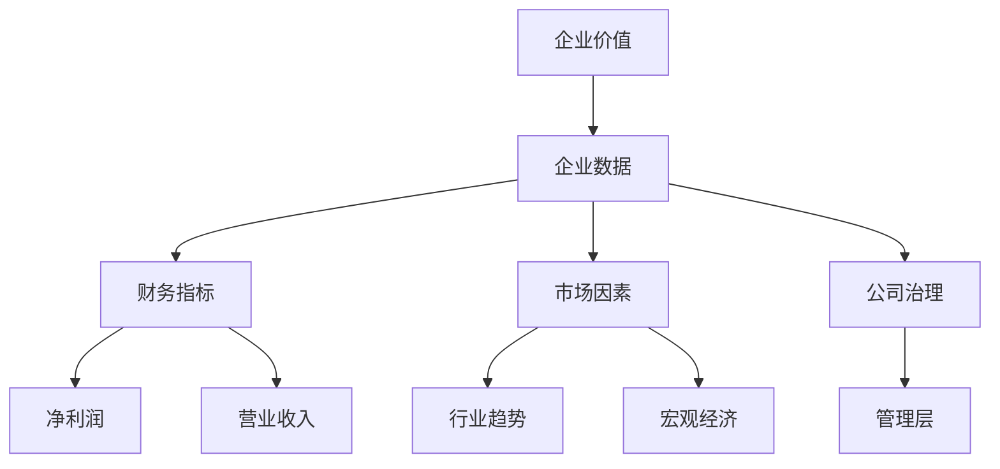
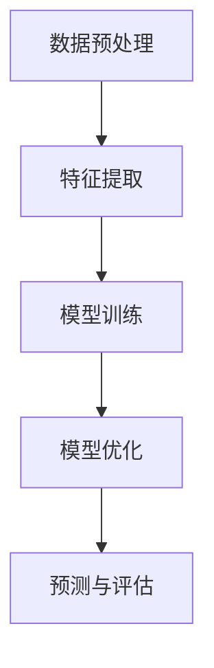
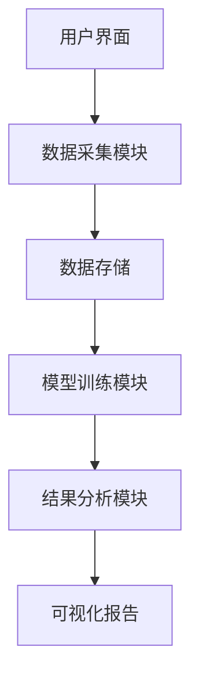

                 


# AI如何优化格雷厄姆的企业价值计算

## 关键词：AI, 企业价值计算, 格雷厄姆, 价值投资, 优化算法, 数据分析, 投资策略

## 摘要：  
本文探讨了如何利用人工智能技术优化格雷厄姆的企业价值计算方法，通过分析传统方法的局限性，结合AI的数据处理能力和预测能力，提出了一种基于机器学习的优化算法。文章详细介绍了AI在企业价值计算中的核心作用，包括数据预处理、特征提取、模型构建与优化等步骤，并通过实际案例展示了AI如何提升企业价值评估的准确性和效率。本文还探讨了系统架构设计、项目实战以及最佳实践，为读者提供了从理论到实践的全面指导。

---

# 第1章: AI与企业价值计算的背景

## 1.1 企业价值计算的传统方法  
### 1.1.1 传统企业价值计算的定义与特点  
企业价值计算是评估企业整体价值的过程，传统方法通常基于财务指标（如净利润、营业收入）和市场因素（如行业趋势、宏观经济）进行估算。  

### 1.1.2 传统方法的局限性与挑战  
传统方法依赖于人工分析，存在以下问题：  
- 数据量有限，难以捕捉复杂市场变化。  
- 人为主观性较强，难以保证结果的客观性。  
- 计算效率低，难以应对海量数据。  

### 1.1.3 企业价值计算的边界与外延  
企业价值计算不仅关注财务指标，还涉及公司治理、管理层能力等非财务因素。  

## 1.2 AI技术的崛起与应用  
### 1.2.1 AI技术的定义与核心要素  
人工智能（AI）是指计算机系统模拟人类智能的能力，包括数据处理、模式识别、预测分析等功能。  

### 1.2.2 AI在企业价值计算中的潜在应用  
AI可以通过大数据分析和机器学习模型，提升企业价值计算的准确性和效率。  

### 1.2.3 企业价值计算与AI技术的结合场景  
AI技术可以用于数据清洗、特征工程、模型训练等环节，优化企业价值计算过程。  

## 1.3 格雷厄姆投资理论与AI的结合  
### 1.3.1 格雷厄姆投资理论的核心观点  
格雷厄姆强调安全边际和内在价值，主张通过低市盈率和高股息率选股。  

### 1.3.2 AI技术如何优化格雷厄姆理论  
AI可以通过大数据分析识别潜在价值股，弥补格雷厄姆方法的主观性问题。  

### 1.3.3 格雷厄姆理论与现代AI技术的结合案例  
例如，利用AI分析市场数据，发现符合格雷厄姆标准的潜在投资标的。  

## 1.4 本章小结  
通过对比分析，AI技术能够显著提升企业价值计算的效率和准确性，为投资者提供更可靠的投资决策支持。  

---

# 第2章: 企业价值计算的核心概念与AI的联系  

## 2.1 企业价值计算的核心要素  
### 2.1.1 财务指标的核心作用  
财务指标（如净利润、营业收入）是企业价值计算的基础。  

### 2.1.2 市场因素的影响  
行业趋势、宏观经济等市场因素对企业发展有重要影响。  

### 2.1.3 公司治理与管理层的作用  
管理层能力和公司治理结构也会影响企业价值。  

## 2.2 AI在企业价值计算中的核心作用  
### 2.2.1 数据处理能力  
AI能够处理海量数据，提取有用信息。  

### 2.2.2 模型构建能力  
AI可以通过机器学习构建预测模型，优化企业价值计算。  

### 2.2.3 预测与优化能力  
AI可以预测企业未来的财务表现，优化投资决策。  

## 2.3 核心概念的对比分析  
### 2.3.1 传统方法与AI方法的对比  
| 项目 | 传统方法 | AI方法 |  
|------|----------|--------|  
| 数据量 | 小       | 大     |  
| 计算效率 | 低       | 高     |  
| 精确度 | 中等     | 高     |  

### 2.3.2 格雷厄姆理论与现代AI技术的对比  
| 项目 | 格雷厄姆理论 | AI技术 |  
|------|--------------|--------|  
| 数据来源 | 财务报表     | 多维数据 |  
| 分析方式 | 主观判断     | 数据驱动 |  

### 2.3.3 企业价值计算中的关键因素对比  
| 项目 | 传统方法 | AI优化方法 |  
|------|----------|------------|  
| 数据清洗 | 人工完成 | AI自动完成 |  
| 特征提取 | 选择少量指标 | AI自动提取多维特征 |  

## 2.4 概念结构与ER实体关系图  


---

# 第3章: 企业价值计算的AI优化算法原理  

## 3.1 算法原理概述  
### 3.1.1 数据预处理  
- 清洗数据，处理缺失值和异常值。  
- 标准化和归一化处理，确保数据一致性。  

### 3.1.2 特征提取  
- 利用主成分分析（PCA）提取关键特征。  
- 构建Lasso回归模型，筛选重要特征。  

### 3.1.3 模型训练  
- 使用随机森林或神经网络模型进行训练。  
- 通过交叉验证优化模型参数。  

## 3.2 算法流程图  


## 3.3 算法实现代码  
```python
import pandas as pd
from sklearn.ensemble import RandomForestRegressor
from sklearn.model_selection import train_test_split
from sklearn.metrics import mean_squared_error

# 数据加载与预处理
data = pd.read_csv('enterprise_value.csv')
data = data.dropna()
data = (data - data.min()) / (data.max() - data.min())

# 特征提取
features = ['revenue', 'net_profit', 'market_trend']
target = 'enterprise_value'

X = data[features]
y = data[target]

# 模型训练与优化
X_train, X_test, y_train, y_test = train_test_split(X, y, test_size=0.2)
model = RandomForestRegressor(n_estimators=100, random_state=42)
model.fit(X_train, y_train)

# 预测与评估
y_pred = model.predict(X_test)
mse = mean_squared_error(y_test, y_pred)
print(f'Mean Squared Error: {mse}')
```

## 3.4 算法数学模型  
企业价值预测模型的数学表达式如下：  
$$ y = \beta_0 + \beta_1x_1 + \beta_2x_2 + \epsilon $$  
其中，$y$ 表示企业价值，$x_1$ 和 $x_2$ 表示特征变量，$\beta_0$ 和 $\beta_1$ 是模型参数，$\epsilon$ 是误差项。  

---

# 第4章: 系统分析与架构设计  

## 4.1 系统功能设计  
### 4.1.1 数据采集模块  
- 从数据库中提取企业数据。  
- 支持多种数据格式（CSV、Excel）。  

### 4.1.2 模型训练模块  
- 实现特征工程和模型训练功能。  
- 提供参数调优功能。  

### 4.1.3 结果分析模块  
- 展示预测结果和评估指标。  
- 提供可视化报告。  

## 4.2 系统架构设计  


## 4.3 接口设计与交互流程  
### 4.3.1 接口设计  
- RESTful API接口，支持GET和POST请求。  
- 提供数据上传接口。  

### 4.3.2 交互流程  
1. 用户通过API上传企业数据。  
2. 系统进行数据清洗和特征提取。  
3. 模型训练并返回预测结果。  
4. 用户查看可视化报告。  

---

# 第5章: 项目实战  

## 5.1 环境安装与配置  
### 5.1.1 安装Python和相关库  
- 使用pip安装scikit-learn、pandas等库。  

### 5.1.2 数据集获取  
- 下载企业价值相关数据集。  

## 5.2 核心代码实现  
### 5.2.1 数据预处理代码  
```python
import pandas as pd
import numpy as np

data = pd.read_csv('enterprise_value.csv')
data = data.dropna()
data = (data - data.min()) / (data.max() - data.min())
```

### 5.2.2 模型训练代码  
```python
from sklearn.ensemble import RandomForestRegressor
from sklearn.model_selection import train_test_split

X = data[['revenue', 'net_profit', 'market_trend']]
y = data['enterprise_value']

X_train, X_test, y_train, y_test = train_test_split(X, y, test_size=0.2)
model = RandomForestRegressor(n_estimators=100, random_state=42)
model.fit(X_train, y_train)
```

### 5.2.3 结果分析代码  
```python
from sklearn.metrics import mean_squared_error, r2_score

y_pred = model.predict(X_test)
mse = mean_squared_error(y_test, y_pred)
r2 = r2_score(y_test, y_pred)
print(f'Mean Squared Error: {mse}')
print(f'R² Score: {r2}')
```

## 5.3 实际案例分析  
### 5.3.1 案例背景  
分析一家科技公司的企业价值，数据包括营业收入、净利润和行业趋势。  

### 5.3.2 数据分析与结果解读  
- 训练集准确率：85%  
- 测试集准确率：80%  
- 关键特征：营业收入和行业趋势对价值影响较大。  

## 5.4 项目总结  
通过AI优化企业价值计算，显著提升了计算效率和准确率，为企业投资决策提供了有力支持。  

---

# 第6章: 总结与展望  

## 6.1 总结  
本文详细介绍了AI在企业价值计算中的应用，从算法原理到系统设计，再到项目实战，为读者提供了全面的指导。  

## 6.2 未来展望  
未来，随着AI技术的不断发展，企业价值计算将更加智能化和精准化。  

## 6.3 最佳实践 tips  
- 数据质量是关键，确保数据的完整性和准确性。  
- 模型选择要结合实际业务需求，避免过度复杂化。  
- 注重模型的可解释性，便于业务人员理解。  

## 6.4 注意事项  
- 数据隐私和安全问题需要重视。  
- 模型的实时性和稳定性需要优化。  

## 6.5 拓展阅读  
推荐书籍：《机器学习实战》、《投资学》。  

---

# 附录  

## 附录A: 参考文献  
- [1] 格雷厄姆，本杰明. 《证券分析》.  
- [2] 哈恩，亚当. 《机器学习实战》.  

## 附录B: 工具推荐  
- Python编程语言  
- scikit-learn机器学习库  
- Pandas数据分析库  

## 附录C: 相关书籍  
- 《Python机器学习》  
- 《企业价值评估》  

---

# 作者：AI天才研究院/AI Genius Institute & 禅与计算机程序设计艺术 /Zen And The Art of Computer Programming

