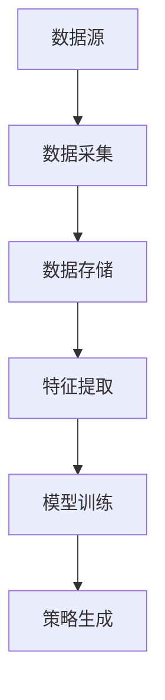

                 


# AI如何优化格雷厄姆的净净股策略

> 关键词：AI，格雷厄姆，净净股策略，投资策略，金融数据分析

> 摘要：本文探讨如何利用人工智能技术优化格雷厄姆的净净股投资策略。通过分析AI在数据处理、特征提取、模型选择等方面的优势，提出了一种结合传统投资策略与现代技术的方法，以提升投资决策的准确性和效率。文章从背景介绍、算法原理、系统架构到项目实战，全面详细地阐述了AI优化净净股策略的实现过程。

---

# 第一部分：背景介绍

## 第1章：格雷厄姆的净净股策略概述

### 1.1 净净股策略的核心思想
格雷厄姆的净净股策略是一种基于基本面分析的投资方法，其核心在于寻找市场价格低于其内在价值的股票。这种策略强调通过分析公司财务报表，特别是每股净现金流（NCAV），来识别那些被市场低估的公司。

### 1.2 净净股策略的局限性
尽管净净股策略在过去取得了显著的成功，但它也存在一些局限性：
- 数据依赖性强，难以捕捉非财务因素。
- 策略过于依赖历史数据，忽视了市场动态变化。
- 人工分析耗时且效率低下，难以应对海量数据。

### 1.3 AI技术如何弥补这些局限性
人工智能技术可以通过以下方式优化净净股策略：
- **数据处理能力**：AI能够处理大量结构化和非结构化数据，包括财务报表、新闻、社交媒体等，从而提供更全面的分析。
- **模式识别**：AI算法可以识别传统方法难以察觉的模式和趋势，帮助投资者发现潜在的投资机会。
- **实时更新**：AI能够实时更新模型，快速响应市场变化，提高决策的及时性。

---

## 第2章：AI在投资策略中的应用背景

### 2.1 AI技术的基本概念与特点
人工智能（AI）是指通过计算机模拟人类智能的技术，具有以下特点：
- 数据驱动：AI依赖大量数据进行学习和推理。
- 自适应性：AI能够根据反馈不断优化模型。
- 并行处理：AI可以同时处理大量数据，提高效率。

### 2.2 AI在金融分析中的优势
- **高效性**：AI能够快速分析大量数据，提高投资决策的效率。
- **准确性**：通过机器学习算法，AI可以发现数据中的复杂模式，提高预测的准确性。
- **实时性**：AI能够实时监控市场动态，提供即时的决策支持。

### 2.3 金融数据分析的挑战与机遇
- **挑战**：金融市场数据复杂且波动性大，传统方法难以捕捉所有相关信息。
- **机遇**：AI技术能够通过深度学习等方法，从海量数据中提取有用的信息，为投资决策提供支持。

---

# 第二部分：AI优化净净股策略的核心概念

## 第3章：AI与净净股策略的核心概念与联系

### 3.1 数据驱动的投资决策
AI通过分析大量数据，帮助投资者做出更科学的投资决策。例如，利用自然语言处理（NLP）技术分析公司财报和新闻，提取情绪指标，从而评估公司的潜在风险。

### 3.2 AI算法在金融数据中的应用
- **回归分析**：用于预测股票价格。
- **时间序列分析**：用于分析股价的趋势和周期性。
- **聚类分析**：用于将股票分为不同类别，寻找具有相似特性的股票。

### 3.3 净净股策略的优化方向
通过AI技术，可以优化以下方面：
- **特征选择**：筛选出对投资决策影响最大的财务指标。
- **模型优化**：通过机器学习算法提高预测的准确性。
- **风险控制**：利用AI技术实时监控市场动态，降低投资风险。

---

## 第4章：AI优化净净股策略的算法原理

### 4.1 回归分析
回归分析是一种统计方法，用于建立因变量和自变量之间的关系。在投资中，可以用于预测股票价格。

$$y = \beta_0 + \beta_1x + \epsilon$$

其中，$y$是预测的股票价格，$x$是自变量（如市盈率），$\beta_0$和$\beta_1$是回归系数，$\epsilon$是误差项。

### 4.2 时间序列分析
时间序列分析用于分析数据的时间依赖性。在投资中，可以用于预测股票价格的变化趋势。

$$ARIMA(p, d, q)$$

其中，$p$是自回归阶数，$d$是差分阶数，$q$是移动平均阶数。

### 4.3 聚类分析
聚类分析用于将股票分为不同的类别，寻找具有相似特性的股票。例如，可以将股票分为成长型和价值型两类。

---

## 第5章：AI优化净净股策略的系统架构设计方案

### 5.1 系统功能设计
- **数据采集模块**：从多个数据源获取股票数据，包括财务报表、新闻等。
- **特征提取模块**：利用机器学习算法提取有用的特征，如市盈率、市净率等。
- **模型训练模块**：训练机器学习模型，预测股票的价值。
- **策略执行模块**：根据模型的预测结果，制定投资策略。

### 5.2 系统架构图（使用 Mermaid）


---

## 第6章：AI优化净净股策略的项目实战

### 6.1 环境配置
- **编程语言**：Python
- **库**：Pandas、NumPy、Scikit-learn、TensorFlow

### 6.2 数据获取与预处理
```python
import pandas as pd
import numpy as np

# 获取数据
data = pd.read_csv('stock_data.csv')

# 数据清洗
data.dropna(inplace=True)
data = data[~data['price'].isnull()]
```

### 6.3 特征工程
```python
from sklearn.preprocessing import StandardScaler

# 标准化处理
scaler = StandardScaler()
features = scaler.fit_transform(data[['pe', 'pb', 'ps']])
```

### 6.4 模型训练
```python
from sklearn.linear_model import LinearRegression

# 训练模型
model = LinearRegression()
model.fit(features, data['value'])
```

### 6.5 策略执行
```python
# 预测股票价值
predicted_values = model.predict(features)

# 判断是否低估
undervalued_stocks = data[predicted_values < data['value']]
```

### 6.6 实际案例分析
通过分析实际案例，验证AI优化后的净净股策略的有效性。例如，假设某股票的预测价值低于其市场价格，投资者可以考虑买入该股票。

---

## 第7章：总结与展望

### 7.1 总结
本文探讨了如何利用人工智能技术优化格雷厄姆的净净股策略。通过数据处理、特征提取和模型训练，AI能够显著提高投资决策的准确性和效率。

### 7.2 展望
未来，随着AI技术的不断发展，净净股策略将进一步优化。例如，可以利用深度学习技术处理更复杂的数据，提高预测的准确性。

---

# 作者：AI天才研究院 & 禅与计算机程序设计艺术

---

这篇文章详细介绍了如何利用AI技术优化格雷厄姆的净净股策略，从背景介绍、算法原理到系统设计，再到项目实战，全面涵盖了AI在投资策略中的应用。通过本文的讲解，读者可以深入了解AI如何为净净股策略带来新的活力和效率提升。

