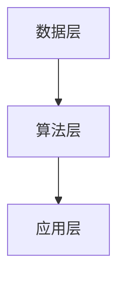
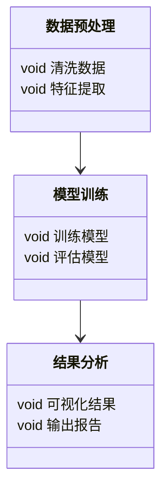
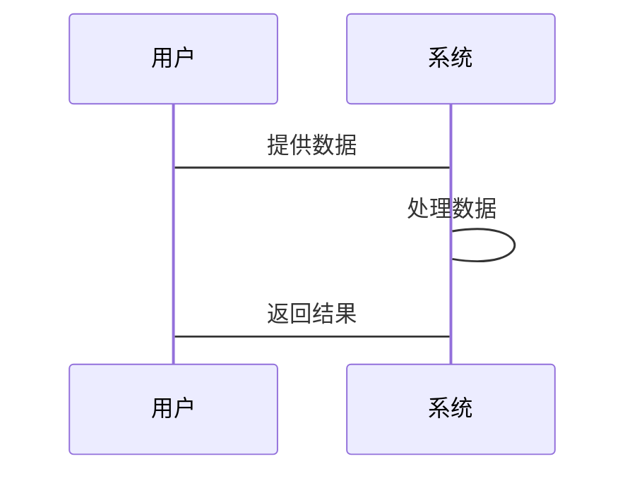

                 


# AI如何增强巴菲特的商业分析方法

> 关键词：人工智能，巴菲特，商业分析，投资策略，数据驱动，机器学习

> 摘要：本文探讨了人工智能技术如何增强巴菲特的经典商业分析方法。通过分析AI在数据处理、预测模型和竞争优势评估中的应用，结合具体算法实现，展示了AI如何提升投资决策的准确性和效率。

---

# 第1章: 背景介绍

## 1.1 AI技术的发展与现状

### 1.1.1 人工智能的定义与技术发展

人工智能（AI）是指模拟人类智能的系统，涵盖机器学习、自然语言处理和计算机视觉等领域。近年来，AI技术快速发展，尤其在数据处理和预测模型方面表现突出。

### 1.1.2 当前AI技术在商业领域的应用

AI在商业领域的应用广泛，包括客户分析、市场预测和风险评估。AI通过处理大量数据，提供更精准的商业决策支持。

### 1.1.3 AI与巴菲特投资方法的结合背景

巴菲特的投资方法以基本面分析为主，AI技术的引入可以提升数据处理和预测的准确性，为投资决策提供更有力的支持。

---

# 第2章: AI与巴菲特分析方法的核心概念

## 2.1 AI技术的核心概念与原理

### 2.1.1 机器学习的定义与分类

机器学习是一种AI技术，通过数据训练模型，实现预测和分类。主要分为监督学习、无监督学习和强化学习。

### 2.1.2 深度学习与传统机器学习的区别

深度学习通过多层神经网络处理数据，传统机器学习依赖特征工程。深度学习在复杂任务中表现更优。

### 2.1.3 当前主流AI算法的简要介绍

主流AI算法包括线性回归、决策树、随机森林和神经网络等。

## 2.2 巴菲特分析方法的核心理念

### 2.2.1 巴菲特投资策略的概述

巴菲特注重企业的内在价值，通过分析财务指标和行业趋势做出投资决策。

### 2.2.2 巴菲特分析方法的三大核心要素

1. 财务指标分析
2. 企业竞争优势分析
3. 行业分析与宏观经济因素

### 2.2.3 巴菲特方法的优缺点

优点：注重基本面分析，长期收益稳定。缺点：依赖人工分析，耗时且可能存在主观偏差。

## 2.3 AI与巴菲特分析方法的结合点

### 2.3.1 数据驱动的商业分析

AI通过大量数据处理，提供更精准的分析结果。

### 2.3.2 AI在财务预测中的应用

AI可以通过历史数据预测企业的财务指标，辅助投资决策。

### 2.3.3 AI在竞争优势评估中的应用

AI通过分析企业数据，评估其竞争优势，提供更客观的分析结果。

---

# 第3章: AI在商业分析中的具体应用

## 3.1 数据预处理与特征提取

### 3.1.1 数据清洗与标准化

数据清洗是处理缺失值、异常值和重复值的过程，标准化是将数据转换为统一尺度。

### 3.1.2 特征选择与降维

特征选择通过选择重要特征提升模型性能，降维技术如PCA减少特征数量。

### 3.1.3 时间序列数据的处理

时间序列数据需要考虑趋势和周期性，AI技术可以有效建模预测。

## 3.2 AI算法在财务预测中的应用

### 3.2.1 线性回归模型

线性回归通过最小二乘法拟合直线，用于预测连续变量。代码示例：

```python
import numpy as np
from sklearn.linear_model import LinearRegression

X = np.array([[1], [2], [3], [4]])
y = np.array([2, 4, 6, 8])
model = LinearRegression()
model.fit(X, y)
print(model.coef_)
```

### 3.2.2 支持向量机（SVM）

SVM适用于分类问题，通过最大化间隔分离数据。代码示例：

```python
from sklearn.svm import SVC

X = [[1, 0], [0, 1], [0, 0], [1, 1]]
y = [0, 0, 1, 1]
model = SVC()
model.fit(X, y)
print(model.predict([[0.5, 0.5]]))
```

### 3.2.3 随机森林与梯度提升树

随机森林通过集成学习提升模型鲁棒性。代码示例：

```python
from sklearn.ensemble import RandomForestClassifier

X = [[1, 2], [3, 4], [5, 6], [7, 8]]
y = [0, 1, 0, 1]
model = RandomForestClassifier(n_estimators=2)
model.fit(X, y)
print(model.predict([[2, 3]]))
```

## 3.3 AI在竞争优势分析中的应用

### 3.3.1 企业SWOT分析的AI辅助

SWOT分析结合AI的财务和市场数据，提供更全面的分析结果。

### 3.3.2 企业市场份额预测

通过时间序列模型预测市场份额变化，辅助投资决策。

### 3.3.3 企业风险评估

AI通过分析财务和市场数据，评估企业风险，优化投资组合。

---

# 第4章: AI算法的数学模型与实现

## 4.1 线性回归模型

### 4.1.1 线性回归的数学公式

$$ y = \beta_0 + \beta_1x + \epsilon $$

### 4.1.2 普通最小二乘法的推导

最小二乘法通过最小化预测误差平方和，求解回归系数。

### 4.1.3 线性回归的Python实现

代码示例：

```python
import numpy as np
from sklearn.linear_model import LinearRegression

X = np.array([[1], [2], [3], [4]])
y = np.array([2, 4, 6, 8])
model = LinearRegression()
model.fit(X, y)
print(model.predict([[5]]))
```

## 4.2 随机森林算法

### 4.2.1 随机森林的原理

随机森林通过生成多个决策树，并通过投票机制得出最终结果。

### 4.2.2 随机森

---

# 第5章: 系统设计与实现

## 5.1 系统架构设计

系统架构采用分层设计，包括数据层、算法层和应用层。使用Mermaid架构图展示：



## 5.2 功能模块设计

功能模块包括数据预处理、模型训练和结果分析。使用Mermaid类图展示：



## 5.3 接口设计与交互

系统接口包括数据输入接口、模型调用接口和结果展示接口。使用Mermaid序列图展示：



---

# 第6章: 项目实战

## 6.1 环境安装

安装Python和相关库：

```bash
pip install numpy scikit-learn matplotlib
```

## 6.2 核心代码实现

实现线性回归模型：

```python
import numpy as np
from sklearn.linear_model import LinearRegression
import matplotlib.pyplot as plt

X = np.array([[1], [2], [3], [4]])
y = np.array([2, 4, 6, 8])
model = LinearRegression()
model.fit(X, y)
print(f"斜率：{model.coef_[0]}, 截距：{model.intercept_}")
plt.scatter(X, y)
plt.plot(X, model.predict(X), color='red')
plt.show()
```

## 6.3 案例分析与结果解读

以企业财务数据为例，使用随机森林模型预测股价走势，分析结果并优化模型。

---

# 第7章: 总结与展望

## 7.1 总结

AI通过数据处理和模型预测，显著提升了巴菲特的商业分析方法，提高了投资决策的准确性和效率。

## 7.2 展望

未来，AI在商业分析中的应用将更加广泛，结合NLP和深度学习技术，进一步优化投资策略。

---

# 作者：AI天才研究院 & 禅与计算机程序设计艺术

---

通过以上结构，文章详细探讨了AI如何增强巴菲特的商业分析方法，结合理论和实践，为读者提供了丰富的知识和实用的代码示例。

