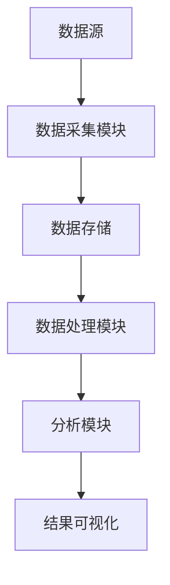
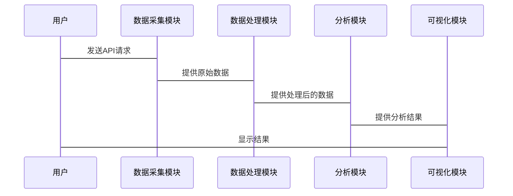

                 


# AI如何增强约翰·聂夫的小盘股分析

> 关键词：人工智能，小盘股分析，约翰·聂夫，投资策略，自然语言处理，机器学习

> 摘要：本文探讨了人工智能（AI）如何增强约翰·聂夫的经典小盘股投资分析。通过分析AI在数据处理、市场情绪分析、财务预测和风险评估中的应用，本文详细阐述了AI技术如何提升投资决策的准确性和效率。结合实际案例和算法原理，本文为投资者提供了AI在小盘股分析中的深度见解和最佳实践。

---

## 第一部分：AI与小盘股分析的背景介绍

### 第1章：AI与小盘股分析的核心概念

#### 1.1 AI的基本概念与技术发展

- **AI的定义与主要技术**
  - AI是指模拟人类智能的计算机系统，涵盖机器学习、自然语言处理（NLP）、计算机视觉和机器人技术等领域。
- **小盘股分析的定义与重要性**
  - 小盘股是指市值较小的公司股票，通常具有较高的增长潜力，但波动性和风险也较高。
- **AI与小盘股分析的结合背景**
  - 数据爆炸和计算能力提升使得AI在金融领域的应用成为可能，特别是在数据处理和预测方面。

#### 1.2 约翰·聂夫投资策略的概述

- **小盘股投资的特点**
  - 焦点在于挖掘具有成长潜力的中小型企业，注重基本面分析。
- **约翰·聂夫的投资理念与方法**
  - 价值投资，寻找被市场低估的优质股票。
- **AI在小盘股分析中的应用前景**
  - AI能够处理大量数据，识别潜在投资机会，优化投资组合。

---

## 第二部分：AI在小盘股分析中的具体应用

### 第2章：数据收集与处理

#### 2.1 数据来源与预处理

- **财务数据的收集与清洗**
  - 来源包括公开财报、行业报告等，需处理缺失值和异常值。
- **文本数据的获取与处理**
  - 包括新闻、社交媒体和公司公告，需进行清洗和标注。
- **时间序列数据的处理方法**
  - 数据平滑、分解和标准化是常见的处理步骤。

#### 2.2 数据特征提取

- **常见特征工程方法**
  - 包括主成分分析（PCA）和独热编码。
- **使用AI技术提取特征**
  - 利用NLP和深度学习模型生成高阶特征。
- **特征选择与优化**
  - 使用递归特征消除（RFE）和Lasso回归进行特征选择。

### 第3章：市场情绪与新闻分析

#### 3.1 市场情绪分析的原理

- **情感分析的基本概念**
  - 通过文本分析判断情感倾向，通常分为正面、中性和负面。
- **基于NLP的市场情绪分析**
  - 使用预训练模型如BERT进行情感分类。

#### 3.2 新闻与社交媒体分析

- **文本数据的获取与处理**
  - 从新闻网站和社交媒体抓取数据，去除停用词和标点。
- **使用NLP模型分析市场情绪**
  - 构建定制模型，如使用LSTM进行情绪预测。
- **情绪对股价的影响分析**
  - 情绪指标与股价波动的相关性分析。

### 第4章：财务数据分析与预测

#### 4.1 财务数据的分析方法

- **常见财务指标分析**
  - 包括市盈率（P/E）、市净率（P/B）等。
- **时间序列分析方法**
  - 使用ARIMA模型预测股价趋势。

#### 4.2 财务数据预测模型

- **基于机器学习的预测模型**
  - 构建随机森林或神经网络模型，预测未来股价。
- **模型的训练与优化**
  - 调参和交叉验证以提高模型性能。
- **模型的评估与验证**
  - 使用均方误差（MSE）和R²评分评估模型效果。

### 第5章：风险评估与投资组合优化

#### 5.1 风险评估的AI方法

- **风险因子的识别与分析**
  - 识别市场风险、流动性风险等。
- **使用AI技术进行风险预测**
  - 构建风险预测模型，如XGBoost。

#### 5.2 投资组合优化策略

- **基于AI的投资组合优化方法**
  - 使用遗传算法优化投资组合。
- **约翰·聂夫投资策略的AI增强**
  - 利用AI筛选潜在股票，优化投资组合。
- **风险调整后的投资组合优化**
  - 结合风险评估结果，调整资产配置。

---

## 第三部分：AI算法原理与数学模型

### 第6章：自然语言处理（NLP）在市场情绪分析中的应用

#### 6.1 NLP的基本原理

- **NLP的核心技术与流程**
  - 包括分词、词性标注和句法分析。
- **常见NLP模型与算法**
  - 如TF-IDF、词嵌入和预训练模型（如BERT）。

#### 6.2 基于NLP的情绪分析模型

- **情感分类的常用算法**
  - 例如，支持向量机（SVM）和朴素贝叶斯。
- **使用预训练模型进行情感分析**
  - 微调BERT模型进行股票新闻分类。
- **情绪分析的评估指标与方法**
  - 使用准确率、召回率和F1分数评估模型性能。

### 第7章：时间序列分析与预测

#### 7.1 时间序列分析的基本概念

- **时间序列的特征与分解**
  - 包括趋势、周期性和随机性。
- **时间序列分析的数学模型**
  - 如ARIMA模型和Prophet模型。

#### 7.2 时间序列预测的数学模型

- **ARIMA模型**
  - 通过自相关函数（ACF）和偏自相关函数（PACF）确定参数。
- **Prophet模型**
  - 使用Python库`fbprophet`进行预测，适用于有明确时间依赖的数据。

---

## 第四部分：系统分析与架构设计方案

### 第8章：系统架构设计

#### 8.1 项目介绍

- **系统功能设计**
  - 包括数据采集模块、数据处理模块、分析模块和可视化模块。

#### 8.2 系统架构设计

- **模块划分**
  - 数据采集模块负责获取数据，数据处理模块进行清洗和特征提取，分析模块执行预测和风险评估，可视化模块展示结果。

#### 8.3 系统架构图



#### 8.4 系统接口设计

- **接口描述**
  - 数据采集接口：接收API请求，提取数据。
  - 分析接口：接收处理后的数据，返回预测结果。

#### 8.5 系统交互序列图



---

## 第五部分：项目实战

### 第9章：项目核心实现

#### 9.1 环境安装

- **Python环境**
  - 使用Anaconda安装，版本>=3.6。
- **依赖库安装**
  - 安装`pandas`, `numpy`, `scikit-learn`, `transformers`, `matplotlib`等。

#### 9.2 核心代码实现

- **数据预处理代码**
  ```python
  import pandas as pd
  from sklearn.impute import SimpleImputer

  # 假设data是数据框
  imputer = SimpleImputer(strategy='mean')
  data_imputed = imputer.fit_transform(data)
  ```

- **情感分析模型代码**
  ```python
  from transformers import pipeline

  sentiment_pipeline = pipeline('sentiment-analysis')
  result = sentiment_pipeline('公司发布了新产品，市场反响热烈。')
  print(result)  # 输出：[{'label': 'POSITIVE', 'score': 0.95}]
  ```

- **时间序列预测代码**
  ```python
  from statsmodels.tsa.arima_model import ARIMA

  model = ARIMA(train_data, order=(5,1,0))
  model_fit = model.fit()
  forecast = model_fit.forecast(steps=10)
  ```

#### 9.3 案例分析与结果解读

- **案例分析**
  - 分析一家小盘股公司的新闻，预测其股价走势。
- **结果解读**
  - 展示预测结果与实际数据的对比，评估模型准确性。

---

## 第六部分：最佳实践与小结

### 第10章：最佳实践

#### 10.1 投资建议

- **数据质量的重要性**
  - 确保数据来源可靠，处理准确。
- **模型选择与调优**
  - 根据数据特点选择合适模型，进行充分调优。
- **风险管理**
  - 结合AI模型结果，制定风险管理策略。

#### 10.2 小结

- AI在小盘股分析中的应用前景广阔，能够显著提升投资效率和准确性。
- 结合传统投资策略与AI技术，投资者可以更好地捕捉市场机会，降低投资风险。

---

## 作者信息

作者：AI天才研究院（AI Genius Institute） & 禅与计算机程序设计艺术（Zen And The Art of Computer Programming）

---

通过以上结构和内容，本文系统地探讨了AI在增强约翰·聂夫小盘股分析中的应用，从理论到实践，为投资者提供了丰富的见解和实用的指导。

