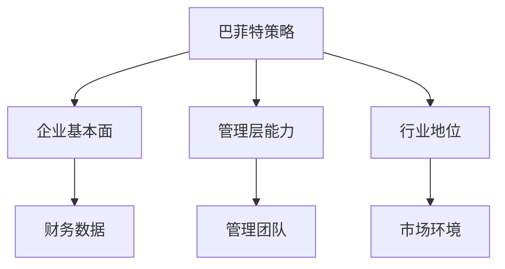
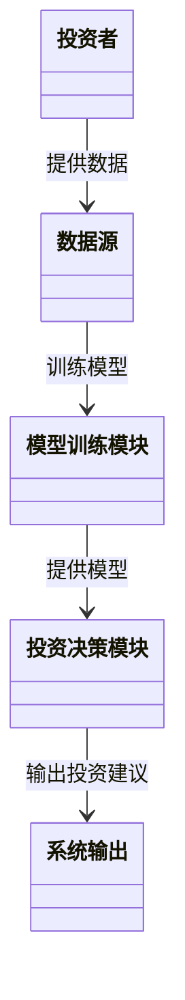
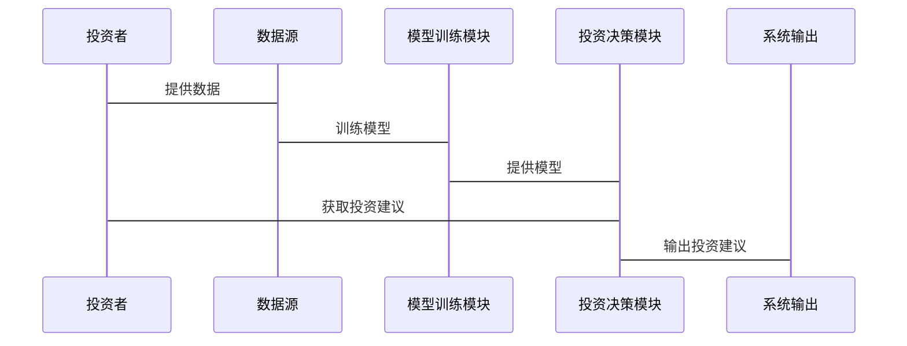

                 


# 第一部分: 巴菲特投资策略与AI的结合背景

# 第1章: 巴菲特投资策略的AI化之路

## 1.1 巴菲特投资策略的核心思想
### 1.1.1 巴菲特投资策略的背景与特点
巴非特的投资策略以长期价值投资为核心，强调对公司管理层、财务状况和行业地位的深入分析。AI技术的应用能够通过数据驱动的方式，提升分析的效率和准确性。

### 1.1.2 巴菲特看人下注策略的核心要素
- 企业基本面分析：包括财务数据、盈利能力、成长性等。
- 管理层能力评估：包括管理团队的经验、决策能力等。
- 行业地位与竞争优势：包括公司在行业中的地位、市场占有率等。

### 1.1.3 AI技术如何赋能巴菲特策略
通过机器学习算法，AI可以对大量的历史数据进行分析，识别出影响投资决策的关键因素，帮助投资者做出更明智的决策。

## 1.2 AI在金融领域的应用现状
### 1.2.1 AI在金融领域的典型应用
- 股票预测：利用历史数据和新闻情感分析预测股票走势。
- 风险评估：通过分析客户的信用记录和行为数据，评估贷款风险。
- 自动交易：使用算法进行高频交易，提高交易效率。

### 1.2.2 传统金融分析与AI的结合点
- 数据量大：金融市场的数据量庞大，AI能够处理和分析这些数据。
- 数据复杂性：金融市场数据具有高度的复杂性和不确定性，AI能够发现其中的规律。
- 实时性要求高：AI可以通过实时数据分析，快速做出投资决策。

### 1.2.3 巴菲特策略与AI结合的可行性分析
- 数据支持：巴菲特策略依赖于大量的历史数据，AI可以通过这些数据进行学习和预测。
- 算法优势：AI算法能够识别出传统金融分析难以捕捉的模式和趋势。
- 提高效率：AI可以快速处理大量数据，帮助投资者做出更高效的决策。

## 1.3 巴菲特策略AI化的技术基础
### 1.3.1 数据驱动的决策模式
AI通过分析历史数据，识别出影响投资决策的关键因素，帮助投资者做出更明智的决策。

### 1.3.2 AI在人物评估中的潜力
通过自然语言处理和情感分析，AI可以分析管理团队的背景、公开演讲和社交媒体信息，评估其能力和稳定性。

### 1.3.3 巴菲特策略AI化的实现路径
- 数据收集与整理：收集相关的财务数据、行业信息和管理团队资料。
- 模型训练：使用机器学习算法对数据进行训练，构建预测模型。
- 模型应用：将训练好的模型应用于实际投资决策中，提供投资建议。

## 1.4 本章小结
本章介绍了巴菲特投资策略的核心思想，分析了AI在金融领域的应用现状，探讨了巴菲特策略与AI结合的可行性，并提出了实现路径。通过这些内容，读者可以理解AI如何赋能巴菲特的看人下注策略。

# 第二部分: 巴菲特策略的AI实现原理

# 第2章: 巴菲特策略的核心要素与AI映射

## 2.1 巴菲特策略的核心要素分析
### 2.1.1 企业基本面分析
- 财务数据：包括收入、利润、资产负债表等。
- 盈利能力：包括净利率、毛利率等。
- 成长性：包括收入和利润的同比增长率。

### 2.1.2 管理层能力评估
- 管理团队的经验：包括CEO、CFO等高管的背景和履历。
- 管理决策：包括公司战略、投资决策等。
- 企业治理：包括公司治理结构、股东关系等。

### 2.1.3 行业地位与竞争优势
- 市场占有率：公司在行业中的市场份额。
- 行业趋势：包括行业增长、技术变革等。
- 竞争优势：包括成本优势、技术优势等。

## 2.2 AI在巴菲特策略中的映射关系
### 2.2.1 数据特征与巴菲特策略的对应关系
- 财务数据：用于预测公司的盈利能力。
- 管理团队：用于评估公司的管理能力。
- 行业信息：用于判断公司的行业地位。

### 2.2.2 AI算法与巴菲特策略的匹配性
- 监督学习：用于分类和回归问题，可以预测股票价格和公司业绩。
- 非监督学习：用于聚类分析，识别行业趋势和市场动态。
- 强化学习：用于模拟投资决策过程，优化投资策略。

### 2.2.3 巴菲特策略AI化的核心逻辑
- 数据驱动：通过大量数据训练AI模型，识别影响投资决策的关键因素。
- 模型优化：通过不断优化算法和参数，提高预测的准确性和稳定性。
- 实时反馈：通过实时数据分析，提供动态的投资建议。

## 2.3 巴菲特策略与AI的实体关系图


## 2.4 本章小结
本章分析了巴菲特策略的核心要素，探讨了AI在这些要素中的映射关系，提出了AI赋能巴菲特策略的核心逻辑，并通过实体关系图展示了各要素之间的关系。

# 第三部分: 基于AI的巴菲特策略实现算法

# 第3章: 基于监督学习的巴菲特策略AI实现

## 3.1 监督学习算法原理
### 3.1.1 监督学习的基本概念
监督学习是一种机器学习方法，通过训练数据学习输入与输出之间的关系，从而能够对新数据进行预测和分类。

### 3.1.2 常见监督学习算法（如决策树、随机森林）
- 决策树：通过树状结构进行分类和回归。
- 随机森林：通过集成多个决策树，提高模型的准确性和稳定性。

### 3.1.3 监督学习在巴菲特策略中的应用
- 股票价格预测：通过历史数据训练模型，预测股票价格走势。
- 公司业绩预测：通过财务数据和行业信息，预测公司的盈利能力。

## 3.2 巴菲特策略AI实现的数学模型
### 3.2.1 数据特征向量表示
将企业的财务数据、管理团队信息和行业地位等特征转化为向量，用于模型训练。

### 3.2.2 监督学习模型的损失函数
使用均方误差作为损失函数，衡量预测值与真实值之间的差异。
$$L = \frac{1}{n}\sum_{i=1}^{n}(y_i - \hat{y}_i)^2$$

### 3.2.3 模型训练与优化
通过梯度下降算法优化模型参数，最小化损失函数，提高预测准确率。

## 3.3 巴菲特策略AI实现的算法流程
### 3.3.1 数据收集与预处理
收集相关的历史数据，包括财务数据、管理团队信息和行业信息，进行数据清洗和特征提取。

### 3.3.2 模型训练
使用监督学习算法训练模型，提取影响投资决策的关键特征。

### 3.3.3 模型评估
通过交叉验证评估模型的准确性和稳定性，优化模型参数。

### 3.3.4 模型应用
将训练好的模型应用于实际投资决策，提供股票推荐和投资建议。

## 3.4 本章小结
本章详细介绍了监督学习算法的原理和应用，构建了巴菲特策略AI实现的数学模型，并提出了算法流程，为后续的系统设计和项目实现奠定了基础。

# 第四部分: 系统分析与架构设计

# 第4章: 巴菲特策略AI化系统分析

## 4.1 问题场景介绍
### 4.1.1 投资者面临的挑战
- 数据量大：投资者需要处理大量的历史数据。
- 数据复杂性：金融市场数据具有高度的复杂性和不确定性。
- 实时性要求高：投资者需要快速做出决策。

### 4.1.2 AI赋能投资的优势
- 数据处理能力强：AI能够快速处理和分析大量的数据。
- 模型优化能力强：AI可以通过不断优化模型，提高预测的准确性和稳定性。
- 实时反馈能力强：AI可以通过实时数据分析，提供动态的投资建议。

## 4.2 项目介绍
### 4.2.1 项目目标
构建一个基于AI的巴菲特策略投资系统，帮助投资者做出更明智的投资决策。

### 4.2.2 项目范围
- 数据收集与预处理
- 模型训练与优化
- 系统设计与实现
- 系统测试与部署

## 4.3 系统功能设计
### 4.3.1 领域模型（Mermaid 类图）


### 4.3.2 系统架构设计（Mermaid 架构图）


### 4.3.3 系统接口设计
- 输入接口：接收投资者提供的数据和指令。
- 输出接口：提供投资建议和实时反馈。

### 4.3.4 系统交互（Mermaid 序列图）


## 4.4 本章小结
本章分析了巴菲特策略AI化系统的问题场景，介绍了项目的总体架构，设计了系统的功能模块和交互流程，为后续的系统实现提供了清晰的指导。

# 第五部分: 项目实战

# 第5章: 巴菲特策略AI化系统实现

## 5.1 环境安装与配置
### 5.1.1 安装Python和必要的库
安装Python 3.x，安装numpy、pandas、scikit-learn、xgboost等机器学习库。

### 5.1.2 安装开发环境
安装Jupyter Notebook或PyCharm等开发环境，配置虚拟环境。

## 5.2 系统核心实现
### 5.2.1 数据收集与预处理
- 数据来源：收集历史股票数据、财务数据和管理团队信息。
- 数据清洗：处理缺失值、异常值和重复数据。
- 特征提取：提取影响投资决策的关键特征，如财务指标、管理团队背景等。

### 5.2.2 模型训练与优化
- 模型选择：选择适合的机器学习算法，如随机森林、XGBoost等。
- 模型训练：使用训练数据训练模型，调整模型参数。
- 模型评估：通过交叉验证评估模型的准确性和稳定性。

### 5.2.3 系统实现
- 数据处理模块：负责数据的收集、清洗和特征提取。
- 模型训练模块：负责模型的训练和优化。
- 投资决策模块：根据模型预测结果，提供投资建议。

## 5.3 核心代码实现
### 5.3.1 数据预处理代码
```python
import pandas as pd
import numpy as np

# 加载数据
data = pd.read_csv('data.csv')

# 数据清洗
data = data.dropna()
data = data.drop_duplicates()

# 特征提取
features = data[[' revenue', 'net_profit', 'market_cap', 'management_team']]
labels = data[' stock_price']
```

### 5.3.2 模型训练代码
```python
from sklearn.model_selection import train_test_split
from sklearn.ensemble import RandomForestRegressor
from sklearn.metrics import mean_squared_error

# 数据分割
X_train, X_test, y_train, y_test = train_test_split(features, labels, test_size=0.2)

# 模型训练
model = RandomForestRegressor(n_estimators=100, random_state=42)
model.fit(X_train, y_train)

# 模型预测
y_pred = model.predict(X_test)
print(mean_squared_error(y_test, y_pred))
```

### 5.3.3 投资决策模块代码
```python
def get_investment_recommendation(data):
    # 数据预处理
    features = data[[' revenue', 'net_profit', 'market_cap', 'management_team']]
    labels = data[' stock_price']
    
    # 模型预测
    y_pred = model.predict(features)
    
    # 投资建议
    recommendation = []
    for i in range(len(y_pred)):
        if y_pred[i] > data[' stock_price'].mean():
            recommendation.append('买入')
        else:
            recommendation.append('卖出')
    return recommendation
```

## 5.4 案例分析与详细解读
### 5.4.1 案例背景
以某科技公司为例，收集其过去5年的财务数据、管理团队信息和股票价格。

### 5.4.2 数据分析
通过数据分析，识别出公司的收入增长迅速，但净利润率有所下降，管理团队稳定，行业地位较高。

### 5.4.3 模型预测
模型预测结果显示，未来6个月的股票价格将上涨，推荐投资者买入该股票。

## 5.5 本章小结
本章通过实际案例展示了巴菲特策略AI化系统的实现过程，从数据收集到模型训练，再到系统实现，详细讲解了每个步骤的操作和实现代码，帮助读者理解如何将AI技术应用于巴菲特的看人下注策略。

# 第六部分: 总结与展望

# 第6章: 巴菲特策略AI化系统的总结与展望

## 6.1 本项目总结
### 6.1.1 项目成果
成功构建了一个基于AI的巴菲特策略投资系统，能够根据历史数据和行业信息，提供投资建议。

### 6.1.2 核心技术总结
- 数据预处理：通过清洗和特征提取，提高了模型的准确性。
- 模型选择：随机森林和XGBoost等算法在预测任务中表现优异。
- 系统设计：模块化的系统架构，提高了系统的可维护性和扩展性。

## 6.2 投资策略AI化的最佳实践
### 6.2.1 数据来源可靠性
确保数据来源的可靠性和准确性，选择权威的数据供应商。

### 6.2.2 模型优化
通过不断优化模型参数和算法，提高预测的准确性和稳定性。

### 6.2.3 系统安全性
确保系统的数据安全和交易安全，防止数据泄露和网络攻击。

## 6.3 项目实施中的注意事项
### 6.3.1 数据隐私
遵守相关法律法规，保护投资者的隐私数据。

### 6.3.2 系统稳定性
确保系统的稳定运行，避免因系统故障导致的投资损失。

### 6.3.3 模型解释性
选择可解释性较强的模型，帮助投资者理解投资决策的依据。

## 6.4 未来研究方向
### 6.4.1 多模态数据融合
将文本数据、图像数据等多种数据类型结合起来，提高模型的预测能力。

### 6.4.2 强化学习应用
研究强化学习在投资决策中的应用，模拟真实的市场环境，优化投资策略。

### 6.4.3 鲁棒性研究
研究模型的鲁棒性，提高系统在极端市场环境下的适应能力。

## 6.5 本章小结
本章总结了项目的成果和实施过程，提出了投资策略AI化的最佳实践和注意事项，展望了未来的研究方向，为读者提供了宝贵的参考和启示。

# 作者：AI天才研究院 & 禅与计算机程序设计艺术

