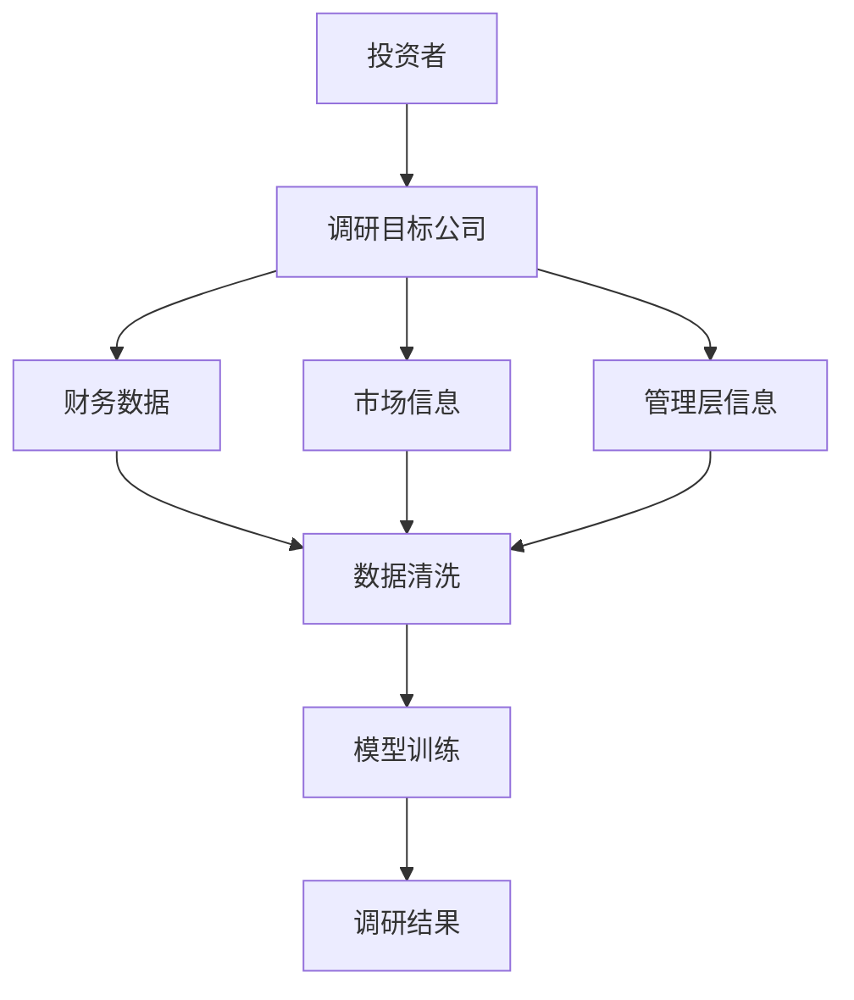
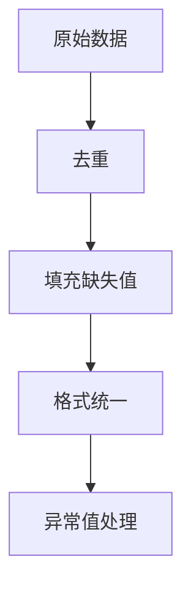
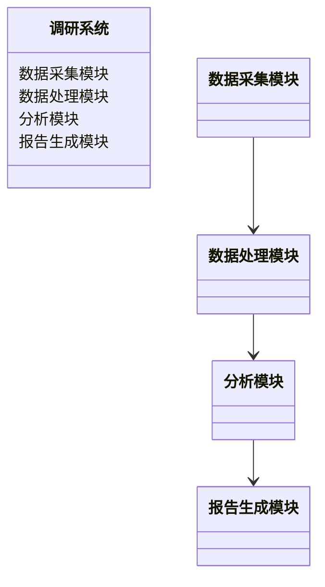
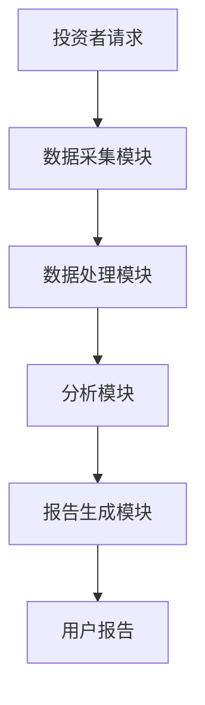

                 


# AI如何实现彼得·林奇的实地调研自动化

> 关键词：AI, 彼得·林奇, 实地调研, 自动化, 大数据, NLP, 机器学习

> 摘要：本文探讨如何利用人工智能技术实现彼得·林奇风格的实地调研自动化。通过分析调研的核心流程，结合自然语言处理和机器学习算法，构建自动化调研系统，并提供实际案例和技术实现。

---

# 第一部分: AI实现彼得·林奇实地调研自动化的背景与概念

## 第1章: 背景介绍

### 1.1 问题背景

#### 1.1.1 彼得·林奇实地调研的核心价值
彼得·林奇以其对企业基本面的深入分析和面对面访谈著称，他的调研方法强调对企业管理层、供应商和客户的深入访谈，以获取潜在的投资机会。这种方法虽然有效，但耗时且成本高昂。

#### 1.1.2 传统实地调研的局限性
- **时间消耗**：传统调研需要大量时间进行实地考察和访谈。
- **成本高昂**：差旅费、人力成本高。
- **主观性**：依赖调研人员的经验和判断，存在主观偏差。

#### 1.1.3 AI技术如何解决调研难题
AI技术可以通过自动化数据收集、分析和生成，辅助或替代部分调研工作，提高效率并降低成本。

### 1.2 问题描述

#### 1.2.1 实地调研的主要流程
1. 确定调研目标。
2. 收集相关信息。
3. 实地考察与访谈。
4. 数据分析与报告撰写。

#### 1.2.2 人工调研的效率瓶颈
- 数据收集范围广，耗时长。
- 数据分析依赖人工经验，容易出错。
- 报告撰写需要大量时间整理数据。

#### 1.2.3 数据处理的复杂性
- 数据来源多样，格式不一。
- 需要处理大量非结构化数据，如文本、语音等。

### 1.3 问题解决

#### 1.3.1 AI在调研自动化中的潜力
- **自动化数据收集**：通过爬虫和API自动获取企业信息。
- **自动分析与报告生成**：利用NLP和机器学习模型自动分析数据并生成报告。

#### 1.3.2 自动化调研的目标与范围
- 目标：提高调研效率，降低成本。
- 范围：涵盖数据收集、分析和报告生成的全流程。

#### 1.3.3 AI调研的核心要素
- 数据源：企业财务数据、新闻报道、社交媒体等。
- 技术：NLP、机器学习、大数据处理。

### 1.4 边界与外延

#### 1.4.1 自动化调研的适用场景
- 初步筛选阶段，快速评估企业基本面。
- 大数据环境下的模式识别。

#### 1.4.2 AI调研的局限性
- 无法完全替代人工判断，特别是在需要深度理解和情境分析的情况下。
- 数据质量对模型性能影响大。

#### 1.4.3 与传统调研的结合点
- 作为辅助工具，提高效率，减少重复劳动。

### 1.5 概念结构与核心要素

#### 1.5.1 调研数据的结构化
- 将非结构化数据（如文本、语音）转化为结构化数据，便于分析。

#### 1.5.2 AI模型的核心要素
- 数据预处理：清洗、转换。
- 模型训练：选择合适的算法，调整参数。
- 模型评估：准确率、召回率等指标。

#### 1.5.3 自动化调研的流程模型
- 数据收集 -> 数据清洗 -> 特征提取 -> 模型训练 -> 结果生成。

---

## 第2章: 核心概念与联系

### 2.1 AI、大数据与NLP的基础知识

#### 2.1.1 人工智能的基本概念
- AI：模拟人类智能的计算机系统，包括学习、推理和自适应能力。

#### 2.1.2 大数据在投资中的应用
- 数据挖掘：发现投资机会。
- 预测分析：预测市场趋势。

#### 2.1.3 自然语言处理的核心原理
- NLP：处理和理解人类语言的技术，包括文本分类、实体识别等。

### 2.2 核心概念原理

#### 2.2.1 数据收集与清洗
- 数据收集：从多种来源获取数据。
- 数据清洗：去重、填充缺失值、处理异常值。

#### 2.2.2 文本分析与特征提取
- 使用TF-IDF提取关键词，分析文本情感。

#### 2.2.3 模型训练与结果生成
- 训练分类模型，生成投资报告。

### 2.3 概念属性特征对比表格

| 概念 | 属性 | 特征 |
|------|------|------|
| AI   | 数据处理 | 文本、语音、图像 |
| 大数据 | 分析方法 | 描述性、预测性、诊断性 |
| NLP  | 应用场景 | 情感分析、实体识别、文本生成 |

### 2.4 ER实体关系图



---

## 第3章: 算法原理讲解

### 3.1 数据清洗算法

#### 3.1.1 数据清洗流程


### 3.2 特征提取算法

#### 3.2.1 TF-IDF特征提取
```python
from sklearn.feature_extraction.text import TfidfVectorizer
vectorizer = TfidfVectorizer()
X = vectorizer.fit_transform(documents)
```

### 3.3 模型训练算法

#### 3.3.1 文本分类模型
- 使用支持向量机（SVM）进行文本分类。
- 训练过程包括特征提取、模型训练和结果评估。

#### 3.3.2 情感分析模型
- 使用深度学习模型如LSTM进行情感分析。
- 模型结构包括输入层、隐藏层和输出层。

---

## 第4章: 系统分析与架构设计方案

### 4.1 问题场景介绍

#### 4.1.1 项目介绍
- 开发一个AI驱动的自动化调研系统，辅助投资者快速评估企业基本面。

### 4.2 系统功能设计

#### 4.2.1 领域模型（类图）


### 4.3 系统架构设计

#### 4.3.1 系统架构图


---

## 第5章: 项目实战

### 5.1 环境安装

#### 5.1.1 安装Python和相关库
```bash
pip install numpy pandas scikit-learn spacy
```

### 5.2 核心实现

#### 5.2.1 数据采集模块
```python
import requests
from bs4 import BeautifulSoup

def fetch_data(url):
    response = requests.get(url)
    soup = BeautifulSoup(response.text, 'html.parser')
    return soup.text
```

#### 5.2.2 数据处理模块
```python
from sklearn.feature_extraction.text import TfidfVectorizer

def process_data(text):
    vectorizer = TfidfVectorizer()
    X = vectorizer.fit_transform([text])
    return X
```

### 5.3 案例分析

#### 5.3.1 实际案例
- 使用某公司新闻数据进行情感分析，生成投资报告。

### 5.4 项目小结
- AI技术能够显著提高调研效率，但仍需人工判断。

---

## 最佳实践 tips

- **数据质量**：确保数据来源可靠，避免噪声干扰。
- **模型选择**：根据任务选择合适的算法，如SVM用于分类，LSTM用于序列分析。
- **持续优化**：定期更新模型，适应市场变化。

## 小结

通过AI技术，我们可以实现彼得·林奇风格的实地调研自动化，显著提高效率和降低成本。然而，AI工具应作为辅助，而非完全替代人类的判断。

## 注意事项

- 数据隐私和合规性问题需谨慎处理。
- 模型的泛化能力有限，需结合具体场景使用。

## 拓展阅读

- 《机器学习实战》
- 《自然语言处理入门》

---

作者：AI天才研究院/AI Genius Institute & 禅与计算机程序设计艺术/Zen And The Art of Computer Programming

