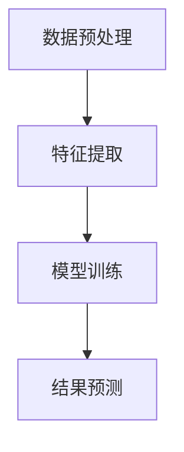
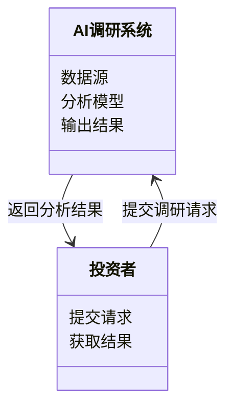

                 


# AI如何实现彼得林奇的实地调研策略

> 关键词：AI、投资调研、彼得·林奇、自然语言处理、情感分析、机器学习、系统架构

> 摘要：本文探讨如何利用AI技术模拟彼得·林奇的实地调研策略，通过自然语言处理、情感分析和机器学习等技术，构建投资模型，实现自动化调研与决策支持。文章详细分析了AI在投资调研中的应用，包括算法原理、系统架构和项目实战，为读者提供深入的技术解析与实践指导。

---

## 第一部分: 背景与概述

### 第1章: 背景与概述

#### 1.1 问题背景与描述

- **1.1.1 彼得·林奇的实地调研策略**
  彼得·林奇是全球著名投资经理，以其独特的实地调研方法闻名。他通过深入分析公司基本面、管理层和行业趋势，发现投资机会。然而，传统调研方法依赖人工分析，耗时且难以量化，容易受到主观因素影响。

- **1.1.2 传统调研方法的局限性**
  传统调研依赖人工收集和分析数据，存在效率低、覆盖范围有限、难以量化等缺点。尤其是在信息量爆炸的时代，人工调研难以及时捕捉市场变化。

- **1.1.3 AI技术如何弥补调研不足**
  AI技术能够快速处理大量数据，发现隐藏模式，提供数据支持和决策建议。通过自然语言处理、情感分析和机器学习，AI可以辅助投资者快速完成调研，提升效率和准确性。

#### 1.2 AI实现调研的核心概念

- **1.2.1 AI在投资调研中的应用**
  AI技术可以用于分析公司财报、新闻报道、行业报告等文本数据，提取关键信息，评估公司前景和市场情绪。

- **1.2.2 AI调研的边界与外延**
  AI调研主要用于辅助投资决策，通过数据分析提供支持，但不能完全替代人类的判断。其外延包括数据挖掘、模式识别和预测建模。

- **1.2.3 核心要素组成与概念结构**
  AI调研的核心要素包括数据源、分析模型、计算引擎和输出结果。概念结构涉及数据输入、处理、分析和决策支持。

---

## 第二部分: 核心概念与技术联系

### 第2章: 核心概念与技术联系

#### 2.1 AI模拟调研的原理

- **2.1.1 自然语言处理在调研中的应用**
  NLP技术用于解析公司财报、新闻报道等文本，提取关键信息如财务数据、行业趋势和公司管理层变动。

- **2.1.2 情感分析与市场情绪预测**
  情感分析用于判断市场情绪，如分析社交媒体和新闻标题的情绪倾向，预测市场走势。

- **2.1.3 数据挖掘与投资机会识别**
  数据挖掘技术用于发现市场趋势和投资机会，如识别行业领先者和潜在风险。

#### 2.2 核心概念对比表格

| **对比维度** | **传统调研** | **AI调研** |
|--------------|--------------|------------|
| **效率**     | 较低         | 高          |
| **覆盖范围** | 有限         | 广泛        |
| **准确性**    | 受主观影响    | 数据驱动    |
| **成本**      | 高           | 低          |

#### 2.3 ER实体关系图

```mermaid
er
    entity 投资调研数据 {
        <调研报告ID, pk>
        <公司名称>
        <调研时间>
        <调研地点>
        <调研人员>
    }
    entity AI调研系统 {
        <系统ID, pk>
        <数据源>
        <分析模型>
        <输出结果>
    }
    relationship 调研数据关联 {
        投资调研数据 --> AI调研系统
        "调研数据输入"
    }
```

---

## 第三部分: 算法原理与流程

### 第3章: 算法原理与流程

#### 3.1 自然语言处理算法

- **3.1.1 BERT模型在调研文本分析中的应用**
  BERT模型用于理解上下文，分析文本中的实体关系和情感倾向。例如，分析公司财报中的关键词和情感倾向。

- **3.1.2 情感分析流程**
  情感分析流程包括数据预处理、特征提取、模型训练和结果预测。例如，使用预训练模型分析新闻标题的情绪。

#### 3.2 算法流程图



#### 3.3 代码实现

```python
import tensorflow as tf
from tensorflow.keras import layers

# 数据预处理
def preprocess(text):
    return text.lower()

# 情感分析模型
def build_model():
    model = tf.keras.Sequential([
        layers.Embedding(10000, 16),
        layers.GlobalAveragePooling1D(),
        layers.Dense(1, activation='sigmoid')
    ])
    return model

# 训练与预测
model = build_model()
model.compile(optimizer='adam', loss='binary_crossentropy', metrics=['accuracy'])
model.fit(x_train, y_train, epochs=10, batch_size=32)
```

#### 3.4 投资模型构建

- **3.4.1 投资模型的数学公式**
  $$ P = \beta_0 + \beta_1 x_1 + \beta_2 x_2 + \ldots + \beta_n x_n $$
  其中，$P$ 是投资价值预测，$x_i$ 是各个特征变量。

- **3.4.2 举例说明**
  使用历史数据训练模型，预测股票价格走势。例如，使用线性回归模型预测未来的价格。

---

## 第四部分: 数学模型与公式

### 第4章: 数学模型与公式

#### 4.1 情感分析的概率计算

$$ P(\text{positive} | \text{text}) = \frac{\text{count}(\text{positive words})}{\text{total words}} $$

#### 4.2 投资模型的回归分析

$$ \text{Price} = \beta_0 + \beta_1 \times \text{Revenue} + \beta_2 \times \text{Profit} + \epsilon $$

---

## 第五部分: 系统分析与架构设计

### 第5章: 系统分析与架构设计

#### 5.1 问题场景介绍

- **数据源**：公司财报、新闻、行业报告。
- **目标**：构建AI辅助投资系统，提供数据支持和决策建议。

#### 5.2 系统功能设计



#### 5.3 系统架构设计


---

## 第六部分: 项目实战

### 第6章: 项目实战

#### 6.1 环境安装

- **Python 3.8+**
- **TensorFlow 2.0+**
- **自然语言处理库（如NLTK、spaCy）**

#### 6.2 系统核心实现源代码

```python
import pandas as pd
import numpy as np

# 数据加载
data = pd.read_csv('investment_reports.csv')

# 特征提取
from sklearn.feature_extraction.text import TfidfVectorizer
vectorizer = TfidfVectorizer()
X = vectorizer.fit_transform(data['text'])

# 模型训练
from sklearn.linear_model import LogisticRegression
model = LogisticRegression()
model.fit(X, data['label'])

# 预测与评估
from sklearn.metrics import accuracy_score
y_pred = model.predict(X)
print(accuracy_score(data['label'], y_pred))
```

---

## 第七部分: 最佳实践与注意事项

### 第7章: 最佳实践与注意事项

#### 7.1 小结

- AI能够显著提升投资调研的效率和准确性。
- 需要结合人工判断，避免完全依赖AI。

#### 7.2 注意事项

- 数据质量至关重要。
- 模型需要定期更新和维护。
- 注意数据隐私和合规性。

#### 7.3 未来展望

- 结合更多数据源和模型，提升预测精度。
- 实时监控市场变化，提供动态支持。

---

## 作者：AI天才研究院 & 禅与计算机程序设计艺术

---

以上是文章的完整结构和内容，涵盖从背景介绍到项目实战的各个方面，旨在为读者提供一个全面且深入的技术解析。

