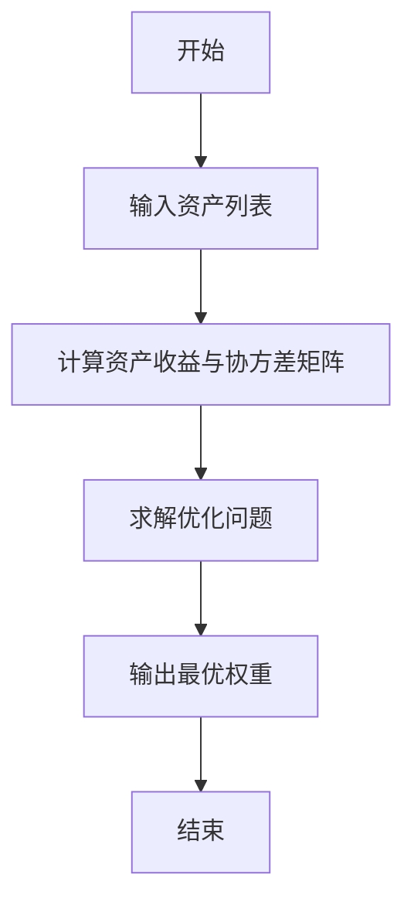
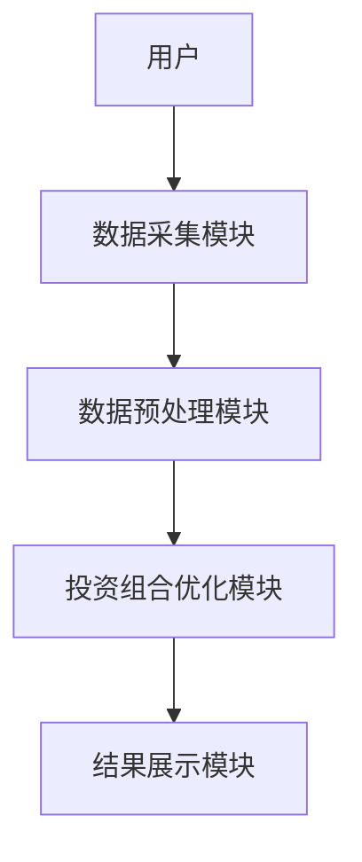

                 


# AI如何实现格雷厄姆的分散投资原则

## 关键词：
AI, 格雷厄姆, 分散投资, 投资组合优化, 机器学习, 金融数据分析

## 摘要：
本文详细探讨了如何利用人工智能技术实现格雷厄姆的分散投资原则。通过结合现代投资组合理论（MPT）和机器学习算法，AI能够优化投资组合，降低风险，实现更高效的资产配置。文章从理论基础、算法实现到系统设计和项目实战，全面解析了AI在分散投资中的应用，为读者提供了深入的技术见解和实践指导。

---

## 第一部分: AI与格雷厄姆分散投资原则的背景介绍

### 第1章: 格雷厄姆分散投资原则概述

#### 1.1 格雷厄姆分散投资原则的核心概念

##### 1.1.1 分散投资的定义与背景
分散投资是一种通过将资金分配到不同的资产或资产类别中来降低投资风险的策略。它的核心思想是“不要把所有鸡蛋放在一个篮子里”。这种策略旨在通过多样化投资，减少单一资产价格波动对整体投资组合的影响。

格雷厄姆是价值投资的鼻祖，他强调通过分散投资来降低非系统性风险。在现代金融学中，分散投资是投资组合理论的核心原则之一。

##### 1.1.2 格雷厄姆投资理念的核心要素
格雷厄姆的价值投资理念强调安全边际和长期持有优质资产。他的分散投资策略包括以下核心要素：
1. **资产多样化**：将资金分配到不同行业、地区或资产类别中。
2. **价值评估**：选择具有安全边际的低估资产。
3. **长期持有**：避免频繁交易以减少成本和风险。
4. **风险控制**：通过分散投资降低投资组合的波动性。

##### 1.1.3 分散投资在现代金融中的应用
随着金融市场的复杂化，分散投资策略被广泛应用于机构和个人投资者的资产配置中。通过多样化投资，投资者可以有效降低市场风险，同时捕捉不同资产的收益机会。

---

#### 1.2 AI在金融投资中的应用基础

##### 1.2.1 AI在金融领域的核心作用
人工智能（AI）在金融领域的应用日益广泛，尤其是在数据处理、预测分析和投资决策方面。AI能够处理海量数据，发现隐藏的模式，并提供实时的决策支持。

##### 1.2.2 AI与金融投资的结合点
AI在金融投资中的应用主要体现在以下几个方面：
1. **数据驱动的投资决策**：通过机器学习算法分析历史数据，预测市场趋势。
2. **风险评估与预测**：利用AI模型评估资产的信用风险和市场风险。
3. **投资组合管理**：通过AI优化投资组合，实现资产的最优配置。

##### 1.2.3 AI与分散投资的结合
AI可以通过算法优化分散投资策略，帮助投资者在复杂市场中做出更科学的投资决策。例如，AI可以通过聚类分析将资产分为不同的类别，从而更有效地实现资产多样化。

---

## 第二部分: AI实现分散投资的原理与算法

### 第2章: AI驱动的分散投资原理

#### 2.1 分散投资的数学模型

##### 2.1.1 投资组合优化的数学公式
现代投资组合理论（MPT）是分散投资的理论基础。其目标是最小化投资组合的波动性，同时最大化预期收益。数学模型如下：

$$
\text{目标函数：} \quad \min_w \frac{1}{2}w^T \Sigma w
$$

$$
\text{约束条件：} \quad \sum_{i=1}^n w_i = 1, \quad w_i \geq 0 \quad (i=1,2,...,n)
$$

其中，$w$ 是资产权重向量，$\Sigma$ 是资产收益的协方差矩阵。

##### 2.1.2 优化目标
投资组合优化的目标是找到最优的资产权重，使得在给定风险水平下，投资组合的预期收益最大化，或在给定收益下，风险最小化。

---

#### 2.2 AI算法在分散投资中的应用

##### 2.2.1 基于机器学习的投资组合优化
机器学习算法（如支持向量机、随机森林）可以用于预测资产收益和风险。通过这些预测，AI可以帮助投资者做出更科学的分散投资决策。

##### 2.2.2 强化学习在动态资产配置中的应用
强化学习是一种通过试错优化决策的AI技术。在动态资产配置中，强化学习可以实时调整资产权重，以应对市场的变化。

##### 2.2.3 聚类算法在资产分类中的应用
聚类算法可以将相似的资产分为同一类别，从而帮助投资者更好地实现资产多样化。

---

### 第3章: 分散投资的AI优化算法

#### 3.1 均值-方差优化算法

##### 3.1.1 算法流程图（Mermaid）


##### 3.1.2 数学模型
均值-方差优化的目标是最小化投资组合的波动性，同时满足预期收益和风险的约束。

$$
\text{目标函数：} \quad \min_w \frac{1}{2}w^T \Sigma w
$$

$$
\text{约束条件：} \quad \sum_{i=1}^n w_i = 1, \quad w_i \geq 0 \quad (i=1,2,...,n)
$$

---

#### 3.2 现代投资组合理论（MPT）的AI实现

##### 3.2.1 MPT与AI的结合原理
MPT通过数学模型优化投资组合，而AI通过机器学习算法提高预测的准确性和优化的效率。

##### 3.2.2 基于AI的MPT实现步骤
1. 收集历史数据。
2. 计算资产收益和协方差矩阵。
3. 使用AI算法优化投资组合。

---

## 第三部分: 系统设计与实现

### 第4章: 系统架构与实现

#### 4.1 问题场景介绍
本文将设计一个基于AI的分散投资系统，帮助投资者优化投资组合。

#### 4.2 系统功能设计

##### 4.2.1 系统功能模块
1. 数据采集模块：收集资产的历史数据。
2. 数据预处理模块：清洗和转换数据。
3. 投资组合优化模块：使用AI算法优化投资组合。
4. 结果展示模块：可视化优化结果。

#### 4.3 系统架构设计（Mermaid）



---

## 第四部分: 项目实战

### 第5章: 项目实战

#### 5.1 环境安装
需要安装以下工具和库：
1. Python
2. Pandas
3. NumPy
4. Scikit-learn
5. Matplotlib

#### 5.2 系统核心实现源代码

##### 5.2.1 数据采集与预处理
```python
import pandas as pd
import numpy as np

# 数据采集
data = pd.read_csv('assets.csv')

# 数据预处理
data = data.dropna()
data = (data - data.mean()) / data.std()
```

##### 5.2.2 投资组合优化
```python
from sklearn.covariance import LedoitWolf
from sklearn.cluster import KMeans

# 计算协方差矩阵
cov_matrix = LedoitWolf().fit(data).covariance_

# 使用K-means进行资产分类
kmeans = KMeans(n_clusters=3, random_state=42)
clusters = kmeans.fit_predict(data)
```

##### 5.2.3 结果展示
```python
import matplotlib.pyplot as plt

plt.scatter(data.index, data.values, c=clusters)
plt.xlabel('时间')
plt.ylabel('资产值')
plt.show()
```

---

## 第五部分: 总结与展望

### 6.1 总结
本文详细探讨了AI如何实现格雷厄姆的分散投资原则，从理论到实践，全面解析了AI在投资组合优化中的应用。通过结合MPT和机器学习算法，AI能够帮助投资者实现更高效的资产配置，降低投资风险。

### 6.2 展望
未来，随着AI技术的不断发展，分散投资的优化算法将更加精准和高效。同时，AI在金融领域的应用也将更加广泛，为投资者提供更多创新的投资工具和策略。

---

## 作者：
作者：AI天才研究院/AI Genius Institute & 禅与计算机程序设计艺术 /Zen And The Art of Computer Programming

---

以上是《AI如何实现格雷厄姆的分散投资原则》的完整内容，涵盖了从理论到实践的各个方面，为读者提供了深入的技术见解和实践指导。

