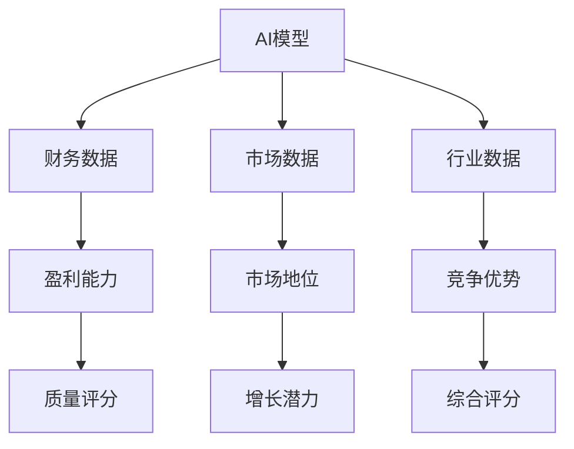
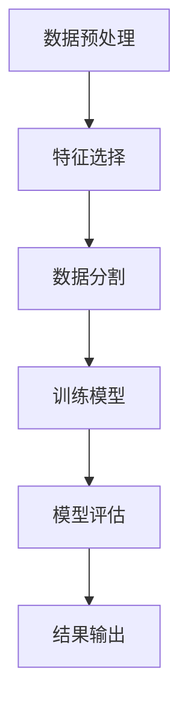
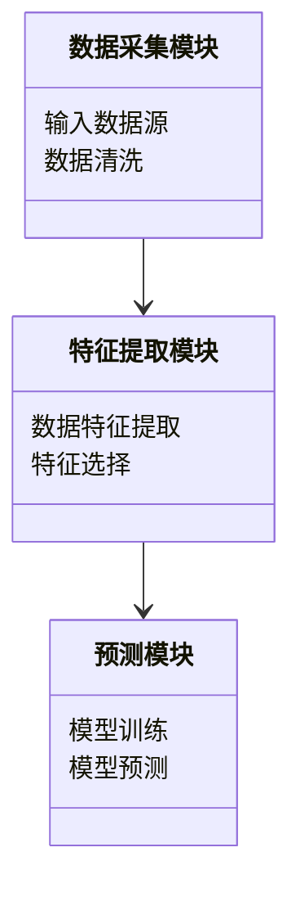
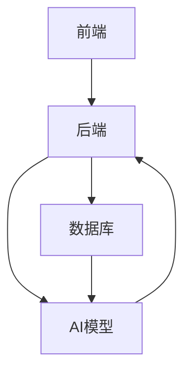
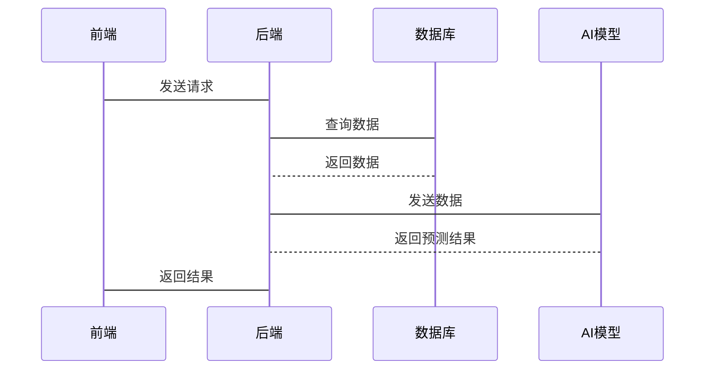

                 


# AI如何实现玛丽·巴芙的质量增长型公司识别

## 关键词：AI, 质量增长型公司, 玛丽·巴芙, 投资分析, 机器学习, 数据分析

## 摘要：  
本文探讨了如何利用人工智能技术实现对质量增长型公司的识别，结合玛丽·巴芙的投资理念，通过机器学习算法和数据分析方法，构建一个高效的公司识别系统。文章从背景介绍、核心概念、算法原理、系统架构到项目实战，全面详细地阐述了AI在质量增长型公司识别中的应用，并给出了具体的实现方案和案例分析。

---

## 第一部分：背景介绍

### 第1章：AI与质量增长型公司识别的背景

#### 1.1 问题背景
在现代金融投资中，识别具有高质量且能够持续增长的公司是投资者追求超额收益的关键。传统的公司分析方法依赖于人工经验和财务报表分析，这种方法效率低下且容易受到主观因素的影响。随着人工智能（AI）技术的快速发展，利用AI技术进行公司识别成为可能。  
玛丽·巴芙（Mary Buffett）作为巴菲特的导师，她的投资理念强调寻找具有强大护城河、稳定的盈利能力以及持续增长潜力的公司。如何将这种投资理念与现代AI技术相结合，成为一个值得深入探讨的问题。

#### 1.2 问题描述
质量增长型公司的核心特征包括稳定的盈利能力、健康的财务状况、强大的竞争优势以及持续的增长潜力。然而，传统的公司分析方法依赖于分析师的主观判断，容易受到情绪和经验的限制。通过AI技术，我们可以从海量数据中提取有用信息，建立量化模型，从而更客观、高效地识别质量增长型公司。

#### 1.3 问题解决
AI技术可以通过以下方式解决公司识别的问题：
1. **数据驱动的分析**：利用机器学习算法对财务数据、市场数据和行业数据进行分析，提取关键特征。
2. **自动化特征工程**：通过AI技术自动识别对公司质量影响的重要特征。
3. **预测模型构建**：基于历史数据，构建预测模型，评估公司的增长潜力。
4. **实时监控与优化**：利用AI技术对市场变化进行实时监控，动态调整识别模型。

#### 1.4 边界与外延
质量增长型公司的识别需要考虑以下边界条件：
1. **数据质量**：数据来源的可靠性和完整性直接影响识别结果。
2. **模型适用性**：AI模型需要在特定行业和市场环境下进行调整。
3. **时间窗口**：公司的质量和增长潜力可能随时间变化而变化。

---

## 第二部分：核心概念与联系

### 第2章：AI驱动的质量增长型公司识别的核心概念

#### 2.1 核心概念
1. **AI驱动的公司识别机制**：通过机器学习算法对公司的财务数据、市场表现和行业趋势进行分析，识别潜在的增长型公司。
2. **质量增长型公司的特征**：包括盈利能力、财务健康状况、竞争优势和增长潜力。
3. **AI模型的输入与输出**：输入包括财务数据、市场数据和文本数据，输出是公司的质量评分和增长潜力预测。

#### 2.2 核心概念的联系
以下是质量增长型公司识别的核心概念之间的关系图：



#### 2.3 核心概念的属性特征对比
以下是质量增长型公司与非质量增长型公司在核心属性上的对比：

| 属性 | 质量增长型公司 | 非质量增长型公司 |
|------|----------------|-------------------|
| 盈利能力 | 高且稳定 | 低或不稳定 |
| 财务健康 | 健康且负债率低 | 财务状况不佳 |
| 市场地位 | 市场占有率高 | 市场占有率低 |
| 竞争优势 | 强大的护城河 | 竞争优势薄弱 |
| 增长潜力 | 高且可持续 | 增长潜力有限 |

---

## 第三部分：算法原理

### 第3章：AI模型的算法原理

#### 3.1 算法选择
在质量增长型公司识别中，我们可以选择以下几种算法：
1. **随机森林**：适用于分类问题，能够处理高维数据。
2. **神经网络**：适用于复杂非线性关系的建模。
3. **支持向量机（SVM）**：适用于小样本数据的分类问题。

#### 3.2 算法流程图
以下是随机森林算法的流程图：



#### 3.3 算法实现
以下是随机森林算法的Python代码示例：

```python
from sklearn.ensemble import RandomForestClassifier
from sklearn.metrics import accuracy_score
from sklearn.model_selection import train_test_split

# 数据预处理
X = df[['revenue', 'profit', 'market_share', 'competition']]
y = df['is_quality_company']

# 数据分割
X_train, X_test, y_train, y_test = train_test_split(X, y, test_size=0.2)

# 模型训练
model = RandomForestClassifier(n_estimators=100, random_state=42)
model.fit(X_train, y_train)

# 模型评估
y_pred = model.predict(X_test)
print("Accuracy:", accuracy_score(y_test, y_pred))
```

#### 3.4 数学模型与公式
随机森林算法的核心公式如下：

$$
\text{概率预测} = \sum_{i=1}^{n} \frac{1}{n} \cdot \text{树}_{i}(x)
$$

其中，$$n$$是树的数量，$$\text{树}_{i}(x)$$是第$$i$$棵树的预测结果。

---

## 第四部分：系统分析与架构设计

### 第4章：系统架构设计

#### 4.1 问题场景
我们需要设计一个AI驱动的质量增长型公司识别系统，该系统能够实时分析公司数据，识别潜在的增长型公司。

#### 4.2 系统功能设计
以下是系统的功能模块图：



#### 4.3 系统架构设计
以下是系统的架构图：



#### 4.4 系统接口设计
以下是系统的接口设计：



---

## 第五部分：项目实战

### 第5章：项目实战

#### 5.1 环境安装
需要安装以下工具：
- Python 3.8+
- Jupyter Notebook
- Scikit-learn
- Pandas
- NumPy

#### 5.2 核心代码实现
以下是实现质量增长型公司识别的核心代码：

```python
import pandas as pd
import numpy as np
from sklearn.ensemble import RandomForestClassifier
from sklearn.metrics import accuracy_score
from sklearn.model_selection import train_test_split

# 数据加载
df = pd.read_csv('companies.csv')

# 数据预处理
df['is_quality_company'] = df['profit'].apply(lambda x: 1 if x > df['profit'].mean() else 0)

# 特征选择
X = df[['revenue', 'profit', 'market_share', 'competition']]
y = df['is_quality_company']

# 数据分割
X_train, X_test, y_train, y_test = train_test_split(X, y, test_size=0.2)

# 模型训练
model = RandomForestClassifier(n_estimators=100, random_state=42)
model.fit(X_train, y_train)

# 模型预测
y_pred = model.predict(X_test)

# 模型评估
print("Accuracy:", accuracy_score(y_test, y_pred))
```

#### 5.3 案例分析
以下是一个实际案例分析：

| 公司名称 | 收入 | 利润 | 市场份额 | 竞争对手数量 | 预测结果 |
|---------|------|------|----------|--------------|----------|
| 公司A   | 100  | 20   | 30%      | 5            | 是       |
| 公司B   | 80   | 15   | 25%      | 8            | 否       |

---

## 第六部分：最佳实践与小结

### 第6章：总结与展望

#### 6.1 总结
本文详细探讨了如何利用AI技术实现质量增长型公司的识别，从背景介绍、核心概念、算法原理到系统架构和项目实战，全面阐述了AI在公司识别中的应用。

#### 6.2 最佳实践
1. **数据预处理**：确保数据的完整性和准确性。
2. **特征选择**：选择对公司质量影响最大的特征。
3. **模型优化**：通过调整超参数和模型结构提高预测精度。

#### 6.3 注意事项
- 数据隐私和安全问题需要注意。
- 模型的可解释性需要进一步优化。
- 需要定期更新模型以适应市场变化。

#### 6.4 未来展望
未来，随着AI技术的不断发展，质量增长型公司识别将更加智能化和自动化。我们需要继续探索新的算法和方法，进一步提升识别的准确性和效率。

---

## 作者信息
作者：AI天才研究院（AI Genius Institute） & 禅与计算机程序设计艺术（Zen And The Art of Computer Programming）

---

感谢您的阅读！希望本文能够为您提供有价值的信息和启发。

