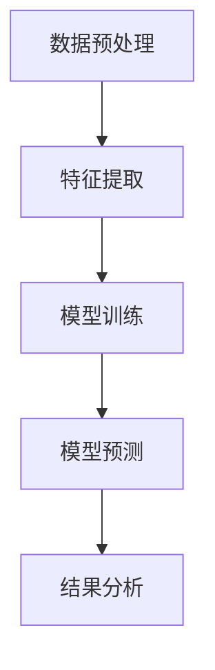
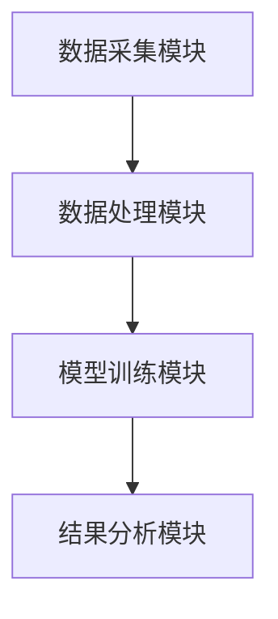
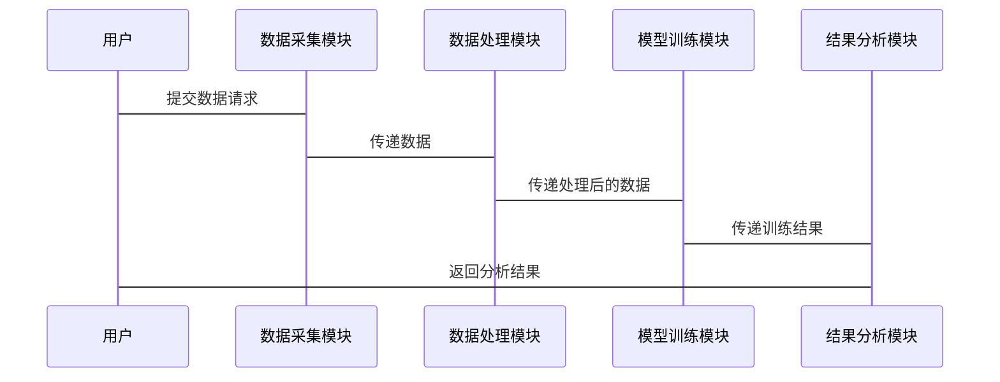

                 


# AI如何实现费雪的消费者行为研究

> 关键词：人工智能, 消费者行为, 费雪理论, 机器学习, 算法原理, 系统架构

> 摘要：本文深入探讨了人工智能技术如何应用于费雪的消费者行为研究。通过分析费雪需求函数与AI算法的结合，结合实际项目案例，详细讲解了AI在消费者行为研究中的应用前景、核心算法、系统架构及实现步骤。

---

# 第1章: AI与消费者行为研究的背景

## 1.1 费雪的消费者行为理论

费雪的需求函数是消费者行为研究的重要理论基础，它描述了消费者在不同价格水平下的购买行为。需求函数的基本形式如下：

$$Q_d = X - pQ_s + \beta p$$

其中，$Q_d$ 是需求量，$Q_s$ 是供给量，$p$ 是价格，$\beta$ 是价格弹性系数，$X$ 是其他影响需求的因素。

费雪的需求函数将价格、收入、偏好等因素纳入模型，为消费者行为研究提供了理论基础。然而，传统的费雪理论在实际应用中面临数据量大、变量复杂等问题，这为AI技术的应用提供了空间。

---

# 第2章: AI与消费者行为研究的核心概念

## 2.1 费雪需求函数的数学模型

费雪需求函数的数学模型可以通过线性回归的形式进行建模。例如，假设需求量 $Q_d$ 与价格 $p$ 和收入 $Y$ 的关系如下：

$$Q_d = \beta_0 + \beta_1 p + \beta_2 Y + \epsilon$$

其中，$\beta_0$ 是截距项，$\beta_1$ 和 $\beta_2$ 是回归系数，$\epsilon$ 是误差项。

通过机器学习算法，我们可以利用历史数据训练模型，预测消费者行为的变化趋势。

---

## 2.2 AI在消费者行为分析中的核心算法

### 2.2.1 机器学习算法在消费者行为分析中的应用

以下是几种常用的机器学习算法及其在消费者行为分析中的应用场景：

| 算法名称       | 应用场景                           |
|----------------|------------------------------------|
| 线性回归       | 预测需求量与价格的关系             |
| 决策树         | 分类消费者群体                     |
| 神经网络       | 模拟复杂的消费者行为模式           |

### 2.2.2 算法原理的 Mermaid 流程图



### 2.2.3 算法实现的 Python 源代码示例

以下是线性回归模型的 Python 实现示例：

```python
import numpy as np
from sklearn.linear_model import LinearRegression

# 数据准备
X = np.array([1, 2, 3, 4, 5]).reshape(-1, 1)
y = np.array([2, 4, 5, 4, 6])

# 模型训练
model = LinearRegression()
model.fit(X, y)

# 预测
print(model.predict(X))  # 输出预测结果
```

---

## 2.3 算法原理的详细讲解

### 2.3.1 线性回归模型的数学公式

线性回归模型的损失函数为均方误差（MSE），其数学公式为：

$$L = \frac{1}{2n}\sum_{i=1}^{n}(y_i - \hat{y}_i)^2$$

其中，$y_i$ 是真实值，$\hat{y}_i$ 是预测值，$n$ 是样本数量。

### 2.3.2 决策树算法的实现步骤

决策树算法的实现步骤如下：

1. 数据预处理与特征选择。
2. 基于信息增益或基尼指数进行特征分裂。
3. 递归构建决策树。
4. 剪枝处理以避免过拟合。
5. 预测与结果分析。

---

# 第3章: AI驱动的消费者行为分析系统架构

## 3.1 系统分析与架构设计

### 3.1.1 系统功能模块划分

系统功能模块包括：

1. 数据采集模块：收集消费者行为数据。
2. 数据处理模块：清洗和预处理数据。
3. 模型训练模块：训练机器学习模型。
4. 结果分析模块：分析模型预测结果。

### 3.1.2 系统架构的 Mermaid 架构图



### 3.1.3 系统接口设计

系统接口设计如下：

- 数据采集模块接口：`GET /data/input`
- 数据处理模块接口：`POST /data/process`
- 模型训练模块接口：`POST /model/train`
- 结果分析模块接口：`GET /result/analyze`

---

## 3.2 系统交互设计

### 3.2.1 系统交互的 Mermaid 序列图



---

# 第4章: 项目实战——基于AI的消费者行为分析

## 4.1 项目背景与目标

### 4.1.1 项目背景介绍

以某电商平台为例，我们需要分析消费者的购买行为，预测销售量和价格敏感度。

### 4.1.2 项目目标设定

- 数据清洗与特征工程。
- 构建需求预测模型。
- 分析消费者行为并优化定价策略。

---

## 4.2 系统核心实现

### 4.2.1 数据预处理与特征工程

数据预处理步骤如下：

1. 数据清洗：处理缺失值和异常值。
2. 特征提取：从原始数据中提取相关特征，如价格、收入、季节等。

### 4.2.2 模型训练与优化

使用随机森林算法训练模型，代码示例如下：

```python
from sklearn.ensemble import RandomForestRegressor

# 数据准备
X_train = ...  # 训练数据特征
y_train = ...  # 训练数据标签

# 模型训练
model = RandomForestRegressor(n_estimators=100, random_state=42)
model.fit(X_train, y_train)

# 预测
print(model.predict(X_test))  # 输出预测结果
```

---

## 4.3 代码实现与解读

### 4.3.1 环境配置与安装

安装所需库：

```bash
pip install numpy pandas scikit-learn
```

---

## 4.4 实际案例分析

### 4.4.1 案例背景介绍

以某电商平台的销售数据为例，分析消费者对价格的敏感度。

### 4.4.2 数据分析与结果解读

通过训练好的模型，我们可以预测不同价格下的销售量，并优化定价策略。

---

# 第5章: 最佳实践与小结

## 5.1 最佳实践 tips

1. 数据质量是模型性能的关键，需重视数据清洗与特征工程。
2. 选择合适的算法，避免过度复杂的模型。
3. 及时监控模型性能，定期更新模型。

---

## 5.2 小结

本文详细探讨了AI在费雪消费者行为研究中的应用，通过理论分析、算法实现和项目实战，展示了AI技术的强大能力。未来，随着技术的发展，AI在消费者行为研究中的应用将更加广泛和深入。

---

作者：AI天才研究院/AI Genius Institute & 禅与计算机程序设计艺术 /Zen And The Art of Computer Programming

