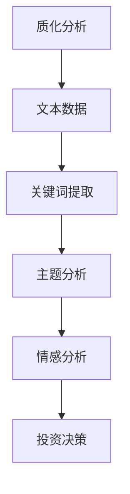
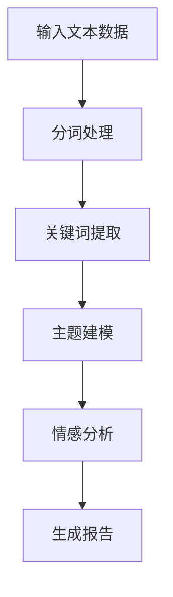
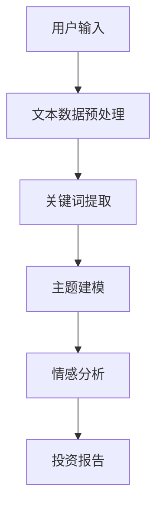

                 


# AI如何实现费雪的质化分析方法

> 关键词：质化分析、AI技术、费雪分析、自然语言处理、机器学习、投资决策

> 摘要：本文探讨如何利用人工智能技术实现费雪的质化分析方法，通过结合自然语言处理、机器学习和数据挖掘等技术，构建高效、智能的质化分析系统。文章详细阐述了质化分析的核心原理、AI技术的应用、算法实现、系统架构设计以及项目实战，旨在为读者提供从理论到实践的全面指导。

---

## 第一部分: 费雪质化分析方法与AI的结合概述

### 第1章: 质化分析方法的背景与AI的引入

#### 1.1 质化分析方法的定义与特点
质化分析是一种以质量和特征为核心的投资分析方法，强调通过对企业的基本面、管理团队、行业地位等非量化因素的深入研究，评估其投资价值。费雪的质化分析方法在投资领域具有重要地位，其核心在于通过定性分析发现投资机会。

#### 1.2 AI技术的背景与发展
人工智能技术近年来迅速发展，广泛应用于金融、医疗、教育等领域。在金融领域，AI技术通过自然语言处理、机器学习等手段，帮助投资者快速分析海量数据，发现潜在投资机会。

#### 1.3 费雪质化分析方法与AI的结合
传统的质化分析方法依赖人工经验，耗时且效率低下。AI技术的引入，将质化分析的流程自动化，通过机器学习模型提取关键信息，大幅提升了分析效率和准确性。

---

### 第2章: 质化分析的核心概念与AI的联系

#### 2.1 质化分析的核心原理
质化分析的核心在于对企业的基本面、行业地位、竞争优势等非量化因素的深入研究。通过分析企业的商业模式、管理团队、行业趋势等因素，评估其投资价值。

#### 2.2 AI技术在质化分析中的应用
AI技术在质化分析中的应用主要体现在以下几个方面：
- **自然语言处理（NLP）**：用于文本数据的分析，提取关键词、主题和情感倾向。
- **机器学习**：用于模式识别和分类，帮助识别企业的竞争优势和行业趋势。
- **数据挖掘**：用于信息提取和关联分析，发现潜在的投资机会。

#### 2.3 质化分析与AI的实体关系图
以下是一个简单的实体关系图，展示了质化分析与AI技术之间的联系：


---

### 第3章: AI实现质化分析的算法原理

#### 3.1 算法流程图
以下是一个实现质化分析的算法流程图：


#### 3.2 算法实现代码
以下是一个简单的关键词提取代码示例：
```python
import numpy as np
from sklearn.feature_extraction.text import TfidfVectorizer
from sklearn.decomposition import NMF

# 示例代码：主题建模
def topic_modeling(text_data):
    vectorizer = TfidfVectorizer(max_features=1000)
    tfidf = vectorizer.fit_transform(text_data)
    nmf = NMF(n_components=5, random_state=42)
    nmf.fit(tfidf)
    return nmf, vectorizer
```

#### 3.3 算法的数学模型与公式
以下是主题建模中常用的NMF（非负矩阵分解）的数学公式：
$$ X = WH $$  
其中，X为输入数据矩阵，W为基矩阵，H为权重矩阵，均为非负矩阵。

---

## 第二部分: 系统分析与架构设计

### 第4章: 系统架构设计

#### 4.1 项目场景介绍
本项目旨在构建一个基于AI的质化分析系统，帮助投资者快速分析企业的基本面信息，生成投资报告。

#### 4.2 系统功能设计
- **文本数据预处理**：包括分词、去停用词等。
- **关键词提取**：提取文本中的关键信息。
- **主题建模**：分析文本的主题分布。
- **情感分析**：评估文本的情感倾向。
- **投资决策支持**：生成投资建议报告。

#### 4.3 系统架构图
以下是一个简单的系统架构图：


---

## 第三部分: 项目实战

### 第5章: 项目实战

#### 5.1 环境安装
需要安装以下依赖：
```bash
pip install numpy scikit-learn nltk
```

#### 5.2 核心代码实现
以下是一个完整的质化分析代码实现：
```python
import numpy as np
from sklearn.feature_extraction.text import TfidfVectorizer
from sklearn.decomposition import NMF
from sklearn.preprocessing import Normalizer
from sklearn.metrics.pairwise import cosine_similarity

def preprocess(text):
    # 分词处理
    words = text.split()
    return ' '.join(words)

def keyword_extraction(text):
    vectorizer = TfidfVectorizer()
    tfidf = vectorizer.fit_transform([preprocess(text)])
    return vectorizer.get_feature_names_out()[tfidf[0].nonzero()[0]]

def topic_modeling(text_data):
    vectorizer = TfidfVectorizer(max_features=1000)
    tfidf = vectorizer.fit_transform(text_data)
    nmf = NMF(n_components=5, random_state=42)
    nmf.fit(tfidf)
    return nmf, vectorizer

def generate_report(nmf, vectorizer, text_data):
    topic_weights = nmf.transform(vectorizer.fit_transform(text_data))
    for i, weight in enumerate(topic_weights[0]):
        print(f"主题{i+1}: 重量{weight:.2f}")
```

#### 5.3 代码解读与分析
上述代码实现了一个简单的质化分析系统，包括文本预处理、关键词提取、主题建模和报告生成。通过NMF算法，可以提取文本的主题分布，帮助投资者快速理解企业的基本面信息。

#### 5.4 实际案例分析
以一家科技公司为例，分析其财务报表和行业地位，生成投资建议报告。

---

## 第四部分: 最佳实践与总结

### 第6章: 最佳实践

#### 6.1 小结
本文详细探讨了AI如何实现费雪的质化分析方法，通过自然语言处理、机器学习和数据挖掘等技术，构建了一个高效的质化分析系统。

#### 6.2 注意事项
在实际应用中，需要注意数据的质量和模型的可解释性，确保分析结果的准确性和可靠性。

#### 6.3 拓展阅读
建议读者进一步学习自然语言处理和机器学习的相关知识，深入理解质化分析的数学模型和算法原理。

---

## 作者信息

作者：AI天才研究院/AI Genius Institute  
联系邮箱：contact@aigeniusinstitute.com  
GitHub：https://github.com/aigeniusinstitute

