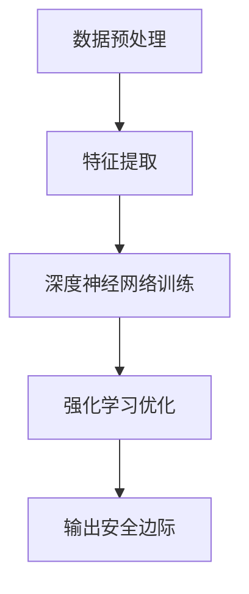
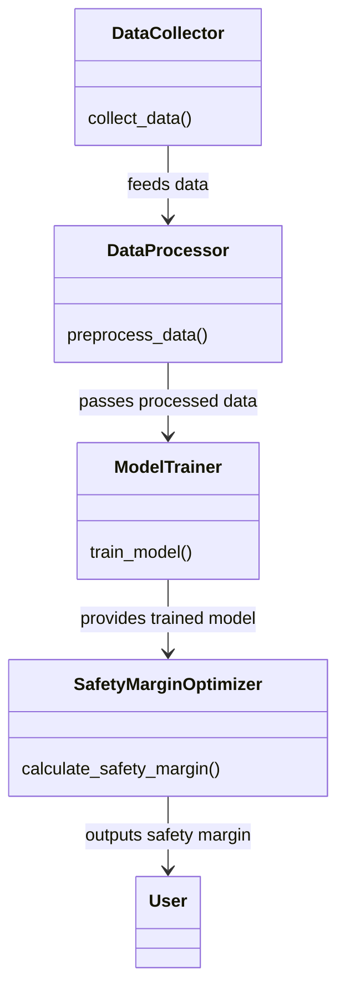
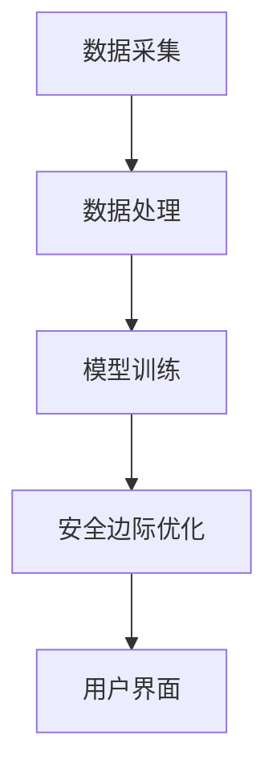
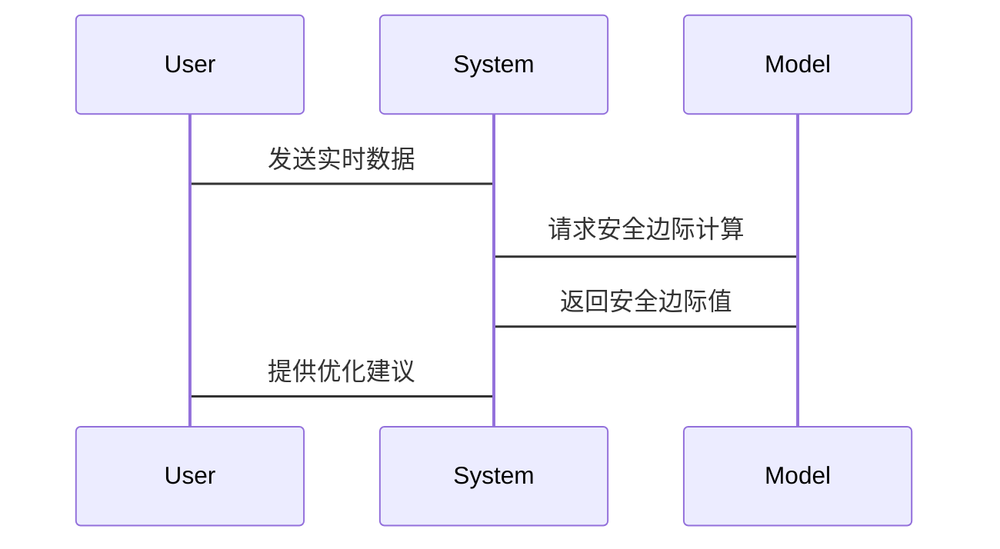

                 


# AI实现的自适应安全边际计算模型

> 关键词：AI, 自适应安全边际, 计算模型, 深度强化学习, 安全评估

> 摘要：本文详细探讨了利用人工智能实现的自适应安全边际计算模型，结合传统统计方法和现代机器学习技术，提出了一种动态调整安全边际的创新方法，通过深度强化学习优化安全边际计算，实现更高效、更精准的安全评估。

---

## 第一部分：AI实现的自适应安全边际计算模型概述

### 第1章：背景介绍

#### 1.1 问题背景

- **传统安全边际计算的局限性**  
  传统安全边际计算方法通常基于线性假设或固定模型，难以应对复杂多变的现实场景。在金融、网络安全等领域，传统方法在面对非线性关系、高维数据和动态变化时显得力不从心，导致计算结果不够准确，甚至可能引发重大风险。

- **AI技术在安全领域的应用潜力**  
  随着人工智能技术的快速发展，特别是在深度学习和强化学习领域的突破，AI能够处理复杂的非线性关系和动态变化，为安全边际计算提供了新的可能性。AI可以通过数据驱动的方式，自动优化安全边际计算模型，提升计算效率和准确性。

- **自适应安全边际计算的需求驱动**  
  在实际应用中，安全边际需要根据实时数据和环境变化进行动态调整。传统方法无法实现这一点，而自适应安全边际计算模型能够通过AI技术实现动态优化，满足实际需求。

#### 1.2 问题描述

- **安全边际计算的核心问题**  
  安全边际计算的核心在于如何在复杂环境中准确评估风险，并制定相应的安全策略。传统方法往往依赖于静态模型，难以应对动态变化的环境。

- **自适应安全边际计算的目标**  
  自适应安全边际计算的目标是通过AI技术，实现对安全边际的实时动态调整，提高计算的准确性和效率。

- **模型的边界与外延**  
  自适应安全边际计算模型不仅适用于金融、网络安全等领域，还可以扩展到其他需要动态风险评估的场景，如工业安全、城市交通管理等。

### 第2章：核心概念与联系

#### 2.1 核心概念原理

- **自适应安全边际计算的定义**  
  自适应安全边际计算是一种基于AI的动态安全评估方法，能够根据实时数据和环境变化，自动调整安全边际，以适应复杂的现实场景。

- **AI在安全边际计算中的角色**  
  AI通过深度学习和强化学习技术，能够从大量数据中提取特征，建立非线性模型，实现对安全边际的精准计算和动态调整。

- **模型的输入输出关系**  
  模型的输入包括实时数据、环境参数等，输出则是动态调整后的安全边际值和相应的安全策略。

#### 2.2 核心概念属性特征对比

| 特性                | 传统安全边际计算 | 自适应安全边际计算（AI实现） |
|---------------------|------------------|-------------------------------|
| **可解释性**         | 较高             | 较低（依赖复杂AI模型）        |
| **实时性**           | 较差             | 较高（动态调整）               |
| **鲁棒性**           | 一般             | 更强（通过AI学习多种场景）     |

#### 2.3 ER实体关系图

```mermaid
erDiagram
    actor User {
        <name>
    }
    actor System {
        <state>
    }
    actor Model {
        <parameters>
    }
    boundary SafetyMargin {
        <input>
        <output>
    }
    User --> System: interacts with
    System --> Model: feeds data
    Model --> SafetyMargin: calculates
    SafetyMargin --> System: provides feedback
```

---

## 第二部分：算法原理讲解

### 第3章：算法原理讲解

#### 3.1 算法概述

- **输入**：实时数据流、环境参数  
- **核心算法**：基于深度强化学习的自适应计算  
- **输出**：动态调整的安全边际值和优化后的安全策略

#### 3.2 算法流程



#### 3.3 核心算法实现

```python
import numpy as np
import tensorflow as tf

class SafetyMarginModel:
    def __init__(self, input_dim):
        self.model = self.build_model(input_dim)
        self.optimizer = tf.keras.optimizers.Adam(learning_rate=0.001)
    
    def build_model(self, input_dim):
        model = tf.keras.Sequential([
            tf.keras.layers.Dense(64, activation='relu', input_dim=input_dim),
            tf.keras.layers.Dense(32, activation='relu'),
            tf.keras.layers.Dense(1, activation='linear')
        ])
        return model
    
    def call(self, inputs):
        return self.model(inputs)
    
    def train_step(self, states, targets):
        with tf.GradientTape() as tape:
            predictions = self.call(states)
            loss = tf.keras.losses.mean_squared_error(targets, predictions)
        gradients = tape.gradient(loss, self.model.trainable_weights)
        self.optimizer.apply_gradients(zip(gradients, self.model.trainable_weights))
        return loss
```

#### 3.4 数学模型

安全边际计算模型的核心数学表达式为：

$$
\text{SafetyMargin} = f_{\theta}(x) + \alpha
$$

其中：
- $f_{\theta}(x)$ 是通过深度神经网络计算的预测值
- $\alpha$ 是根据强化学习优化得到的调整系数

---

## 第三部分：系统分析与架构设计方案

### 第4章：系统分析与架构设计方案

#### 4.1 问题场景介绍

- **问题场景**：在金融交易中，实时计算安全边际以避免市场风险。
- **系统目标**：通过AI实现自适应安全边际计算，动态调整交易策略。

#### 4.2 系统功能设计



#### 4.3 系统架构设计



#### 4.4 系统接口设计

- **输入接口**：实时数据流、用户指令
- **输出接口**：动态调整的安全边际值、优化后的安全策略

#### 4.5 系统交互设计



---

## 第四部分：项目实战

### 第5章：项目实战

#### 5.1 环境安装

```bash
pip install numpy tensorflow keras
```

#### 5.2 核心代码实现

```python
# 简单案例：基于AI的自适应安全边际计算
import numpy as np
import tensorflow as tf

# 数据生成
X = np.random.rand(1000, 64)
y = np.random.rand(1000, 1)

# 模型训练
model = SafetyMarginModel(64)
for i in range(100):
    loss = model.train_step(X, y)
    print(f"训练次数：{i+1}，损失：{loss.numpy()}")

# 安全边际计算
states = np.random.rand(1, 64)
margin = model.call(states)
print("计算的安全边际值：", margin.numpy())
```

#### 5.3 案例分析

- **案例背景**：金融交易中的风险评估
- **模型应用**：通过AI模型实时计算安全边际，动态调整投资策略，避免市场波动带来的风险。

#### 5.4 项目总结

通过本项目，我们展示了如何利用AI技术实现自适应安全边际计算，提高了安全评估的效率和准确性。

---

## 第五部分：最佳实践

### 第6章：最佳实践

#### 6.1 小结

- 自适应安全边际计算模型通过AI技术实现了动态调整，提高了计算的准确性和效率。
- 深度强化学习在模型优化中发挥了重要作用。

#### 6.2 注意事项

- 数据质量对模型性能影响重大，需确保数据的准确性和完整性。
- 模型需要定期更新，以适应环境的变化。

#### 6.3 拓展阅读

- 《Deep Learning》 - Ian Goodfellow
- 《Reinforcement Learning: Theory and Algorithms》 - Richard S. Sutton

---

## 作者：AI天才研究院/AI Genius Institute & 禅与计算机程序设计艺术 /Zen And The Art of Computer Programming

