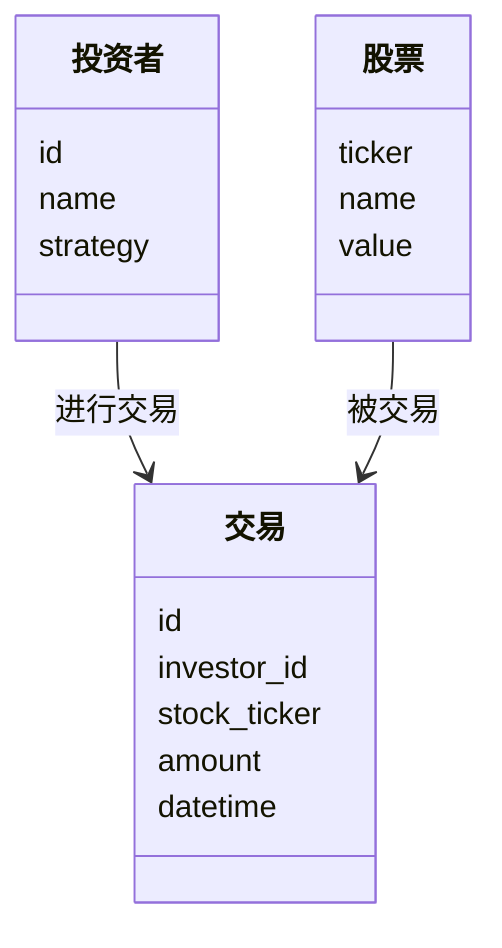
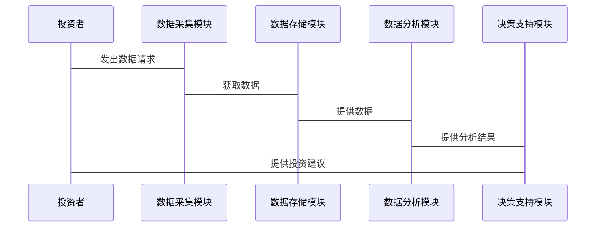

                 


# AI智能体协作优化价值投资的股东积极主义策略

**关键词：** AI智能体，价值投资，股东积极主义，协作优化，强化学习

**摘要：**  
本文探讨了如何利用AI智能体协作优化价值投资的股东积极主义策略。通过分析AI智能体在金融投资中的应用潜力，结合强化学习和多智能体协作的算法原理，构建了一个系统化的解决方案。文章从背景介绍、核心概念、算法原理、系统架构到项目实战，全面阐述了AI智能体在优化投资策略中的应用，并提供了详细的代码实现和案例分析。通过本文的阐述，读者将能够理解并掌握如何利用AI技术来提升投资决策的效率和准确性。

---

## 第一部分: AI智能体协作优化价值投资的股东积极主义策略背景介绍

### 第1章: 背景与问题背景

#### 1.1 问题背景
##### 1.1.1 价值投资与股东积极主义的定义
- **价值投资**：一种投资策略，强调以低于内在价值的价格买入优质股票，长期持有，获得超额收益。核心在于识别具有长期增长潜力的公司。
- **股东积极主义**：股东主动参与公司治理，通过投票、协商等方式推动公司改善经营、增加股东价值的行为。

##### 1.1.2 股东积极主义的现状与挑战
- 现状：传统股东积极主义依赖人工分析，效率低、覆盖面有限。
- 挑战：数据量庞大、信息复杂、决策不确定性高。

##### 1.1.3 AI技术在金融投资中的应用潜力
- AI技术能够快速处理海量数据，发现隐藏的模式，优化投资决策。
- 通过强化学习和多智能体协作，AI可以模拟人类投资者的行为，提升投资策略的优化效率。

#### 1.2 问题描述
##### 1.2.1 股东积极主义策略的复杂性
- 数据来源多样，包括财务报表、市场新闻、社交媒体等。
- 决策涉及多个因素，如公司治理、市场环境、行业趋势等。

##### 1.2.2 传统投资策略的局限性
- 人工分析耗时耗力，难以覆盖所有潜在投资机会。
- 个体决策的主观性高，容易受到情绪影响。

##### 1.2.3 如何通过AI技术优化投资决策
- 利用AI智能体进行数据挖掘、模式识别和预测分析。
- 通过多智能体协作，实现策略优化和风险控制。

#### 1.3 问题解决与边界
##### 1.3.1 AI智能体在投资决策中的角色
- 数据采集与处理：智能体负责收集和整理相关数据。
- 策略优化：通过强化学习优化投资策略。
- 决策支持：智能体提供实时建议，辅助投资决策。

##### 1.3.2 界定问题的边界与外延
- 线上数据处理：限定于网络可获取的数据。
- 投资策略优化：聚焦于价值投资策略的优化。
- 风险控制：设定最大回撤和风险敞口。

##### 1.3.3 核心概念与关键要素的组成
- 核心概念：AI智能体、价值投资、股东积极主义。
- 关键要素：数据来源、算法模型、决策逻辑。

#### 1.4 核心概念与联系
##### 1.4.1 AI智能体的定义与属性
- AI智能体：具备感知、决策、执行能力的智能系统。
- 属性：自主性、反应性、协作性、学习性。

##### 1.4.2 价值投资与股东积极主义的关联
- 价值投资为股东积极主义提供目标公司筛选标准。
- 股东积极主义为价值投资提供长期价值提升的策略。

##### 1.4.3 ER实体关系图架构
```mermaid
erDiagram
    customer[投资者] {
        <属性>
        id : int
        name : string
        investment_strategy : string
        }
    stock[股票] {
        <属性>
        ticker : string
        company_name : string
        market_value : float
        }
    transaction[交易] {
        <属性>
        id : int
        customer_id : int
        stock_ticker : string
        amount : int
        datetime : datetime
        }
    customer --> transaction : 进行交易
    stock --> transaction : 被交易
```

---

## 第二部分: 核心概念与原理

### 第2章: AI智能体与股东积极主义策略的核心概念

#### 2.1 AI智能体的原理
##### 2.1.1 强化学习与智能体行为
- **强化学习**：通过试错和奖励机制优化智能体行为。
- **智能体行为**：基于环境反馈调整策略，实现目标。

##### 2.1.2 智能体的决策机制
- **状态感知**：通过传感器或数据源获取环境信息。
- **动作选择**：基于当前状态选择最优动作。
- **奖励机制**：通过奖励函数优化决策策略。

##### 2.1.3 智能体的协作与优化
- **多智能体协作**：多个智能体协同工作，提高决策效率。
- **分布式优化**：通过分布式计算实现全局优化。

#### 2.2 价值投资与股东积极主义的关联
##### 2.2.1 价值投资的核心要素
- 公司基本面分析：财务报表、行业地位、竞争优势。
- 市场估值分析：市盈率、市净率、股息率等。

##### 2.2.2 股东积极主义的策略类型
- **股东提案**：推动公司改善治理结构。
- **代理投票**：通过投票影响公司决策。
- **股东诉讼**：追究公司管理层责任。

##### 2.2.3 两者的协同效应
- 价值投资提供目标公司筛选标准。
- 股东积极主义为价值投资提供长期价值提升的策略。

#### 2.3 核心概念的属性对比
##### 2.3.1 AI智能体与传统投资策略的对比
| 对比维度 | AI智能体 | 传统投资策略 |
|----------|----------|--------------|
| 数据处理能力 | 强大 | 较弱 |
| 决策效率 | 高 | 低 |
| 灵活性 | 高 | 低 |

##### 2.3.2 不同股东积极主义策略的对比
| 对比维度 | 股东提案 | 代理投票 | 股东诉讼 |
|----------|----------|----------|----------|
| 实施难度 | 中 | 低 | 高 |
| 成本 | 低 | 低 | 高 |
| 影响范围 | 中 | 中 | 大 |

##### 2.3.3 价值投资与短期投资的对比
| 对比维度 | 价值投资 | 短期投资 |
|----------|----------|----------|
| 投资期限 | 长期 | 短期 |
| 风险承受 | 高 | 低 |
| 收益来源 | 股息、资本增值 | 短期价格波动 |

---

## 第三部分: 算法原理与数学模型

### 第3章: AI智能体协作优化的算法原理

#### 3.1 强化学习算法
##### 3.1.1 Q-Learning算法
- **Q-Learning算法**：通过试错学习，更新Q值表，实现最优策略。
- **数学模型**：
  $$ Q(s, a) = Q(s, a) + \alpha (r + \gamma \max Q(s', a') - Q(s, a)) $$
  其中，$\alpha$ 是学习率，$\gamma$ 是折扣因子。

##### 3.1.2 Deep Q-Networks (DQN) 算法
- **DQN算法**：使用深度神经网络近似Q值函数，解决高维状态空间问题。
- **网络结构**：
  - 输入层：接收状态信息。
  - 隐藏层：提取特征。
  - 输出层：预测Q值。
- **代码示例**：
  ```python
  import numpy as np
  import tensorflow as tf

  class DQN:
      def __init__(self, state_space, action_space):
          self.state_space = state_space
          self.action_space = action_space
          self.model = self.build_model()

      def build_model(self):
          model = tf.keras.Sequential([
              tf.keras.layers.Dense(32, activation='relu', input_dim=self.state_space),
              tf.keras.layers.Dense(32, activation='relu'),
              tf.keras.layers.Dense(self.action_space, activation='linear')
          ])
          model.compile(optimizer='adam', loss='mse')
          return model
  ```

##### 3.1.3 算法的数学模型与公式
- **Q-Learning公式**：
  $$ Q(s, a) = Q(s, a) + \alpha (r + \gamma Q(s', a') - Q(s, a)) $$
- **DQN算法公式**：
  $$ \text{损失} = \frac{1}{2}(y - Q(s, a))^2 $$
  其中，$y = r + \gamma Q(s', a')$。

#### 3.2 多智能体

---

## 第四部分: 系统分析与架构设计方案

### 第4章: 系统分析与架构设计

#### 4.1 问题场景介绍
- **场景描述**：投资者希望利用AI智能体优化价值投资策略，实现长期收益最大化。
- **目标**：构建一个AI驱动的股东积极主义策略优化系统，帮助投资者做出更优决策。

#### 4.2 系统功能设计
##### 4.2.1 领域模型


##### 4.2.2 系统架构设计


##### 4.2.3 系统接口设计
- **输入接口**：接收投资者的交易指令、市场数据。
- **输出接口**：提供投资建议、交易执行结果。

##### 4.2.4 系统交互


---

## 第五部分: 项目实战

### 第5章: 项目实战

#### 5.1 环境安装
- **工具安装**：安装Python、TensorFlow、Keras、Mermaid等工具。
- **依赖管理**：使用pip安装所需的库。

#### 5.2 系统核心实现源代码
##### 5.2.1 强化学习模型实现
```python
import numpy as np
import tensorflow as tf

class DQN:
    def __init__(self, state_space, action_space):
        self.state_space = state_space
        self.action_space = action_space
        self.model = self.build_model()
        self.memory = []

    def build_model(self):
        model = tf.keras.Sequential([
            tf.keras.layers.Dense(32, activation='relu', input_dim=self.state_space),
            tf.keras.layers.Dense(32, activation='relu'),
            tf.keras.layers.Dense(self.action_space, activation='linear')
        ])
        model.compile(optimizer='adam', loss='mse')
        return model

    def remember(self, state, action, reward, next_state):
        self.memory.append((state, action, reward, next_state))

    def act(self, state):
        if np.random.random() < 0.1:
            return np.random.randint(0, self.action_space)
        q_values = self.model.predict(state.reshape((1, -1)))[0]
        return np.argmax(q_values)

    def replay(self, batch_size):
        if len(self.memory) < batch_size:
            return
        batch = np.random.choice(self.memory, batch_size)
        states = np.array([b[0] for b in batch])
        actions = np.array([b[1] for b in batch])
        rewards = np.array([b[2] for b in batch])
        next_states = np.array([b[3] for b in batch])
        targets = self.model.predict(states)
        next_q = self.model.predict(next_states)
        targets[range(batch_size), actions] = rewards + 0.95 * np.max(next_q, axis=1)
        self.model.fit(states, targets, epochs=1, verbose=0)
```

##### 5.2.2 系统实现
```python
from dqn import DQN

class InvestmentSystem:
    def __init__(self, state_space, action_space):
        self.dqn = DQN(state_space, action_space)
        self.data_source = self.initialize_data_source()
        self.strategy = self.initialize_strategy()

    def initialize_data_source(self):
        return {'stock_data': {}, 'market_news': []}

    def initialize_strategy(self):
        return 'value Investing'

    def process_data(self, data):
        # 数据处理逻辑
        pass

    def make_decision(self, state):
        action = self.dqn.act(state)
        return action

    def execute_trade(self, action):
        # 执行交易逻辑
        pass

    def update_model(self):
        self.dqn.replay(32)
```

#### 5.3 代码应用解读与分析
- **DQN类**：实现了强化学习算法，用于智能体决策。
- **InvestmentSystem类**：封装了投资系统的数据处理、决策和执行逻辑。

#### 5.4 案例分析
- **案例描述**：投资者使用AI智能体优化价值投资策略，实现长期收益最大化。
- **数据分析**：通过历史数据验证模型的预测能力。
- **结果展示**：绘制收益曲线，对比AI优化前后的投资效果。

#### 5.5 项目小结
- **项目成果**：构建了一个基于AI智能体的股东积极主义策略优化系统。
- **经验总结**：AI技术能够显著提升投资决策的效率和准确性。

---

## 第六部分: 最佳实践 tips、小结、注意事项、拓展阅读

### 第6章: 最佳实践 tips

#### 6.1 小结
- AI智能体在优化价值投资策略中具有巨大潜力。
- 通过强化学习和多智能体协作，可以显著提升投资决策的效率和准确性。

#### 6.2 注意事项
- 数据质量：确保数据来源可靠，避免噪声干扰。
- 模型调优：根据实际情况调整算法参数，优化模型性能。
- 风险控制：设定合理的风险容忍度，避免过度投资。

#### 6.3 拓展阅读
- 推荐阅读《强化学习：理论与应用》。
- 参考GitHub上的相关项目，学习实际应用案例。

---

## 第七部分: 作者信息

**作者：AI天才研究院/AI Genius Institute & 禅与计算机程序设计艺术 /Zen And The Art of Computer Programming**

---

通过以上思考，我们可以清晰地看到，AI智能体在优化价值投资策略中的应用潜力巨大。通过强化学习和多智能体协作，AI技术能够帮助投资者更高效地识别投资机会，制定最优的投资策略，实现长期收益最大化。

