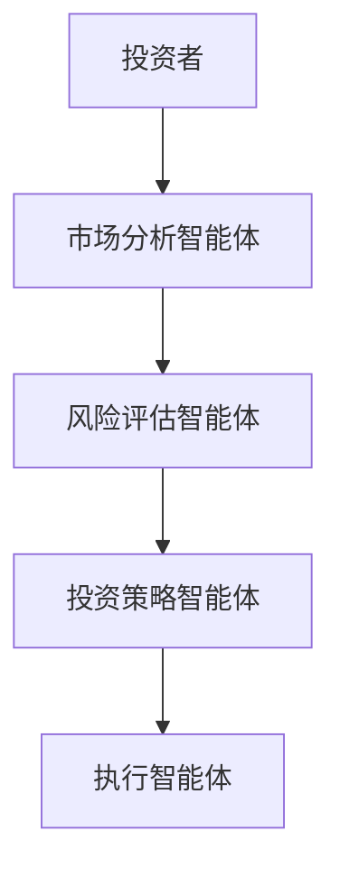
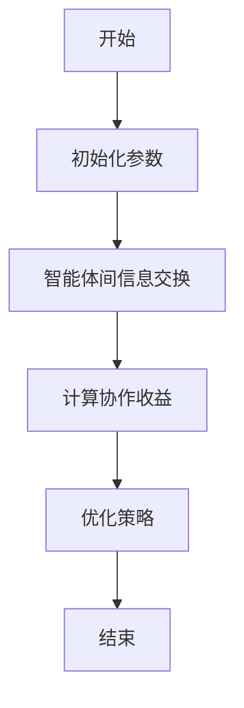
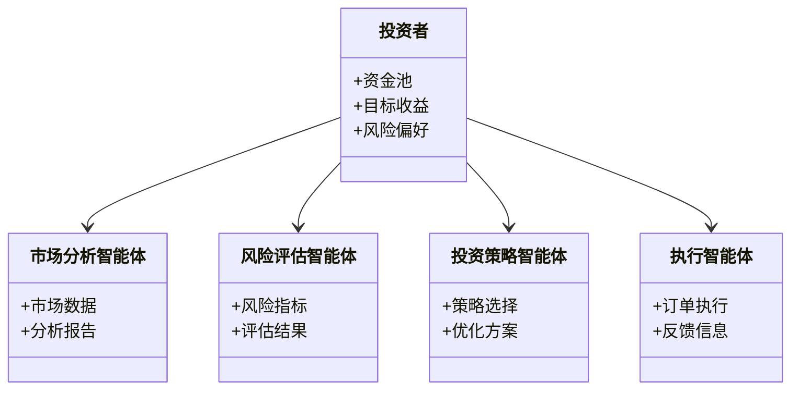
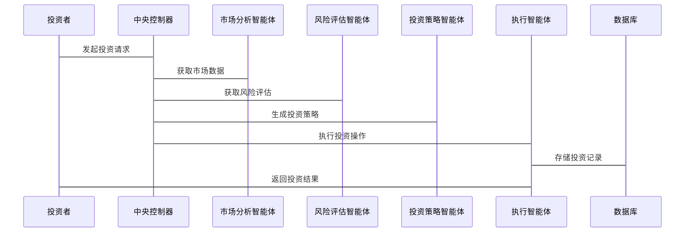

                 


# AI智能体协作：优化价值投资的全球产业布局策略

> 关键词：AI智能体协作，价值投资，产业布局，多智能体系统，协作算法，全球投资策略

> 摘要：本文探讨了AI智能体协作在优化价值投资中的应用，分析了多智能体协作的核心原理及其在投资决策中的应用。通过构建数学模型和算法流程图，详细阐述了AI智能体协作如何优化全球产业布局。本文旨在为投资领域的技术实践者提供理论支持和实践指导，帮助其更好地理解和应用AI智能体协作技术。

---

# 第一部分: AI智能体协作与价值投资的背景

## 第1章: AI智能体协作与价值投资的背景

### 1.1 AI智能体协作的背景与意义

#### 1.1.1 人工智能与投资领域的结合
人工智能（AI）技术的快速发展为投资领域带来了革命性的变化。传统的投资决策依赖于人类分析师的经验和直觉，而AI智能体协作通过多智能体的协同工作，能够更高效地分析市场数据、预测趋势并制定投资策略。

#### 1.1.2 智能体协作的定义与特点
智能体协作是指多个智能体（Agent）通过信息共享和协同决策来完成复杂任务的过程。其特点包括：
1. **分布式计算**：每个智能体独立计算，通过通信共享信息。
2. **协同决策**：智能体之间通过协作优化整体决策效果。
3. **动态适应**：能够根据市场变化实时调整策略。

#### 1.1.3 价值投资与产业布局的结合
价值投资强调以低于内在价值的价格买入优质资产。通过AI智能体协作，可以更精准地评估资产价值、识别投资机会，并优化全球产业布局。

---

### 1.2 价值投资与产业布局的基本概念

#### 1.2.1 价值投资的核心理念
价值投资的核心理念是寻找被市场低估的资产，长期持有并获得超额收益。其关键在于对资产内在价值的深度分析。

#### 1.2.2 产业布局的定义与分类
产业布局是指在不同行业和地域之间分配投资资源的过程。常见的布局策略包括集中投资、分散投资和行业轮动。

#### 1.2.3 AI智能体协作在投资中的作用
AI智能体协作通过多智能体的协同工作，能够快速分析海量数据、优化投资组合，并实时调整投资策略。

---

### 1.3 问题背景与目标

#### 1.3.1 传统投资中的问题与挑战
传统投资依赖于人类经验和主观判断，存在效率低、决策滞后、风险控制不足等问题。

#### 1.3.2 AI智能体协作的目标与边界
AI智能体协作的目标是通过多智能体协同优化投资决策，降低风险、提高收益。其边界包括数据来源、计算能力限制和市场环境变化。

#### 1.3.3 本书的核心问题与解决思路
本书的核心问题是如何通过AI智能体协作优化价值投资的全球产业布局。解决思路包括：构建多智能体协作模型、设计协作算法、实现投资策略优化。

---

### 1.4 本章小结
本章介绍了AI智能体协作与价值投资的背景，明确了智能体协作的基本概念和其在投资中的作用，提出了本书的核心问题和解决思路。

---

# 第二部分: AI智能体协作的核心概念与联系

## 第2章: 多智能体协作的原理与机制

### 2.1 多智能体协作的原理

#### 2.1.1 多智能体系统的定义
多智能体系统是指由多个智能体组成的分布式系统，每个智能体具有自主决策能力。

#### 2.1.2 协作机制的分类
协作机制可以分为基于信息共享、基于任务分配和基于博弈论的协作。

#### 2.1.3 智能体协作的核心要素
智能体协作的核心要素包括：信息共享、协同决策、任务分配和反馈优化。

---

### 2.2 价值投资中的多智能体协作

#### 2.2.1 投资决策中的多智能体角色
在价值投资中，多智能体分别承担市场分析、风险评估、投资策略制定和执行的任务。

#### 2.2.2 协作过程中的信息传递与协调
智能体之间通过共享市场数据、分析结果和决策建议进行协作。

#### 2.2.3 协作效果的评估与优化
通过收益-风险比、投资回报率等指标评估协作效果，并通过反馈优化协作策略。

---

### 2.3 智能体协作与价值投资的对比分析

#### 2.3.1 概念对比表格
| 概念 | 传统投资 | AI智能体协作投资 |
|------|-----------|------------------|
| 决策主体 | 人类分析师 | 多智能体协同 |
| 数据处理 | 人工分析 | 自动化分析 |
| 决策效率 | 较低 | 高 |

#### 2.3.2 实体关系图（Mermaid）



---

### 2.4 本章小结
本章分析了多智能体协作的原理和机制，并通过对比分析明确了AI智能体协作在价值投资中的优势。

---

## 第3章: 多智能体协作算法的核心原理

### 3.1 基于博弈论的协作算法

#### 3.1.1 博弈论基础
博弈论研究的是多个决策主体在竞争环境中的策略选择问题。

#### 3.1.2 协作算法的数学模型
协作算法的数学模型可以表示为：

$$ \text{收益} = \sum_{i=1}^{n} v_i \cdot s_i $$

其中，$v_i$ 是智能体 $i$ 的贡献值，$s_i$ 是策略权重。

#### 3.1.3 算法流程图（Mermaid）



---

### 3.2 协作算法的实现与优化

#### 3.2.1 协作算法的实现步骤
1. 初始化参数：包括智能体数量、初始策略权重。
2. 智能体间信息共享：通过通信模块共享市场数据和分析结果。
3. 计算协作收益：基于博弈论模型计算各智能体的贡献值。
4. 优化策略：通过反馈机制调整策略权重，优化整体收益。

#### 3.2.2 算法优化的关键点
- 参数初始化：采用随机初始化或经验初始化。
- 信息共享机制：设计高效的通信协议，减少信息传递延迟。
- 反馈优化：通过梯度下降等方法优化策略权重。

---

### 3.3 算法实现的代码示例

#### 3.3.1 环境安装
需要安装以下库：
- `numpy`：用于数值计算。
- `scipy`：用于优化算法。

#### 3.3.2 核心代码实现

```python
import numpy as np
from scipy.optimize import minimize

# 初始化参数
n_agents = 5
weights = np.random.rand(n_agents)

# 协作收益函数
def collaboration_objective(weights, *args):
    market_data = args[0]
    return -np.sum(weights * market_data)

# 优化策略
result = minimize(collaboration_objective, weights, args=(market_data,))
optimized_weights = result.x

print("优化后的策略权重：", optimized_weights)
```

---

### 3.4 本章小结
本章详细介绍了基于博弈论的协作算法，通过数学模型和代码示例，展示了如何实现多智能体协作优化投资策略。

---

# 第三部分: AI智能体协作的系统分析与架构设计

## 第4章: 系统分析与架构设计方案

### 4.1 问题场景介绍
本系统旨在通过AI智能体协作优化价值投资的全球产业布局，解决传统投资中的效率低下、风险控制不足等问题。

### 4.2 系统功能设计

#### 4.2.1 领域模型（Mermaid类图）



---

### 4.3 系统架构设计

#### 4.3.1 系统架构图（Mermaid架构图）


---

### 4.4 系统接口设计

#### 4.4.1 接口描述
- **市场分析接口**：提供市场数据查询和分析报告生成。
- **风险评估接口**：提供风险指标计算和评估结果输出。
- **投资策略接口**：提供策略选择和优化方案生成。
- **执行接口**：提供订单执行和反馈信息。

---

### 4.5 系统交互设计（Mermaid序列图）



---

### 4.6 本章小结
本章通过系统分析和架构设计，明确了AI智能体协作优化价值投资的实现方案。

---

# 第四部分: AI智能体协作的项目实战

## 第5章: 项目实战

### 5.1 环境安装
安装以下环境：
- Python 3.8+
- numpy、pandas、scipy
- Mermaid图生成工具

### 5.2 核心代码实现

#### 5.2.1 市场数据分析

```python
import pandas as pd

# 加载市场数据
market_data = pd.read_csv("market.csv")
print(market_data.head())
```

#### 5.2.2 投资策略优化

```python
from scipy.optimize import minimize

# 定义优化目标函数
def objective(weights, market_data):
    return -np.sum(weights * market_data.mean())

# 初始化权重
n_assets = len(market_data.columns)
weights = np.random.rand(n_assets)

# 优化
result = minimize(objective, weights, args=(market_data,))
optimized_weights = result.x

print("优化后的权重：", optimized_weights)
```

---

### 5.3 案例分析与详细解读

#### 5.3.1 案例背景
假设我们有5个资产，目标是优化投资组合的收益-风险比。

#### 5.3.2 实施步骤
1. 加载市场数据。
2. 初始化智能体。
3. 设计协作算法。
4. 优化投资组合。
5. 输出优化结果。

---

### 5.4 本章小结
本章通过实际案例展示了AI智能体协作在价值投资中的应用，验证了算法的有效性。

---

# 第五部分: 最佳实践与总结

## 第6章: 最佳实践与总结

### 6.1 小结
通过本文的分析，我们了解了AI智能体协作在优化价值投资中的应用，掌握了多智能体协作的核心原理和实现方法。

### 6.2 注意事项
在实际应用中，需要注意数据质量、算法优化和系统安全等问题。

### 6.3 拓展阅读
建议读者深入学习博弈论、多智能体系统和强化学习的相关知识。

---

# 作者

作者：AI天才研究院/AI Genius Institute & 禅与计算机程序设计艺术 /Zen And The Art of Computer Programming

