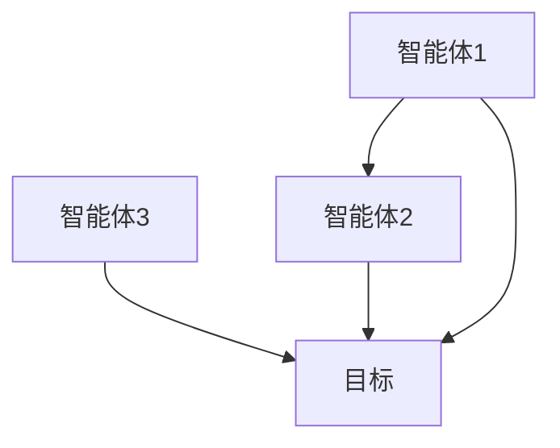
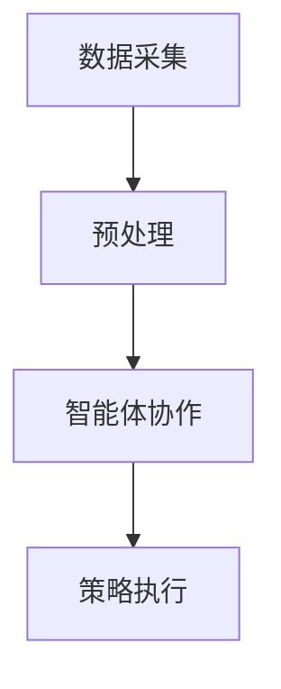

                 


# AI智能体协作：优化价值投资的行业轮动策略

## 关键词：AI智能体协作，价值投资，行业轮动策略，强化学习，多智能体系统，收益预测模型，风险评估

## 摘要：本文深入探讨了AI智能体协作在优化价值投资中的应用，特别是行业轮动策略的优化。通过分析多智能体协作的核心机制，结合强化学习算法和数学模型，提出了一套高效的行业轮动策略。文章从背景介绍、核心概念、算法实现到系统架构和项目实战，详细阐述了AI智能体协作的应用，并提供了实际案例和最佳实践，为读者提供了全面的指导。

---

## 第1章：AI智能体协作与价值投资概述

### 1.1 AI智能体协作的背景与概念

#### 1.1.1 传统投资方法的局限性
传统的价值投资方法依赖于人工分析，存在主观性强、效率低、覆盖范围有限等问题。随着市场数据量的激增和复杂性的提升，传统方法难以满足现代投资需求。

#### 1.1.2 AI智能体协作的核心概念
AI智能体协作是指多个智能体通过协同工作，利用强化学习和分布式计算来优化决策过程。这种协作能够提高投资策略的效率和准确性。

#### 1.1.3 价值投资与行业轮动的结合
价值投资强调长期持有的优质资产，而行业轮动策略则通过动态调整投资组合中的行业配置，捕捉市场变化带来的收益。AI智能体协作能够帮助投资者更精准地识别行业轮动的机会。

---

### 1.2 行业轮动策略的基本原理

#### 1.2.1 行业轮动的定义与分类
行业轮动是指根据市场变化，定期调整投资组合中的行业配置，以适应不同经济周期下的表现差异。主要分为战术性和战略性轮动两种类型。

#### 1.2.2 行业轮动策略的优势与挑战
优势：提高投资组合的收益和风险调整后的收益；挑战：市场预测的不确定性、数据质量和处理难度。

#### 1.2.3 AI在行业轮动中的应用前景
AI通过分析海量数据，识别潜在的投资机会，优化行业轮动策略，提高投资效率和收益。

---

## 第2章：AI智能体协作的核心机制

### 2.1 多智能体协作的基本原理

#### 2.1.1 多智能体系统的定义
多智能体系统是由多个智能体组成的协作团队，每个智能体负责特定任务，通过通信和协调完成整体目标。

#### 2.1.2 协作机制的分类与特点
- **直接通信**：智能体之间直接交换信息。
- **间接通信**：通过共享数据库或中间件进行信息传递。
- **分布式协作**：各智能体独立决策，基于全局信息进行协作。

#### 2.1.3 智能体之间的通信与协调
智能体通过共享信息、协调动作和同步决策来实现协作，确保整体目标的达成。

---

### 2.2 基于强化学习的协作算法

#### 2.2.1 强化学习的基本概念
强化学习是一种通过试错学习的方法，智能体通过与环境交互，获得奖励或惩罚，优化决策策略。

#### 2.2.2 多智能体强化学习的挑战
- **协调问题**：多个智能体之间的决策协调。
- **通信开销**：信息传递的效率和准确性问题。

#### 2.2.3 行业轮动中的协作策略设计
设计多智能体协作策略，优化行业轮动决策，提升投资收益。

---

## 第3章：AI智能体协作的数学模型与算法

### 3.1 多智能体协作的数学模型

#### 3.1.1 状态空间的定义
状态空间包括市场数据、经济指标等，用于描述系统的当前状况。

#### 3.1.2 动作空间的构建
动作空间定义了智能体可执行的操作，如买入、卖出或保持行业配置。

#### 3.1.3 奖励函数的设计
奖励函数量化智能体的决策效果，引导智能体向优化目标靠近。

---

### 3.2 基于强化学习的协作算法实现

#### 3.2.1 算法流程图（使用mermaid）


#### 3.2.2 算法伪代码实现
```python
def multi_agent_learning():
    initialize agents
    while True:
        for each agent:
            receive state
            compute action
            send action
        update agents' policies
```

---

## 第4章：系统架构与设计

### 4.1 系统整体架构设计

#### 4.1.1 系统模块划分
- **数据采集模块**：获取市场数据和经济指标。
- **智能体协作模块**：实现多智能体协作和决策。
- **策略执行模块**：根据决策结果执行投资策略。

#### 4.1.2 模块之间的关系（使用mermaid）


---

## 第5章：项目实战

### 5.1 环境安装与数据获取

#### 5.1.1 环境安装
安装必要的Python库，如TensorFlow、Keras和Scikit-learn。

#### 5.1.2 数据获取
从金融数据源获取历史数据，进行清洗和预处理。

### 5.2 模型训练与优化

#### 5.2.1 模型训练
使用强化学习算法训练智能体协作模型，优化行业轮动策略。

#### 5.2.2 模型优化
调整超参数，提高模型的预测准确性和稳定性。

### 5.3 策略实现与结果分析

#### 5.3.1 策略实现
根据训练好的模型，生成行业轮动策略，并在实际市场中进行测试。

#### 5.3.2 结果分析
评估策略的表现，对比传统方法，验证AI智能体协作的优势。

---

## 第6章：最佳实践与小结

### 6.1 最佳实践
- 定期更新模型和数据，适应市场变化。
- 结合多智能体协作和强化学习，优化投资策略。

### 6.2 小结
AI智能体协作在优化价值投资中的行业轮动策略展现了巨大潜力，通过数学模型和算法的创新，为投资者提供了更高效、更精准的决策支持。

---

## 作者：AI天才研究院/AI Genius Institute & 禅与计算机程序设计艺术/Zen And The Art of Computer Programming

---

这篇文章详细探讨了AI智能体协作在优化价值投资中的应用，从背景介绍、核心概念、算法实现到系统架构和项目实战，为读者提供了全面的指导。

