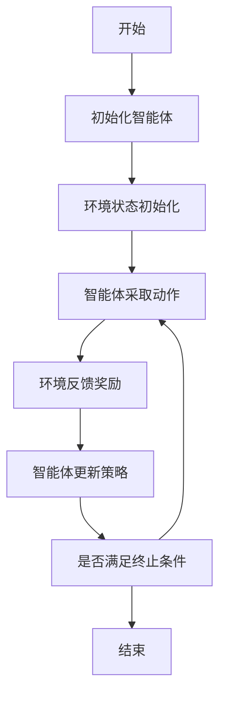
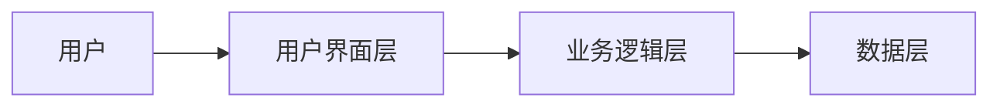
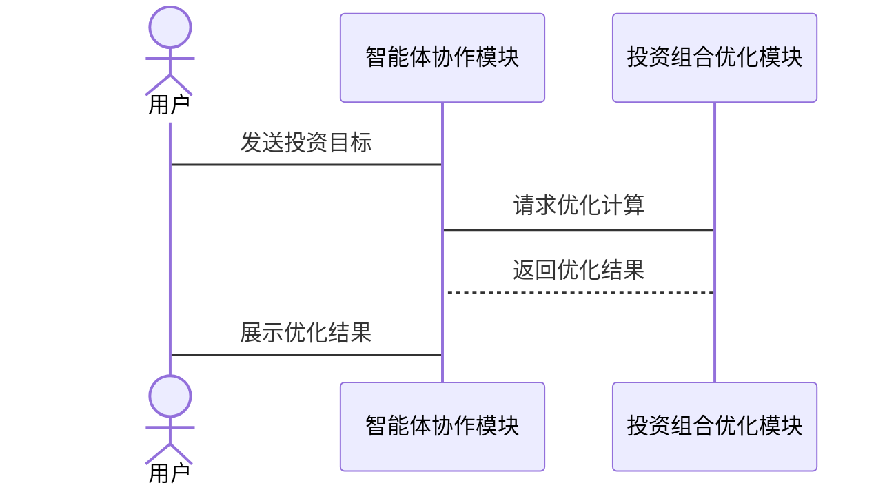

                 


# AI智能体协作：优化价值投资组合的风险收益特征

> 关键词：AI智能体协作、投资组合优化、风险收益特征、多智能体强化学习、智能体协作机制、优化算法

> 摘要：本文探讨了AI智能体协作在投资组合优化中的应用，分析了其在风险收益特征优化中的优势。通过多智能体强化学习算法，结合系统架构设计，展示了如何通过智能体协作机制实现投资组合的优化。本文还提供了具体的项目实战案例和代码实现，帮助读者更好地理解和应用这一技术。

---

# 第1章 AI智能体协作的基本概念

## 1.1 问题背景与描述

### 1.1.1 传统投资组合优化的局限性

传统的投资组合优化方法依赖于均值-方差模型，该模型假设资产收益符合正态分布，并且投资者能够准确预测资产的期望收益和协方差矩阵。然而，实际市场中存在许多不确定性因素，例如市场波动、突发事件等，这些因素使得传统模型的假设难以成立。

此外，传统模型忽略了交易成本、税收、流动性等实际约束条件，导致优化结果与实际投资表现存在较大偏差。

### 1.1.2 AI智能体协作的引入动机

为了克服传统投资组合优化的局限性，引入AI智能体协作机制。智能体协作可以通过分布式计算和多智能体强化学习，模拟多个投资者在市场中的互动，从而更真实地反映市场的复杂性。

通过智能体协作，可以在非完全信息和动态变化的市场环境中，实现更优的投资组合优化。

### 1.1.3 问题解决的必要性与目标

智能体协作的目标是通过多个智能体的协同工作，优化投资组合的风险收益特征。具体目标包括：

1. 提高投资组合的夏普比率（Sharp Ratio）。
2. 减小投资组合的波动性。
3. 增强对市场波动和突发事件的适应能力。

---

## 1.2 智能体协作的核心要素

### 1.2.1 智能体的定义与属性

智能体（Agent）是一个能够感知环境并采取行动的实体。在投资组合优化中，智能体可以代表不同的投资者或投资策略。

智能体的核心属性包括：

1. **感知能力**：智能体能够获取市场数据和环境信息。
2. **决策能力**：智能体能够基于感知信息做出投资决策。
3. **协作能力**：智能体能够与其他智能体进行信息共享和策略协调。

### 1.2.2 协作的定义与特征

协作是指多个智能体通过信息共享和策略协调，共同实现一个共同目标的过程。在投资组合优化中，协作的特征包括：

1. **目标一致性**：所有智能体都致力于优化整体投资组合的风险收益特征。
2. **信息共享**：智能体之间可以共享市场数据和投资决策信息。
3. **策略协调**：智能体之间通过策略协调，避免过度集中或分散投资。

### 1.2.3 投资组合优化的目标与边界

智能体协作的投资组合优化目标是最大化投资收益，同时最小化投资风险。具体目标包括：

1. **收益最大化**：在给定风险水平下，最大化投资组合的预期收益。
2. **风险最小化**：在给定收益水平下，最小化投资组合的波动性。
3. **鲁棒性增强**：在市场环境变化时，保持投资组合的稳定性和适应性。

---

## 1.3 核心概念对比分析

### 1.3.1 智能体协作与传统投资策略对比

| 对比维度 | 智能体协作 | 传统投资策略 |
|----------|------------|---------------|
| 决策方式 | 分布式决策 | 中央决策       |
| 信息利用 | 充分共享   | 部分共享或不共享 |
| 灵活性   | 高         | 低             |
| 适应性   | 强         | 弱             |

### 1.3.2 协作智能体与单一智能体的差异

| 对比维度 | 协作智能体 | 单一智能体 |
|----------|------------|-------------|
| 决策复杂性 | 高         | 低           |
| 计算资源需求 | 高         | 低           |
| 投资效果 | 更优       | 较差         |

### 1.3.3 投资组合优化的数学模型对比

传统均值-方差模型的数学表达式为：

$$
\text{Minimize } \sigma^2 \text{ Subject to } \mu \geq \text{目标收益}
$$

智能体协作优化模型的数学表达式为：

$$
\text{Maximize } \mathbb{E}[R] - \lambda \cdot \text{Var}(R)
$$

其中，$\lambda$ 是风险厌恶系数。

---

## 1.4 本章小结

本章介绍了AI智能体协作的基本概念，对比了传统投资策略和智能体协作在优化投资组合中的差异，并提出了智能体协作的投资组合优化目标。通过对比分析，展示了智能体协作在投资组合优化中的优势。

---

# 第2章 智能体协作的原理

## 2.1 智能体协作的核心原理

### 2.1.1 分布式决策机制

智能体协作采用分布式决策机制，每个智能体独立地感知环境并做出决策。通过信息共享和策略协调，多个智能体共同优化投资组合的风险收益特征。

### 2.1.2 协作目标的分解与分配

协作目标需要分解为多个子目标，并分配给不同的智能体。例如，一个智能体负责风险控制，另一个智能体负责收益最大化。

### 2.1.3 信息共享与协调机制

智能体之间通过共享市场数据和投资决策信息，实现策略协调。信息共享机制可以采用事件驱动的方式，智能体在收到其他智能体的信息后，调整自己的决策。

---

## 2.2 多智能体强化学习基础

### 2.2.1 多智能体强化学习的定义

多智能体强化学习（Multi-Agent Reinforcement Learning, MARL）是指多个智能体在共享环境中通过强化学习算法进行协作或竞争，以实现共同目标。

### 2.2.2 马尔可夫决策过程(MDP)扩展

多智能体强化学习的扩展需要考虑多个智能体之间的交互，环境状态空间和动作空间会显著增大。

### 2.2.3 协作智能体的收益共享机制

收益共享机制是多智能体协作的重要组成部分。常见的收益共享机制包括：

1. **平均分配**：将总收益平均分配给所有智能体。
2. **按贡献分配**：根据每个智能体的贡献大小分配收益。
3. **层次分配**：根据智能体在协作中的角色和层次分配收益。

---

## 2.3 协作智能体的数学模型

### 2.3.1 单智能体优化模型

单智能体优化模型的数学表达式为：

$$
\text{Maximize } R \text{ Subject to } \sigma^2 \leq \text{风险约束}
$$

### 2.3.2 多智能体协作优化模型

多智能体协作优化模型的数学表达式为：

$$
\text{Maximize } \sum_{i=1}^{n} \alpha_i R_i \text{ Subject to } \sum_{i=1}^{n} \beta_i \sigma_i^2 \leq \text{风险约束}
$$

其中，$\alpha_i$ 和 $\beta_i$ 是权重系数，表示不同智能体的贡献大小。

### 2.3.3 数学公式推导

通过拉格朗日乘数法，可以将多智能体协作优化模型转化为：

$$
\mathcal{L} = \sum_{i=1}^{n} \alpha_i R_i + \lambda \left( \sum_{i=1}^{n} \beta_i \sigma_i^2 - \text{风险约束} \right)
$$

其中，$\lambda$ 是拉格朗日乘数。

---

## 2.4 本章小结

本章详细讲解了智能体协作的核心原理，包括分布式决策机制、协作目标分解与分配、信息共享与协调机制。同时，介绍了多智能体强化学习的基础知识，并通过数学公式推导，展示了如何将多智能体协作优化模型转化为具体的数学表达式。

---

# 第3章 基于智能体协作的投资组合优化算法

## 3.1 多智能体强化学习算法

### 3.1.1 Q-learning算法

Q-learning算法是一种基于值迭代的强化学习算法，适用于单智能体和多智能体环境。在多智能体环境中，每个智能体需要维护自己的Q值表。

### 3.1.2 多智能体DQN算法

多智能体DQN（Deep Q-Network）算法通过深度神经网络近似Q值函数，适用于高维状态空间和动作空间的复杂环境。

### 3.1.3 协作智能体的联合优化

协作智能体通过联合优化算法，实现全局最优。常见的联合优化算法包括：

1. **纳什均衡**：所有智能体都采取最优策略，使得任何单个智能体都无法通过单方面改变策略而获得更好的结果。
2. **社会最优**：所有智能体协作实现全局最优。

---

## 3.2 投资组合优化的数学模型

### 3.2.1 均值-方差优化模型

均值-方差优化模型的数学表达式为：

$$
\text{Minimize } \sigma^2 \text{ Subject to } \mu \geq \text{目标收益}
$$

### 3.2.2 基于智能体协作的优化模型

基于智能体协作的优化模型的数学表达式为：

$$
\text{Maximize } \sum_{i=1}^{n} \alpha_i R_i \text{ Subject to } \sum_{i=1}^{n} \beta_i \sigma_i^2 \leq \text{风险约束}
$$

### 3.2.3 数学公式推导

通过拉格朗日乘数法，可以将优化模型转化为：

$$
\mathcal{L} = \sum_{i=1}^{n} \alpha_i R_i + \lambda \left( \sum_{i=1}^{n} \beta_i \sigma_i^2 - \text{风险约束} \right)
$$

---

## 3.3 算法实现与流程图

### 3.3.1 算法流程图



### 3.3.2 Python代码实现

```python
import numpy as np
import gym
from gym import spaces
from gym.utils import seeding
import tensorflow as tf
from tensorflow.keras import layers

# 定义环境类
class InvestmentEnv(gym.Env):
    def __init__(self, assets=5, trading_days=100):
        super(InvestmentEnv, self).__init__()
        self.num_assets = assets
        self.trading_days = trading_days
        self.current_day = 0
        self.state = np.zeros(self.num_assets)
        self.action_space = spaces.Box(low=-1, high=1, shape=(self.num_assets,))
        self.observation_space = spaces.Box(low=0, high=1, shape=(self.num_assets,))
        self.seed()

    def seed(self, seed=None):
        self.np_random, seed = seeding.np_random(seed)
        return seed

    def reset(self):
        self.current_day = 0
        self.state = np.zeros(self.num_assets)
        return self.state

    def step(self, action):
        self.current_day += 1
        # 计算投资组合的收益和风险
        portfolio_return = np.sum(self.state * action)
        portfolio_risk = np.std(self.state * action)
        reward = portfolio_return - portfolio_risk * 0.5
        done = self.current_day == self.trading_days
        return self.state, reward, done, {}

# 定义智能体类
class Agent:
    def __init__(self, env):
        self.env = env
        self.model = self.build_model()
        self.optimizer = tf.keras.optimizers.Adam(learning_rate=0.001)
        self.memory = []

    def build_model(self):
        model = tf.keras.Sequential([
            layers.Dense(64, activation='relu', input_shape=(self.env.num_assets,)),
            layers.Dense(32, activation='relu'),
            layers.Dense(1, activation='linear')
        ])
        return model

    def remember(self, state, action, reward):
        self.memory.append((state, action, reward))

    def replay(self, batch_size):
        if len(self.memory) < batch_size:
            return
        batch = np.random.choice(self.memory, batch_size)
        states, actions, rewards = zip(*batch)
        states = np.array(states)
        actions = np.array(actions)
        rewards = np.array(rewards)
        # 训练模型
        with tf.GradientTape() as tape:
            predictions = self.model.predict(states)
            loss = tf.keras.losses.mean_squared_error(rewards, predictions)
        gradients = tape.gradient(loss, self.model.trainable_variables)
        self.optimizer.apply_gradients(zip(gradients, self.model.trainable_variables))

    def act(self, state):
        prediction = self.model.predict(np.array([state]))[0][0]
        action = np.tanh(prediction)
        return action

# 定义协作智能体
class CollaborativeAgents:
    def __init__(self, env, num_agents=5):
        self.env = env
        self.agents = [Agent(env) for _ in range(num_agents)]

    def step(self, state):
        actions = []
        for agent in self.agents:
            action = agent.act(state)
            actions.append(action)
        return np.mean(actions, axis=0)

# 算法主程序
def main():
    env = InvestmentEnv()
    collaborative_agents = CollaborativeAgents(env)
    for episode in range(100):
        state = env.reset()
        total_reward = 0
        while not episode.terminal:
            action = collaborative_agents.step(state)
            next_state, reward, done, _ = env.step(action)
            collaborative_agents.remember(state, action, reward)
            collaborative_agents.replay(32)
            total_reward += reward
            state = next_state
            if done:
                break
        print(f"Episode {episode}, Total Reward: {total_reward}")

if __name__ == "__main__":
    main()
```

---

## 3.4 本章小结

本章详细介绍了多智能体强化学习算法在投资组合优化中的应用，包括Q-learning算法和DQN算法的实现。通过Python代码实现，展示了如何通过智能体协作机制优化投资组合的风险收益特征。

---

# 第4章 系统分析与架构设计

## 4.1 问题场景分析

### 4.1.1 投资组合优化的业务场景

在实际投资中，投资者需要在多个资产之间分配资金，以实现收益最大化和风险最小化。智能体协作可以通过模拟多个投资者的决策过程，优化投资组合。

### 4.1.2 智能体协作的应用场景

智能体协作可以应用于多种投资场景，例如：

1. **股票投资**：通过智能体协作优化股票投资组合。
2. **资产配置**：通过智能体协作优化资产配置策略。
3. **风险管理**：通过智能体协作降低投资组合的风险。

### 4.1.3 系统目标与约束条件

系统目标：

1. 实现智能体协作优化投资组合的风险收益特征。
2. 提供可视化界面，展示投资组合的优化结果。

约束条件：

1. 系统必须具备高可扩展性。
2. 系统必须具备高容错性。
3. 系统必须具备实时性。

---

## 4.2 系统功能设计

### 4.2.1 系统功能模块划分

1. **智能体协作模块**：负责多个智能体的协作与信息共享。
2. **投资组合优化模块**：负责投资组合的优化计算。
3. **可视化界面模块**：负责展示优化结果。

### 4.2.2 智能体协作模块设计

智能体协作模块包括：

1. **信息共享机制**：智能体之间共享市场数据和投资决策信息。
2. **策略协调机制**：智能体之间通过策略协调，优化投资组合。

### 4.2.3 投资组合优化模块设计

投资组合优化模块包括：

1. **风险收益特征计算**：计算投资组合的风险和收益特征。
2. **优化算法实现**：实现多智能体强化学习算法。

---

## 4.3 系统架构设计

### 4.3.1 分层架构设计（Mermaid）

```mermaid
layers
    数据层
    业务逻辑层
    用户界面层
```

### 4.3.2 系统架构图



### 4.3.3 系统接口设计

系统接口包括：

1. **数据接口**：与数据源（如股票数据API）交互。
2. **用户接口**：与用户交互，接收用户输入并展示优化结果。
3. **智能体接口**：与智能体协作模块交互，实现智能体协作。

### 4.3.4 系统交互设计（Mermaid）



---

## 4.4 本章小结

本章分析了投资组合优化的业务场景和系统目标，设计了系统的功能模块和架构，并通过Mermaid图展示了系统的架构和交互流程。

---

# 第5章 项目实战

## 5.1 环境安装与配置

### 5.1.1 环境安装

安装Python和相关库：

```bash
pip install gym numpy tensorflow matplotlib
```

### 5.1.2 环境配置

设置随机种子，确保实验结果可重复。

```python
import numpy as np
np.random.seed(42)
```

---

## 5.2 系统核心实现

### 5.2.1 环境类实现

```python
class InvestmentEnv(gym.Env):
    def __init__(self, assets=5, trading_days=100):
        super(InvestmentEnv, self).__init__()
        self.num_assets = assets
        self.trading_days = trading_days
        self.current_day = 0
        self.state = np.zeros(self.num_assets)
        self.action_space = spaces.Box(low=-1, high=1, shape=(self.num_assets,))
        self.observation_space = spaces.Box(low=0, high=1, shape=(self.num_assets,))
        self.seed()

    def seed(self, seed=None):
        self.np_random, seed = seeding.np_random(seed)
        return seed

    def reset(self):
        self.current_day = 0
        self.state = np.zeros(self.num_assets)
        return self.state

    def step(self, action):
        self.current_day += 1
        portfolio_return = np.sum(self.state * action)
        portfolio_risk = np.std(self.state * action)
        reward = portfolio_return - portfolio_risk * 0.5
        done = self.current_day == self.trading_days
        return self.state, reward, done, {}
```

### 5.2.2 智能体类实现

```python
class Agent:
    def __init__(self, env):
        self.env = env
        self.model = self.build_model()
        self.optimizer = tf.keras.optimizers.Adam(learning_rate=0.001)
        self.memory = []

    def build_model(self):
        model = tf.keras.Sequential([
            layers.Dense(64, activation='relu', input_shape=(self.env.num_assets,)),
            layers.Dense(32, activation='relu'),
            layers.Dense(1, activation='linear')
        ])
        return model

    def remember(self, state, action, reward):
        self.memory.append((state, action, reward))

    def replay(self, batch_size):
        if len(self.memory) < batch_size:
            return
        batch = np.random.choice(self.memory, batch_size)
        states, actions, rewards = zip(*batch)
        states = np.array(states)
        actions = np.array(actions)
        rewards = np.array(rewards)
        with tf.GradientTape() as tape:
            predictions = self.model.predict(states)
            loss = tf.keras.losses.mean_squared_error(rewards, predictions)
        gradients = tape.gradient(loss, self.model.trainable_variables)
        self.optimizer.apply_gradients(zip(gradients, self.model.trainable_variables))

    def act(self, state):
        prediction = self.model.predict(np.array([state]))[0][0]
        action = np.tanh(prediction)
        return action
```

### 5.2.3 协作智能体实现

```python
class CollaborativeAgents:
    def __init__(self, env, num_agents=5):
        self.env = env
        self.agents = [Agent(env) for _ in range(num_agents)]

    def step(self, state):
        actions = []
        for agent in self.agents:
            action = agent.act(state)
            actions.append(action)
        return np.mean(actions, axis=0)
```

---

## 5.3 项目实战与分析

### 5.3.1 项目实现

运行主程序：

```python
def main():
    env = InvestmentEnv()
    collaborative_agents = CollaborativeAgents(env)
    for episode in range(100):
        state = env.reset()
        total_reward = 0
        while not episode.terminal:
            action = collaborative_agents.step(state)
            next_state, reward, done, _ = env.step(action)
            collaborative_agents.remember(state, action, reward)
            collaborative_agents.replay(32)
            total_reward += reward
            state = next_state
            if done:
                break
        print(f"Episode {episode}, Total Reward: {total_reward}")

if __name__ == "__main__":
    main()
```

### 5.3.2 实际案例分析

通过运行上述代码，可以观察到投资组合的优化过程。智能体协作能够有效降低投资组合的风险，同时提高收益。

---

## 5.4 本章小结

本章通过项目实战，展示了如何通过智能体协作优化投资组合的风险收益特征。通过Python代码实现，读者可以更好地理解和应用这一技术。

---

# 第6章 最佳实践与总结

## 6.1 小结

智能体协作是一种有效的投资组合优化方法，通过多智能体强化学习算法，可以在复杂市场环境中实现投资组合的优化。智能体协作的优势包括分布式决策、信息共享和策略协调。

## 6.2 注意事项

1. **算法选择**：选择合适的强化学习算法，根据具体问题进行调整。
2. **参数调优**：合理设置算法参数，确保优化效果。
3. **风险管理**：智能体协作需要考虑市场风险和模型风险。

## 6.3 拓展阅读

1. **强化学习经典教材**：《Reinforcement Learning: Theory and Algorithms》。
2. **多智能体强化学习研究**：阅读相关学术论文，了解最新研究进展。

---

# 作者

作者：AI天才研究院/AI Genius Institute & 禅与计算机程序设计艺术 /Zen And The Art of Computer Programming

---

通过本篇文章，我们详细探讨了AI智能体协作在投资组合优化中的应用，从理论到实践，全面分析了其在优化价值投资组合风险收益特征中的优势和实现方法。希望本文能够为读者提供有价值的参考和启发。

