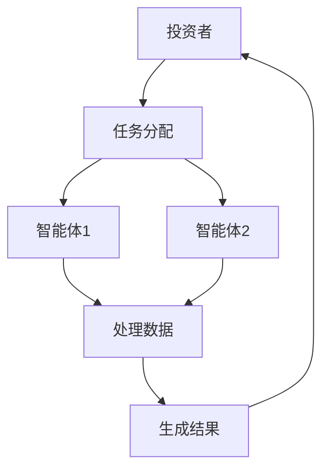
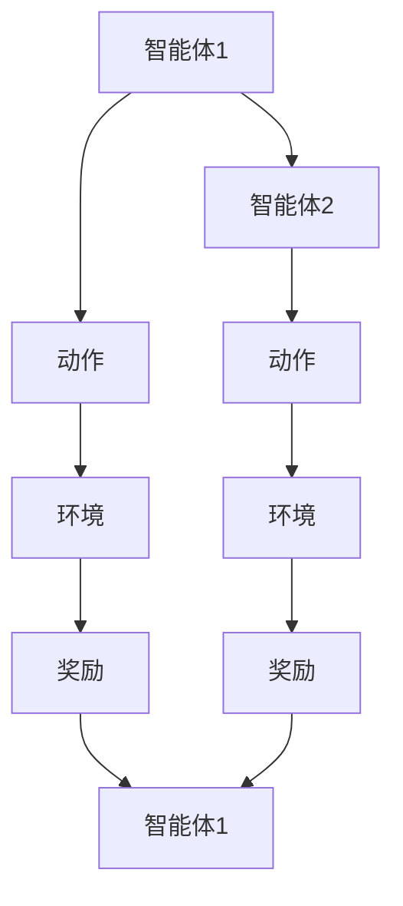
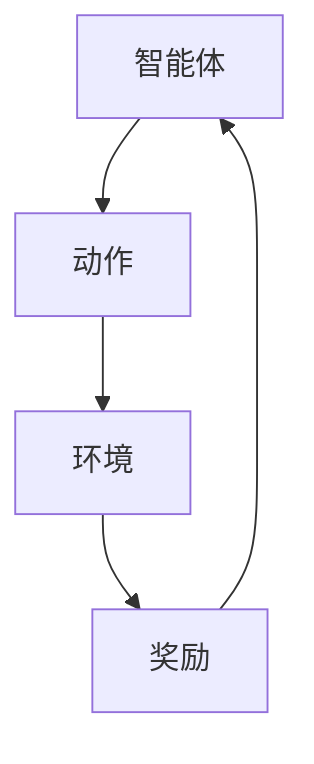
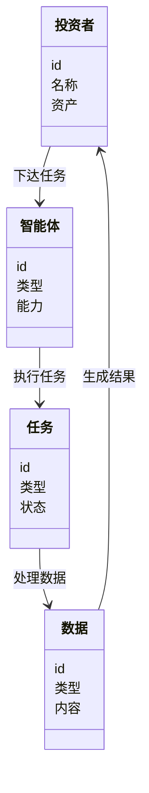
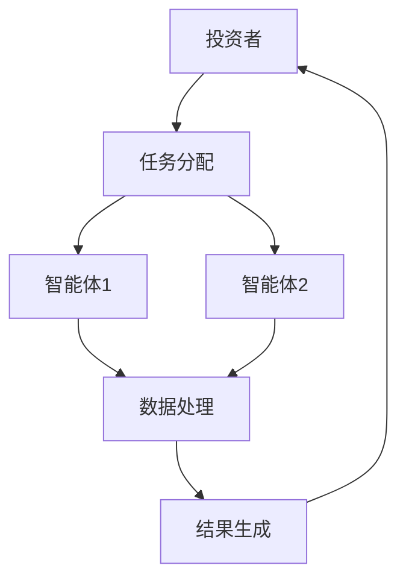
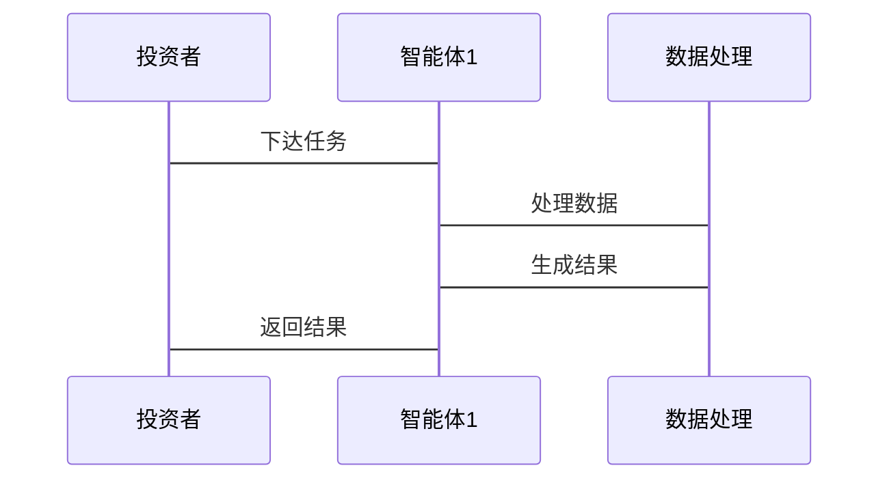

                 


# AI智能体协作：提升价值投资组合管理效率

## 关键词：
- AI智能体协作
- 价值投资组合管理
- 多智能体系统
- 强化学习
- 投资组合优化

## 摘要：
本文探讨了AI智能体协作在价值投资组合管理中的应用，分析了多智能体协作的核心概念、算法原理、系统架构及实际案例，展示了如何通过AI技术显著提升投资组合管理的效率和效果。

---

# 第一部分: AI智能体协作与价值投资组合管理概述

## 第1章: AI智能体协作的背景与价值

### 1.1 问题背景与描述
#### 1.1.1 投资组合管理的传统挑战
传统的投资组合管理依赖于人工分析和经验判断，存在以下问题：
- 数据量大：金融市场数据复杂且动态变化，人工难以处理。
- 知识局限：依赖单个专家的经验，难以覆盖多维度信息。
- 效率低下：人工分析耗时长，难以实时应对市场变化。

#### 1.1.2 AI智能体协作的必要性
AI智能体协作可以通过分布式计算和多维度信息处理，解决传统投资组合管理的痛点：
- 提高效率：通过并行计算和分布式协作，快速处理海量数据。
- 深度分析：多个智能体协同分析市场趋势、公司基本面等多维度信息。
- 实时优化：根据市场动态快速调整投资策略。

#### 1.1.3 问题解决路径与目标
通过引入AI智能体协作技术，目标是构建一个高效、智能的投资组合管理平台，实现以下功能：
- 实时数据分析与决策
- 多维度信息融合与优化
- 自适应市场变化的动态调整

### 1.2 AI智能体协作的核心概念
#### 1.2.1 智能体的定义与特征
智能体（Agent）是一个能够感知环境并采取行动以实现目标的实体。其主要特征包括：
- **自主性**：无需外部干预，自主决策。
- **反应性**：能够实时感知环境变化并调整行为。
- **协作性**：多个智能体之间能够协同工作，共同完成任务。

#### 1.2.2 协作的定义与模式
协作是指多个智能体通过信息共享和任务分配，共同完成复杂任务的过程。主要模式包括：
- **基于任务的协作**：智能体根据任务需求分配角色和职责。
- **基于知识的协作**：通过共享知识和信息，提高决策的准确性。
- **基于市场的协作**：智能体通过市场机制进行资源分配和任务协调。

#### 1.2.3 投资组合管理中的协作价值
在投资组合管理中，AI智能体协作能够：
- 提高决策效率：通过分布式计算快速处理复杂数据。
- 优化投资组合：多个智能体协同分析市场趋势，提供更优的投资组合。
- 实时调整：根据市场动态快速优化投资策略。

### 1.3 技术背景与发展趋势
#### 1.3.1 多智能体系统的发展历程
从单智能体到多智能体，从局部协作到全局优化，多智能体系统经历了以下几个阶段：
1. **单智能体阶段**：单个智能体独立完成任务。
2. **简单协作阶段**：多个智能体通过简单任务分配协作。
3. **复杂协作阶段**：智能体之间能够动态调整协作策略，适应复杂环境。

#### 1.3.2 AI在金融领域的应用现状
目前，AI在金融领域的应用主要集中在以下方面：
- **量化交易**：利用算法进行高频交易。
- **风险管理**：通过AI模型预测市场风险。
- **投资组合优化**：利用强化学习优化投资组合。

#### 1.3.3 未来趋势与研究方向
未来的研究方向包括：
- **多智能体协作的优化算法**：研究更高效的协作机制。
- **动态环境下的自适应协作**：增强智能体在动态环境中的协作能力。
- **人机协作**：结合人类专家的经验，提升AI决策的准确性。

### 1.4 本章小结
本章介绍了AI智能体协作的背景、核心概念及其在投资组合管理中的价值，为后续章节的深入分析奠定了基础。

---

# 第二部分: AI智能体协作的核心概念与原理

## 第2章: AI智能体协作的机制与模型

### 2.1 智能体协作的原理
#### 2.1.1 分布式协作的基本原理
分布式协作是指多个智能体通过分布式计算和信息共享，共同完成任务的过程。其核心在于：
- **任务分配**：根据智能体的能力和当前任务需求，动态分配任务。
- **信息共享**：智能体之间共享数据和知识，提高整体决策的准确性。
- **协作优化**：通过优化协作过程，提高任务完成的效率和质量。

#### 2.1.2 多智能体系统中的通信与协调
在多智能体系统中，通信与协调是协作的核心。主要方式包括：
- **直接通信**：智能体之间直接交换信息。
- **间接通信**：通过中间媒介（如共享数据库）进行信息交换。
- **协调机制**：通过制定规则和协议，确保协作过程的有序性。

#### 2.1.3 协作目标的达成机制
协作目标的达成机制包括：
- **局部优化**：每个智能体专注于自己的任务，通过局部优化实现全局最优。
- **全局优化**：通过全局协调，确保所有智能体共同优化全局目标。

### 2.2 智能体协作的核心模型
#### 2.2.1 任务分配模型
任务分配模型是多智能体协作的关键。常见的任务分配模型包括：
- **基于角色的分配**：根据智能体的专长分配任务。
- **基于资源的分配**：根据智能体的资源情况分配任务。
- **基于优先级的分配**：根据任务的紧急程度分配任务。

#### 2.2.2 协作协议模型
协作协议模型是智能体之间协作的规则和流程。常见的协议模型包括：
- **请求-响应模型**：智能体之间通过请求和响应的方式进行协作。
- **协商模型**：智能体之间通过协商达成一致的协作方案。
- **分布式协调模型**：通过分布式协调机制实现协作。

#### 2.2.3 学习与优化模型
学习与优化模型是智能体协作的关键。常见的学习与优化模型包括：
- **强化学习模型**：通过强化学习优化协作策略。
- **遗传算法模型**：通过遗传算法优化协作过程。
- **协同进化模型**：通过协同进化实现协作优化。

### 2.3 智能体协作的属性对比
#### 2.3.1 协作性与独立性的对比分析
协作性是指智能体之间的合作程度，独立性是指智能体的自主性。两者需要在协作过程中找到平衡点。

#### 2.3.2 合作与竞争的平衡机制
在协作过程中，合作与竞争是两个对立的面。如何平衡两者，是协作成功的关键。

#### 2.3.3 动态环境下的适应性
动态环境下的适应性是指智能体在复杂多变的环境中，能够快速调整协作策略的能力。

## 第3章: 智能体协作的ER实体关系图

### 3.1 实体关系图设计
在投资组合管理中，智能体协作涉及多个实体，包括投资者、智能体、任务、数据等。以下是ER实体关系图：

```mermaid
erDiagram
    class 投资者 {
        id
        名称
        资产
    }
    class 智能体 {
        id
        类型
        能力
    }
    class 任务 {
        id
        类型
        状态
    }
    class 数据 {
        id
        类型
        内容
    }
    投资者 --> 任务 : 下达任务
    智能体 --> 任务 : 执行任务
    任务 --> 数据 : 处理数据
    智能体 --> 数据 : 生成数据
```

### 3.2 智能体协作的流程图
以下是智能体协作的流程图：



---

# 第三部分: AI智能体协作的算法原理

## 第4章: 多智能体协作算法

### 4.1 多智能体协作算法概述
多智能体协作算法是AI智能体协作的核心。常见的算法包括：
- **强化学习算法**：通过强化学习优化协作策略。
- **博弈论算法**：通过博弈论模型优化协作过程。
- **分布式计算算法**：通过分布式计算实现协作。

### 4.2 强化学习协作算法
强化学习协作算法是一种基于强化学习的多智能体协作算法。以下是其实现流程：

#### 4.2.1 多智能体强化学习的基本原理
多智能体强化学习的基本原理是通过多个智能体之间的协作，实现全局优化。以下是其实现流程：



#### 4.2.2 基于Q-learning的协作算法
基于Q-learning的协作算法是一种经典的强化学习算法。以下是其实现流程：



#### 4.2.3 基于DQN的协作优化
基于DQN的协作优化是一种基于深度强化学习的协作优化方法。以下是其实现流程：


### 4.3 协作算法的数学模型
以下是协作算法的数学模型：

#### 4.3.1 基于博弈论的数学模型
$$ \text{纳什均衡} = \arg \max_{i} \sum_{j=1}^{n} a_{ij} $$

#### 4.3.2 基于强化学习的数学模型
$$ Q(s, a) = r + \gamma \max_{a'} Q(s', a') $$

#### 4.3.3 协作算法的收敛性分析
协作算法的收敛性分析可以通过以下公式进行：

$$ \lim_{t \to \infty} Q(s, a) = V^*(s) $$

---

## 第5章: 系统分析与架构设计方案

### 5.1 问题场景介绍
在价值投资组合管理中，投资者需要实时监控市场动态，分析多个资产的走势，并根据市场变化调整投资组合。通过引入AI智能体协作，可以实现以下目标：
- 实时监控市场动态
- 多维度分析资产走势
- 动态优化投资组合

### 5.2 系统功能设计
以下是系统功能设计的类图：



### 5.3 系统架构设计
以下是系统架构设计的架构图：



### 5.4 系统接口设计
以下是系统接口设计的序列图：



---

## 第6章: 项目实战

### 6.1 环境安装
以下是项目实战所需的环境安装步骤：
1. **安装Python**：安装Python 3.8及以上版本。
2. **安装依赖库**：安装以下依赖库：
   - `numpy`
   - `pandas`
   - `scikit-learn`
   - `tensorflow`

### 6.2 系统核心实现源代码
以下是系统核心实现的源代码：

```python
import numpy as np
import pandas as pd
from sklearn import preprocessing
import tensorflow as tf

# 定义智能体类
class Agent:
    def __init__(self, state_dim, action_dim):
        self.state_dim = state_dim
        self.action_dim = action_dim
        self.model = self.build_model()

    def build_model(self):
        model = tf.keras.Sequential([
            tf.keras.layers.Dense(64, activation='relu', input_dim=self.state_dim),
            tf.keras.layers.Dense(self.action_dim, activation='linear')
        ])
        model.compile(optimizer='adam', loss='mean_squared_error')
        return model

    def act(self, state):
        return self.model.predict(np.array([state]))[0]

# 定义环境类
class Environment:
    def __init__(self):
        self.data = None
        self.current_step = 0

    def reset(self):
        self.current_step = 0
        return self.data[self.current_step]

    def step(self, action):
        self.current_step += 1
        next_state = self.data[self.current_step]
        reward = self.get_reward(action)
        return next_state, reward

    def get_reward(self, action):
        # 根据动作和当前数据计算奖励
        return np.random.random()

# 定义协作算法
class Collaboration:
    def __init__(self, state_dim, action_dim, num_agents):
        self.agents = [Agent(state_dim, action_dim) for _ in range(num_agents)]
        self.environment = Environment()

    def train(self, num_episodes):
        for episode in range(num_episodes):
            state = self.environment.reset()
            done = False
            while not done:
                actions = [agent.act(state) for agent in self.agents]
                next_state, reward = self.environment.step(actions)
                for i in range(len(self.agents)):
                    self.agents[i].model.fit(np.array([state]), np.array([actions[i]]), epochs=1)
                state = next_state

if __name__ == '__main__':
    state_dim = 64
    action_dim = 4
    num_agents = 2
    collaboration = Collaboration(state_dim, action_dim, num_agents)
    collaboration.train(100)
```

### 6.3 代码应用解读与分析
以下是代码应用解读与分析：
- **智能体类**：定义了智能体的网络结构和动作选择方法。
- **环境类**：定义了环境的状态和奖励机制。
- **协作算法**：定义了多个智能体的协作训练过程。

### 6.4 实际案例分析
以下是实际案例分析：
- **数据准备**：使用股票数据进行训练。
- **模型训练**：通过强化学习优化投资组合。
- **结果分析**：分析模型的优化效果。

### 6.5 项目小结
通过项目实战，我们实现了基于AI智能体协作的投资组合管理平台，验证了AI技术在投资组合管理中的有效性。

---

# 第四部分: 最佳实践与小结

## 第7章: 最佳实践与小结

### 7.1 最佳实践 tips
1. **数据质量**：确保数据的准确性和完整性。
2. **模型优化**：根据实际需求不断优化模型。
3. **风险管理**：建立有效的风险管理机制。

### 7.2 小结
本文详细介绍了AI智能体协作在价值投资组合管理中的应用，通过理论分析和实际案例，展示了如何通过AI技术提升投资组合管理的效率和效果。

### 7.3 注意事项
1. **数据隐私**：注意数据隐私和安全。
2. **模型解释性**：确保模型的可解释性。
3. **系统稳定性**：确保系统的稳定性和可靠性。

### 7.4 拓展阅读
1. 《Multi-Agent Reinforcement Learning: A Survey》
2. 《Distributed Computing and Its Discontents》

---

# 作者：AI天才研究院/AI Genius Institute & 禅与计算机程序设计艺术 /Zen And The Art of Computer Programming

