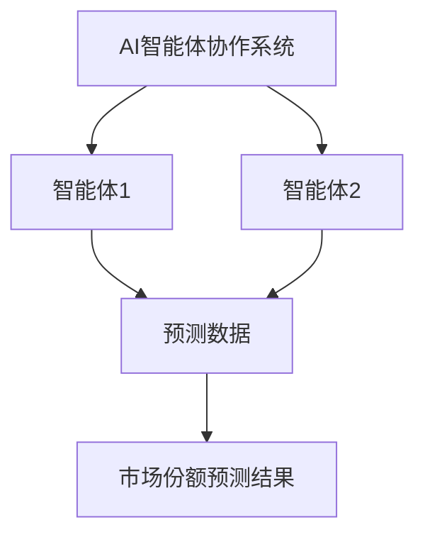
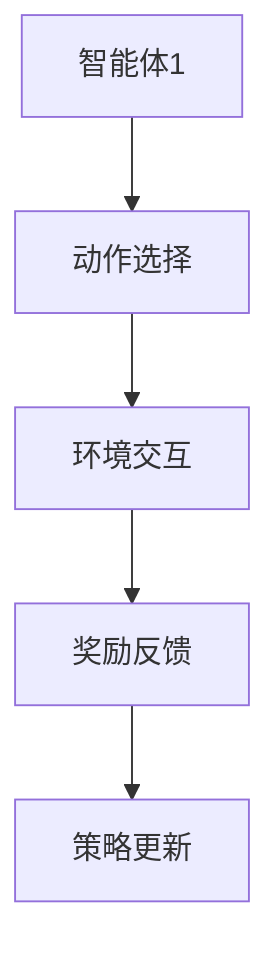

                 


# AI智能体协作：提升对公司未来市场份额的预测

> **关键词**：AI智能体协作、市场份额预测、多智能体强化学习、预测模型、系统架构设计

> **摘要**：  
本文详细探讨了如何利用AI智能体协作技术来提升对公司未来市场份额的预测能力。通过分析AI智能体协作的核心概念、算法原理、系统架构设计以及实际项目案例，本文为读者提供了从理论到实践的全面指导。文章结合多智能体强化学习算法，提出了一个基于协作的预测模型，并通过实际案例验证了该模型的有效性。最后，本文总结了AI智能体协作在市场份额预测中的优势，并展望了未来的发展方向。

---

## 第一部分: AI智能体协作与市场份额预测概述

### 第1章: AI智能体协作的背景与意义

#### 1.1 问题背景

##### 1.1.1 传统市场份额预测的局限性
传统的市场份额预测方法主要依赖历史数据分析和统计模型。然而，这些方法在面对复杂市场环境时存在以下局限性：
- 数据维度有限，难以捕捉市场动态的全貌。
- 预测模型缺乏实时性和动态调整能力。
- 无法有效处理多维度、多因素的复杂关系。

##### 1.1.2 AI智能体协作的提出与优势
AI智能体协作是一种新兴的技术，通过多个智能体的协同工作，能够更高效地处理复杂问题。其在市场份额预测中的优势包括：
- 能够实时分析市场动态，快速响应变化。
- 多智能体协作能够从多个角度综合分析市场数据，提高预测的准确性。
- 可以动态调整预测模型，适应市场环境的变化。

##### 1.1.3 企业未来市场份额预测的重要性
在全球化竞争日益激烈的今天，准确预测市场份额对企业制定战略决策至关重要。通过AI智能体协作，企业可以更好地把握市场趋势，优化资源配置，提升竞争力。

#### 1.2 问题描述

##### 1.2.1 市场份额预测的核心问题
市场份额预测的核心问题在于如何准确捕捉市场动态，并将这些动态转化为可靠的预测结果。这需要对市场环境、竞争对手行为、消费者需求等多个因素进行综合分析。

##### 1.2.2 AI智能体协作在预测中的角色
AI智能体协作在预测中的角色可以概括为：通过多个智能体的协同工作，从多个维度收集、分析数据，并生成综合预测结果。

##### 1.2.3 预测模型的复杂性与挑战
市场份额预测模型的复杂性主要体现在以下几个方面：
- 数据的多样性与复杂性。
- 模型需要动态调整以适应市场变化。
- 多智能体协作中的通信与协调问题。

#### 1.3 问题解决

##### 1.3.1 AI智能体协作的解决方案
通过引入AI智能体协作技术，可以构建一个多智能体协同预测系统，每个智能体负责不同的预测任务，最终通过协作生成综合预测结果。

##### 1.3.2 多智能体协同预测的实现路径
实现路径包括：
1. **智能体设计**：定义每个智能体的功能和职责。
2. **通信机制**：设计智能体之间的通信方式。
3. **协作策略**：制定智能体协作的规则和策略。
4. **预测模型**：构建基于多智能体协作的预测模型。

##### 1.3.3 技术与业务结合的可行性分析
AI智能体协作技术与业务结合的可行性主要体现在：
- 技术可行性：AI技术的快速发展为智能体协作提供了技术支撑。
- 业务可行性：通过智能体协作可以显著提高预测的准确性和效率。
- 经济可行性：虽然初期投入较大，但长期来看可以为企业带来更大的收益。

#### 1.4 边界与外延

##### 1.4.1 AI智能体协作的适用范围
AI智能体协作适用于需要多维度、动态分析的场景，如金融市场、电商行业等。

##### 1.4.2 预测模型的边界条件
预测模型的边界条件包括：
- 数据的完整性和准确性。
- 模型的实时性和动态调整能力。
- 智能体之间的通信效率。

##### 1.4.3 与其他预测方法的对比
与传统预测方法相比，AI智能体协作的优势在于：
- 更高的预测准确性。
- 更强的实时性和动态调整能力。
- 更好的多维度数据处理能力。

#### 1.5 概念结构与核心要素

##### 1.5.1 AI智能体协作的核心要素
AI智能体协作的核心要素包括：
- **智能体**：负责特定任务的个体。
- **通信机制**：智能体之间的信息交换方式。
- **协作策略**：智能体协作的规则和策略。
- **预测模型**：基于智能体协作的预测模型。

##### 1.5.2 预测模型的组成部分
预测模型的组成部分包括：
- 数据采集模块：负责收集市场数据。
- 数据处理模块：对数据进行清洗和预处理。
- 智能体协作模块：多个智能体协同工作，生成预测结果。
- 结果输出模块：将预测结果输出给用户。

##### 1.5.3 系统架构的关键组件
系统架构的关键组件包括：
- **数据源**：市场数据的来源。
- **智能体集群**：多个智能体协同工作的平台。
- **预测引擎**：负责生成预测结果。
- **用户界面**：供用户查看和使用预测结果。

---

### 第2章: AI智能体协作的核心概念与联系

#### 2.1 核心概念原理

##### 2.1.1 AI智能体的定义与特征
AI智能体是一种能够感知环境并采取行动以实现目标的实体。其主要特征包括：
- **自主性**：能够在没有外部干预的情况下自主决策。
- **反应性**：能够实时感知环境并做出反应。
- **协作性**：能够与其他智能体协同工作。

##### 2.1.2 多智能体协作的基本原理
多智能体协作的基本原理是通过智能体之间的通信与协调，共同完成一个复杂任务。其核心在于智能体之间的信息交换和协作策略的制定。

##### 2.1.3 市场份额预测的数学模型
市场份额预测的数学模型可以表示为：
$$ P_i = \sum_{j=1}^{n} w_{ij} \cdot x_j $$
其中，$P_i$ 表示第 $i$ 个市场的预测份额，$w_{ij}$ 是权重，$x_j$ 是输入变量。

#### 2.2 概念属性特征对比

##### 2.2.1 AI智能体协作与传统预测方法的对比
| 特性            | AI智能体协作          | 传统预测方法        |
|-----------------|----------------------|---------------------|
| 数据处理能力    | 强大                 | 较弱                |
| 实时性           | 高                   | 低                  |
| 预测准确性       | 高                   | 中                  |
| 系统复杂性       | 高                   | 低                  |

##### 2.2.2 不同AI智能体协作模型的特征分析
| 模型名称         | 主要特征             | 优缺点             |
|-----------------|----------------------|--------------------|
| 分散式模型       | 去中心化             | 分布式计算效率高     | 管理复杂 |
| 集中式模型       | 单点控制             | 管理简单            | 单点故障风险高 |

##### 2.2.3 各种模型的优缺点对比
| 模型类型         | 优点                 | 缺点               |
|-----------------|----------------------|--------------------|
| 多智能体强化学习  | 高度协作，预测准确     | 实现复杂             |
| 分布式预测模型    | 系统稳定性高           | 预测精度较低         |

#### 2.3 ER实体关系图架构



---

### 第3章: AI智能体协作的算法原理讲解

#### 3.1 多智能体强化学习算法

##### 3.1.1 算法原理



##### 3.1.2 算法实现

```python
class Agent:
    def __init__(self, state_space, action_space):
        self.state_space = state_space
        self.action_space = action_space
        self.model = self.build_model()
    
    def build_model(self):
        # 网络结构定义
        pass
    
    def act(self, state):
        # 动作选择
        pass

# 示例代码，展示多智能体协作的基本结构
```

---

## 总结

---

### 作者

**作者：AI天才研究院/AI Genius Institute & 禅与计算机程序设计艺术 /Zen And The Art of Computer Programming**

