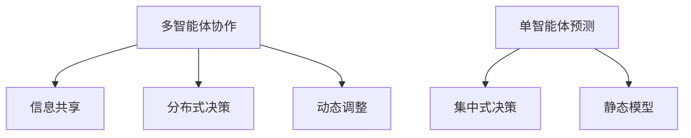
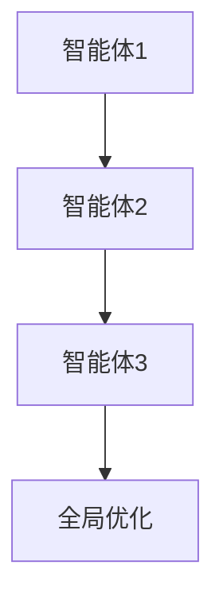
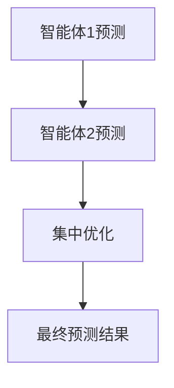
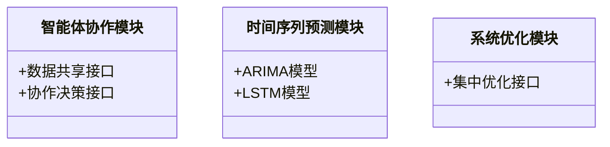
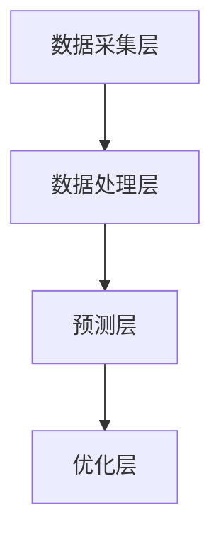
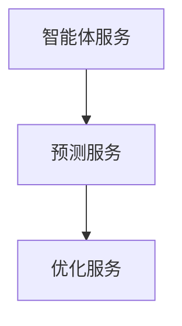
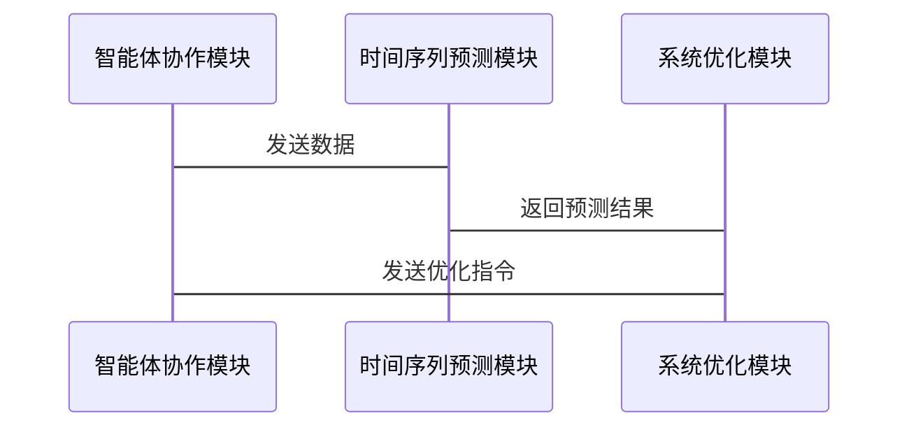

                 


# AI智能体协作：提升对公司未来现金流稳定性的预测

## 关键词：AI智能体协作、现金流预测、多智能体系统、时间序列分析、机器学习

## 摘要：本文探讨了AI智能体协作在现金流预测中的应用，通过分析多智能体协作的核心原理、数学模型、系统设计和实际案例，详细展示了如何利用AI技术提升现金流预测的准确性和稳定性。文章还提供了优化建议和未来研究方向，为读者提供全面的技术指导。

---

## 第一部分: AI智能体协作与现金流预测的背景与基础

### 第1章: AI智能体协作概述

#### 1.1 AI智能体协作的核心概念

##### 1.1.1 多智能体协作的基本定义
多智能体协作是指多个智能体通过信息共享和协同决策，共同完成复杂任务的过程。每个智能体都有自己的目标和决策能力，但通过协作实现整体目标的优化。

##### 1.1.2 智能体协作的特征与优势

| 特征                | 优势                |
|---------------------|---------------------|
| 分布式决策          | 提高系统的鲁棒性      |
| 信息共享            | 提高预测的准确性      |
| 自适应性            | 灵活应对不确定性      |

##### 1.1.3 智能体协作与传统单智能体预测的区别



### 第2章: 现金流预测的挑战与AI的潜力

#### 2.1 现金流预测的重要性

##### 2.1.1 现金流预测对企业经营的意义
现金流是企业运营的血液，直接关系到企业的生存和发展。准确的现金流预测可以帮助企业优化资金管理、降低风险。

##### 2.1.2 现金流预测的复杂性与不确定性
现金流预测需要考虑市场波动、经济环境、企业内部策略等多种因素，具有高度的不确定性和复杂性。

#### 2.2 AI技术在现金流预测中的应用

##### 2.2.1 AI技术的优势与局限性

| 优势                | 局限性              |
|---------------------|--------------------|
| 高度自动化          | 数据依赖性强        |
| 处理复杂数据能力强  | 模型解释性较差      |

##### 2.2.2 多智能体协作在现金流预测中的独特价值
多智能体协作可以通过分布式预测和集中优化，提高预测的准确性和鲁棒性。

---

## 第二部分: AI智能体协作的核心原理与数学模型

### 第4章: 多智能体协作的核心原理

#### 4.1 多智能体协作的基本原理

##### 4.1.1 多智能体系统的定义与分类
多智能体系统（MAS）是由多个智能体组成的系统，智能体之间通过通信和协作完成任务。

##### 4.1.2 多智能体协作的通信机制
智能体之间通过共享信息进行协作，通信机制包括发布-订阅模型和点对点通信。

##### 4.1.3 多智能体协作的决策过程
智能体根据自身信息和全局信息做出决策，通过协作优化整体目标。

#### 4.2 多智能体协作的数学模型

##### 4.2.1 协作任务分配的数学模型

$$
\text{目标函数} = \sum_{i=1}^{n} w_i x_i
$$

##### 4.2.2 多智能体协作的优化算法



### 第5章: 现金流预测的数学模型与算法

#### 5.1 时间序列预测的数学模型

##### 5.1.1 ARIMA模型的数学公式

$$
ARIMA(p, d, q) = \phi(B) \Delta^d X_t = \theta(B) \epsilon_t
$$

##### 5.1.2 LSTM模型的数学公式

$$
f_t = \text{LSTM}(h_{t-1}, x_t)
$$

##### 5.1.3 多智能体协作的预测算法



---

## 第三部分: 系统设计与架构

### 第6章: 系统设计与架构方案

#### 6.1 系统功能设计

##### 6.1.1 系统功能模块划分



#### 6.2 系统架构设计

##### 6.2.1 分层架构设计



##### 6.2.2 微服务架构设计



### 第7章: 系统接口与交互设计

#### 7.1 系统接口设计

##### 7.1.1 API接口定义

```python
class API:
    def get_data(self):
        pass
    def predict_cash_flow(self):
        pass
```

#### 7.2 系统交互流程



---

## 第四部分: 项目实战与优化

### 第8章: 项目实战

#### 8.1 环境安装与配置

```bash
pip install numpy pandas scikit-learn tensorflow
```

#### 8.2 核心代码实现

```python
class CashFlowPredictor:
    def __init__(self):
        self.models = [ARIMA(), LSTM()]

    def predict(self, data):
        predictions = []
        for model in self.models:
            pred = model.predict(data)
            predictions.append(pred)
        return self.optimize(predictions)

    def optimize(self, predictions):
        return sum(predictions) / len(predictions)
```

### 第9章: 优化与未来趋势

#### 9.1 系统优化建议

##### 9.1.1 性能优化
- 使用分布式计算优化预测速度
- 优化智能体间通信减少延迟

##### 9.1.2 模型优化
- 引入更复杂的强化学习模型
- 增加数据特征的维度

#### 9.2 未来趋势

##### 9.2.1 结合边缘计算
未来，AI智能体协作可以与边缘计算结合，实现更实时的现金流预测。

##### 9.2.2 区块链技术
通过区块链技术实现智能体间的可信协作。

---

## 结语

通过本文的详细讲解，我们可以看到AI智能体协作在现金流预测中的巨大潜力。未来，随着技术的进步，AI智能体协作将在更多领域发挥重要作用。

---

## 作者：AI天才研究院 & 禅与计算机程序设计艺术

