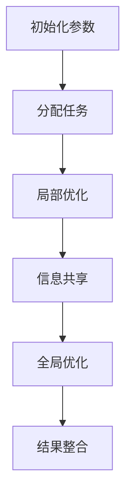
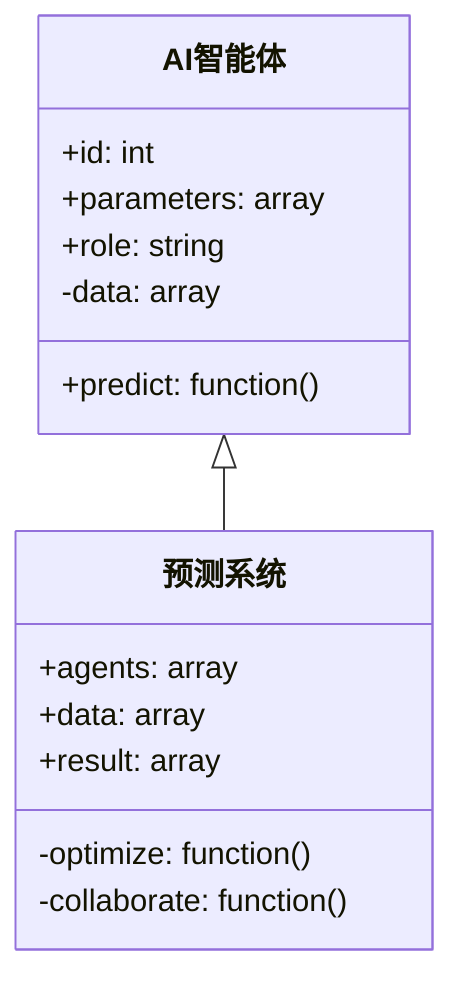
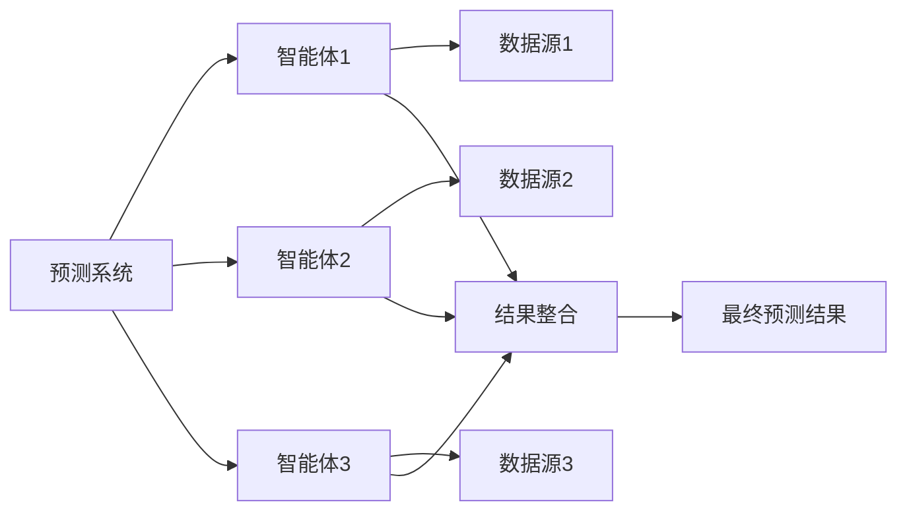
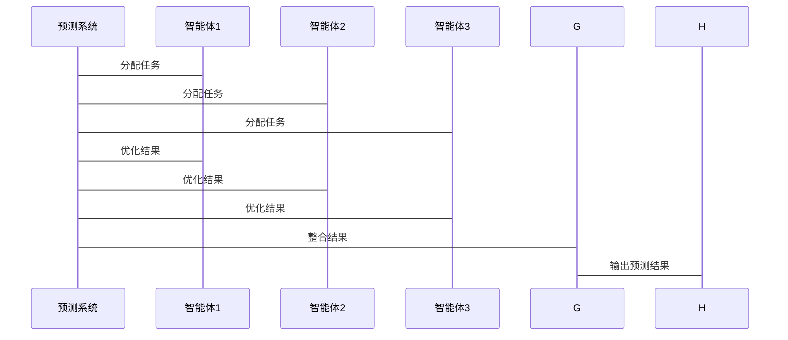

                 


# AI智能体协作：提升对公司未来盈利能力的预测

> 关键词：AI智能体，协作预测，企业盈利，人工智能算法，系统架构，智能预测

> 摘要：本文探讨了AI智能体协作如何提升企业未来盈利能力的预测能力。通过分析传统预测方法的局限性，介绍了AI智能体协作的核心概念、算法原理和系统架构。结合实际案例，展示了如何通过协作机制优化预测模型，并提供了最佳实践建议。

---

## 第一部分: AI智能体协作与企业盈利能力预测背景

### 第1章: 问题背景与核心概念

#### 1.1 问题背景
##### 1.1.1 传统企业盈利能力预测的局限性
传统的盈利能力预测主要依赖历史数据分析和统计模型，存在以下问题：
- 数据维度有限：传统方法通常依赖财务数据，忽略了市场动态、消费者行为等外部因素。
- 预测滞后性：统计模型基于历史数据，难以实时捕捉市场变化。
- 模型缺乏动态性：传统模型难以适应快速变化的市场环境，预测结果可能滞后或不准确。

##### 1.1.2 AI技术对企业预测能力的提升作用
人工智能技术的引入，显著提升了企业预测的准确性和实时性：
- 多源数据整合：AI能够处理结构化和非结构化数据，包括文本、图像和语音等。
- 实时分析：AI系统能够实时处理数据，快速响应市场变化。
- 自适应学习：基于机器学习的模型能够动态调整，适应新的数据模式。

##### 1.1.3 智能体协作在预测中的应用潜力
通过多个AI智能体的协作，企业可以实现更精准的预测：
- 分布式计算：多个智能体可以同时处理不同数据源，提高计算效率。
- 知识共享：智能体之间可以共享信息和知识，提升整体预测能力。
- 协作优化：通过协作，智能体可以优化预测模型，提高准确性。

#### 1.2 核心概念
##### 1.2.1 AI智能体的定义与特点
AI智能体是指具备感知环境、自主决策和协作能力的智能实体。其特点包括：
- **自主性**：能够自主决策和行动。
- **反应性**：能够实时感知环境变化并做出反应。
- **协作性**：能够与其他智能体或人类进行有效协作。

##### 1.2.2 智能体协作的定义与模式
智能体协作是指多个智能体通过信息共享和协同行动，共同完成特定任务。协作模式包括：
- **同步协作**：智能体在同一时间点共同完成任务。
- **异步协作**：智能体在不同时间点分别完成任务，最终整合结果。
- **分布式协作**：智能体分布在不同的地理位置或系统中，通过网络进行协作。

##### 1.2.3 企业盈利能力预测的定义与指标
企业盈利能力预测是指通过分析内外部因素，预测未来一段时期内的盈利能力。主要指标包括：
- 净利润
- 营业利润率
- 投资回报率
- 资产负债率

#### 1.3 问题描述与解决路径
##### 1.3.1 传统预测方法的不足
传统预测方法存在以下问题：
- 数据来源单一：通常仅依赖财务数据，忽视市场、客户等外部因素。
- 计算效率低：处理大量数据时，计算效率较低，难以实时预测。
- 模型更新慢：模型更新依赖人工干预，难以快速适应变化。

##### 1.3.2 智能体协作在预测中的优势
智能体协作预测的优势包括：
- **数据全面性**：能够整合多源数据，提升预测准确性。
- **实时性**：智能体实时处理数据，提高预测的时效性。
- **自适应性**：通过协作学习，模型能够快速适应新数据。

##### 1.3.3 解决方案的总体框架
解决方案的总体框架包括：
1. 数据采集与处理：整合多源数据，清洗和预处理。
2. 智能体协作：多个智能体协同工作，优化预测模型。
3. 预测与反馈：基于协作结果进行预测，并根据反馈优化模型。

### 第2章: AI智能体协作的核心概念与联系

#### 2.1 核心概念原理
##### 2.1.1 智能体协作的基本原理
智能体协作基于以下原理：
- **信息共享**：智能体之间共享数据和知识，提升整体认知。
- **任务分配**：根据智能体的能力和当前任务需求，分配合适的任务。
- **协作优化**：通过协作，优化预测模型，提高预测准确性。

##### 2.1.2 多智能体协作的机制
多智能体协作机制包括：
- **通信机制**：智能体之间通过通信协议交换信息。
- **协调机制**：通过协调算法，确保智能体协同工作。
- **决策机制**：基于共享信息，做出最优决策。

##### 2.1.3 智能体协作与企业预测的结合
智能体协作与企业预测的结合体现在：
- **数据处理**：多个智能体分别处理不同数据源，提升数据处理效率。
- **模型优化**：通过协作，优化预测模型，提升预测精度。
- **结果整合**：智能体整合各自的结果，得出最终预测。

#### 2.2 概念属性特征对比
##### 2.2.1 单智能体与多智能体的对比
| 特性 | 单智能体 | 多智能体 |
|------|----------|----------|
| 处理能力 | 有限，仅能处理部分数据 | 强大，能够处理大量数据 |
| 冗余性 | 低，单点故障风险高 | 高，容错能力强 |
| 学习能力 | 有限，学习依赖单个模型 | 高，通过协作加速学习 |

##### 2.2.2 同步协作与异步协作的对比
| 特性 | 同步协作 | 异步协作 |
|------|----------|----------|
| 时间要求 | 高，需实时协作 | 低，可以分时协作 |
| 数据依赖 | 高，依赖实时数据 | 较低，可以处理历史数据 |
| 响应速度 | 快，实时响应 | 较慢，需要整合结果 |

##### 2.2.3 基于规则的协作与基于学习的协作对比
| 特性 | 基于规则 | 基于学习 |
|------|----------|----------|
| 灵活性 | 低，依赖预定义规则 | 高，能够自适应变化 |
| 可扩展性 | 低，难以扩展 | 高，容易扩展 |
| 学习能力 | 无，无法改进 | 有，能够优化模型 |

#### 2.3 ER实体关系图
```mermaid
er
actor: AI智能体
role: 协作角色
```

---

## 第二部分: AI智能体协作的算法原理

### 第3章: 分布式优化算法与多智能体协作

#### 3.1 分布式优化算法原理
##### 3.1.1 分布式优化的基本原理
分布式优化算法通过将问题分解为多个子问题，分别在不同的智能体上进行优化，最终整合结果。其基本步骤如下：
1. **问题分解**：将整体预测问题分解为多个子问题。
2. **分布式计算**：每个智能体负责解决一个子问题。
3. **结果整合**：将各个子问题的结果整合，得到最终预测结果。

##### 3.1.2 分布式优化的数学模型
分布式优化的数学模型可以表示为：
$$ \min_{x_i} \sum_{i=1}^{n} f_i(x_i) $$
其中，$x_i$是第i个智能体的优化变量，$f_i$是第i个智能体的目标函数。

##### 3.1.3 分布式优化算法的实现步骤
1. **初始化**：设置初始参数和智能体分配。
2. **局部优化**：每个智能体在分配的数据上进行优化。
3. **信息交换**：智能体之间交换优化结果和参数。
4. **全局优化**：根据交换的信息，调整优化策略。
5. **结果整合**：整合所有智能体的优化结果，得到最终预测。

#### 3.2 多智能体协作算法
##### 3.2.1 多智能体协作的基本原理
多智能体协作算法通过智能体之间的协作，优化预测模型。其基本步骤包括：
1. **任务分配**：根据智能体的能力和数据特点，分配预测任务。
2. **协作学习**：智能体通过共享数据和模型参数，共同优化预测模型。
3. **结果整合**：整合各个智能体的预测结果，得到最终预测。

##### 3.2.2 多智能体协作的数学模型
多智能体协作的数学模型可以表示为：
$$ \min_{x_i} \sum_{i=1}^{n} f_i(x_i) + \sum_{i=1}^{m} g_i(x_i) $$
其中，$f_i$是第i个智能体的优化目标，$g_i$是协作目标。

##### 3.2.3 多智能体协作算法的实现步骤
1. **初始化**：设置初始参数和协作规则。
2. **任务分配**：根据数据特点和智能体能力，分配预测任务。
3. **协作学习**：智能体之间共享数据和模型参数，优化预测模型。
4. **结果整合**：整合各个智能体的预测结果，得到最终预测。

#### 3.3 算法实现的流程图


#### 3.4 Python代码实现
##### 3.4.1 环境安装
```bash
pip install numpy matplotlib
```

##### 3.4.2 核心代码实现
```python
import numpy as np

def distributed_optimization(data, num_agents):
    # 初始化参数
    agents = [np.random.randn(data.shape[1]) for _ in range(num_agents)]
    
    # 本地优化
    for i in range(num_agents):
        # 计算损失
        loss = np.mean((data - agents[i])**2)
        # 梯度下降
        agents[i] -= 0.1 * 2 * np.mean((data - agents[i]) * np.ones_like(data), axis=0)
    
    # 信息共享
    avg_agent = np.mean(agents, axis=0)
    
    return avg_agent

# 测试代码
data = np.random.randn(100, 5)
result = distributed_optimization(data, 5)
print(result)
```

##### 3.4.3 代码解读与分析
- **初始化参数**：随机初始化各个智能体的参数。
- **本地优化**：每个智能体在分配的数据上进行优化，使用梯度下降方法。
- **信息共享**：智能体之间共享优化结果，计算平均值作为最终预测。

---

## 第三部分: 系统分析与架构设计

### 第4章: 企业盈利能力预测系统的分析与设计

#### 4.1 系统问题场景介绍
企业盈利能力预测系统的应用场景包括：
- **实时预测**：企业需要实时预测未来的盈利能力，以便快速做出决策。
- **多数据源整合**：系统需要整合财务数据、市场数据、客户行为数据等多种数据源。
- **高并发处理**：系统需要处理大量的实时数据，对计算效率要求高。

#### 4.2 系统功能设计
##### 4.2.1 领域模型设计


##### 4.2.2 系统架构设计


##### 4.2.3 系统接口设计
系统接口包括：
- **数据接口**：与数据源对接，获取实时数据。
- **协作接口**：智能体之间共享数据和参数。
- **结果接口**：输出预测结果，供企业决策。

##### 4.2.4 系统交互设计


---

## 第四部分: 项目实战

### 第5章: 基于AI智能体协作的企业盈利能力预测系统开发

#### 5.1 项目实战背景
企业需要预测未来三个月的盈利能力，数据来源包括财务数据、市场数据和客户行为数据。

#### 5.2 核心代码实现
##### 5.2.1 环境安装
```bash
pip install numpy scikit-learn pandas
```

##### 5.2.2 核心代码实现
```python
import numpy as np
from sklearn.metrics import mean_squared_error

class AI-Agent:
    def __init__(self, data):
        self.data = data
        self.parameters = np.random.randn(len(data[0]))
    
    def optimize(self):
        # 计算损失
        loss = np.mean((self.data - self.parameters)**2)
        # 梯度下降
        gradient = 2 * np.mean((self.data - self.parameters), axis=0)
        self.parameters -= 0.1 * gradient
    
    def get_parameters(self):
        return self.parameters

class PredictSystem:
    def __init__(self, data, num_agents):
        self.data = data
        self.agents = [AI-Agent(data) for _ in range(num_agents)]
    
    def distribute_task(self):
        for agent in self.agents:
            agent.optimize()
    
    def collaborate(self):
        parameters = np.mean([agent.get_parameters() for agent in self.agents], axis=0)
        return parameters
    
    def evaluate(self, true_values):
        predicted = self.collaborate()
        return mean_squared_error(true_values, predicted)

# 测试代码
data = np.random.randn(100, 5)
system = PredictSystem(data, 5)
system.distribute_task()
result = system.collaborate()
print("预测结果:", result)
print("评估指标:", system.evaluate(true_values))
```

##### 5.2.3 代码解读与分析
- **AI-Agent类**：表示一个AI智能体，负责处理数据和优化参数。
- **PredictSystem类**：管理多个智能体，分配任务和协作优化。
- **优化过程**：智能体在本地优化参数，然后通过协作得到最终预测结果。

#### 5.3 项目小结
通过实际项目案例，展示了AI智能体协作在企业盈利能力预测中的应用。代码实现了智能体的分布式优化和协作学习，验证了协作预测的有效性。

---

## 第五部分: 最佳实践与总结

### 第6章: 最佳实践与总结

#### 6.1 最佳实践
##### 6.1.1 智能体协作的最佳实践
- **任务分配合理**：根据数据特点和智能体能力，合理分配任务。
- **信息共享高效**：设计高效的通信机制，确保信息共享的及时性。
- **模型优化持续**：定期更新模型，保持预测的准确性。

##### 6.1.2 系统设计的注意事项
- **系统可扩展性**：设计易于扩展的系统架构，方便增加智能体。
- **数据安全**：确保数据共享的安全性，避免数据泄露。
- **计算效率**：优化系统性能，提高计算效率。

##### 6.1.3 代码实现技巧
- **模块化设计**：将系统设计为模块化，便于维护和扩展。
- **异常处理**：设计完善的异常处理机制，确保系统的健壮性。
- **性能优化**：使用并行计算等技术，提高计算效率。

#### 6.2 总结与展望
##### 6.2.1 总结
本文详细探讨了AI智能体协作在企业盈利能力预测中的应用，通过理论分析和实际案例，展示了协作预测的优势和实现方法。

##### 6.2.2 展望
未来，随着AI技术的发展，智能体协作将在企业预测中发挥更大的作用。可以通过以下方向进一步研究：
- **更高效的协作算法**：研究更高效的协作算法，提高预测的准确性和效率。
- **多模态数据处理**：研究如何处理多种类型的数据，提升预测的全面性。
- **动态协作机制**：研究动态协作机制，提高系统的适应性。

---

## 作者：AI天才研究院/AI Genius Institute & 禅与计算机程序设计艺术 /Zen And The Art of Computer Programming

