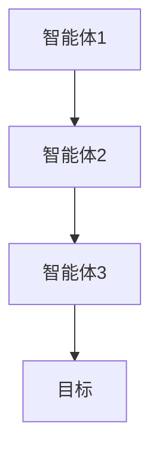
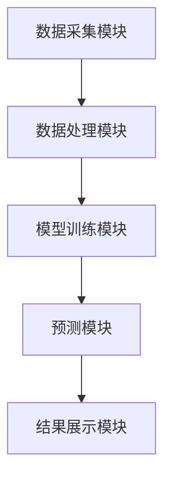

                 


# AI智能体协作：提升对公司未来竞争力的预测

> 关键词：AI智能体、协作预测、企业竞争力、系统架构、算法原理  
> 摘要：本文探讨了AI智能体协作在企业竞争力预测中的应用，分析了其核心概念、算法原理、系统架构，并通过实际案例展示了如何通过AI智能体协作提升企业竞争力预测的准确性和效率。

---

## 第一部分: AI智能体协作的背景与概念

### 第1章: AI智能体协作的背景与问题背景

#### 1.1 问题背景

企业竞争环境日益复杂，市场变化迅速，企业需要准确预测未来竞争力以制定有效的战略。传统的预测方法依赖历史数据分析，但存在以下问题：

- 数据维度单一：难以捕捉多因素的复杂关系。
- 预测模型简单：难以处理非线性关系和复杂场景。
- 预测结果准确性低：难以应对市场的不确定性。

AI智能体协作通过多智能体协同工作，结合实时数据和复杂模型，提供更准确的预测。

#### 1.2 问题描述

企业未来竞争力预测涉及多个因素，包括市场趋势、竞争对手行为、内部资源分配等。传统的预测方法依赖统计分析，而AI智能体协作通过多智能体协同，能够更好地捕捉复杂关系，提供动态预测。

#### 1.3 问题解决

AI智能体协作通过以下方式解决预测问题：

- **数据采集与处理**：多智能体协同采集和处理多源数据。
- **模型训练与优化**：通过协作优化预测模型，提高准确性。
- **实时预测与反馈**：动态调整预测模型，应对变化。

---

## 第二部分: AI智能体协作的核心概念与联系

### 第2章: AI智能体协作的核心概念

#### 2.1 AI智能体的定义与特点

AI智能体是具备感知、决策和行动能力的实体，具有以下特点：

- **自主性**：能够自主决策。
- **协作性**：能够与其他智能体协作。
- **适应性**：能够适应环境变化。

#### 2.2 AI智能体协作的原理

协作过程包括数据共享、任务分配和结果整合，确保各智能体协同工作，提高预测准确性。

#### 2.3 AI智能体协作的属性对比

| 属性         | 传统预测方法 | AI智能体协作 |
|--------------|---------------|--------------|
| 数据来源     | 单一          | 多源         |
| 计算能力     | 有限          | 强大         |
| 预测精度     | 较低          | 较高         |

#### 2.4 实体关系图



---

## 第三部分: AI智能体协作的算法原理

### 第3章: AI智能体协作的算法原理

#### 3.1 预测模型的数学公式

$$ P(y|x) = \frac{P(x|y)P(y)}{P(x)} $$

#### 3.2 训练过程的数学公式

$$ \theta = \arg\max_{\theta} \sum_{i=1}^{n} \log P(\theta|x_i,y_i) $$

#### 3.3 Python代码示例

```python
import numpy as np
from sklearn.metrics import accuracy_score

def predict Competitiveness(X, model):
    return model.predict(X)

def main():
    # 数据处理
    X_train, y_train, X_test = preprocess_data()
    # 模型训练
    model = train_model(X_train, y_train)
    # 预测
    y_pred = predict Competitiveness(X_test, model)
    # 评估
    print(f"Accuracy: {accuracy_score(y_test, y_pred)}")

if __name__ == "__main__":
    main()
```

---

## 第四部分: 系统分析与架构设计方案

### 第4章: 系统分析与架构设计方案

#### 4.1 项目场景介绍

系统需要实时采集市场数据，训练预测模型，并动态调整预测结果。

#### 4.2 系统功能设计

- **数据采集模块**：实时采集多源数据。
- **模型训练模块**：训练预测模型。
- **预测模块**：动态预测企业竞争力。

#### 4.3 系统架构图



---

## 第五部分: 项目实战

### 第5章: 项目实战

#### 5.1 环境安装

```bash
pip install numpy scikit-learn
```

#### 5.2 核心代码实现

```python
import numpy as np
from sklearn.ensemble import RandomForestClassifier

def preprocess_data():
    # 数据预处理
    return X_train, y_train, X_test

def train_model(X_train, y_train):
    model = RandomForestClassifier()
    model.fit(X_train, y_train)
    return model

def predict_competitiveness(X_test, model):
    return model.predict(X_test)

if __name__ == "__main__":
    X_train, y_train, X_test = preprocess_data()
    model = train_model(X_train, y_train)
    y_pred = predict_competitiveness(X_test, model)
    print("Predictions:", y_pred)
```

---

## 第六部分: 最佳实践

### 第6章: 最佳实践

#### 6.1 小结

AI智能体协作通过多智能体协同，提高预测准确性，帮助企业制定有效战略。

#### 6.2 注意事项

- 数据隐私保护
- 系统可扩展性设计
- 模型实时更新

#### 6.3 拓展阅读

推荐学习分布式系统和强化学习，进一步提升AI智能体协作能力。

---

## 作者信息

作者：AI天才研究院/AI Genius Institute & 禅与计算机程序设计艺术 /Zen And The Art of Computer Programming

