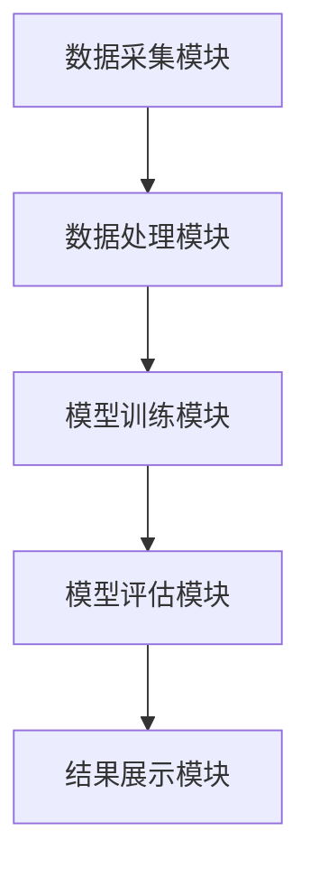
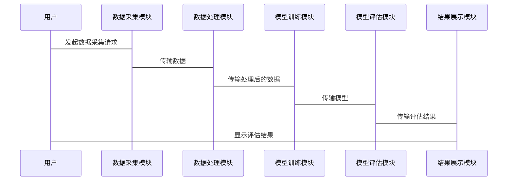

                 


# AI智能体协作：提升对公司财务健康状况的评估

> 关键词：AI智能体协作，财务健康评估，算法原理，系统架构设计，项目实战，最佳实践

> 摘要：本文将探讨如何利用AI智能体协作技术提升对公司财务健康状况的评估。通过详细分析AI智能体协作的核心概念、算法原理、系统架构设计、项目实战以及最佳实践，本文旨在为技术与财务领域的专业人士提供一份全面的指导，帮助他们更好地理解和应用这一技术。

---

# 第1章: AI智能体协作与财务健康评估的背景

## 1.1 问题背景

### 1.1.1 传统财务健康评估的局限性
传统财务健康评估主要依赖于人工分析和经验判断，这种方法存在以下问题：
- 数据量大、维度多，人工分析效率低。
- 容易受到主观因素影响，结果可能存在偏差。
- 需要持续更新和调整模型，维护成本高。

### 1.1.2 AI技术在财务分析中的潜力
AI技术的引入为财务健康评估带来了新的可能性：
- 高效处理大规模数据，提升分析效率。
- 通过机器学习算法发现潜在的财务风险和机会。
- 实现实时监控和预测，帮助企业做出更及时的决策。

### 1.1.3 智能体协作在财务评估中的优势
智能体协作通过多个AI智能体的协同工作，进一步提升了财务健康评估的准确性：
- 每个智能体专注于不同的任务，提高整体效率。
- 多智能体协作能够从多个角度分析数据，降低单点失效风险。
- 支持动态调整和优化，适应复杂多变的财务环境。

## 1.2 问题描述

### 1.2.1 财务健康评估的核心挑战
财务健康评估涉及多个维度，包括盈利能力、偿债能力、运营能力等。传统方法在以下方面存在挑战：
- 数据的实时性与准确性难以保证。
- 财务指标之间的关联性复杂，难以全面分析。
- 风险预测的准确性和及时性不足。

### 1.2.2 AI智能体协作在财务分析中的具体问题
AI智能体协作在财务分析中的应用还面临以下问题：
- 多个智能体之间的协作机制需要优化。
- 数据共享与隐私保护之间的平衡问题。
- 智能体的自适应能力需要进一步提升。

### 1.2.3 解决策略
通过引入AI智能体协作技术，可以有效解决上述问题：
- 利用分布式计算和协作算法提高数据处理效率。
- 通过模块化设计实现智能体之间的高效协作。
- 建立动态调整机制，确保智能体能够适应复杂变化的财务环境。

## 1.3 问题解决

### 1.3.1 AI智能体协作的基本原理
AI智能体协作是一种通过多个智能体协同工作来完成复杂任务的技术。每个智能体负责不同的子任务，通过通信和协作机制实现整体目标。

### 1.3.2 智能体协作在财务评估中的具体应用
智能体协作可以应用于财务数据的采集、清洗、分析和预测等多个环节。例如：
- 智能体A负责采集实时财务数据。
- 智能体B负责数据清洗和预处理。
- 智能体C负责建立预测模型并输出结果。

### 1.3.3 解决方案的可行性分析
通过模块化设计和分布式计算，AI智能体协作在财务评估中的应用具有以下优势：
- 提高数据处理效率。
- 降低单点故障风险。
- 实现动态调整和优化。

## 1.4 边界与外延

### 1.4.1 财务健康评估的边界条件
财务健康评估的边界条件包括：
- 数据范围：仅限于财务相关数据。
- 时间范围：实时或定期评估。
- 评估目标：仅用于内部管理决策。

### 1.4.2 智能体协作的适用范围
智能体协作适用于以下场景：
- 需要处理大规模、多维度数据的任务。
- 需要实时监控和预测的任务。
- 需要分布式计算和协作的任务。

### 1.4.3 与其他技术的对比与区别
与其他技术相比，智能体协作的优势在于：
- 高度的模块化和可扩展性。
- 支持动态协作和自适应调整。
- 能够处理复杂多变的任务。

## 1.5 核心要素组成

### 1.5.1 智能体协作的关键要素
智能体协作的关键要素包括：
- 智能体：负责具体任务的执行。
- 协作机制：智能体之间通信和协作的方式。
- 管理机制：对智能体的协调和控制。

### 1.5.2 财务健康评估的核心指标
财务健康评估的核心指标包括：
- 利润能力：如净利润率、毛利率。
- 偿债能力：如资产负债率、流动比率。
- 运营能力：如存货周转率、应收账款周转率。

### 1.5.3 两者结合的逻辑关系
智能体协作通过分工合作，分别对不同的财务指标进行分析和预测，最终实现对整体财务健康状况的评估。

---

# 第2章: 核心概念与联系

## 2.1 核心概念原理

### 2.1.1 AI智能体协作的基本原理
AI智能体协作的基本原理是通过多个智能体协同工作，完成复杂任务。每个智能体负责不同的子任务，并通过通信机制实现协作。

### 2.1.2 财务健康评估的数学模型
财务健康评估的数学模型可以表示为：
$$
F = f(x_1, x_2, ..., x_n)
$$
其中，$F$ 表示财务健康状况，$x_i$ 表示各个财务指标。

### 2.1.3 智能体协作在财务分析中的具体应用
智能体协作在财务分析中的具体应用包括：
- 数据采集：智能体A负责从不同数据源采集财务数据。
- 数据清洗：智能体B负责对数据进行预处理。
- 数据分析：智能体C负责建立预测模型并输出结果。

## 2.2 核心概念对比表

### 2.2.1 AI智能体协作与传统财务分析的对比
| 特性                | AI智能体协作          | 传统财务分析        |
|---------------------|----------------------|--------------------|
| 数据处理能力        | 强大                | 较弱               |
| 分析效率            | 高                  | 低                |
| 精度                | 高                  | 中等               |
| 适应性              | 强                  | 较弱               |

### 2.2.2 不同智能体协作方法的优缺点对比
| 方法                | 优点                | 缺点               |
|---------------------|----------------------|--------------------|
| 基于规则的协作      | 简单易实现          | 缺乏灵活性          |
| 基于学习的协作      | 高度灵活            | 实现复杂           |
| 混合协作方法        | 结合了规则和学习的优势 | 实现难度大         |

### 2.2.3 财务健康评估指标的对比分析
| 指标                | 利润能力            | 偿债能力            | 运营能力            |
|---------------------|----------------------|--------------------|--------------------|
| 重要性              | 高                  | 高                | 中等               |
| 数据来源            | 利润表              | 资产负债表          | 运营报表            |

## 2.3 ER实体关系图

```mermaid
erd
    customer[客户]
    order[订单]
    product[产品]
    customer -[1..n]-> order: places
    order -[1]-> product: includes
    product -[m..n]-> order: contains
```

---

# 第3章: 算法原理讲解

## 3.1 数据预处理

### 3.1.1 数据清洗
数据清洗是AI智能体协作的第一步，主要包括：
- 删除重复数据。
- 处理缺失值。
- 标准化数据格式。

### 3.1.2 数据分拆
数据分拆是将数据分成训练集和测试集，通常采用70/30分法。

### 3.1.3 数据增强
数据增强是通过增加数据的多样性来提高模型的泛化能力，例如：
- 添加噪声数据。
- 数据归一化。

## 3.2 模型训练

### 3.2.1 模型选择
根据任务需求选择合适的模型，例如：
- 线性回归：适用于简单预测。
- 支持向量机：适用于分类任务。
- 神经网络：适用于复杂任务。

### 3.2.2 模型训练
通过训练数据对模型进行训练，调整模型参数，使其能够准确预测财务健康状况。

### 3.2.3 模型评估
通过测试数据对模型进行评估，计算准确率、召回率等指标，确保模型性能。

## 3.3 模型优化

### 3.3.1 参数调优
通过调整模型参数，例如学习率、正则化系数等，优化模型性能。

### 3.3.2 模型集成
通过集成多个模型的预测结果，例如投票法、加权法，提高模型的准确性和稳定性。

### 3.3.3 模型部署
将训练好的模型部署到生产环境中，实时处理财务数据，输出评估结果。

## 3.4 实际案例分析

### 3.4.1 案例背景
某公司希望通过AI智能体协作技术，对其客户的财务健康状况进行评估。

### 3.4.2 数据准备
从公司数据库中提取客户的财务数据，包括收入、利润、负债等指标。

### 3.4.3 模型训练
选择合适的机器学习算法，训练模型并进行评估。

### 3.4.4 模型优化
根据评估结果，调整模型参数，优化模型性能。

### 3.4.5 结果分析
通过模型预测结果，识别潜在的财务风险，制定相应的应对策略。

---

# 第4章: 系统架构设计

## 4.1 问题场景介绍

### 4.1.1 系统目标
通过AI智能体协作技术，实现对公司财务健康状况的实时评估。

### 4.1.2 系统需求
- 实时采集财务数据。
- 高效处理大规模数据。
- 准确预测财务健康状况。

## 4.2 系统功能设计

### 4.2.1 功能模块
- 数据采集模块：负责从不同数据源采集财务数据。
- 数据处理模块：负责数据清洗、转换和增强。
- 模型训练模块：负责建立和训练预测模型。
- 模型评估模块：负责评估模型性能并优化模型。
- 结果展示模块：负责展示评估结果。

### 4.2.2 功能流程
1. 数据采集模块从数据库、财务报表等数据源采集财务数据。
2. 数据处理模块对数据进行清洗、转换和增强。
3. 模型训练模块选择合适的算法，训练预测模型。
4. 模型评估模块对模型进行评估，并进行参数调优。
5. 结果展示模块将评估结果展示给用户。

## 4.3 系统架构设计

### 4.3.1 系统架构图


### 4.3.2 系统交互流程图


### 4.3.3 接口设计
- 数据采集接口：用于从数据库、API等数据源采集数据。
- 数据处理接口：用于对数据进行清洗、转换和增强。
- 模型训练接口：用于选择和训练模型。
- 模型评估接口：用于评估模型性能并优化模型。
- 结果展示接口：用于展示评估结果。

---

# 第5章: 项目实战

## 5.1 环境安装

### 5.1.1 安装Python
```bash
python --version
pip install --upgrade pip
```

### 5.1.2 安装依赖库
```bash
pip install numpy pandas scikit-learn
```

## 5.2 系统核心实现

### 5.2.1 数据采集模块
```python
import pandas as pd

def fetch_data():
    # 从数据库或API采集数据
    data = pd.read_csv('financial_data.csv')
    return data
```

### 5.2.2 数据处理模块
```python
def preprocess_data(data):
    # 删除重复数据
    data = data.drop_duplicates()
    # 处理缺失值
    data = data.dropna()
    # 标准化数据格式
    data['revenue'] = data['revenue'].astype(float)
    return data
```

### 5.2.3 模型训练模块
```python
from sklearn.linear_model import LinearRegression

def train_model(data):
    # 划分训练集和测试集
    X_train, X_test, y_train, y_test = train_test_split(data.drop('profit', axis=1), data['profit'], test_size=0.3)
    # 训练模型
    model = LinearRegression()
    model.fit(X_train, y_train)
    return model
```

### 5.2.4 模型评估模块
```python
from sklearn.metrics import r2_score

def evaluate_model(model, X_test, y_test):
    # 预测结果
    y_pred = model.predict(X_test)
    # 计算R²分数
    score = r2_score(y_test, y_pred)
    return score
```

## 5.3 代码应用解读

### 5.3.1 数据采集模块
数据采集模块从CSV文件中读取财务数据，返回处理后的数据集。

### 5.3.2 数据处理模块
数据处理模块对采集到的数据进行清洗和标准化处理，确保数据质量。

### 5.3.3 模型训练模块
模型训练模块使用线性回归算法对数据进行训练，建立预测模型。

### 5.3.4 模型评估模块
模型评估模块对训练好的模型进行评估，计算R²分数，评估模型性能。

## 5.4 案例分析

### 5.4.1 案例背景
某公司希望通过AI智能体协作技术，对其客户的财务健康状况进行评估。

### 5.4.2 数据准备
从公司数据库中提取客户的财务数据，包括收入、利润、负债等指标。

### 5.4.3 模型训练
选择合适的机器学习算法，训练模型并进行评估。

### 5.4.4 模型优化
根据评估结果，调整模型参数，优化模型性能。

### 5.4.5 结果分析
通过模型预测结果，识别潜在的财务风险，制定相应的应对策略。

---

# 第6章: 最佳实践与小结

## 6.1 最佳实践

### 6.1.1 数据质量的重要性
确保数据的准确性和完整性是AI智能体协作成功的关键。

### 6.1.2 模型调优的技巧
通过交叉验证和网格搜索等方法，找到最佳模型参数。

### 6.1.3 智能体协作的优化策略
- 合理分配任务，避免负载不均。
- 建立高效的通信机制，减少信息传递延迟。
- 定期监控和调整协作策略，确保系统稳定运行。

## 6.2 小结

通过本文的详细讲解，我们可以看到AI智能体协作在财务健康评估中的巨大潜力。从数据预处理到模型训练，再到系统架构设计，每一步都需要精心设计和优化。通过实际案例分析和项目实战，我们可以更好地理解和应用这一技术。

## 6.3 注意事项

### 6.3.1 数据隐私保护
在实际应用中，需要注意数据隐私保护，避免数据泄露和滥用。

### 6.3.2 模型泛化能力
模型的泛化能力直接影响预测的准确性，需要通过交叉验证等方法进行评估。

### 6.3.3 系统可扩展性
随着数据量的增加，系统需要具备良好的可扩展性，确保能够适应未来的需求。

## 6.4 拓展阅读

### 6.4.1 推荐书籍
- 《机器学习实战》
- 《分布式系统：概念与设计》

### 6.4.2 推荐博客
- Towards Data Science
- Medium的AI与机器学习专栏

---

# 作者：AI天才研究院 & 禅与计算机程序设计艺术

