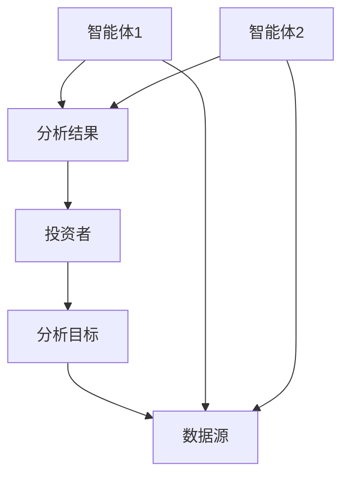
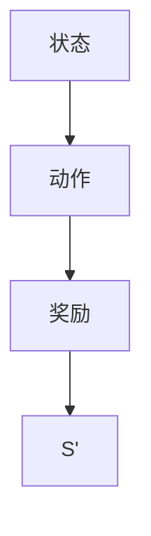
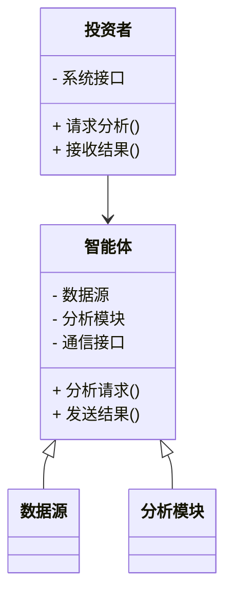
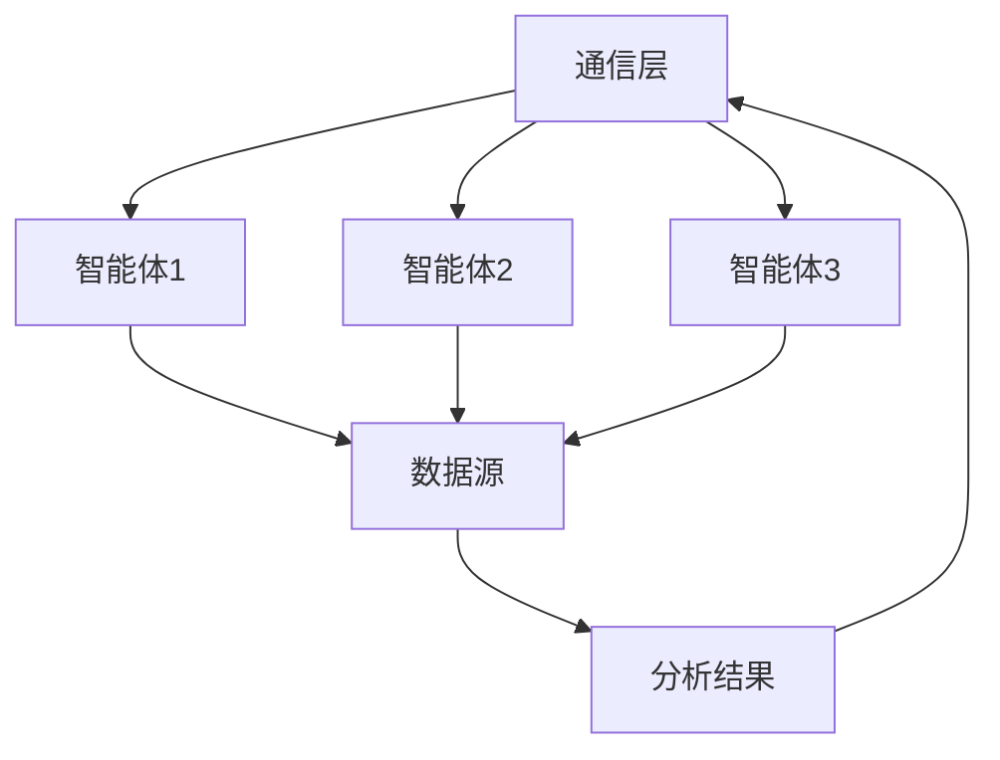
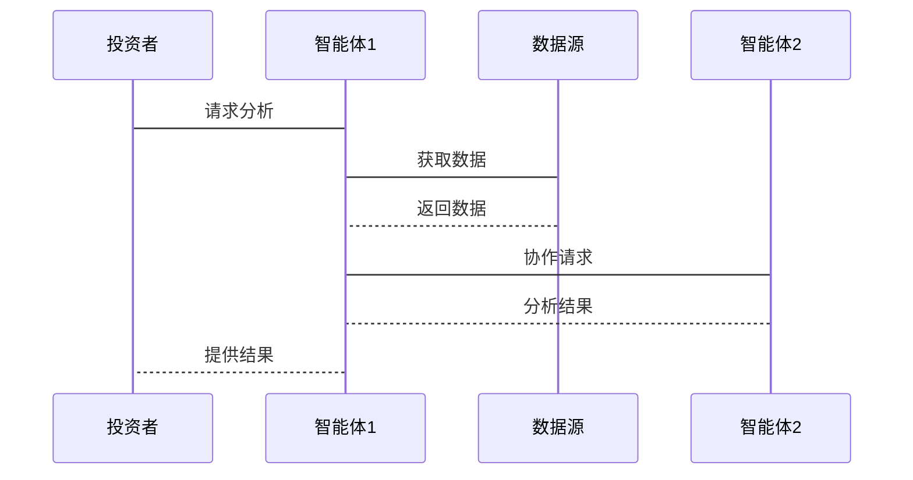

                 


# AI智能体协作：提升巴菲特的企业分析方法

## 关键词：AI智能体协作、巴菲特投资方法、企业分析、强化学习、多智能体系统、Python实现

## 摘要：本文探讨如何利用AI智能体协作技术提升巴菲特的经典企业分析方法。通过分析传统方法的局限性，结合AI技术，提出创新的企业分析模型，详细介绍AI智能体协作的算法原理、系统架构，并通过实际案例展示如何实现和应用。文章还提供代码示例和项目实战指导，帮助读者理解如何将AI技术融入投资分析中。

---

# 1. 背景介绍

## 1.1 问题背景与描述

### 1.1.1 传统企业分析方法的局限性
传统企业分析方法依赖于财务指标和市场数据，但这些方法在处理复杂市场动态时显得不足。巴菲特的投资方法强调长期价值和竞争优势，但手动分析耗时且难以量化。

### 1.1.2 巴菲特投资理念的核心要素
巴菲特的策略包括寻找具有持续竞争优势的公司，评估管理层能力和财务健康状况，以及关注市场情绪。这些要素需要综合分析，但传统方法难以高效整合。

### 1.1.3 AI智能体协作的引入动机
AI技术，特别是多智能体协作，能够处理大量数据，识别复杂模式，提升分析速度和准确性，符合现代投资分析的需求。

## 1.2 问题解决与边界

### 1.2.1 AI智能体协作如何提升企业分析效率
AI智能体协作通过分布式计算和协作学习，提升数据处理能力，帮助投资者快速识别潜在投资机会。

### 1.2.2 问题解决的边界与外延
本文专注于企业基本面分析和市场情绪分析，不涉及技术分析或其他投资策略。

### 1.2.3 核心概念的结构与组成
AI智能体协作系统由多个智能体组成，每个负责特定任务，通过通信协议协作完成复杂分析任务。

---

# 2. 核心概念与联系

## 2.1 AI智能体协作的核心原理

### 2.1.1 多智能体协作的基本概念
多智能体系统由多个智能体组成，每个智能体负责特定任务，通过通信协作完成整体目标。

### 2.1.2 AI智能体在企业分析中的角色
AI智能体可执行数据收集、模式识别和决策支持等任务，提升分析效率和准确性。

## 2.2 核心概念的属性对比

### 2.2.1 AI智能体与传统分析工具的对比表格
| 特性         | 传统分析工具       | AI智能体协作     |
|--------------|--------------------|------------------|
| 数据处理     | 单一、有限         | 分布式、高效     |
| 模式识别     | 低效、耗时         | 高效、精准       |
| 决策支持     | 基于规则           | 基于学习         |

### 2.2.2 实体关系图的Mermaid流程图


---

# 3. 算法原理讲解

## 3.1 多智能体协作算法

### 3.1.1 强化学习算法的Mermaid流程图


### 3.1.2 算法原理的数学模型与公式
目标函数：$$ J = \sum_{t} \gamma^t R_t $$
其中，γ是折扣因子，R_t是第t步的奖励。

### 3.1.3 实际案例的详细讲解与举例说明
通过Python代码实现强化学习，训练智能体识别财务指标中的异常情况。

---

# 4. 系统分析与架构设计

## 4.1 问题场景介绍

### 4.1.1 巴菲特投资分析的典型场景
分析公司财务报表和市场情绪，识别投资机会。

## 4.2 系统功能设计

### 4.2.1 领域模型的Mermaid类图


## 4.3 系统架构设计

### 4.3.1 系统架构的Mermaid架构图


## 4.4 系统接口与交互设计

### 4.4.1 系统接口设计
定义智能体之间的通信接口，包括请求和响应格式。

### 4.4.2 系统交互的Mermaid序列图


---

# 5. 项目实战

## 5.1 环境安装与配置

### 5.1.1 开发环境的搭建
安装Python、TensorFlow和Keras库。

## 5.2 核心代码实现

### 5.2.1 AI智能体协作算法的Python源代码
```python
import numpy as np
import tensorflow as tf

class Agent:
    def __init__(self, state_space, action_space):
        self.model = self.build_model(state_space, action_space)
    
    def build_model(self, state_space, action_space):
        model = tf.keras.Sequential([
            tf.keras.layers.Dense(64, activation='relu', input_dim=state_space),
            tf.keras.layers.Dense(action_space, activation='linear')
        ])
        model.compile(optimizer='adam', loss='mse')
        return model

    def act(self, state):
        return self.model.predict(np.array([state]))[0]
```

### 5.2.2 代码的功能解读与分析
该代码定义了一个AI智能体，使用神经网络模型进行决策，适用于企业分析任务。

## 5.3 实际案例分析

### 5.3.1 案例分析与详细讲解
通过代码实现对企业财务数据的分析，识别潜在投资机会。

---

# 6. 最佳实践与小结

## 6.1 小结

### 6.1.1 核心内容回顾
AI智能体协作提升巴菲特分析方法的效率和准确性。

## 6.2 注意事项与未来展望

### 6.2.1 实际应用中的注意事项
确保数据质量和模型的持续优化。

### 6.2.2 未来的研究方向
探索更多AI技术在投资分析中的应用。

## 6.3 拓展阅读

### 6.3.1 推荐书籍和资料
推荐学习强化学习和多智能体协作的书籍。

---

# 作者：AI天才研究院 & 禅与计算机程序设计艺术

