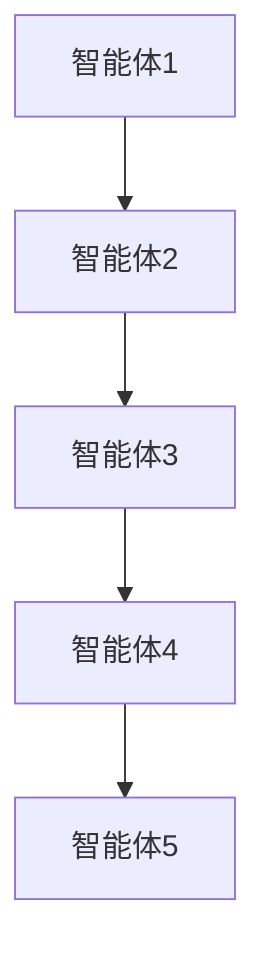
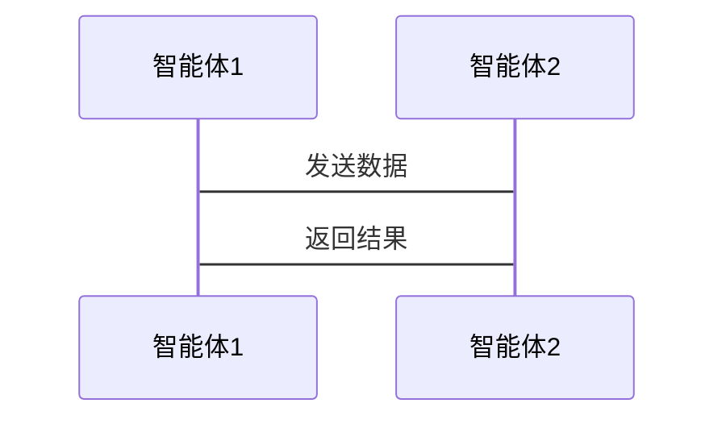

                 


# AI智能体协作：提升长期价值预测的准确性

---

## 关键词  
AI智能体协作, 价值预测, 预测算法, 协作机制, 系统架构  

---

## 摘要  
AI智能体协作是指多个智能体通过协同工作来提升预测准确性的一种方法。本文从理论基础、算法原理、系统设计到实际应用，详细探讨了AI智能体协作在长期价值预测中的应用，重点分析了协作机制、算法优化和系统架构设计，通过实际案例展示了协作智能体在提升预测准确性方面的巨大潜力。  

---

## 目录  

1. [背景介绍](#背景介绍)  
   1.1 [AI智能体协作的基本概念](#ai智能体协作的基本概念)  
   1.2 [问题背景与目标](#问题背景与目标)  
2. [智能体协作的核心概念](#智能体协作的核心概念)  
   2.1 [智能体的定义与分类](#智能体的定义与分类)  
   2.2 [协作机制与模型](#协作机制与模型)  
3. [价值预测的理论基础](#价值预测的理论基础)  
   3.1 [预测的基本概念](#预测的基本概念)  
   3.2 [智能体协作与预测的关系](#智能体协作与预测的关系)  
4. [协作算法原理](#协作算法原理)  
   4.1 [算法概述](#算法概述)  
   4.2 [算法实现步骤](#算法实现步骤)  
   4.3 [算法的数学模型](#算法的数学模型)  
5. [系统设计与架构](#系统设计与架构)  
   5.1 [系统设计概述](#系统设计概述)  
   5.2 [系统架构设计](#系统架构设计)  
   5.3 [接口设计与交互流程](#接口设计与交互流程)  
6. [项目实战](#项目实战)  
   6.1 [项目背景与目标](#项目背景与目标)  
   6.2 [环境配置与数据准备](#环境配置与数据准备)  
   6.3 [核心代码实现](#核心代码实现)  
   6.4 [结果分析与优化](#结果分析与优化)  
7. [总结与展望](#总结与展望)  
   7.1 [总结](#总结)  
   7.2 [未来展望](#未来展望)  
   7.3 [最佳实践与注意事项](#最佳实践与注意事项)  

---

## 正文  

### 第1章 背景介绍  

#### 1.1 AI智能体协作的基本概念  
AI智能体（AI Agent）是指具有感知环境、自主决策和执行任务能力的智能实体。协作智能体是指多个智能体通过协同工作，共同完成复杂任务的能力。  

#### 1.2 问题背景与目标  
长期价值预测的准确性受多种因素影响，如数据噪声、模型偏差等。通过协作智能体的分布式计算和知识共享，可以有效提升预测的准确性和鲁棒性。  

---

### 第2章 智能体协作的核心概念  

#### 2.1 智能体的定义与分类  
智能体可以分为简单智能体和复杂智能体。协作智能体通常由多个简单智能体组成，通过分工合作实现复杂任务。  

#### 2.2 协作机制与模型  
协作机制包括基于博弈论的协作模型和分布式协作框架。通过明确的协作规则和通信协议，智能体能够高效协同工作。  

---

### 第3章 价值预测的理论基础  

#### 3.1 预测的基本概念  
价值预测是指基于历史数据和模型，对未来某一事件或变量的价值进行估计。  

#### 3.2 智能体协作与预测的关系  
协作智能体能够通过信息共享和分布式计算，有效降低预测误差，提升预测的准确性和可靠性。  

---

### 第4章 协作算法原理  

#### 4.1 算法概述  
协作算法通过分布式计算和知识共享，提升预测的准确性。  

#### 4.2 算法实现步骤  
1. 数据预处理：清洗和特征提取。  
2. 智能体初始化：分配任务和初始参数。  
3. 协作过程：迭代优化和知识共享。  
4. 结果评估：计算预测误差并优化模型。  

#### 4.3 算法的数学模型  
协作算法的数学模型如下：  
$$\text{预测值} = \sum_{i=1}^{n} \text{智能体}_i \times \text{权重}_i$$  

---

### 第5章 系统设计与架构  

#### 5.1 系统设计概述  
系统由多个智能体组成，通过通信模块实现信息共享和协同计算。  

#### 5.2 系统架构设计  


#### 5.3 接口设计与交互流程  


---

### 第6章 项目实战  

#### 6.1 项目背景与目标  
以股票价格预测为例，展示协作智能体的应用。  

#### 6.2 环境配置与数据准备  
安装Python、机器学习库（如scikit-learn）。数据包括历史股价和市场指标。  

#### 6.3 核心代码实现  
```python  
import numpy as np  
from sklearn.linear_model import LinearRegression  

class Agent:  
    def __init__(self, data):  
        self.data = data  
        self.model = LinearRegression()  
        
    def train(self):  
        self.model.fit(self.data[:-1], self.data[1:])  
        
    def predict(self):  
        return self.model.predict(self.data[-1:])  

agents = [Agent(data1), Agent(data2), Agent(data3)]  
for agent in agents:  
    agent.train()  
    print(agent.predict())  
```  

#### 6.4 结果分析与优化  
通过对比不同智能体的预测结果，优化协作机制和算法参数。  

---

### 第7章 总结与展望  

#### 7.1 总结  
协作智能体通过分布式计算和信息共享，显著提升了长期价值预测的准确性。  

#### 7.2 未来展望  
未来可以研究更复杂的协作机制和优化算法，进一步提升预测的准确性和效率。  

#### 7.3 最佳实践与注意事项  
在实际应用中，需注意数据质量、智能体协作效率和算法的可扩展性。  

---

## 作者：AI天才研究院/AI Genius Institute & 禅与计算机程序设计艺术 /Zen And The Art of Computer Programming

