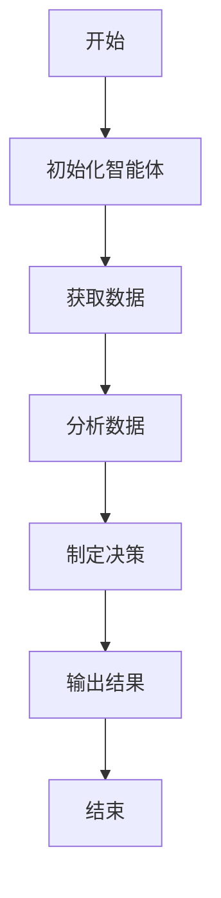
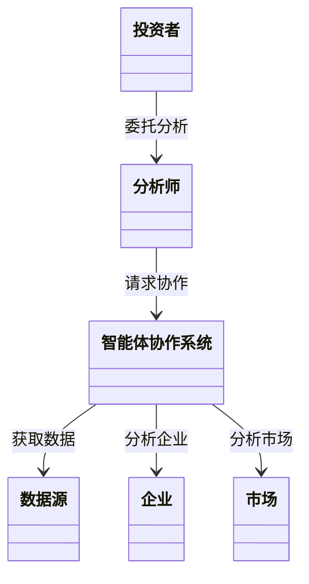

                 


# AI智能体协作：改进价值投资的产业链分析方法

> 关键词：AI智能体协作，价值投资，产业链分析，多智能体协作，强化学习，图神经网络，投资组合优化

> 摘要：本文探讨了AI智能体协作在价值投资产业链分析中的应用，详细介绍了AI智能体协作的核心概念、算法原理、系统架构及项目实战。通过多智能体协作的机制，优化投资决策过程，提高投资分析的准确性和效率。

---

## 第1章 AI智能体协作与价值投资概述

### 1.1 问题背景与问题描述

#### 1.1.1 传统价值投资的局限性
传统价值投资依赖于人工分析和经验判断，存在以下问题：
- **信息处理能力有限**：人工分析难以处理海量数据。
- **主观性较强**：依赖分析师的主观判断，容易出现偏差。
- **效率低下**：产业链复杂，分析耗时长。

#### 1.1.2 问题解决方法
引入AI智能体协作，利用多智能体协同工作，提升投资分析的效率和准确性。

#### 1.1.3 核心要素
- **数据驱动**：依赖实时数据和历史数据。
- **智能体协作**：多个智能体协同完成复杂任务。
- **优化目标**：最大化投资收益，最小化风险。

### 1.2 问题解决与边界

#### 1.2.1 AI智能体协作的核心优势
- 提高数据分析效率。
- 深度挖掘数据关联性。
- 优化投资组合。

#### 1.2.2 产业链分析的边界与外延
- **边界**：产业链上下游企业的关联性分析。
- **外延**：从微观到宏观的多层次分析。

#### 1.2.3 应用场景
- 行业趋势预测。
- 企业竞争力评估。
- 投资组合优化。

### 1.3 核心概念与结构

#### 1.3.1 核心概念
- **多智能体系统**：多个智能体协作完成任务。
- **强化学习**：智能体通过试错优化策略。
- **图神经网络**：分析复杂关系网络。

#### 1.3.2 产业链分析框架
- **产业链图谱**：展示产业链上下游关系。
- **关键节点识别**：识别产业链中的核心企业。

#### 1.3.3 智能体协作与产业链分析的结合
- 智能体协同分析产业链数据。
- 多维度优化投资决策。

---

## 第2章 AI智能体协作的原理与机制

### 2.1 AI智能体协作的原理

#### 2.1.1 多智能体协作的基本概念
- 多智能体系统：多个智能体协作完成任务。
- 协作机制：通信、协调和决策。

#### 2.1.2 智能体之间的通信与协调机制
- 信息传递：通过共享数据进行协作。
- 协调决策：基于共同目标制定策略。

#### 2.1.3 基于博弈论的协作策略
- **纳什均衡**：避免冲突，确保协作稳定。
- **收益分配**：公平分配协作成果。

### 2.2 核心概念对比分析

#### 2.2.1 AI智能体协作与其他协作方法的对比
| 对比项 | 传统协作方法 | AI智能体协作 |
|------|------|------|
| 协作效率 | 低 | 高 |
| 协作深度 | 浅层 | 深层 |

#### 2.2.2 产业链分析方法的特征对比
| 对比项 | 传统方法 | AI智能体协作方法 |
|------|------|------|
| 分析速度 | 慢 | 快 |
| 分析精度 | 中 | 高 |

#### 2.2.3 实体关系图架构

```mermaid
erDiagram
    actor 投资者
    actor 分析师
    actor 企业
    actor 市场
    actor 数据源
    actor 智能体协作系统
   投资者 --> 分析师 : 委托分析
   分析师 --> 智能体协作系统 : 请求协作
   智能体协作系统 --> 数据源 : 获取数据
   智能体协作系统 --> 企业 : 分析企业
   智能体协作系统 --> 市场 : 分析市场
   企业 --> 分析师 : 提供数据
   市场 --> 分析师 : 提供数据
```

---

## 第3章 AI智能体协作的核心算法

### 3.1 算法原理概述

#### 3.1.1 基于强化学习的协作策略
- **策略优化**：智能体通过试错优化策略。
- **奖励机制**：根据协作成果给予奖励。

#### 3.1.2 基于图神经网络的协作模型
- **图结构分析**：分析产业链中的关系网络。
- **节点表示**：将企业映射为图节点，分析其关联性。

#### 3.1.3 多智能体协作的数学模型
$$ V(s) = \max_{a} \sum_{t=0}^{T} \gamma^t r(s_t, a_t) $$
其中，\( V(s) \) 是价值函数，\( a \) 是动作，\( r \) 是奖励函数。

### 3.2 算法流程图



---

## 第4章 系统分析与架构设计

### 4.1 问题场景介绍

#### 4.1.1 投资者需求
- 实时分析产业链数据。
- 优化投资组合。

#### 4.1.2 系统功能设计
- 数据采集模块：获取市场数据。
- 数据分析模块：智能体协作分析。
- 决策支持模块：输出投资建议。

### 4.2 系统架构设计

#### 4.2.1 领域模型类图



#### 4.2.2 系统架构图


---

## 第5章 项目实战

### 5.1 环境安装

#### 5.1.1 安装Python和相关库
```bash
pip install numpy pandas matplotlib
```

#### 5.1.2 安装机器学习框架
```bash
pip install tensorflow keras
```

### 5.2 核心代码实现

#### 5.2.1 数据采集模块
```python
import pandas as pd
import requests

def get_data():
    url = "https://api.example.com/data"
    response = requests.get(url)
    return pd.DataFrame(response.json())
```

#### 5.2.2 智能体协作模块
```python
import tensorflow as tf
import keras

def build_model():
    model = keras.Sequential([
        keras.layers.Dense(64, activation='relu'),
        keras.layers.Dense(1, activation='sigmoid')
    ])
    model.compile(optimizer='adam', loss='binary_crossentropy')
    return model
```

### 5.3 案例分析

#### 5.3.1 数据分析
使用智能体协作系统分析某行业的产业链数据，识别出关键企业。

#### 5.3.2 投资组合优化
根据分析结果，优化投资组合，降低风险。

---

## 第6章 最佳实践与小结

### 6.1 小结
AI智能体协作显著提升了投资分析的效率和准确性。

### 6.2 注意事项
- 数据质量至关重要。
- 算法需要持续优化。

### 6.3 拓展阅读
- 《强化学习导论》
- 《图神经网络入门》

---

## 作者信息

作者：AI天才研究院/AI Genius Institute & 禅与计算机程序设计艺术/Zen And The Art of Computer Programming

