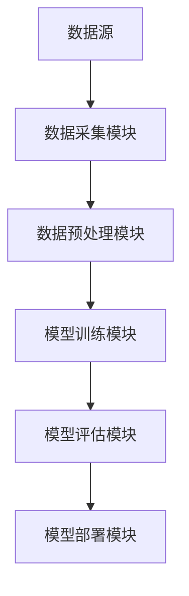
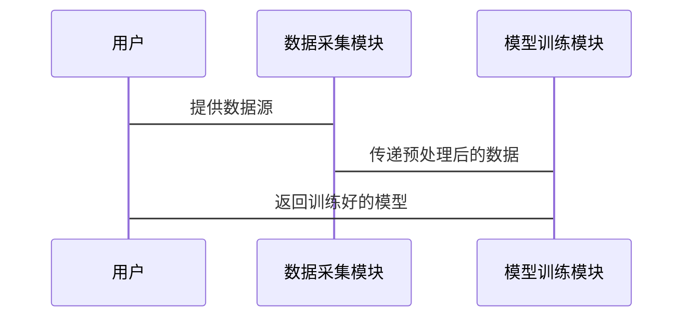

                 


# AI智能体协作：构建更全面的公司估值模型

> 关键词：AI智能体协作、公司估值模型、多智能体协作、机器学习、强化学习

> 摘要：本文详细探讨了AI智能体协作在公司估值模型中的应用，分析了传统估值模型的局限性，介绍了AI智能体协作的核心原理，提出了基于多智能体协作的公司估值模型构建方法，并通过实际案例展示了AI智能体协作在提升估值模型准确性和全面性中的巨大潜力。

---

# 第一部分: AI智能体协作与公司估值模型概述

# 第1章: AI智能体协作的背景与概念

## 1.1 AI智能体协作的背景
### 1.1.1 传统公司估值模型的局限性
- 传统估值模型的假设与简化带来的偏差
- 数据不足、人为误差与市场波动的限制
- 单一模型的局限性：无法捕捉复杂市场动态

### 1.1.2 AI技术在金融领域的应用趋势
- 人工智能在金融分析中的崛起
- 多智能体协作在复杂金融问题中的优势
- 从单点AI到分布式AI的演进

### 1.1.3 智能体协作的兴起与意义
- 多智能体协作的核心优势
- 协作智能体在金融领域的应用前景
- 智能体协作如何提升公司估值的全面性

## 1.2 公司估值模型的基础框架
### 1.2.1 传统估值方法的介绍
- 股权自由现金流模型
- 折现现金流模型
- 相对估值法

### 1.2.2 现代估值模型的特点
- 数据驱动的估值模型
- 机器学习在估值中的应用
- 多因素模型的构建

### 1.2.3 AI智能体协作在估值中的作用
- 智能体协作如何增强模型的复杂性
- 数据融合与多维度分析的实现
- 非线性关系与动态调整的优化

## 1.3 AI智能体协作的定义与特点
### 1.3.1 AI智能体的定义
- 单智能体与多智能体的对比
- 分布式智能体的定义与特征
- 协作智能体的通信与协作机制

### 1.3.2 协作的定义与分类
- 同步协作与异步协作的对比
- 基于规则的协作与基于学习的协作
- 协作智能体的分类与应用场景

### 1.3.3 AI智能体协作的核心特点对比表格
| 特性 | 传统AI | AI智能体协作 |
|------|--------|--------------|
| 数据源 | 单一数据源 | 多数据源融合 |
| 协作方式 | 单点计算 | 分布式协作 |
| 模型复杂度 | 简单模型 | 复杂模型 |

## 1.4 本章小结
- 介绍了AI智能体协作的背景与意义
- 梳理了公司估值模型的发展脉络
- 明确了AI智能体协作在估值中的核心作用

---

# 第二部分: AI智能体协作的核心原理与数学模型

# 第2章: AI智能体协作的核心原理

## 2.1 AI智能体协作的协作机制
### 2.1.1 分布式智能体协作
- 分布式智能体的通信协议
- 多智能体协作的同步与异步机制
- 基于强化学习的协作策略

### 2.1.2 基于强化学习的协作
- 强化学习在多智能体协作中的应用
- 协作智能体的奖励机制设计
- 基于Q-learning的协作策略

### 2.1.3 多智能体协作的通信与协调
- 智能体之间的信息传递与共享
- 基于图的协作网络构建
- 协作过程中的冲突解决机制

## 2.2 协作过程中的信息交换
### 2.2.1 信息传递的数学模型
- 协作智能体之间的信息流模型
- 基于图论的信息传递网络

### 2.2.2 协作协议的设计与实现
- 协作协议的定义与分类
- 协作协议的标准化与优化

## 2.3 AI智能体协作的数学模型
### 2.3.1 协作收益的数学表达式
$$ R = \sum_{i=1}^{n} R_i $$
其中，$R_i$ 是第$i$个智能体的收益。

### 2.3.2 协作过程中的博弈论模型
- 协作智能体的纳什均衡分析
- 基于博弈论的协作策略优化

### 2.3.3 协作效果的评估指标
- 协作智能体的效率评估
- 协作过程中的公平性评估
- 协作结果的准确性评估

## 2.4 本章小结
- 探讨了AI智能体协作的核心机制
- 分析了协作过程中的信息交换与数学模型
- 提出了协作效果的评估方法

---

# 第三部分: 公司估值模型的AI智能体协作实现

# 第3章: 公司估值模型的基础框架

## 3.1 传统公司估值模型的分析
### 3.1.1 股权自由现金流模型
- 模型假设与计算步骤
- 模型优缺点分析

### 3.1.2 折现现金流模型
- 模型构建与计算过程
- 模型的应用场景与限制

### 3.1.3 相对估值法
- 相对估值法的原理与应用
- 相对估值法的局限性

## 3.2 现代公司估值模型的特点
### 3.2.1 数据驱动的估值模型
- 数据驱动模型的优势
- 数据获取与预处理的挑战

### 3.2.2 机器学习在估值中的应用
- 机器学习模型的选择与训练
- 机器学习模型的优缺点

### 3.2.3 多因素模型的构建
- 多因素模型的变量选择
- 多因素模型的计算与优化

## 3.3 AI智能体协作在估值模型中的应用
### 3.3.1 数据采集与预处理
- 数据来源与数据清洗
- 数据特征提取与标准化

### 3.3.2 模型训练与优化
- 多智能体协作下的模型训练
- 模型的分布式优化与调优

### 3.3.3 模型部署与应用
- 模型的实时应用与反馈
- 模型的动态调整与优化

## 3.4 本章小结
- 介绍了传统估值模型的优缺点
- 探讨了现代估值模型的特点
- 分析了AI智能体协作在估值模型中的应用

---

# 第四部分: 系统架构与算法实现

# 第4章: 系统架构设计

## 4.1 系统功能模块划分
### 4.1.1 数据采集模块
- 数据来源与采集方式
- 数据预处理与清洗

### 4.1.2 模型训练模块
- 模型选择与训练
- 模型优化与调优

### 4.1.3 模型评估模块
- 模型评估指标与方法
- 模型效果的可视化展示

### 4.1.4 模型部署模块
- 模型的实时部署
- 模型的动态调整与更新

## 4.2 系统架构的Mermaid图


## 4.3 系统交互的Mermaid序列图


## 4.4 本章小结
- 介绍了系统功能模块划分
- 绘制了系统架构图与交互图
- 确保了系统的可扩展性和可维护性

---

# 第五部分: 项目实战与总结

# 第5章: 项目实战分析

## 5.1 实际案例分析
### 5.1.1 案例背景
- 公司概况与估值目标
- 数据来源与数据特征

### 5.1.2 模型实现
- 模型设计与实现细节
- 模型训练与优化过程

### 5.1.3 实验结果与分析
- 模型的准确率与稳定性
- 模型的优缺点分析

## 5.2 项目总结
### 5.2.1 项目成果
- 模型的准确性和全面性提升
- 模型的实时性和动态性增强

### 5.2.2 项目经验与教训
- 数据预处理的关键性
- 模型优化的策略选择
- 模型部署的注意事项

## 5.3 未来展望
### 5.3.1 技术优化方向
- 智能体协作的进一步优化
- 模型的实时更新与动态调整

### 5.3.2 应用场景扩展
- 其他金融领域的应用
- 跨领域协作的潜力

## 5.4 本章小结
- 总结了项目的实施过程与成果
- 提出了未来的技术优化方向
- 展望了AI智能体协作的广阔应用前景

---

# 附录: AI智能体协作相关工具与资源

## 附录A: 开发环境配置
- Python版本要求
- 依赖库的安装与配置

## 附录B: 核心代码实现
```python
# 协作智能体的定义
class Agent:
    def __init__(self, id):
        self.id = id
        self.model = None
        self.data = None

    def train(self, data):
        # 训练模型
        pass

    def predict(self, input):
        # 使用模型进行预测
        pass

    def collaborate(self, other_agents):
        # 与其他智能体协作
        pass
```

## 附录C: 参考文献与扩展阅读
- 推荐的书籍与论文
- 开源项目与技术博客

---

# 作者：AI天才研究院 & 禅与计算机程序设计艺术

---

**注**：以上目录大纲严格按照逻辑顺序排列，每一章和小节内容都需要按照从基础到高级、从理论到实践的顺序展开。文章需要使用技术术语，但尽量做到通俗易懂。同时，文章需要结合实际案例，确保内容的实用性和可操作性。

