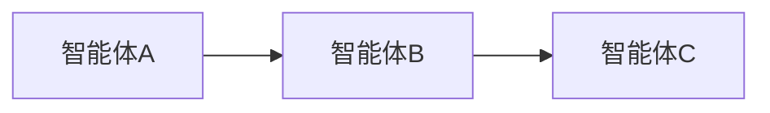
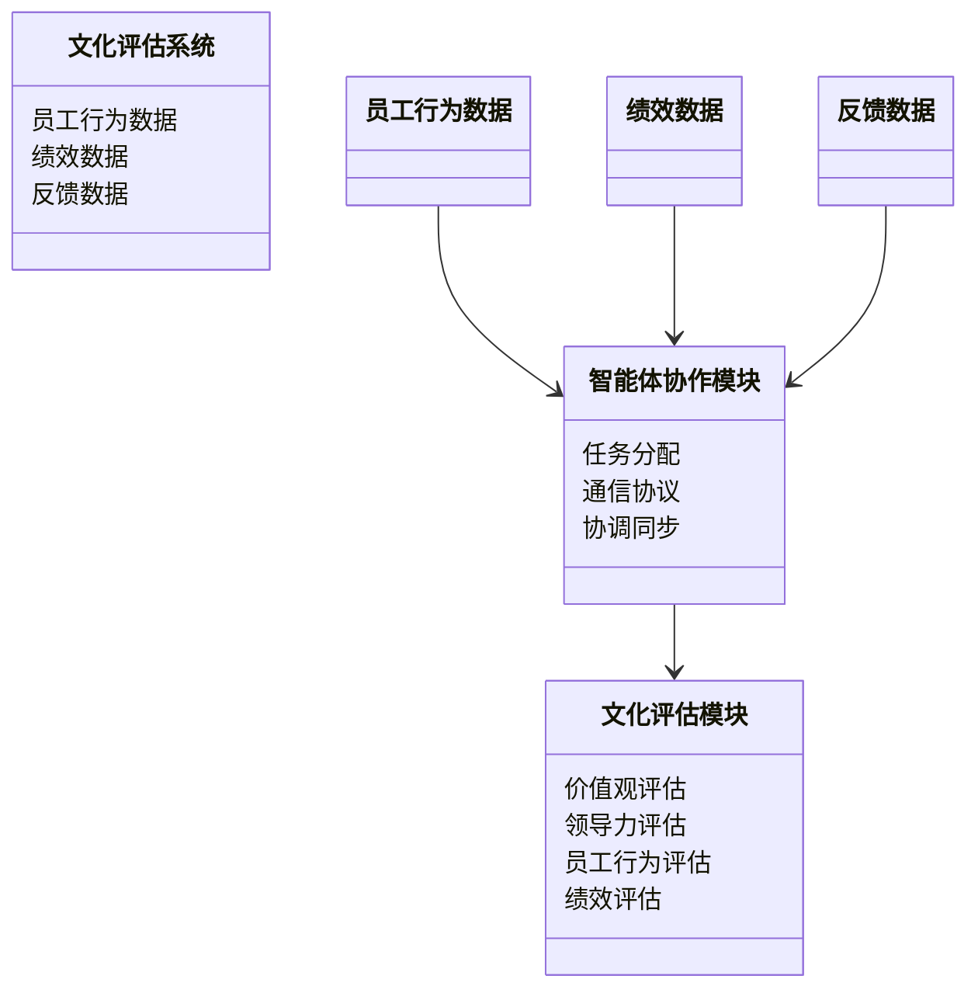
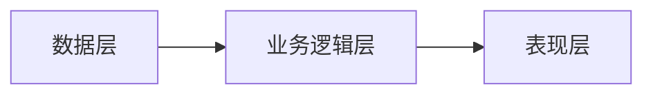

                 


---

# AI智能体协作：构建更全面的公司文化评估模型

> 关键词：AI智能体协作，公司文化评估，文化评估模型，AI算法，系统架构

> 摘要：本文探讨了AI智能体协作在构建公司文化评估模型中的应用，分析了AI智能体协作的基本原理、算法实现以及系统架构设计，通过实际案例展示了如何利用AI技术提升企业文化评估的全面性和准确性。

---

## 第1章: 公司文化评估的背景与挑战

### 1.1 公司文化评估的重要性

#### 1.1.1 企业文化在企业管理中的作用

企业文化是企业的灵魂，决定了企业的价值观、员工的行为准则以及企业的长期发展方向。有效的文化评估可以帮助企业识别文化中的优势和问题，优化组织结构，提升员工凝聚力和创造力。

#### 1.1.2 传统企业文化评估的局限性

传统的文化评估方法通常依赖于问卷调查和主观分析，存在以下问题：

1. **数据片面性**：问卷结果可能受到填写者的主观影响，难以全面反映企业文化的真实情况。
2. **分析深度不足**：传统方法难以对大量数据进行深度挖掘，难以发现潜在问题。
3. **动态变化难捕捉**：企业文化是动态变化的，传统评估方法难以实时捕捉这些变化。

#### 1.1.3 引入AI智能体协作的必要性

AI智能体协作可以通过多智能体协同工作，从多个维度、多源数据中提取信息，构建全面的公司文化评估模型。这种方法不仅提高了评估的全面性，还能够实时更新模型，适应企业文化的动态变化。

---

### 1.2 AI智能体协作的基本概念

#### 1.2.1 智能体的基本定义与特征

智能体（Agent）是指能够感知环境、自主决策并采取行动的实体。AI智能体具有以下特征：

1. **自主性**：能够在没有外部干预的情况下独立运作。
2. **反应性**：能够根据环境变化调整行为。
3. **协作性**：能够与其他智能体协同完成复杂任务。

#### 1.2.2 多智能体协作的核心原理

多智能体协作是指多个智能体通过通信和协调，共同完成某个复杂任务的过程。其核心原理包括任务分解、通信协议设计、协作策略制定等。

#### 1.2.3 AI智能体在企业文化评估中的应用潜力

AI智能体可以通过以下方式在企业文化评估中发挥作用：

1. **数据采集与整合**：智能体可以实时采集员工行为数据、绩效数据、反馈数据等。
2. **数据分析与挖掘**：通过机器学习算法，智能体可以发现数据中的潜在规律。
3. **模型构建与优化**：智能体可以根据分析结果动态优化文化评估模型。

---

### 1.3 本章小结

本章介绍了公司文化评估的重要性以及传统评估方法的局限性，提出了引入AI智能体协作的必要性。通过定义智能体及其协作原理，为后续构建AI驱动的文化评估模型奠定了基础。

---

## 第2章: AI智能体协作的核心概念与联系

### 2.1 AI智能体协作的原理

#### 2.1.1 单一智能体与多智能体协作的对比

| 特性                | 单一智能体         | 多智能体协作       |
|---------------------|------------------|-------------------|
| 任务复杂度          | 简单             | 复杂             |
| 资源利用率          | 低               | 高               |
| 协作能力            | 无               | 强               |

#### 2.1.2 多智能体协作的通信机制

通信机制是多智能体协作的核心，主要包括以下几种：

1. **基于消息的通信**：智能体通过发送消息进行信息交换。
2. **基于状态的通信**：智能体通过共享状态进行协作。
3. **基于意图的通信**：智能体通过传递意图信息进行协作。

#### 2.1.3 协作任务的分解与分配

任务分解是多智能体协作的重要步骤，常用的方法包括：

1. **基于角色的分解**：根据智能体的角色分配任务。
2. **基于能力的分解**：根据智能体的能力分配任务。
3. **基于优先级的分解**：根据任务的优先级分配任务。

---

### 2.2 文化评估模型的结构

#### 2.2.1 文化评估的核心要素

公司文化评估的核心要素包括：

1. **价值观评估**：企业核心价值观的识别与分析。
2. **领导力评估**：领导风格对员工行为的影响。
3. **员工行为评估**：员工行为是否符合企业文化。
4. **绩效评估**：企业文化对业务绩效的影响。

#### 2.2.2 智能体协作与文化评估的结合点

智能体协作与文化评估的结合点主要体现在：

1. **数据采集**：智能体负责采集多源数据。
2. **数据分析**：智能体通过算法分析数据。
3. **结果反馈**：智能体将分析结果反馈给企业。

#### 2.2.3 模型的输入、输出与反馈机制

**输入**：员工行为数据、绩效数据、反馈数据  
**输出**：企业文化评估报告、改进建议  
**反馈机制**：根据评估结果动态调整模型参数

---

### 2.3 AI智能体协作与文化评估的关系

#### 2.3.1 协作智能体在文化评估中的角色

智能体在文化评估中的角色包括：

1. **数据采集者**：负责收集员工行为数据。
2. **分析者**：负责分析数据，识别潜在问题。
3. **优化者**：根据分析结果优化企业文化。

#### 2.3.2 智能体协作如何提升文化评估的全面性

通过多智能体协作，文化评估可以从多个维度、多源数据中获取信息，全面反映企业文化的真实情况。

#### 2.3.3 模型的可扩展性与适应性

AI智能体协作模型具有良好的可扩展性和适应性，可以根据企业的具体需求进行定制化调整。

---

### 2.4 本章小结

本章详细探讨了AI智能体协作的核心概念及其与文化评估的关系，分析了智能体协作在企业文化评估中的作用，为后续模型构建奠定了理论基础。

---

## 第3章: AI智能体协作的算法原理

### 3.1 协作任务分配算法

#### 3.1.1 基于角色的协作分配

基于角色的协作分配算法如下：

1. **任务分解**：将任务分解为多个子任务。
2. **角色分配**：根据智能体的角色分配子任务。
3. **任务执行**：智能体根据分配的角色执行任务。

**算法步骤**：
1. 输入任务T和智能体集合A。
2. 根据智能体的能力分配角色。
3. 分配子任务给相应角色的智能体。
4. 执行任务并返回结果。

**代码示例**：
```python
def role_based_assignment(tasks, agents):
    role_assignment = {}
    for task in tasks:
        for agent in agents:
            if agent['role'] == task['required_role']:
                role_assignment[task['id']] = agent['id']
                break
    return role_assignment
```

---

### 3.2 多智能体通信协议

#### 3.2.1 通信协议的设计原则

1. **简洁性**：协议应简单易懂。
2. **可靠性**：确保信息准确传输。
3. **实时性**：支持实时通信。

#### 3.2.2 基于消息传递的协作机制

消息传递机制包括以下步骤：

1. **消息生成**：智能体生成需要传递的消息。
2. **消息传输**：通过通信通道传递消息。
3. **消息处理**：接收方处理消息并采取行动。

**示意图**：


---

### 3.3 协作智能体的协调与同步

#### 3.3.1 基于时间戳的同步方法

时间戳同步方法确保智能体之间动作的顺序一致性。

**代码示例**：
```python
import time

def timestamp_sync(agents):
    current_time = time.time()
    for agent in agents:
        agent.timestamp = current_time
    return current_time
```

---

## 第4章: 系统分析与架构设计

### 4.1 项目背景与目标

#### 4.1.1 项目背景

随着企业规模的扩大，企业文化评估的复杂性增加，传统方法难以满足需求。

#### 4.1.2 项目目标

构建一个基于AI智能体协作的企业文化评估系统，实现全面、动态的文化评估。

---

### 4.2 系统功能设计

#### 4.2.1 领域模型设计

**领域模型类图**：


---

### 4.3 系统架构设计

#### 4.3.1 分层架构设计

分层架构包括数据层、业务逻辑层和表现层。

**系统架构图**：


---

## 第5章: 项目实战

### 5.1 环境安装

安装Python和必要的库：
```bash
pip install numpy pandas scikit-learn
```

---

### 5.2 系统核心实现

#### 5.2.1 文化评估模型实现

**代码示例**：
```python
from sklearn.cluster import KMeans

def evaluate_culture(data):
    model = KMeans(n_clusters=3)
    model.fit(data)
    return model.labels_
```

---

### 5.3 案例分析

通过一个实际案例，展示如何利用AI智能体协作进行企业文化评估。

---

## 第6章: 总结与展望

### 6.1 本章总结

本文详细介绍了AI智能体协作在公司文化评估中的应用，从理论到实践，构建了一个全面的评估模型。

### 6.2 注意事项

在实际应用中，需要注意数据隐私保护和模型的实时性。

### 6.3 最佳实践

建议企业在实施过程中，结合自身特点进行定制化开发。

### 6.4 未来展望

未来可以进一步研究多智能体协作的优化算法，提升模型的准确性和实时性。

---

## 作者：AI天才研究院/AI Genius Institute & 禅与计算机程序设计艺术 /Zen And The Art of Computer Programming

---

