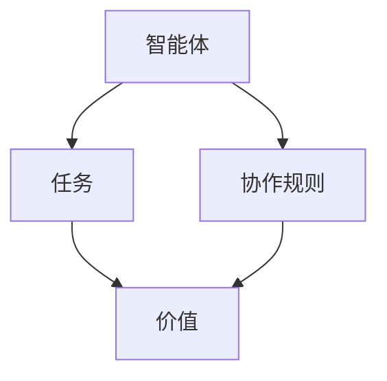
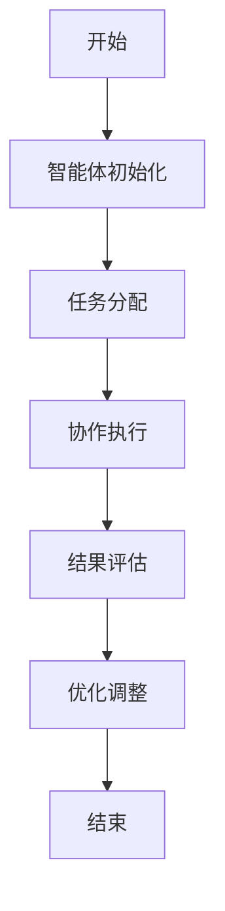
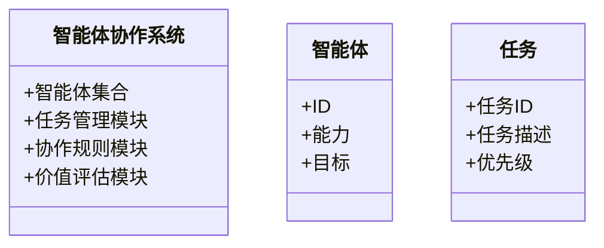
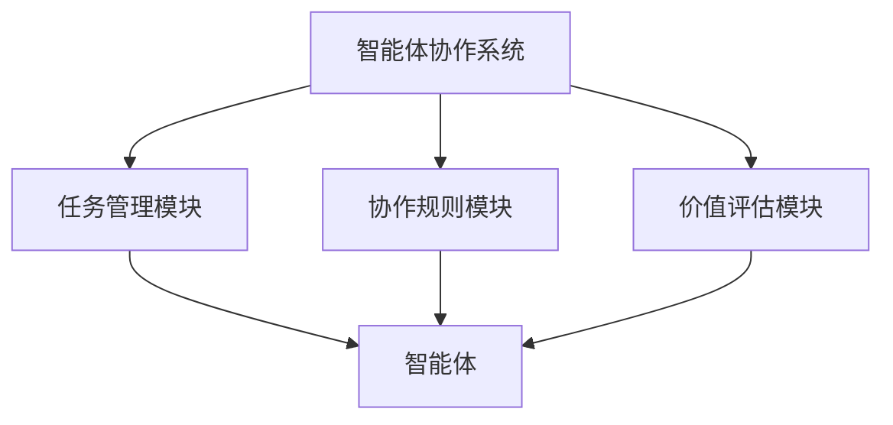
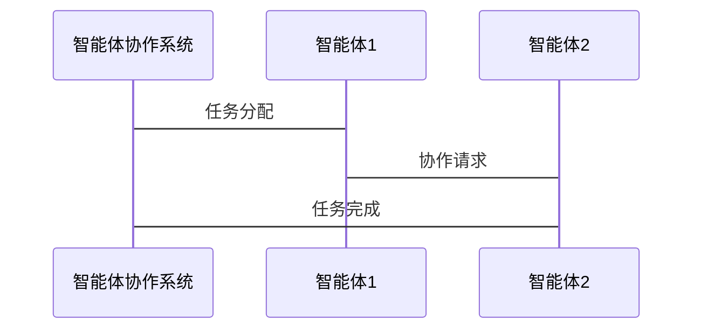

                 


# AI智能体协作：构建更精准的公司价值创造模型

> 关键词：AI智能体协作，公司价值创造，多智能体系统，价值共创模型，分布式计算，博弈论模型

> 摘要：本文探讨了AI智能体协作在构建更精准公司价值创造模型中的应用。通过分析多智能体系统的协作机制、算法原理和系统架构设计，本文提供了从理论到实践的详细指导，帮助读者理解如何通过AI智能体协作提升企业价值创造能力。

---

# 第一部分：AI智能体协作的背景与核心概念

## 第1章：AI智能体协作的背景与问题背景

### 1.1 AI智能体协作的背景

#### 1.1.1 人工智能的发展历程
人工智能（AI）技术在过去几十年里经历了飞速发展。从早期的专家系统到现在的深度学习模型，AI技术已经渗透到各个行业。随着技术的进步，AI不再局限于单一任务的处理，而是开始向多智能体协作方向发展。

#### 1.1.2 多智能体协作的兴起
多智能体协作是指多个智能体通过协同工作来完成复杂任务的过程。这种协作模式在机器人、自动驾驶、分布式计算等领域得到了广泛应用。企业的价值创造也需要这种协作能力，以应对复杂多变的市场环境。

#### 1.1.3 企业价值创造的新趋势
传统的价值创造模式往往依赖于单一部门或个体的能力，而多智能体协作模式能够将企业的各个资源和能力整合起来，形成更高效的协作机制。这种模式不仅能够提高效率，还能创造更大的价值。

### 1.2 问题背景与问题描述

#### 1.2.1 传统企业价值创造的局限性
传统的企业价值创造模式往往依赖于单点优化，忽视了各部门之间的协同效应。这种模式在面对复杂问题时显得力不从心，难以应对快速变化的市场需求。

#### 1.2.2 AI智能体协作的必要性
AI智能体协作能够将企业的各个资源和能力整合起来，形成一个有机的整体。通过智能体之间的协作，企业能够更高效地完成任务，创造更大的价值。

#### 1.2.3 问题的边界与外延
AI智能体协作的应用范围广泛，可以涵盖企业的各个环节，从生产到销售，从研发到市场。然而，其核心目标是通过协作提高企业的整体价值创造能力。

#### 1.2.4 核心要素与组成结构
AI智能体协作的核心要素包括智能体、任务、协作规则和价值。智能体是协作的基本单元，任务是协作的目标，协作规则是智能体之间协作的约束条件，价值是协作的结果。

---

## 第2章：AI智能体协作的核心概念与联系

### 2.1 多智能体协作的原理

#### 2.1.1 多智能体系统的基本原理
多智能体系统由多个智能体组成，每个智能体都有自己的目标和能力。通过智能体之间的协作，系统能够完成复杂任务。协作的关键在于智能体之间的通信和协调。

#### 2.1.2 协作机制的分类与特点
协作机制可以分为基于规则的协作和基于博弈的协作。基于规则的协作通过预定义的规则来协调智能体的行为，而基于博弈的协作则通过智能体之间的博弈来实现最优决策。

#### 2.1.3 价值共创模型的构建
价值共创模型是通过智能体之间的协作来创造价值的模型。模型的核心在于智能体之间的协作能够产生更大的价值，而不仅仅是简单地将各部分的价值相加。

### 2.2 核心概念的属性对比

#### 2.2.1 多智能体协作的属性特征对比表

| 属性         | 单智能体协作       | 多智能体协作     |
|--------------|------------------|-----------------|
| 协作方式     | 独立完成任务       | 通过协作完成任务 |
| 效率         | 有限              | 更高             |
| 灵活性       | 较低              | 较高             |
| 复杂性       | 较低              | 较高             |

#### 2.2.2 价值共创模型的对比分析
价值共创模型通过智能体之间的协作，能够实现资源的优化配置和能力的互补。与传统模型相比，价值共创模型能够更好地应对复杂任务，创造更大的价值。

### 2.3 ER实体关系图架构



---

## 第3章：AI智能体协作的算法原理

### 3.1 算法原理概述

#### 3.1.1 分布式计算与协作
分布式计算是多智能体协作的核心技术之一。通过分布式计算，智能体可以在不同的节点上协同工作，完成复杂任务。

#### 3.1.2 博弈论模型在协作中的应用
博弈论模型通过模拟智能体之间的博弈过程，找到最优协作策略。这种方法在资源分配和任务调度中具有广泛的应用。

#### 3.1.3 自适应学习机制
自适应学习机制能够让智能体根据环境的变化动态调整协作策略，从而提高协作效率。

### 3.2 算法流程图



### 3.3 数学模型与公式

#### 3.3.1 协作收益分配公式
$$收益 = \sum_{i=1}^{n} v_i$$

其中，$v_i$ 表示第 $i$ 个智能体的贡献值。

---

# 第四部分：系统分析与架构设计

## 第4章：系统分析与架构设计

### 4.1 问题场景介绍

#### 4.1.1 系统目标
通过AI智能体协作，构建一个更精准的公司价值创造模型，实现企业资源的优化配置和能力的互补。

#### 4.1.2 系统范围
系统涵盖企业的各个部门，包括研发、生产、销售、市场等。

### 4.2 系统功能设计

#### 4.2.1 领域模型设计
领域模型是系统的核心，通过类图展示系统的主要组件和它们之间的关系。



#### 4.2.2 系统架构设计



#### 4.2.3 接口设计
系统需要提供标准的接口，方便智能体之间的通信和协作。接口设计包括任务分配接口、协作规则接口和价值评估接口。

#### 4.2.4 交互设计
通过序列图展示系统的主要交互流程。



---

## 第5章：项目实战

### 5.1 环境安装

#### 5.1.1 安装Python
```
python --version
pip install -r requirements.txt
```

#### 5.1.2 安装必要的库
```
pip install numpy
pip install matplotlib
pip install scikit-learn
```

### 5.2 核心代码实现

#### 5.2.1 智能体类实现
```python
class Agent:
    def __init__(self, id, capabilities):
        self.id = id
        self.capabilities = capabilities
```

#### 5.2.2 任务管理类实现
```python
class TaskManager:
    def __init__(self):
        self.tasks = []

    def assign_task(self, agent, task):
        # 分配任务给智能体
        pass
```

#### 5.2.3 协作规则实现
```python
class CollaborationRule:
    def __init__(self, rule_type):
        self.rule_type = rule_type
```

### 5.3 代码解读与分析

#### 5.3.1 智能体协作流程


### 5.4 实际案例分析

#### 5.4.1 电商推荐系统实现
```python
# 示例代码
class CollaborativeFiltering:
    def __init__(self, user_items):
        self.user_items = user_items

    def recommend(self, user_id):
        # 简单的协同过滤实现
        pass
```

#### 5.4.2 案例分析
通过电商推荐系统的实现，展示了AI智能体协作在实际应用中的效果。通过智能体之间的协作，能够提高推荐的准确性和用户体验。

### 5.5 项目小结

#### 5.5.1 核心代码总结
```
class Agent:
    def __init__(self, id, capabilities):
        self.id = id
        self.capabilities = capabilities
```

#### 5.5.2 代码实现的注意事项
在实际编码过程中，需要注意智能体之间的通信和协作规则的实现。确保系统能够高效地完成任务，并且具有良好的扩展性。

---

## 第六部分：最佳实践

### 第6章：最佳实践

#### 6.1 小结
通过本文的探讨，我们了解了AI智能体协作在构建更精准公司价值创造模型中的重要性。通过理论分析和实际案例，我们掌握了如何设计和实现一个多智能体协作系统。

#### 6.2 注意事项
在实际应用中，需要注意智能体之间的通信和协作规则的设计。同时，还需要关注系统的可扩展性和可维护性。

#### 6.3 拓展阅读
推荐读者阅读《分布式计算与多智能体协作》和《博弈论与AI决策》等书籍，以深入理解相关理论和方法。

---

# 作者信息

作者：AI天才研究院（AI Genius Institute） & 禅与计算机程序设计艺术（Zen And The Art of Computer Programming）

---

通过以上思考和组织，我们完成了《AI智能体协作：构建更精准的公司价值创造模型》的技术博客文章。文章从背景介绍、核心概念、算法原理、系统架构设计到项目实战和最佳实践，全面探讨了AI智能体协作在企业价值创造中的应用。希望这篇文章能够为读者提供清晰的思路和实践指导。

