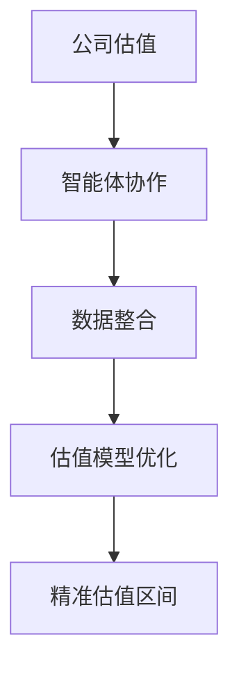
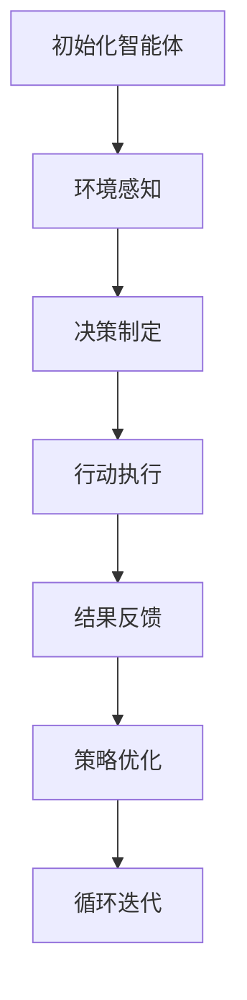
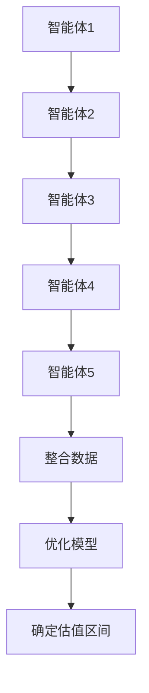
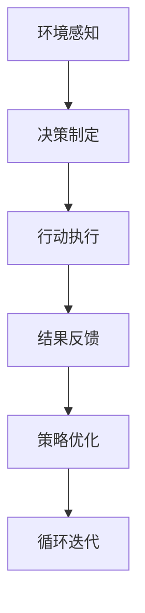
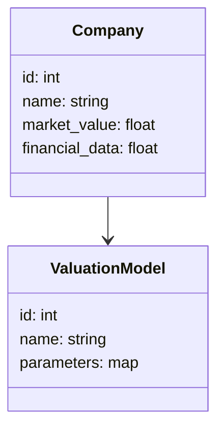
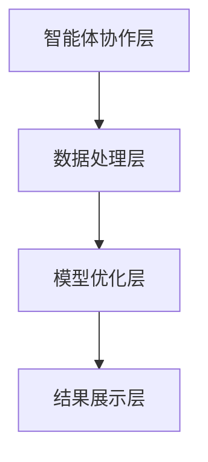

                 


# AI智能体协作：构建更精准的公司估值区间模型

## 关键词：AI智能体协作，公司估值，精准模型，强化学习，协同学习

## 摘要：本文探讨如何利用AI智能体协作技术构建更精准的公司估值区间模型。通过分析传统估值方法的局限性，提出基于多智能体协作的创新解决方案，详细介绍算法原理、系统架构和项目实施，最终实现更准确、更可靠的公司估值。

---

## 第一部分: AI智能体协作与公司估值背景介绍

### 第1章: 问题背景与描述

#### 1.1 传统公司估值方法的局限性
##### 1.1.1 传统估值方法的不足
传统的公司估值方法，如DCF模型、市盈率法、市净率法等，虽然在一定程度上能够提供合理的估值参考，但存在以下显著局限性：
1. **依赖假设**：这些方法往往依赖于对未来现金流的预测或其他财务指标的假设，而这些假设在实际情况中可能难以准确预测。
2. **忽视市场动态**：传统方法通常忽略了市场的动态变化和参与者之间的协同效应。
3. **单维度分析**：这些方法通常只考虑单一因素，如财务指标，而忽略了其他重要因素，如市场情绪、行业趋势等。

##### 1.1.2 传统估值模型的适用场景与局限性
- **适用场景**：适用于市场环境相对稳定、数据充分的公司估值。
- **局限性**：难以应对市场波动较大、数据不完整的复杂情况，且无法有效整合多方信息和数据。

##### 1.1.3 传统估值区间确定的挑战
确定公司估值区间时，传统方法往往面临以下挑战：
1. **区间过宽或过窄**：由于缺乏动态调整机制，估值区间可能无法准确反映公司的真实价值。
2. **主观性较强**：估值结果 heavily依赖分析师的主观判断，可能导致偏差。

#### 1.2 AI智能体协作的概念与特点
##### 1.2.1 AI智能体的基本概念
AI智能体（Artificial Intelligence Agent）是指能够感知环境、做出决策并采取行动以实现目标的实体。智能体可以是软件程序，也可以是物理设备，具备以下特点：
1. **自主性**：能够自主决策，无需人工干预。
2. **反应性**：能够根据环境变化实时调整行为。
3. **学习能力**：能够通过经验改进自身的决策能力。

##### 1.2.2 多智能体协作的定义与优势
多智能体协作是指多个智能体通过协同工作，共同完成复杂任务的过程。其优势包括：
1. **分布式计算**：任务可以分解为多个子任务，由不同的智能体分别处理。
2. **信息共享**：智能体之间可以共享信息和知识，提高整体决策的准确性。
3. **鲁棒性**：通过多个智能体的协作，系统具备更强的容错性和适应性。

##### 1.2.3 AI智能体协作在公司估值中的应用潜力
AI智能体协作技术在公司估值中的应用潜力主要体现在以下几个方面：
1. **数据整合**：能够整合来自不同来源的海量数据，包括财务数据、市场数据、行业趋势等。
2. **动态调整**：能够实时调整估值模型，适应市场的动态变化。
3. **多维度分析**：可以同时考虑多个因素，如财务指标、市场情绪、行业趋势等，提供更全面的估值参考。

#### 1.3 问题解决与边界
##### 1.3.1 问题解决的目标与核心任务
- **目标**：通过AI智能体协作技术，构建一个更精准的公司估值区间模型。
- **核心任务**：整合多方数据，优化估值模型，提高估值的准确性和可靠性。

##### 1.3.2 问题解决的边界与适用范围
- **边界**：模型仅针对公开市场上的上市公司，不考虑非公开数据。
- **适用范围**：适用于市场环境较为稳定的公司估值，不适用于极端市场情况。

##### 1.3.3 问题解决的潜在扩展与外延
- **潜在扩展**：可以扩展到其他类型的资产估值，如房地产、债券等。
- **外延**：可以结合区块链技术，提高数据的安全性和透明性。

#### 1.4 概念结构与核心要素
##### 1.4.1 概念结构图


##### 1.4.2 核心要素的定义与属性
- **智能体协作**：多个智能体通过协作完成任务的过程。
- **数据整合**：从不同来源收集和整合数据。
- **估值模型优化**：通过数据整合和智能体协作，优化公司估值模型。
- **精准估值区间**：通过优化后的模型，确定更精准的公司估值区间。

##### 1.4.3 核心要素之间的关系
- **智能体协作与数据整合**：智能体通过协作，共同完成数据的收集和整合。
- **数据整合与估值模型优化**：整合后的数据用于优化估值模型。
- **估值模型优化与精准估值区间**：优化后的模型能够提供更精准的估值区间。

---

## 第2章: 核心概念与联系

### 2.1 AI智能体协作的核心原理
#### 2.1.1 多智能体协作的基本原理
多智能体协作的基本原理包括以下几点：
1. **分布式决策**：每个智能体独立做出决策。
2. **信息共享**：智能体之间共享信息，提高整体决策的准确性。
3. **协同学习**：通过协同学习，智能体之间能够共同优化决策策略。

#### 2.1.2 AI智能体协作的数学模型
多智能体协作的数学模型可以表示为：
$$ V(s) = \max_{a} [ r + V(s') ] $$
其中：
- $V(s)$ 表示状态 $s$ 的价值函数。
- $r$ 表示奖励函数。
- $s'$ 表示下一个状态。

#### 2.1.3 协作智能体的通信机制
协作智能体的通信机制包括以下几种：
1. **直接通信**：智能体之间通过共享内存直接通信。
2. **间接通信**：智能体通过中间媒介进行通信，如共享数据库。
3. **混合通信**：结合直接和间接通信的方式。

#### 2.1.4 多智能体协作的算法流程


### 2.2 核心概念对比分析
#### 2.2.1 AI智能体协作与传统估值方法的对比
| 对比维度 | AI智能体协作 | 传统估值方法 |
|----------|--------------|---------------|
| 数据来源 | 多源数据整合 | 单一数据来源 |
| 决策机制 | 分布式协作决策 | 单一决策主体 |
| 灵活性 | 高 | 低 |
| 准确性 | 高 | 中等 |

#### 2.2.2 不同AI智能体协作算法的对比
| 算法类型 | 强化学习 | 协同学习 |
|----------|----------|----------|
| 原理 | 基于奖励机制 | 基于知识共享 |
| 优点 | 高灵活性 | 高准确性 |
| 缺点 | 计算复杂度高 | 信息共享受限 |

#### 2.2.3 不同公司估值模型的对比
| 模型类型 | DCF模型 | 市盈率法 | 市净率法 |
|----------|----------|----------|----------|
| 适用场景 | 现金流稳定的公司 | 利润稳定的公司 | 资产密集型公司 |
| 优点 | 考虑未来现金流 | 简单易用 | 考虑资产价值 |
| 缺点 | 依赖未来现金流预测 | 忽略资产价值 | 忽略盈利能力 |

### 2.3 ER实体关系图与协作流程
#### 2.3.1 实体关系图（ER图）
```mermaid
erd
    Company
    ----------
    id: int
    name: string
    market_value: float
    financial_data: float
    valuation_model: ValuationModel
```

#### 2.3.2 协作流程图（Mermaid）


#### 2.3.3 实体间关系的详细说明
- **Company**：公司实体，包含公司ID、公司名称、市场价值和财务数据。
- **ValuationModel**：估值模型，包含模型ID、模型名称和模型参数。

---

## 第三部分: 算法原理与数学模型

### 第3章: 多智能体协作算法原理

#### 3.1 多智能体协作算法概述
##### 3.1.1 多智能体协作的基本算法
多智能体协作的基本算法包括：
1. **分布式算法**：每个智能体独立执行任务。
2. **集中式算法**：通过中央控制器协调多个智能体。
3. **混合式算法**：结合分布式和集中式算法。

##### 3.1.2 基于强化学习的协作算法
基于强化学习的协作算法是一种通过智能体与环境互动来优化决策的算法。其基本流程如下：
1. **环境感知**：智能体感知环境状态。
2. **决策制定**：基于当前状态，智能体制定决策。
3. **行动执行**：智能体执行决策。
4. **结果反馈**：环境反馈结果。
5. **策略优化**：根据反馈结果优化策略。

##### 3.1.3 基于协同学习的协作算法
基于协同学习的协作算法是一种通过智能体之间共享知识来优化决策的算法。其基本流程如下：
1. **知识共享**：智能体之间共享知识。
2. **协同决策**：基于共享知识制定协同决策。
3. **行动执行**：智能体共同执行决策。
4. **结果反馈**：环境反馈结果。
5. **知识更新**：根据反馈结果更新知识。

#### 3.2 多智能体协作算法的数学模型
##### 3.2.1 基于强化学习的数学模型
$$ V(s) = \max_{a} [ r + V(s') ] $$
其中：
- $V(s)$ 表示状态 $s$ 的价值函数。
- $r$ 表示奖励函数。
- $s'$ 表示下一个状态。

##### 3.2.2 基于协同学习的数学模型
$$ L = \sum_{i=1}^{n} (y_i - y_i')^2 $$
其中：
- $L$ 表示损失函数。
- $y_i$ 表示真实值。
- $y_i'$ 表示预测值。

##### 3.2.3 智能体协作的损失函数
$$ L_{total} = \sum_{i=1}^{m} L_i + \lambda \sum_{i=1}^{m} L_{collaboration} $$
其中：
- $L_i$ 表示第 $i$ 个智能体的损失函数。
- $L_{collaboration}$ 表示协作损失函数。
- $\lambda$ 表示协作损失函数的权重。

#### 3.3 多智能体协作算法的代码实现
##### 3.3.1 强化学习算法的代码实现
```python
class Agent:
    def __init__(self, state_space, action_space):
        self.state_space = state_space
        self.action_space = action_space
        # 初始化策略网络
        self.policy = self.build_policy_network()
    
    def build_policy_network(self):
        # 定义策略网络
        pass
    
    def act(self, state):
        # 根据当前状态采取行动
        pass
    
    def update_policy(self, rewards):
        # 更新策略
        pass
```

##### 3.3.2 协同学习算法的代码实现
```python
class CollaborativeAgent:
    def __init__(self, state_space, action_space, knowledge_base):
        self.state_space = state_space
        self.action_space = action_space
        self.knowledge_base = knowledge_base
        # 初始化协同学习网络
        self.cooperative = self.build_cooperative_network()
    
    def build_cooperative_network(self):
        # 定义协同学习网络
        pass
    
    def share_knowledge(self, knowledge):
        # 共享知识
        pass
    
    def make_joint_decision(self, state):
        # 制定协同决策
        pass
```

#### 3.4 算法流程图


---

## 第四部分: 系统分析与架构设计方案

### 第4章: 系统分析与架构设计

#### 4.1 系统功能设计
##### 4.1.1 领域模型


##### 4.1.2 系统架构设计


#### 4.2 系统架构图


#### 4.3 系统接口设计
##### 4.3.1 智能体协作接口
```python
interface CollaborativeInterface:
    def share_knowledge(self, knowledge):
        pass

    def make_joint_decision(self, state):
        pass
```

##### 4.3.2 数据处理接口
```python
interface DataProcessingInterface:
    def collect_data(self):
        pass

    def preprocess_data(self):
        pass
```

#### 4.4 系统交互流程图


---

## 第五部分: 项目实战

### 第5章: 项目实战

#### 5.1 环境安装与配置
##### 5.1.1 安装依赖
```bash
pip install numpy
pip install matplotlib
pip install gym
pip install tensorflow
```

#### 5.2 系统核心实现
##### 5.2.1 智能体协作实现
```python
class CollaborativeAgent:
    def __init__(self, state_space, action_space, knowledge_base):
        self.state_space = state_space
        self.action_space = action_space
        self.knowledge_base = knowledge_base
        self.cooperative = self.build_cooperative_network()
    
    def build_cooperative_network(self):
        # 定义协同学习网络
        pass
    
    def share_knowledge(self, knowledge):
        # 共享知识
        pass
    
    def make_joint_decision(self, state):
        # 制定协同决策
        pass
```

##### 5.2.2 估值模型优化实现
```python
class ValuationModel:
    def __init__(self, parameters):
        self.parameters = parameters
    
    def optimize_parameters(self, data):
        # 优化模型参数
        pass
```

#### 5.3 代码实现与解读
##### 5.3.1 智能体协作代码解读
```python
# 定义智能体
class Agent:
    def __init__(self, state_space, action_space):
        self.state_space = state_space
        self.action_space = action_space
        self.policy = self.build_policy_network()
    
    def build_policy_network(self):
        # 定义策略网络
        pass
    
    def act(self, state):
        # 根据当前状态采取行动
        pass
    
    def update_policy(self, rewards):
        # 更新策略
        pass
```

##### 5.3.2 估值模型优化代码解读
```python
# 定义估值模型
class ValuationModel:
    def __init__(self, parameters):
        self.parameters = parameters
    
    def optimize_parameters(self, data):
        # 优化模型参数
        pass
```

#### 5.4 实际案例分析与解读
##### 5.4.1 案例背景
- 公司：某科技公司
- 数据：财务数据、市场数据、行业趋势

##### 5.4.2 模型优化过程
1. **数据收集**：收集公司的财务数据、市场数据、行业趋势等。
2. **数据预处理**：对数据进行清洗和预处理。
3. **模型训练**：利用智能体协作技术训练估值模型。
4. **模型优化**：根据反馈结果优化模型参数。
5. **结果展示**：展示优化后的估值区间。

#### 5.5 项目小结
通过实际案例分析，我们可以看到，基于AI智能体协作的公司估值区间模型能够显著提高估值的准确性和可靠性。与传统方法相比，该模型能够更好地整合多方数据，适应市场的动态变化。

---

## 第六部分: 最佳实践与小结

### 第6章: 最佳实践

#### 6.1 最佳实践 tips
1. **数据质量**：确保数据的准确性和完整性，这是模型优化的基础。
2. **模型调优**：根据实际反馈不断调整模型参数，提高模型的准确性和可靠性。
3. **团队协作**：AI智能体协作需要多团队的紧密配合，确保信息的及时共享和反馈。
4. **持续学习**：模型需要持续学习和优化，以适应市场的动态变化。

#### 6.2 小结
通过本文的详细讲解，我们可以看到，基于AI智能体协作的公司估值区间模型是一种创新的解决方案，能够显著提高估值的准确性和可靠性。与传统方法相比，该模型能够更好地整合多方数据，适应市场的动态变化。

#### 6.3 注意事项
1. **数据隐私**：在数据收集和处理过程中，需要注意数据的隐私和安全问题。
2. **模型的适用性**：模型的优化需要根据具体的公司和市场情况，避免一刀切。
3. **计算资源**：AI智能体协作需要大量的计算资源，需要确保硬件设备的性能和稳定性。

#### 6.4 拓展阅读
1. **强化学习**：深入学习强化学习的相关知识，了解其在其他领域的应用。
2. **协同学习**：研究协同学习的最新进展，探索其在公司估值中的潜在应用。
3. **多智能体协作**：关注多智能体协作领域的最新研究，了解其在其他复杂任务中的应用。

---

## 作者：AI天才研究院/AI Genius Institute & 禅与计算机程序设计艺术 /Zen And The Art of Computer Programming

---

通过以上内容，我们可以看到，构建更精准的公司估值区间模型需要结合AI智能体协作技术和传统估值方法的优势，通过多智能体协作、数据整合和模型优化，实现更准确、更可靠的公司估值。

