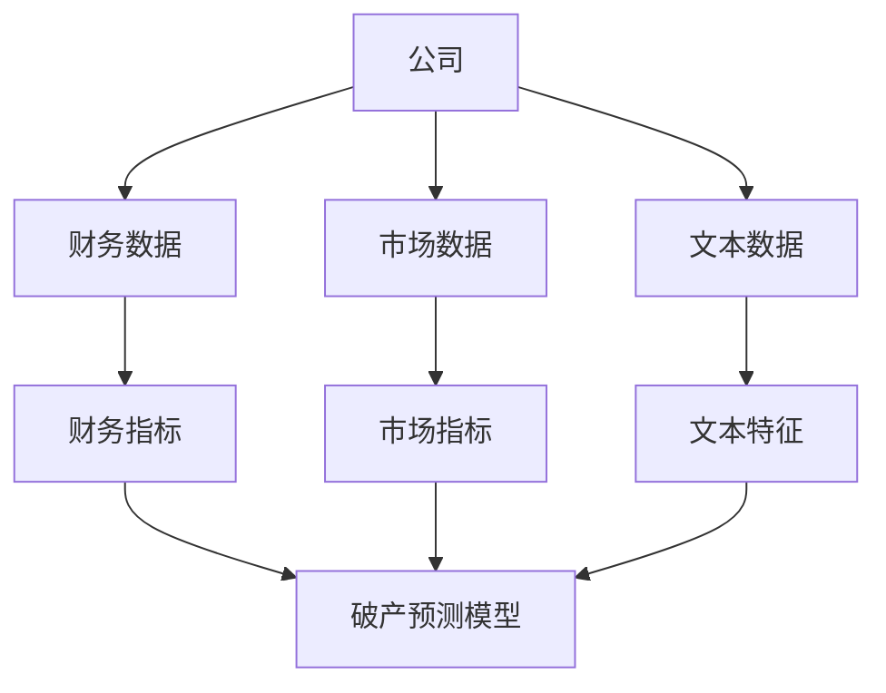
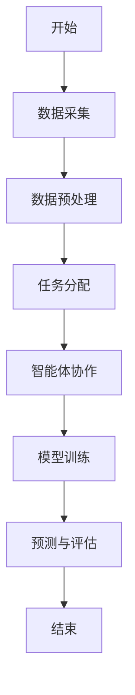
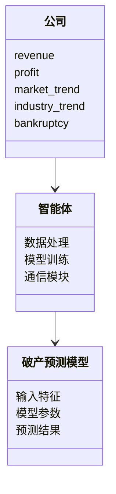
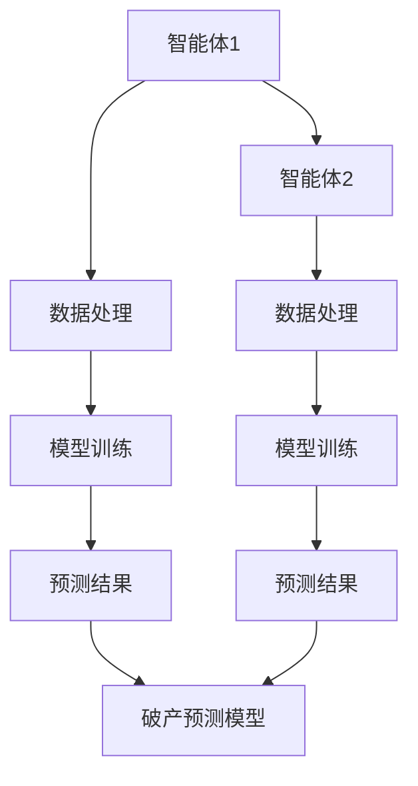
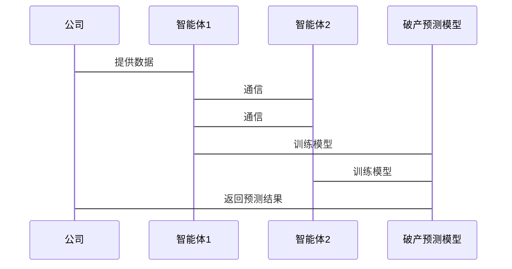

                 


# AI智能体协作：构建更精准的公司破产预测模型

> 关键词：AI智能体协作，公司破产预测，机器学习，多智能体系统，系统架构设计

> 摘要：本文深入探讨了利用AI智能体协作构建更精准的公司破产预测模型的方法。通过分析破产预测的核心问题，介绍AI智能体协作的基本原理，并结合实际案例详细讲解了模型的构建流程和系统架构设计，最终给出了在实际应用中的最佳实践和注意事项。

---

## 第1章: 背景介绍

### 1.1 问题背景

#### 1.1.1 破产预测的重要性
公司在经营过程中可能面临多种风险，其中 bankruptcy 是企业生命周期中的一个重要转折点。及时准确的 bankruptcy 预测可以帮助企业采取措施避免破产，也可以帮助债权人和投资者做出更明智的决策。传统的 bankruptcy 预测方法通常基于财务指标和简单的统计模型，但这些方法在面对复杂多变的市场环境时往往显得力不从心。

#### 1.1.2 当前破产预测的局限性
传统的 bankruptcy 预测方法存在以下问题：
1. 数据维度单一：主要依赖财务数据，忽略了市场环境、行业趋势等外部因素。
2. 模型能力有限：传统的统计模型（如逻辑回归）难以捕捉复杂的非线性关系。
3. 单一模型的局限性：单一模型的预测能力有限，难以应对多变的市场环境。

#### 1.1.3 AI智能体协作的优势
AI智能体协作通过多个智能体的分布式计算和协同工作，可以有效克服传统模型的局限性：
1. 多模态数据处理：多个智能体可以分别处理不同类型的数据（如财务数据、市场数据、文本数据等）。
2. 分布式计算：通过分布式计算，可以提高模型的计算效率和容错性。
3. 协作学习：多个智能体可以共享信息，共同优化预测模型。

### 1.2 问题描述

#### 1.2.1 破产预测的核心问题
 bankruptcy 预测的核心问题是：如何利用多源数据，构建一个能够准确预测公司破产风险的模型。这个问题涉及到数据采集、特征提取、模型训练等多个环节。

#### 1.2.2 数据特征与预测目标
 bankruptcy 预测的数据特征通常包括：
1. 财务指标：如流动资产、负债率、利润率等。
2. 市场指标：如行业趋势、市场波动等。
3. 文本数据：如公司公告、新闻报道等。

预测目标是将公司分为破产和非破产两类。

#### 1.2.3 AI智能体协作的应用场景
在 bankruptcy 预测中，AI智能体协作可以应用于数据处理、特征提取、模型训练等多个环节。多个智能体可以分别负责不同的任务，最终通过协作得到一个更精准的预测结果。

### 1.3 问题解决

#### 1.3.1 AI智能体协作的解决方案
AI智能体协作的解决方案主要包括以下步骤：
1. 数据采集：从多种数据源采集相关数据。
2. 数据预处理：对数据进行清洗、特征提取和标准化处理。
3. 分配任务：将数据分配给不同的智能体进行处理。
4. 智能体协作：智能体之间通过通信模块共享信息，共同优化模型。
5. 模型训练：多个智能体分别训练局部模型，最终通过协作得到全局模型。
6. 预测与评估：利用训练好的模型进行 bankruptcy 预测，并评估模型的性能。

#### 1.3.2 多智能体协作的机制
多智能体协作的机制包括：
1. 分布式计算：每个智能体负责一部分数据的处理和计算。
2. 通信与协调：智能体之间通过通信模块共享信息，协调各自的任务。
3. 协作学习：通过联邦学习等技术，多个智能体共同优化模型。

#### 1.3.3 破产预测模型的构建流程
破产预测模型的构建流程如下：
1. 数据采集：从财务报表、市场数据等多源数据中采集数据。
2. 数据预处理：清洗数据，提取特征，标准化处理。
3. 分配任务：将数据分配给多个智能体。
4. 智能体协作：智能体分别处理数据，训练局部模型。
5. 模型优化：通过协作学习，优化全局模型。
6. 预测与评估：利用模型进行 bankruptcy 预测，并评估模型的性能。

### 1.4 边界与外延

#### 1.4.1 破产预测的边界条件
破产预测的边界条件包括：
1. 数据范围：模型只能处理已知的数据类型和特征。
2. 时间范围：模型只能预测一定时间范围内的破产风险。
3. 模型假设：模型基于历史数据和假设条件进行预测。

#### 1.4.2 智能体协作的适用范围
智能体协作的适用范围包括：
1. 多源数据处理：适合处理多类型、多源的数据。
2. 分布式计算：适合需要高计算能力和容错性的场景。
3. 协作学习：适合需要多个模型协作优化的场景。

#### 1.4.3 模型的局限性与改进方向
模型的局限性包括：
1. 数据依赖性：模型的预测能力依赖于数据的质量和完整性。
2. 模型假设：模型基于假设条件进行预测，可能存在偏差。
3. 协作效率：多个智能体协作可能会影响模型的训练效率。

改进方向包括：
1. 提高数据质量：通过数据增强、特征工程等方法提高数据质量。
2. 优化协作机制：改进通信模块和协作学习算法，提高协作效率。
3. 多模态数据融合：引入更多的数据类型，提高模型的预测能力。

### 1.5 概念结构与核心要素

#### 1.5.1 破产预测模型的组成
破产预测模型的组成包括：
1. 数据采集模块：从多种数据源采集数据。
2. 数据预处理模块：清洗数据，提取特征，标准化处理。
3. 模型训练模块：训练 bankruptcy 预测模型。
4. 预测与评估模块：利用模型进行预测，并评估模型的性能。

#### 1.5.2 AI智能体协作的核心要素
AI智能体协作的核心要素包括：
1. 智能体：负责处理数据和训练模型的计算单元。
2. 通信模块：智能体之间共享信息的通道。
3. 协作学习算法：优化全局模型的算法。
4. 分布式计算框架：支持智能体协作的计算框架。

#### 1.5.3 模型的输入与输出
模型的输入包括：
1. 多源数据：如财务数据、市场数据、文本数据等。
2. 标签数据：公司是否破产的标签。

模型的输出包括：
1. 预测结果：公司是否破产的预测结果。
2. 概率值：公司破产的概率。

---

## 第2章: 核心概念与联系

### 2.1 AI智能体协作的原理

#### 2.1.1 多智能体系统的基本概念
多智能体系统由多个智能体组成，每个智能体负责一定的任务。智能体之间通过通信模块共享信息，共同完成复杂的任务。

#### 2.1.2 分布式计算与协作机制
分布式计算通过将任务分配给多个智能体，利用并行计算提高效率。协作机制通过通信模块实现智能体之间的信息共享和任务协调。

#### 2.1.3 智能体之间的通信与协调
智能体之间的通信与协调是多智能体系统的核心。通信模块负责信息的传递，协调机制负责任务的分配和同步。

---

### 2.2 核心概念对比表

#### 2.2.1 单智能体与多智能体的特征对比

| 特征                | 单智能体                  | 多智能体                  |
|---------------------|--------------------------|--------------------------|
| 数据处理能力        | 单一数据源               | 多数据源                 |
| 计算能力            | 有限                     | 更强                     |
| 协作能力            | 无                       | 有                       |
| 容错性              | 低                      | 高                      |

#### 2.2.2 协作与非协作

| 特征                | 协作                    | 非协作                  |
|---------------------|-------------------------|--------------------------|
| 信息共享            | 是                     | 否                     |
| 任务分配            | 是                     | 否                     |
| 计算效率            | 高                     | 低                     |

---

### 2.3 ER实体关系图架构



---

## 第3章: 算法原理讲解

### 3.1 算法流程图



### 3.2 算法实现代码

```python
import numpy as np
import pandas as pd
from sklearn.linear_model import LogisticRegression
from sklearn.metrics import accuracy_score

# 数据采集
data = pd.read_csv('company_data.csv')

# 数据预处理
X = data.drop(columns=['bankruptcy'])
y = data['bankruptcy'].astype(int)

# 任务分配
# 假设使用两个智能体，分别处理财务数据和市场数据
X1 = X[['revenue', 'profit']]
X2 = X[['market_trend', 'industry_trend']]

# 智能体协作
# 智能体1训练局部模型
model1 = LogisticRegression()
model1.fit(X1, y)

# 智能体2训练局部模型
model2 = LogisticRegression()
model2.fit(X2, y)

# 组合预测
# 预测概率
pred1 = model1.predict_proba(X1)[:, 1]
pred2 = model2.predict_proba(X2)[:, 1]

# 组合预测结果
final_pred = (pred1 + pred2) / 2
final_pred = np.where(final_pred > 0.5, 1, 0)

# 评估
accuracy = accuracy_score(y, final_pred)
print(f'模型准确率: {accuracy}')
```

### 3.3 数学模型和公式

#### 3.3.1 逻辑回归模型
$$ P(y=1|x) = \frac{1}{1 + e^{-\beta x}} $$

#### 3.3.2 多智能体协作学习
$$ \theta^{(i)} = \theta^{(i-1)} + \alpha \cdot \nabla L_i $$
$$ \theta = \frac{1}{n} \sum_{i=1}^{n} \theta^{(i)} $$

---

## 第4章: 系统分析与架构设计

### 4.1 问题场景介绍

#### 4.1.1 问题场景
破产预测系统需要处理多源数据，包括财务数据、市场数据和文本数据等。系统需要通过AI智能体协作，构建一个精准的破产预测模型。

#### 4.1.2 项目介绍
本项目旨在利用AI智能体协作技术，构建一个能够准确预测公司破产风险的模型。

### 4.2 系统功能设计

#### 4.2.1 领域模型



#### 4.2.2 系统架构设计



#### 4.2.3 接口和交互设计



---

## 第5章: 项目实战

### 5.1 环境安装

#### 5.1.1 安装Python
```bash
python --version
pip install --upgrade pip
```

#### 5.1.2 安装依赖库
```bash
pip install numpy pandas scikit-learn
```

### 5.2 系统核心实现

#### 5.2.1 核心代码实现

```python
import pandas as pd
from sklearn.model_selection import train_test_split
from sklearn.linear_model import LogisticRegression
from sklearn.metrics import accuracy_score

# 数据加载
data = pd.read_csv('company_data.csv')

# 数据预处理
X = data.drop(columns=['bankruptcy'])
y = data['bankruptcy'].astype(int)

# 数据分割
X_train, X_test, y_train, y_test = train_test_split(X, y, test_size=0.2, random_state=42)

# 智能体协作
# 智能体1处理财务数据
X_train1 = X_train[['revenue', 'profit']]
model1 = LogisticRegression()
model1.fit(X_train1, y_train)

# 智能体2处理市场数据
X_train2 = X_train[['market_trend', 'industry_trend']]
model2 = LogisticRegression()
model2.fit(X_train2, y_train)

# 预测
# 测试集预测
X_test1 = X_test[['revenue', 'profit']]
X_test2 = X_test[['market_trend', 'industry_trend]]

pred1 = model1.predict(X_test1)
pred2 = model2.predict(X_test2)

# 组合预测
final_pred = []
for i in range(len(pred1)):
    if pred1[i] == 1 or pred2[i] == 1:
        final_pred.append(1)
    else:
        final_pred.append(0)

# 评估
accuracy = accuracy_score(y_test, final_pred)
print(f'模型准确率: {accuracy}')
```

#### 5.2.2 代码功能解读
1. 数据加载：从CSV文件中加载公司数据。
2. 数据预处理：分割训练集和测试集。
3. 智能体协作：两个智能体分别处理不同的特征数据，训练局部模型。
4. 预测：利用训练好的局部模型进行预测。
5. 组合预测：将两个智能体的预测结果进行组合，得到最终的预测结果。
6. 评估：评估模型的准确率。

#### 5.2.3 案例分析
假设我们有一个公司数据集，包含以下特征：
- revenue（收入）
- profit（利润）
- market_trend（市场趋势）
- industry_trend（行业趋势）
- bankruptcy（是否破产）

通过上述代码，我们可以训练一个基于智能体协作的 bankruptcy 预测模型，并评估其准确率。

#### 5.2.4 模型应用
利用训练好的模型，可以对新的公司数据进行 bankruptcy 预测，帮助做出更明智的决策。

### 5.3 项目小结
通过本项目的实战，我们学会了如何利用AI智能体协作技术构建 bankruptcy 预测模型。通过数据预处理、智能体协作和模型训练，我们可以得到一个更精准的预测结果。

---

## 第6章: 最佳实践

### 6.1 小结
通过本文的介绍，我们了解了AI智能体协作在 bankruptcy 预测中的应用。通过多智能体协作，我们可以提高模型的预测能力和计算效率。

### 6.2 注意事项
1. 数据质量：模型的预测能力依赖于数据的质量和完整性。
2. 模型评估：需要对模型的准确率、召回率等指标进行评估。
3. 协作效率：多个智能体协作可能会影响模型的训练效率。

### 6.3 拓展阅读
1. 《分布式机器学习》
2. 《多智能体系统与协作学习》
3. 《 bankruptcy 预测的最新研究》

---

## 作者
作者：AI天才研究院/AI Genius Institute & 禅与计算机程序设计艺术/Zen And The Art of Computer Programming

