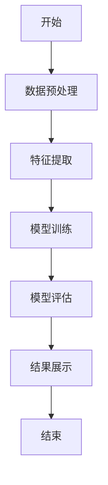
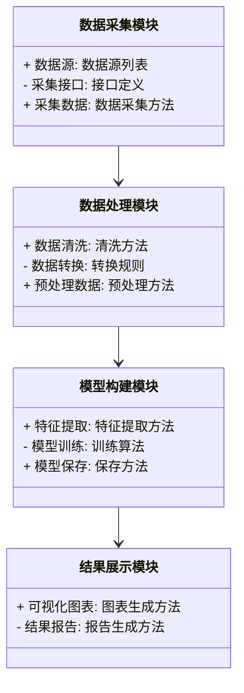

                 


# AI智能体在公司治理评估中的应用

## 关键词：AI智能体，公司治理，评估模型，算法原理，系统架构

## 摘要：  
本文探讨了AI智能体在公司治理评估中的应用，分析了公司治理评估的理论基础，详细讲解了AI智能体的基本原理及其在公司治理评估中的应用场景。通过具体的算法模型和系统架构设计，展示了AI智能体如何提升公司治理评估的效率和准确性，并通过实际案例分析验证了其有效性。文章最后总结了AI智能体在公司治理评估中的优势与挑战，并展望了未来的发展方向。

---

## 第1章 AI智能体与公司治理评估概述

### 1.1 AI智能体的基本概念

#### 1.1.1 AI智能体的定义与特点
AI智能体（Artificial Intelligence Agent）是一种能够感知环境、做出决策并执行动作的智能系统。其特点包括自主性、反应性、目标导向性和学习能力。AI智能体能够通过传感器获取信息，利用算法处理信息，并根据结果采取行动。

#### 1.1.2 AI智能体的分类与应用场景
AI智能体主要分为基于规则的智能体、基于模型的智能体和基于数据驱动的智能体。在公司治理评估中，AI智能体可以用于数据分析、风险评估和决策支持等场景。

#### 1.1.3 公司治理评估的基本概念
公司治理评估是对公司治理结构、治理效率和治理效果的综合评价。评估内容包括股东权益保护、董事会结构优化、高管责任履行等方面。

### 1.2 公司治理评估的背景与挑战

#### 1.2.1 公司治理的核心要素
公司治理的核心要素包括股权结构、董事会结构、高管激励、内部控制和信息披露等。

#### 1.2.2 传统公司治理评估的局限性
传统评估方法依赖人工分析，存在效率低、主观性强、数据量有限等问题。

#### 1.2.3 AI智能体在公司治理评估中的优势
AI智能体能够快速处理大量数据，提供客观、精准的评估结果，并支持动态调整和优化。

### 1.3 本章小结
本章介绍了AI智能体的基本概念和分类，分析了公司治理评估的背景和挑战，并强调了AI智能体在提升公司治理评估效率和准确性中的重要作用。

---

## 第2章 公司治理评估的理论框架

### 2.1 公司治理的主要模型

#### 2.1.1 詹森模型
詹森模型关注股东价值最大化，强调董事会在公司治理中的核心作用。

#### 2.1.2 威廉姆斯模型
威廉姆斯模型强调公司治理的系统性，包括股东、董事会、高管和利益相关者之间的相互作用。

#### 2.1.3 其他相关模型
包括利益相关者理论和代理成本理论等。

### 2.2 公司治理评估的关键指标

#### 2.2.1 股东价值最大化
通过财务指标（如ROE、ROA）和市场指标（如股价）衡量。

#### 2.2.2 风险管理与内部控制
通过内部控制有效性评估和风险敞口分析衡量。

#### 2.2.3 企业社会责任
通过环境、社会和治理（ESG）指标衡量。

### 2.3 本章小结
本章介绍了公司治理的主要模型和关键评估指标，为后续AI智能体的应用提供了理论基础。

---

## 第3章 AI智能体的基本原理

### 3.1 AI智能体的组成要素

#### 3.1.1 感知层
通过数据采集和特征提取，获取公司治理相关的数据。

#### 3.1.2 决策层
利用机器学习算法，对数据进行分析和建模，生成评估结果。

#### 3.1.3 执行层
根据决策层的结果，生成优化建议或自动调整治理结构。

### 3.2 AI智能体的核心算法

#### 3.2.1 机器学习算法
包括线性回归、逻辑回归和随机森林等。

#### 3.2.2 自然语言处理算法
用于分析公司治理相关的文本数据，如年报和公告。

#### 3.2.3 强化学习算法
用于动态调整评估模型，提高评估准确性。

### 3.3 AI智能体的分类与特点

#### 3.3.1 基于规则的智能体
通过预设规则进行判断，适用于简单场景。

#### 3.3.2 基于模型的智能体
基于数学模型进行预测，适用于复杂场景。

#### 3.3.3 基于数据驱动的智能体
通过大数据分析进行预测，适用于需要实时反馈的场景。

### 3.4 本章小结
本章详细讲解了AI智能体的基本原理和核心算法，为后续的应用提供了技术基础。

---

## 第4章 AI智能体在公司治理评估中的应用场景

### 4.1 AI智能体在公司治理评估中的应用场景

#### 4.1.1 合规性评估
通过AI智能体分析公司治理是否符合相关法律法规。

#### 4.1.2 风险评估
通过AI智能体识别公司治理中的潜在风险，并提供风险预警。

#### 4.1.3 绩效评估
通过AI智能体分析公司治理对绩效的影响，提供优化建议。

### 4.2 具体应用场景的实现

#### 4.2.1 数据采集与处理
通过网络爬虫获取公司治理相关数据，并进行清洗和预处理。

#### 4.2.2 数据分析与建模
利用机器学习算法构建评估模型，并进行模型训练和优化。

#### 4.2.3 结果展示与决策支持
通过可视化工具展示评估结果，并为决策者提供优化建议。

### 4.3 本章小结
本章详细讲解了AI智能体在公司治理评估中的具体应用场景及其实现过程。

---

## 第5章 算法原理讲解

### 5.1 评估模型的数学公式

#### 5.1.1 线性回归模型
$$ y = \beta_0 + \beta_1x_1 + \beta_2x_2 + ... + \beta_nx_n + \epsilon $$

#### 5.1.2 逻辑回归模型
$$ P(y=1|x) = \frac{e^{\beta_0 + \beta_1x_1 + ... + \beta_nx_n}}{1 + e^{\beta_0 + \beta_1x_1 + ... + \beta_nx_n}} $$

#### 5.1.3 随机森林模型
随机森林是一种基于决策树的集成学习算法，通过投票机制进行预测。

### 5.2 算法实现的流程图


### 5.3 Python代码实现

```python
import pandas as pd
from sklearn.ensemble import RandomForestClassifier
from sklearn.metrics import accuracy_score

# 数据预处理
data = pd.read_csv('governance_data.csv')
X = data.drop('target', axis=1)
y = data['target']

# 模型训练
model = RandomForestClassifier()
model.fit(X, y)

# 模型评估
y_pred = model.predict(X)
print("准确率:", accuracy_score(y, y_pred))
```

### 5.4 本章小结
本章详细讲解了评估模型的数学公式和算法实现过程，并通过代码示例展示了如何利用AI智能体进行公司治理评估。

---

## 第6章 系统架构设计

### 6.1 系统功能设计

#### 6.1.1 数据采集模块
负责从多种数据源获取公司治理相关数据。

#### 6.1.2 数据处理模块
对数据进行清洗、转换和预处理。

#### 6.1.3 模型构建模块
利用机器学习算法构建评估模型。

#### 6.1.4 结果展示模块
通过可视化工具展示评估结果。

### 6.2 系统架构图


### 6.3 系统接口设计

#### 6.3.1 数据接口
提供RESTful API，用于数据的上传和下载。

#### 6.3.2 模型接口
提供API，用于模型的训练和预测。

#### 6.3.3 结果接口
提供API，用于获取评估结果和可视化图表。

### 6.4 本章小结
本章详细讲解了系统的功能设计和架构设计，并通过类图展示了各个模块之间的关系。

---

## 第7章 项目实战

### 7.1 环境安装与配置

#### 7.1.1 安装Python和必要的库
安装Python和pandas、scikit-learn等库。

#### 7.1.2 安装Jupyter Notebook
用于数据处理和模型训练。

### 7.2 核心代码实现

#### 7.2.1 数据预处理
```python
import pandas as pd
import numpy as np

# 数据加载
data = pd.read_csv('governance_data.csv')

# 数据清洗
data = data.dropna()
data = data.drop_duplicates()

# 特征工程
from sklearn.preprocessing import StandardScaler
scaler = StandardScaler()
X_scaled = scaler.fit_transform(data.drop('target', axis=1))
```

#### 7.2.2 模型训练
```python
from sklearn.ensemble import RandomForestClassifier
from sklearn.model_selection import train_test_split

X_train, X_test, y_train, y_test = train_test_split(X_scaled, data['target'], test_size=0.2, random_state=42)

model = RandomForestClassifier(n_estimators=100, random_state=42)
model.fit(X_train, y_train)

# 模型评估
y_pred = model.predict(X_test)
print("准确率:", accuracy_score(y_test, y_pred))
```

#### 7.2.3 结果可视化
```python
import matplotlib.pyplot as plt

# 绘制混淆矩阵
from sklearn.metrics import confusion_matrix
cm = confusion_matrix(y_test, y_pred)
plt.imshow(cm, cmap='binary')
plt.xlabel('预测值')
plt.ylabel('真实值')
plt.show()
```

### 7.3 案例分析与解读

#### 7.3.1 案例背景
分析一家公司的治理结构和绩效。

#### 7.3.2 数据分析
利用AI智能体分析公司的治理风险和绩效表现。

#### 7.3.3 结果展示
生成可视化图表和优化建议。

### 7.4 本章小结
本章通过实际案例展示了如何利用AI智能体进行公司治理评估，并详细讲解了实现过程。

---

## 第8章 总结与展望

### 8.1 本章总结
总结了AI智能体在公司治理评估中的应用，分析了其优势和局限性。

### 8.2 未来展望
展望了AI智能体在公司治理评估中的发展方向，包括更复杂的模型和更广泛的应用场景。

### 8.3 最佳实践 tips
提供了一些实用的建议，帮助读者更好地应用AI智能体进行公司治理评估。

### 8.4 本章小结
本章总结了全文，并展望了未来的发展方向，为读者提供了进一步的研究方向。

---

## 作者信息

作者：AI天才研究院/AI Genius Institute & 禅与计算机程序设计艺术 /Zen And The Art of Computer Programming

