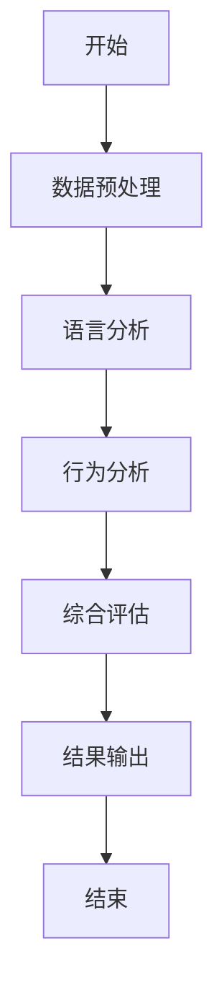
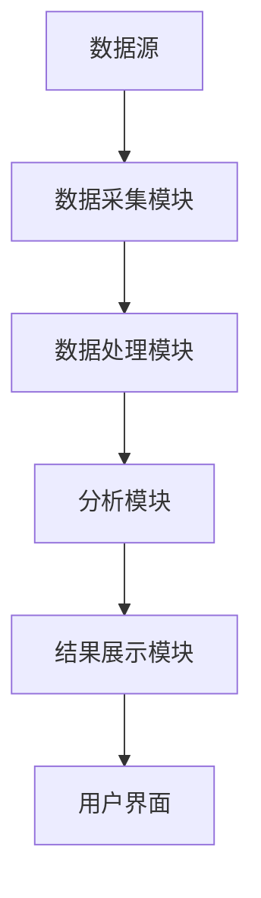
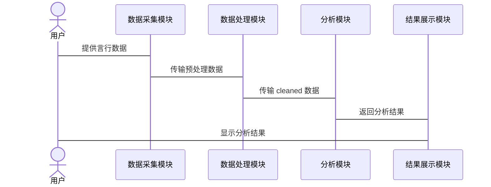

                 


# AI智能体在分析公司高管言行不一致性中的应用

**关键词**：AI智能体、高管言行分析、自然语言处理、行为分析、数据挖掘

**摘要**：本文探讨了如何利用AI智能体分析公司高管的言行不一致性。通过背景介绍、核心概念、算法原理、系统架构、项目实战等部分，详细分析了AI智能体在高管言行分析中的应用价值和实现方法，为企业的高管行为管理提供了新的思路和技术支持。

---

# 第1章 背景介绍

## 1.1 问题背景

### 1.1.1 高管言行不一致的定义
高管言行不一致指的是公司高层管理者在言论和实际行动中表现出不一致的行为模式，这可能影响企业的决策和声誉。

### 1.1.2 高管言行不一致对企业的影响
- 影响企业决策的准确性和一致性。
- 影响员工士气和企业文化的建设。
- 可能引发信任危机和声誉损失。

### 1.1.3 传统方法的局限性
- 传统的人工分析效率低、主观性强。
- 数据量大、信息复杂，难以全面分析。

## 1.2 问题描述

### 1.2.1 高管言行不一致的表现形式
- 语言表述与实际行为的差异。
- 决策与执行过程中的矛盾。
- 团队协作中的不一致行为。

### 1.2.2 问题的复杂性和挑战性
- 数据来源多样化，处理难度大。
- 需要结合语境和背景信息进行分析。

### 1.2.3 问题的边界与外延
- 分析范围限于高管层，不涉及普通员工。
- 数据范围包括高管的公开言论和行为记录。

## 1.3 问题解决

### 1.3.1 AI智能体的应用价值
- 提高分析效率和准确性。
- 实现自动化、实时化的分析能力。

### 1.3.2 AI智能体在高管言行分析中的优势
- 能够处理大规模数据。
- 可以进行语义理解和行为预测。

### 1.3.3 解决方案的可行性分析
- 技术可行性：AI智能体的发展成熟。
- 经济可行性：降低人工成本，提高效率。
- 实用性：为企业高管管理提供科学依据。

## 1.4 本章小结
本章介绍了高管言行不一致的定义、影响和传统方法的局限性，提出了利用AI智能体进行分析的解决方案，并分析了其可行性和优势。

---

# 第2章 AI智能体与高管言行分析的核心概念

## 2.1 AI智能体的定义与原理

### 2.1.1 AI智能体的基本概念
AI智能体是一种能够感知环境、自主决策并执行任务的智能系统，具备学习、推理和自适应能力。

### 2.1.2 AI智能体的核心原理
- 感知环境：通过传感器或数据输入获取信息。
- 决策与推理：基于逻辑推理和概率模型做出决策。
- 行动执行：根据决策结果执行具体操作。

### 2.1.3 AI智能体的关键特性
- 智能性：具备自主学习和问题解决能力。
- 适应性：能够根据环境变化调整行为。
- 可扩展性：支持大规模数据处理和复杂任务。

## 2.2 高管言行分析的理论框架

### 2.2.1 高管言行分析的定义
通过分析高管的语言和行为数据，识别其言行一致性，评估其领导能力和管理风格。

### 2.2.2 高管言行分析的理论模型
- 语言分析模型：基于自然语言处理技术，分析高管的言论内容。
- 行为分析模型：通过行为数据（如会议记录、决策记录）进行分析。
- 综合评估模型：结合语言和行为数据，评估高管的言行一致性。

### 2.2.3 高管言行分析的关键要素
- 数据来源：包括高管的公开演讲、会议记录、决策文件等。
- 分析方法：自然语言处理、行为建模、数据挖掘。
- 评估标准：一致性、逻辑性、可信度。

## 2.3 AI智能体与高管言行分析的结合

### 2.3.1 AI智能体在高管言行分析中的作用
- 数据采集与处理：自动收集和整理高管的言行数据。
- 语义分析：理解高管的言论内容和意图。
- 行为预测：基于历史数据预测未来行为。

### 2.3.2 AI智能体与高管言行分析的关联性
- 数据驱动：AI智能体依赖大量数据进行分析。
- 自动化处理：AI智能体能够自动化处理复杂的数据和任务。
- 实时监控：AI智能体可以实时监控高管的言行变化。

### 2.3.3 AI智能体在高管言行分析中的优势
- 高效性：快速处理大量数据，提高分析效率。
- 客观性：减少人为干扰，确保分析结果的客观性。
- 智能性：能够识别复杂模式和潜在问题。

## 2.4 核心概念属性对比

| **概念**       | **AI智能体**               | **高管言行分析**               |
|----------------|---------------------------|-------------------------------|
| 定义           | 具备智能性和自主性的系统   | 分析高管语言和行为一致性         |
| 核心原理       | 感知、决策、执行           | 语言分析、行为建模、综合评估     |
| 应用领域       | 各行各业                   | 企业管理和领导力评估             |
| 技术特点       | 自主学习、实时响应         | 数据驱动、模型驱动               |

## 2.5 ER实体关系图

```mermaid
erd
    股东
    投资者
    企业
    高管
    会议记录
    决策文件
    演讲记录
    行为数据
    语言数据
    分析结果
```

---

# 第3章 算法原理与实现

## 3.1 算法原理

### 3.1.1 自然语言处理算法
- 词袋模型：将文本表示为词的集合。
- 词嵌入：使用Word2Vec或BERT等模型生成词向量。
- 情感分析：识别文本中的情感倾向。

### 3.1.2 行为分析算法
- 时间序列分析：分析行为数据的时间模式。
- 聚类分析：将相似的行为模式归为一类。
- 异常检测：识别异常行为。

### 3.1.3 综合评估算法
- 加权评分：根据语言和行为数据的权重计算综合评分。
- 回归分析：预测高管的未来行为表现。
- 分类算法：将高管分为一致和不一致两类。

### 3.1.4 算法流程图



## 3.2 算法实现

### 3.2.1 Python代码实现

```python
import numpy as np
from sklearn.feature_extraction.text import TfidfVectorizer
from sklearn.naive_bayes import MultinomialNB

# 数据预处理
def preprocess_data(texts):
    vectorizer = TfidfVectorizer()
    X = vectorizer.fit_transform(texts)
    return X

# 语言分析
def analyze_language(X):
    clf = MultinomialNB()
    clf.fit(X, y)
    return clf.predict(X)

# 行为分析
def analyze_behavior(behavior_data):
    from sklearn.cluster import KMeans
    kmeans = KMeans(n_clusters=2)
    kmeans.fit(behavior_data)
    return kmeans.labels_

# 综合评估
def evaluate_consistency(language_scores, behavior_scores):
    scores = np.array([language_scores, behavior_scores])
    weighted_score = np.dot(scores, [0.6, 0.4])
    return weighted_score
```

### 3.2.2 数学模型与公式

- 词袋模型表示：
  $$ X = \{x_1, x_2, ..., x_n\} $$
  其中，$$ x_i $$ 表示第i个词的出现情况。

- 词嵌入模型：
  $$ W \in \mathbb{R}^{V \times D} $$
  其中，$$ V $$ 是词表大小，$$ D $$ 是嵌入维度。

- 加权评分公式：
  $$ \text{score} = \sum_{i=1}^{m} w_i \cdot s_i $$
  其中，$$ w_i $$ 是第i个特征的权重，$$ s_i $$ 是对应的评分。

---

# 第4章 系统架构与设计

## 4.1 系统架构设计

### 4.1.1 系统模块划分
- 数据采集模块：收集高管的言行数据。
- 数据处理模块：清洗和预处理数据。
- 分析模块：执行语言和行为分析。
- 结果展示模块：输出分析结果。

### 4.1.2 系统架构图



### 4.1.3 系统交互流程



---

# 第5章 项目实战

## 5.1 环境配置

### 5.1.1 安装依赖
```bash
pip install numpy scikit-learn tensorflow
```

### 5.1.2 数据准备
- 获取高管的演讲记录、会议记录、决策文件等数据。

## 5.2 核心代码实现

### 5.2.1 数据预处理
```python
import pandas as pd
from sklearn.model_selection import train_test_split

data = pd.read_csv('executive_data.csv')
X_train, X_test, y_train, y_test = train_test_split(data['text'], data['label'])
```

### 5.2.2 语言分析
```python
from sklearn.feature_extraction.text import TfidfVectorizer
from sklearn.linear_model import LogisticRegression

vectorizer = TfidfVectorizer()
X_train_vec = vectorizer.fit_transform(X_train)
model = LogisticRegression()
model.fit(X_train_vec, y_train)
```

### 5.2.3 行为分析
```python
from sklearn.cluster import KMeans

behavior_data = pd.read_csv('behavior.csv')
X_behavior = behavior_data[['action1', 'action2', 'action3']]
model = KMeans(n_clusters=2)
model.fit(X_behavior)
```

### 5.2.4 综合评估
```python
def evaluate_language_behavior(lang_score, behav_score):
    weighted = 0.6 * lang_score + 0.4 * behav_score
    return weighted > 0.5

evaluate_language_behavior(0.7, 0.6)  # 返回 True 表示不一致
```

## 5.3 案例分析与结果解读

### 5.3.1 案例分析
分析某公司高管在会议中的发言与实际决策的不一致情况。

### 5.3.2 结果解读
- 语言分析结果：高管的言论中存在矛盾。
- 行为分析结果：高管的决策与承诺不符。
- 综合评估结果：高管言行不一致评分较高，需引起关注。

## 5.4 项目总结

### 5.4.1 项目成果
- 成功构建了高管言行分析系统。
- 提高了分析的效率和准确性。

### 5.4.2 经验与教训
- 数据质量对分析结果影响重大。
- 系统需要定期更新和优化。

---

# 第6章 最佳实践与总结

## 6.1 最佳实践

### 6.1.1 数据质量管理
确保数据的完整性和准确性。

### 6.1.2 模型优化
定期更新模型，提高分析精度。

### 6.1.3 人机结合
结合人工审核，确保分析结果的准确性。

## 6.2 小结

### 6.2.1 项目总结
本文详细介绍了AI智能体在高管言行分析中的应用，从理论到实践，展示了其在企业管理中的巨大潜力。

### 6.2.2 注意事项
- 数据隐私保护。
- 模型的可解释性。
- 人工干预的必要性。

## 6.3 未来展望

### 6.3.1 技术发展
AI智能体将更加智能化和自主化。

### 6.3.2 应用领域
高管言行分析将扩展到更多领域，如领导力培训和企业治理。

## 6.4 拓展阅读

### 6.4.1 推荐书籍
- 《机器学习实战》
- 《自然语言处理入门》

### 6.4.2 推荐博客
- 禅与计算机程序设计艺术
- AI Genius Institute

---

# 作者：AI天才研究院/AI Genius Institute & 禅与计算机程序设计艺术/Zen And The Art of Computer Programming

