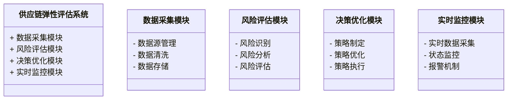
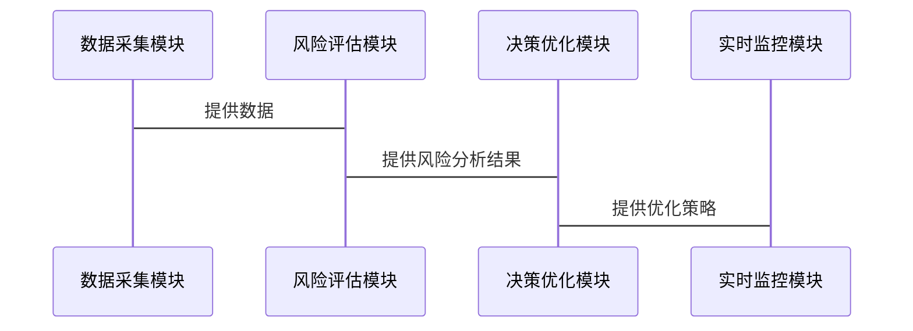

                 


# AI智能体在评估公司供应链弹性中的作用

## 关键词：AI智能体，供应链弹性，风险管理，算法模型，优化策略

## 摘要：本文探讨AI智能体在评估公司供应链弹性中的作用。通过分析供应链弹性的核心概念、AI智能体的技术原理，结合实际应用场景，详细阐述如何利用AI技术优化供应链弹性评估过程，提升企业应对风险的能力。

---

# 第1章: 供应链弹性与AI智能体概述

## 1.1 供应链弹性的概念与重要性

### 1.1.1 供应链弹性的定义
供应链弹性是指供应链在面对外部干扰、市场波动或内部问题时，能够迅速调整、恢复并维持稳定运作的能力。它包括抗风险能力、适应能力和快速响应能力。

### 1.1.2 供应链弹性的重要性
- 供应链弹性是企业应对不确定性的重要保障。
- 弹性供应链能够减少中断带来的损失，提高企业的生存能力和竞争力。
- 在全球化和数字化背景下，供应链弹性对企业可持续发展至关重要。

### 1.1.3 供应链弹性与企业可持续发展的关系
供应链弹性不仅是企业运营的关键因素，也是实现可持续发展的重要基础。通过提高供应链弹性，企业可以在复杂多变的环境中保持稳定，同时减少资源浪费和环境影响。

## 1.2 AI智能体的基本概念

### 1.2.1 AI智能体的定义
AI智能体是指具备感知环境、自主决策、执行操作并能够与环境互动的智能系统。它能够通过传感器获取数据，利用算法进行分析和决策，并通过执行机构实现目标。

### 1.2.2 AI智能体的核心特征
- **自主性**：能够自主决策和行动，无需人工干预。
- **反应性**：能够实时感知环境变化并做出反应。
- **学习能力**：通过数据和经验不断优化自身的决策能力。
- **协作性**：能够与其他智能体或系统协同工作。

### 1.2.3 AI智能体与传统算法的区别
传统的算法通常基于固定的规则和数据进行处理，而AI智能体具备学习和适应能力，能够在复杂环境中动态调整策略。

## 1.3 本章小结

- 供应链弹性是企业在复杂环境中保持稳定的关键能力。
- AI智能体具备自主决策、学习和协作等特点，能够在供应链弹性评估中发挥重要作用。
- 通过结合AI智能体，企业可以显著提升供应链弹性评估的效率和准确性。

---

# 第2章: 供应链弹性评估的背景与问题

## 2.1 供应链弹性评估的背景

### 2.1.1 全球化供应链的脆弱性
全球化使得供应链高度依赖全球资源和合作伙伴，但这也带来了更高的脆弱性。任何环节的中断都可能引发连锁反应，导致整个供应链瘫痪。

### 2.1.2 数字化转型对供应链的影响
数字化转型为企业提供了更高效的数据处理和分析能力，但也带来了新的挑战，如数据隐私、网络安全等。AI技术的应用为供应链弹性评估提供了新的工具和方法。

### 2.1.3 企业供应链弹性评估的需求
随着市场竞争的加剧和环境的不确定性增加，企业越来越意识到供应链弹性的重要性。通过科学的评估方法，企业可以更好地识别和应对潜在风险。

## 2.2 供应链弹性评估的核心问题

### 2.2.1 供应链风险的多样性
供应链中断可能由多种因素引起，包括自然灾害、政策变化、市场需求波动等。不同类型的中断需要不同的应对策略。

### 2.2.2 数据驱动的供应链优化
通过收集和分析大量的供应链数据，企业可以更好地理解供应链的运行状况，发现潜在问题，并制定优化策略。

### 2.2.3 AI智能体在供应链弹性中的作用
AI智能体可以通过实时监控、预测分析和自适应决策，帮助企业在供应链中断时快速响应，减少损失。

## 2.3 本章小结

- 供应链弹性评估的背景包括全球化带来的脆弱性和数字化转型的机遇与挑战。
- 供应链弹性评估的核心问题包括风险多样性、数据驱动优化和AI智能体的应用。
- AI智能体在供应链弹性中的作用是通过实时监控和决策优化，帮助企业应对复杂环境。

---

# 第3章: 供应链弹性评估的核心概念

## 3.1 供应链弹性评估的理论基础

### 3.1.1 供应链弹性评估的模型
供应链弹性评估模型通常包括以下几个部分：风险识别、风险分析、风险评估和应对策略。模型的设计需要考虑供应链的各个环节和潜在风险。

### 3.1.2 供应链弹性评估的指标体系
常用的供应链弹性指标包括：供应链中断的时间、恢复所需成本、供应商的多样性、库存水平的合理性等。

### 3.1.3 供应链弹性评估的数学模型
供应链弹性评估的数学模型可以通过概率论和统计学方法构建。例如，可以利用马尔可夫链模型预测供应链中断的可能性，或者通过线性规划优化供应链的资源配置。

## 3.2 AI智能体在供应链弹性评估中的作用

### 3.2.1 AI智能体的决策能力
AI智能体可以通过机器学习算法分析历史数据，识别潜在风险，并制定最优决策。例如，通过预测分析，AI智能体可以提前预测供应链中断的可能性，并制定应对策略。

### 3.2.2 AI智能体的数据处理能力
AI智能体能够处理大量复杂的数据，包括结构化数据（如库存水平、运输时间）和非结构化数据（如市场趋势、社交媒体信息）。通过数据处理，AI智能体可以提供更全面的供应链视图。

### 3.2.3 AI智能体的自适应能力
AI智能体能够根据环境的变化动态调整策略。例如，在供应链中断时，AI智能体可以快速找到替代供应商，调整生产计划，以最小化中断带来的损失。

## 3.3 供应链弹性评估与AI智能体的结合

### 3.3.1 供应链弹性评估的多维度分析
供应链弹性评估需要从多个维度进行分析，包括供应商的稳定性、物流的可靠性、库存的合理性等。AI智能体可以通过多维度的数据分析，提供更全面的评估结果。

### 3.3.2 AI智能体在供应链弹性评估中的应用场景
AI智能体可以在供应链弹性评估的各个环节中发挥作用，包括风险识别、预测分析、决策优化和实时监控。例如，在风险识别阶段，AI智能体可以通过自然语言处理技术分析新闻报道，识别潜在风险。

### 3.3.3 供应链弹性评估的未来趋势
随着AI技术的不断进步，供应链弹性评估将更加智能化和自动化。未来的AI智能体将具备更强的学习能力和自适应能力，能够更好地应对复杂的供应链环境。

## 3.4 本章小结

- 供应链弹性评估的理论基础包括模型构建、指标体系和数学模型。
- AI智能体在供应链弹性评估中的作用体现在决策能力、数据处理能力和自适应能力。
- 供应链弹性评估与AI智能体的结合将推动供应链管理的智能化和高效化。

---

# 第4章: 供应链弹性评估的算法原理

## 4.1 供应链弹性评估的算法选择

### 4.1.1 常见的供应链优化算法
常用的供应链优化算法包括线性规划、动态规划、遗传算法等。这些算法可以帮助企业优化供应链的资源配置，降低运营成本。

### 4.1.2 AI智能体在供应链弹性评估中的算法选择
在供应链弹性评估中，基于强化学习的AI智能体模型表现出色。强化学习是一种通过试错和奖励机制优化决策的算法，适用于复杂和动态的环境。

### 4.1.3 基于强化学习的供应链弹性评估算法
基于强化学习的AI智能体模型可以通过模拟供应链环境，学习最优的决策策略。例如，AI智能体可以在模拟中断中学习如何快速找到替代供应商，以最小化中断带来的损失。

## 4.2 基于强化学习的AI智能体模型

### 4.2.1 强化学习的基本原理
强化学习是一种通过试错和奖励机制优化决策的算法。智能体通过与环境互动，逐步学习最优策略。

### 4.2.2 基于强化学习的AI智能体模型设计
基于强化学习的AI智能体模型通常包括以下几个部分：状态空间、动作空间、奖励函数和策略网络。模型通过不断试错，优化策略网络，以提高决策的准确性。

### 4.2.3 基于强化学习的AI智能体模型

```python
class Agent:
    def __init__(self, state_space, action_space):
        self.state_space = state_space
        self.action_space = action_space
        # 策略网络
        self.policy = self.build_policy_network()
    
    def build_policy_network(self):
        # 网络结构设计
        pass
    
    def act(self, state):
        # 根据当前状态选择动作
        pass
    
    def train(self, state, action, reward, next_state):
        # 更新策略网络
        pass
```

## 4.3 本章小结

- 供应链弹性评估的算法选择需要考虑算法的适用性和复杂性。
- 基于强化学习的AI智能体模型在供应链弹性评估中表现优异。
- 通过强化学习，AI智能体可以在复杂环境中动态调整策略，提高供应链弹性的评估和优化能力。

---

# 第5章: 供应链弹性评估的系统分析与架构设计

## 5.1 供应链弹性评估的系统功能设计

### 5.1.1 系统功能模块
供应链弹性评估系统通常包括以下几个功能模块：数据采集、风险评估、决策优化和实时监控。

### 5.1.2 系统功能设计的领域模型


## 5.2 系统架构设计

### 5.2.1 系统架构设计


### 5.2.2 系统接口设计


## 5.3 本章小结

- 供应链弹性评估系统的功能模块包括数据采集、风险评估、决策优化和实时监控。
- 系统架构设计需要考虑模块之间的协同工作和数据流的高效传递。
- 通过系统架构设计，可以实现供应链弹性评估的高效性和准确性。

---

# 第6章: 供应链弹性评估的项目实战

## 6.1 项目背景

### 6.1.1 项目目标
本项目旨在利用AI智能体技术，构建一个高效的供应链弹性评估系统，帮助企业应对供应链中断的风险。

### 6.1.2 项目范围
本项目涵盖供应链弹性评估的各个方面，包括数据采集、风险评估、决策优化和实时监控。

## 6.2 系统核心实现

### 6.2.1 环境安装
- 安装Python和相关库（如TensorFlow、Keras、Scikit-learn等）。
- 安装强化学习框架（如OpenAI Gym）。

### 6.2.2 核心代码实现

```python
import numpy as np
import gym

class SupplyChainEnv(gym.Env):
    def __init__(self):
        super().__init__()
        # 定义状态空间和动作空间
        self.observation_space = gym.spaces.Box(low=0, high=100, shape=(1,))
        self.action_space = gym.spaces.Discrete(5)

    def step(self, action):
        # 状态转移和奖励计算
        pass

    def reset(self):
        # 初始化环境
        pass
```

## 6.3 案例分析与详细解读

### 6.3.1 案例分析
假设某企业面临供应商中断的风险，AI智能体可以通过分析历史数据，识别潜在风险，并制定最优的应对策略。

### 6.3.2 详细解读
通过AI智能体的实时监控和预测分析，企业可以在供应链中断时快速响应，减少损失。例如，AI智能体可以自动寻找替代供应商，调整生产计划，以最小化中断带来的影响。

## 6.4 本章小结

- 项目实战需要结合实际需求，选择合适的算法和工具。
- 通过AI智能体技术，企业可以显著提升供应链弹性评估的效率和准确性。
- 案例分析和详细解读有助于读者更好地理解AI智能体在供应链弹性评估中的应用。

---

# 第7章: 供应链弹性评估的最佳实践

## 7.1 小结

- 供应链弹性评估是企业在复杂环境中保持稳定的关键能力。
- AI智能体在供应链弹性评估中的作用日益重要。
- 通过结合AI智能体技术，企业可以显著提升供应链弹性的评估和优化能力。

## 7.2 注意事项

- 在实施供应链弹性评估时，企业需要充分考虑数据的准确性和完整性。
- AI智能体的应用需要结合企业的实际情况，避免过于依赖技术而忽视人的因素。
- 供应链弹性评估是一个持续优化的过程，需要企业不断学习和调整。

## 7.3 拓展阅读

- 《供应链风险管理》
- 《强化学习在供应链管理中的应用》
- 《AI智能体在企业中的应用》

---

# 作者：AI天才研究院 & 禅与计算机程序设计艺术

通过本文，我们详细探讨了AI智能体在供应链弹性评估中的作用，从理论基础到实际应用，为读者提供了全面的视角。希望本文能够为企业的供应链弹性评估提供有价值的参考和启示。

