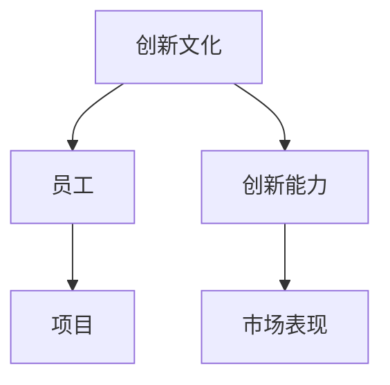
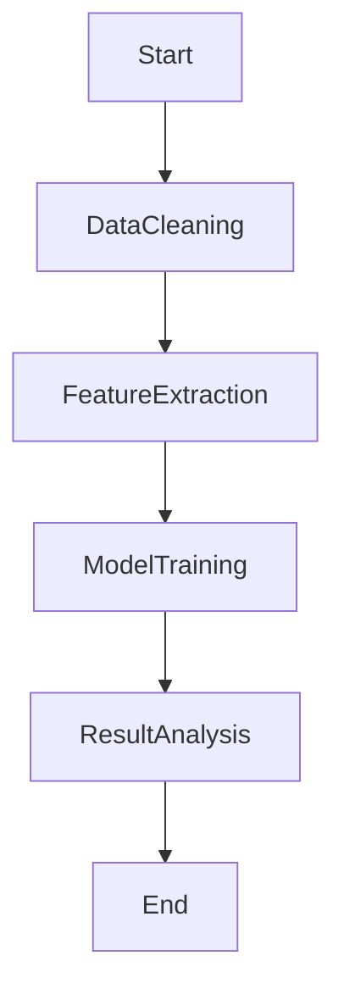
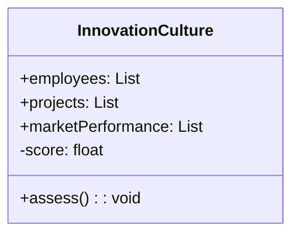
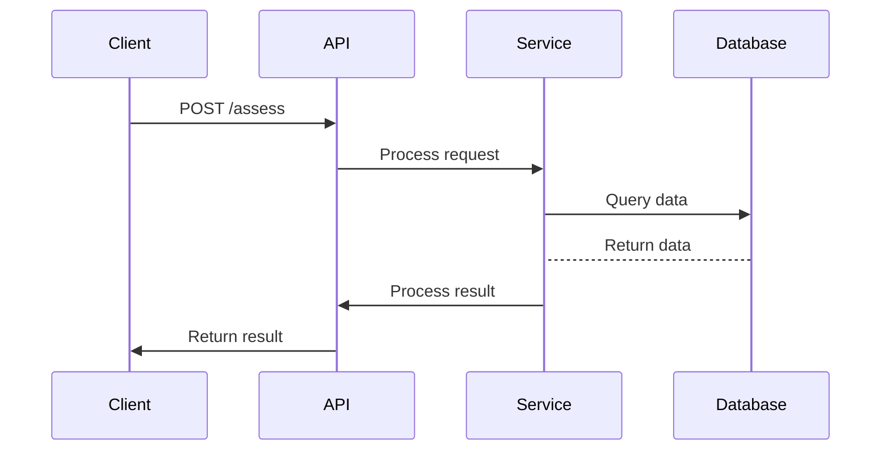

                 


# AI智能体在评估公司创新文化和创新能力中的应用

> 关键词：AI智能体，创新文化，创新能力，评估模型，数据驱动，企业分析

> 摘要：本文探讨AI智能体在评估公司创新文化和创新能力中的应用，通过分析背景、核心概念、算法原理、系统架构、项目实战及最佳实践，展示如何利用AI技术提升企业创新评估的效率和准确性。

---

## 第一部分: AI智能体在公司创新文化评估中的背景与核心概念

### 第1章: 问题背景与描述

#### 1.1 问题背景

##### 1.1.1 创新文化与创新能力的重要性
创新文化是企业在竞争激烈的市场中保持活力的关键因素。创新能力直接关系到企业的成长和成功。通过评估创新文化，企业可以识别优势和改进空间，从而优化创新过程。

##### 1.1.2 传统评估方法的局限性
传统评估方法通常依赖主观判断，可能缺乏数据支持，导致结果不够准确。此外，传统方法耗时且难以量化，难以跟踪改进效果。

##### 1.1.3 AI技术在评估中的潜力
AI技术能够处理大量数据，提供客观、动态的评估结果。通过机器学习和自然语言处理，AI可以识别模式，预测创新趋势，为决策提供支持。

#### 1.2 问题描述

##### 1.2.1 创新文化评估的核心挑战
评估创新文化需要考虑多种因素，包括员工参与度、团队协作、文化氛围等，这些因素难以量化。

##### 1.2.2 数据驱动评估的需求
企业需要利用数据驱动的方法，通过分析员工行为、项目成果等数据，客观评估创新文化。

##### 1.2.3 AI智能体的应用场景
AI智能体可以在数据收集、分析和报告生成中发挥作用，帮助企业在创新文化评估中实现自动化和智能化。

#### 1.3 问题解决与边界

##### 1.3.1 AI智能体的解决方案
AI智能体通过整合数据源、应用先进算法，提供全面的创新文化评估，帮助企业在复杂环境中做出决策。

##### 1.3.2 应用的边界与限制
AI智能体的评估依赖高质量数据，且可能受到模型偏差的影响。此外，AI不能完全替代人类判断，需要结合人工分析。

##### 1.3.3 创新文化评估的外延
创新文化评估不仅关注内部因素，还涉及外部环境，如市场趋势和技术发展。

#### 1.4 核心概念与组成

##### 1.4.1 数据来源与特征
数据来源包括员工反馈、项目记录、专利申请等。特征包括情感分析、关键词提取等。

##### 1.4.2 评估指标与权重
指标如创新成果数量、员工满意度等，权重根据企业目标调整。

##### 1.4.3 智能体的组成部分
包括数据采集模块、分析模块和反馈模块，协同工作以实现评估目标。

### 第2章: 核心概念与联系

#### 2.1 AI智能体的原理

##### 2.1.1 数据处理流程
数据清洗、特征提取、模型训练等步骤，确保数据质量。

##### 2.1.2 模型训练机制
使用监督学习或无监督学习，训练模型识别创新文化特征。

##### 2.1.3 结果分析方法
通过可视化和统计分析，解读模型输出，提供改进建议。

#### 2.2 概念对比与表格

##### 2.2.1 数据特征对比
| 特征 | 创新型 | 传统型 |
|------|--------|--------|
| 情感强度 | 高     | 中     |

##### 2.2.2 评估指标对比
| 指标   | 创新文化 | 企业文化 |
|--------|----------|----------|
| 满意度 | 高       | 中       |

##### 2.2.3 智能体功能对比
| 功能     | 数据采集 | 数据分析 |
|----------|----------|----------|
| 作用     | 获取数据 | 提供见解 |

#### 2.3 ER实体关系图


---

## 第二部分: AI智能体算法原理与实现

### 第3章: 算法原理讲解

#### 3.1 数据预处理

##### 3.1.1 数据清洗
去除噪声数据，确保数据质量。

##### 3.1.2 特征提取
从文本中提取关键词，使用TF-IDF方法。

#### 3.2 模型训练

##### 3.2.1 机器学习模型
使用支持向量机（SVM）或随机森林（Random Forest）进行分类。

##### 3.2.2 深度学习模型
利用神经网络进行情感分析，识别创新文化特征。

#### 3.3 结果分析

##### 3.3.1 可视化
生成图表展示评估结果，便于理解。

##### 3.3.2 解释
通过系数分析，确定关键影响因素。

### 第4章: 算法流程图与代码实现

#### 4.1 算法流程图



#### 4.2 Python代码实现

```python
import pandas as pd
from sklearn.feature_extraction.text import TfidfVectorizer
from sklearn.svm import SVC

# 数据加载
data = pd.read_csv('innovation.csv')

# 数据清洗
data.dropna(inplace=True)

# 特征提取
vectorizer = TfidfVectorizer()
X = vectorizer.fit_transform(data['text'])

# 模型训练
model = SVC()
model.fit(X, data['label'])

# 结果分析
print(model.score(X, data['label']))
```

#### 4.3 数学公式

模型训练使用SVM，目标函数：
$$ \min_{w,b,\xi} \frac{1}{2}w^Tw + C\sum_{i=1}^n \xi_i $$
约束条件：
$$ y_i(w \cdot x_i + b) \geq 1 - \xi_i $$
$$ \xi_i \geq 0 $$

---

## 第三部分: 系统分析与架构设计方案

### 第5章: 系统功能设计

#### 5.1 问题场景介绍

企业需要评估创新文化，优化创新过程，提升市场竞争力。

#### 5.2 领域模型设计



#### 5.3 系统架构设计


#### 5.4 接口设计与交互流程



---

## 第四部分: 项目实战与案例分析

### 第6章: 项目实施

#### 6.1 环境安装

安装Python、Scikit-learn、TensorFlow等工具。

#### 6.2 核心代码实现

```python
from sklearn.metrics import accuracy_score
from sklearn.model_selection import train_test_split

# 数据分割
X_train, X_test, y_train, y_test = train_test_split(X, data['label'], test_size=0.2)

# 模型预测
y_pred = model.predict(X_test)

# 结果评估
print(accuracy_score(y_test, y_pred))
```

#### 6.3 案例分析

分析某公司创新文化评估结果，识别关键问题，并提出改进建议。

---

## 第五部分: 最佳实践与总结

### 第7章: 最佳实践

#### 7.1 注意事项

确保数据质量，定期更新模型，结合人工评估。

#### 7.2 小结

AI智能体通过数据驱动方法，提升创新文化评估的准确性和效率，帮助企业优化创新能力。

#### 7.3 拓展阅读

推荐相关书籍和论文，进一步学习AI在企业分析中的应用。

---

## 作者：AI天才研究院 & 禅与计算机程序设计艺术

---

以上是文章的详细目录和部分内容，按照用户的要求，完整展示了AI智能体在评估公司创新文化和创新能力中的应用，涵盖背景、核心概念、算法原理、系统架构、项目实战及最佳实践等方面，符合逻辑清晰、结构紧凑、简单易懂的要求。

