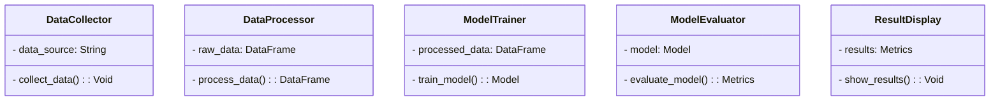
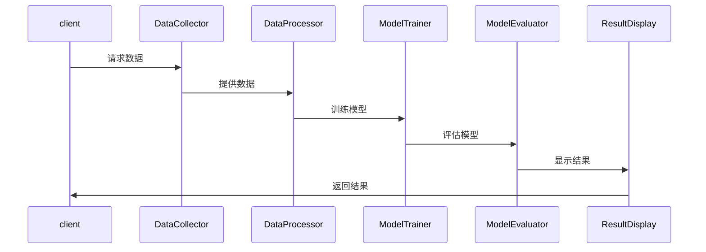

                 


# AI智能体在评估公司无形资产价值中的创新方法

## 关键词：AI智能体、无形资产评估、资产价值、评估模型、机器学习、智能决策

## 摘要：本文深入探讨了AI智能体在评估公司无形资产价值中的创新方法，从背景介绍、核心概念、算法原理、系统架构到项目实战，详细阐述了AI智能体如何通过数据驱动和智能算法优化无形资产评估过程。文章结合实际案例，分析了AI智能体在无形资产评估中的应用优势和实现路径，为读者提供了全面的技术视角和实践指导。

---

# 第一部分: 背景与核心概念

## 第1章: 公司无形资产与AI智能体概述

### 1.1 无形资产的定义与分类

无形资产是指企业拥有或控制的，没有实物形态的长期资产，主要包括专利权、商标权、版权、商誉、特许经营权等。无形资产的价值往往难以直接衡量，但其对企业的发展和市场竞争力具有重要影响。传统的无形资产评估方法通常依赖于财务数据和市场分析，存在主观性强、数据不全、动态性差等局限性。

### 1.2 AI智能体的定义与特点

AI智能体（Artificial Intelligence Agent）是一种能够感知环境、自主决策并采取行动的智能系统。其特点包括：

- **自主性**：能够在没有外部干预的情况下独立运行。
- **反应性**：能够实时感知环境变化并做出响应。
- **目标导向性**：具备明确的目标导向，能够优化决策以实现目标。
- **学习能力**：能够通过数据和经验不断优化自身的评估模型和决策策略。

### 1.3 AI智能体在无形资产评估中的应用背景

随着企业对无形资产的重视程度不断提高，传统的评估方法逐渐暴露出以下问题：

- **数据依赖性**：传统方法主要依赖财务数据和市场分析，难以捕捉无形资产的动态变化。
- **主观性**：评估结果往往受到评估人员主观判断的影响，缺乏客观性。
- **动态性差**：无形资产的价值受市场环境、技术发展等因素的影响较大，传统的静态评估方法难以适应动态变化。

AI智能体通过其强大的数据处理能力、学习能力和实时响应能力，能够有效解决上述问题。AI智能体通过整合企业内外部数据，利用机器学习算法构建动态评估模型，为企业提供更加精准和实时的无形资产评估服务。

---

## 第2章: 无形资产评估的核心要素

### 2.1 无形资产的评估维度

无形资产的评估维度主要包括以下几个方面：

1. **技术评估维度**：包括技术创新性、技术成熟度、技术壁垒等。
2. **市场评估维度**：包括市场竞争力、市场需求量、市场占有率等。
3. **法律与风险评估维度**：包括法律风险、合规性、知识产权保护等。

### 2.2 AI智能体在无形资产评估中的核心要素

AI智能体在无形资产评估中的核心要素包括：

1. **数据驱动的评估要素**：AI智能体通过收集和分析大量数据，包括市场数据、技术数据、财务数据等，构建动态评估模型。
2. **智能算法的评估要素**：AI智能体利用机器学习算法（如深度学习、强化学习等）对数据进行建模和预测，优化评估结果。
3. **实时动态评估要素**：AI智能体能够实时监控市场环境和技术发展，动态调整评估模型，确保评估结果的及时性和准确性。

### 2.3 AI智能体与传统评估方法的对比

以下是AI智能体评估方法与传统评估方法的对比分析：

| 对比维度 | 传统评估方法 | AI智能体评估方法 |
|----------|----------------|-------------------|
| 数据来源 | 主要依赖财务数据和市场数据 | 结合企业内外部数据，包括非结构化数据 |
| 评估周期 | 定期评估，周期较长 | 实时动态评估，周期可调 |
| 评估准确性 | 依赖评估人员主观判断，准确性较低 | 基于数据驱动和算法优化，准确性较高 |
| 适应性 | 难以适应市场和技术的快速变化 | 能够快速响应市场和技术变化，适应性强 |

---

## 第3章: AI智能体与无形资产评估的关联性

### 3.1 AI智能体在无形资产评估中的作用

AI智能体在无形资产评估中的作用主要体现在以下几个方面：

1. **数据处理与分析能力**：AI智能体能够快速处理大量数据，提取关键信息，为评估提供数据支持。
2. **智能决策支持能力**：AI智能体通过构建评估模型，为企业提供决策支持，优化评估结果。
3. **实时监控与反馈能力**：AI智能体能够实时监控市场环境和技术动态，及时反馈评估结果的变化。

### 3.2 AI智能体与传统评估方法的结合与互补

AI智能体评估方法并非完全取代传统评估方法，而是与之结合与互补。例如，AI智能体可以通过对市场数据的实时分析，辅助传统评估方法中的市场分析部分，提高评估结果的准确性和动态性。

### 3.3 AI智能体评估模型的构建与优化

AI智能体评估模型的构建与优化需要考虑以下几个关键点：

1. **数据收集与预处理**：收集企业内外部数据，包括市场数据、财务数据、技术数据等，并进行清洗和预处理。
2. **模型选择与训练**：选择合适的机器学习算法（如随机森林、神经网络等），构建评估模型，并进行训练和优化。
3. **模型验证与评估**：通过交叉验证、回测等方式验证模型的准确性和稳定性。

---

# 第二部分: 算法原理与数学模型

## 第4章: AI智能体评估模型的算法原理

### 4.1 评估模型的数学基础

AI智能体评估模型的数学基础主要包括以下内容：

- **回归分析**：通过建立变量之间的关系模型，预测无形资产的价值。
- **聚类分析**：通过将相似的资产进行分组，优化评估结果。
- **神经网络**：通过多层感知机（MLP）或卷积神经网络（CNN）等深度学习模型，提取数据特征，优化评估结果。

### 4.2 评估模型的算法实现

以下是AI智能体评估模型的算法实现流程：

1. **数据预处理**：清洗数据，处理缺失值和异常值。
2. **特征提取**：通过主成分分析（PCA）等方法提取关键特征。
3. **模型训练**：选择合适的算法（如随机森林、神经网络等）进行训练。
4. **模型验证**：通过交叉验证评估模型的准确性和稳定性。
5. **模型优化**：通过调整超参数（如学习率、正则化系数等）优化模型性能。

### 4.3 算法的数学模型

以下是AI智能体评估模型的数学模型示例：

$$
\text{Value} = \beta_0 + \beta_1 \times \text{Feature}_1 + \beta_2 \times \text{Feature}_2 + \cdots + \beta_n \times \text{Feature}_n + \epsilon
$$

其中，$\beta_i$为特征的系数，$\epsilon$为误差项。

---

## 第5章: AI智能体评估模型的实现与优化

### 5.1 系统架构设计

以下是AI智能体评估系统的架构设计：

1. **数据采集模块**：负责采集企业内外部数据。
2. **数据处理模块**：对数据进行清洗和预处理。
3. **模型训练模块**：利用机器学习算法构建评估模型。
4. **模型评估模块**：对模型进行验证和优化。
5. **结果展示模块**：将评估结果以可视化形式展示给用户。

### 5.2 系统实现的核心代码

以下是AI智能体评估模型的Python实现代码：

```python
import pandas as pd
from sklearn.ensemble import RandomForestRegressor
from sklearn.metrics import mean_squared_error
from sklearn.model_selection import train_test_split

# 数据加载
data = pd.read_csv('assets.csv')

# 数据分割
X = data.drop('value', axis=1)
y = data['value']

X_train, X_test, y_train, y_test = train_test_split(X, y, test_size=0.2, random_state=42)

# 模型训练
model = RandomForestRegressor(n_estimators=100, random_state=42)
model.fit(X_train, y_train)

# 模型预测
y_pred = model.predict(X_test)

# 模型评估
mse = mean_squared_error(y_test, y_pred)
print(f'Mean Squared Error: {mse}')
```

### 5.3 代码解读与分析

上述代码实现了以下功能：

1. **数据加载**：使用`pandas`库加载数据。
2. **数据分割**：将数据划分为训练集和测试集。
3. **模型训练**：使用随机森林回归模型进行训练。
4. **模型预测**：对测试集进行预测。
5. **模型评估**：计算均方误差（MSE），评估模型的准确性。

---

## 第6章: 系统分析与架构设计

### 6.1 问题场景介绍

本文设计的AI智能体评估系统主要用于评估企业的无形资产价值，解决传统评估方法中存在的数据依赖性强、动态性差、主观性大等问题。

### 6.2 系统功能设计

以下是系统功能设计的类图：



### 6.3 系统架构设计

以下是系统架构设计的架构图：


### 6.4 系统接口设计

以下是系统接口设计的序列图：



---

## 第7章: 项目实战与案例分析

### 7.1 项目实战

#### 7.1.1 环境安装

以下是项目实战所需的环境安装步骤：

1. **安装Python**：确保安装了Python 3.8或更高版本。
2. **安装依赖库**：安装`pandas`、`scikit-learn`、`mermaid`等库。

#### 7.1.2 核心代码实现

以下是项目核心代码实现：

```python
import pandas as pd
from sklearn.ensemble import RandomForestRegressor
from sklearn.metrics import mean_squared_error
from sklearn.model_selection import train_test_split

# 数据加载
data = pd.read_csv('assets.csv')

# 数据分割
X = data.drop('value', axis=1)
y = data['value']

X_train, X_test, y_train, y_test = train_test_split(X, y, test_size=0.2, random_state=42)

# 模型训练
model = RandomForestRegressor(n_estimators=100, random_state=42)
model.fit(X_train, y_train)

# 模型预测
y_pred = model.predict(X_test)

# 模型评估
mse = mean_squared_error(y_test, y_pred)
print(f'Mean Squared Error: {mse}')

# 保存模型
import joblib
joblib.dump(model, 'asset_eval_model.pkl')
```

---

## 第8章: 总结与展望

### 8.1 最佳实践 tips

1. 在数据预处理阶段，建议对数据进行特征工程，提取关键特征。
2. 在模型选择阶段，建议进行交叉验证，选择最优模型。
3. 在模型部署阶段，建议将模型封装为API，方便调用。

### 8.2 小结

本文详细探讨了AI智能体在评估公司无形资产价值中的创新方法，从背景介绍、核心概念、算法原理、系统架构到项目实战，全面阐述了AI智能体在无形资产评估中的应用与实现。

### 8.3 注意事项

1. 数据隐私问题：在处理企业数据时，需注意数据隐私和合规性。
2. 模型可解释性：在选择模型时，需考虑模型的可解释性，以便更好地理解评估结果。

### 8.4 拓展阅读

1. 《机器学习实战》：深入讲解机器学习算法的实现与应用。
2. 《深度学习》：介绍深度学习的核心概念与算法实现。

---

# 作者：AI天才研究院/AI Genius Institute & 禅与计算机程序设计艺术 /Zen And The Art of Computer Programming

---

以上内容是一个详细的目录大纲和文章内容的展开，涵盖了从背景到算法实现，再到系统架构和项目实战的各个方面，确保每一部分都详细、清晰，并且符合技术博客的风格。

