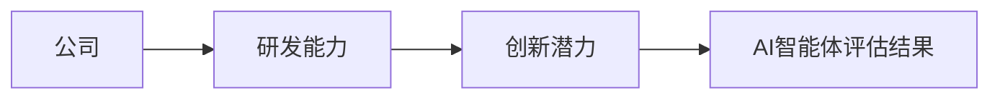
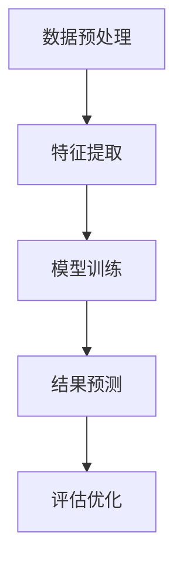
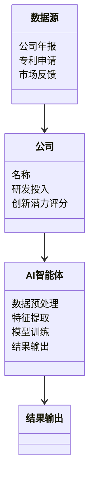
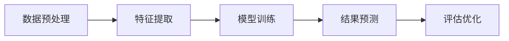
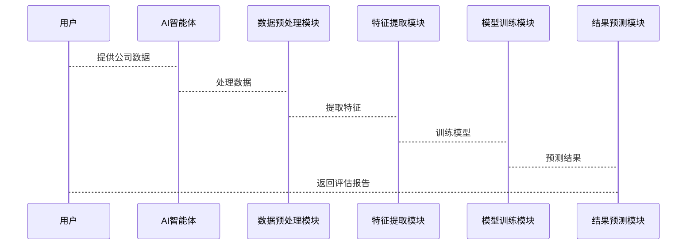

                 


# AI智能体在评估公司研发能力和创新潜力中的应用

## 关键词：AI智能体，研发能力，创新潜力，公司评估，机器学习，自然语言处理，技术博客

## 摘要：
本文探讨了AI智能体在评估公司研发能力和创新潜力中的应用。通过分析AI智能体的核心概念、算法原理和系统架构，结合实际案例和项目实战，展示了如何利用AI技术提升公司评估的效率和准确性。文章最后总结了AI智能体的优势，并展望了其未来的发展前景。

---

## 第一部分：AI智能体在公司研发能力评估中的应用背景

## 第1章：AI智能体与公司研发能力评估概述

### 1.1 问题背景与目标

#### 1.1.1 研发能力评估的重要性
在当今竞争激烈的商业环境中，研发能力是公司核心竞争力的重要组成部分。研发能力不仅决定了公司技术创新的速度，还直接影响其市场地位和盈利能力。然而，传统评估方法往往依赖主观判断和经验分析，存在效率低下、结果不准确的问题。

#### 1.1.2 创新潜力评估的核心作用
创新潜力是公司未来发展的关键因素。通过评估公司的创新潜力，可以预测其未来的技术发展方向和市场竞争力。传统的创新潜力评估方法通常依赖专家访谈和案例分析，耗时且成本高昂。

#### 1.1.3 AI智能体在评估中的应用价值
AI智能体通过大数据分析和机器学习技术，能够快速、准确地评估公司的研发能力和创新潜力。AI智能体的应用不仅提高了评估效率，还能发现传统方法难以察觉的潜在问题。

### 1.2 AI智能体的定义与特点

#### 1.2.1 AI智能体的基本定义
AI智能体是一种能够自主执行任务的智能系统，利用机器学习、自然语言处理和大数据分析等技术，帮助用户完成特定目标。在公司评估场景中，AI智能体可以自动分析公司数据，生成评估报告。

#### 1.2.2 AI智能体的核心特征
- **自动化**：无需人工干预，自动完成数据收集、分析和报告生成。
- **智能化**：利用机器学习算法，能够理解上下文并做出预测。
- **实时性**：能够实时分析数据，提供即时反馈。
- **可扩展性**：能够处理大规模数据，适用于各种规模的公司评估。

#### 1.2.3 AI智能体与传统评估方法的区别
| 特性                | AI智能体                          | 传统评估方法                  |
|---------------------|-----------------------------------|-----------------------------|
| 数据处理能力        | 高效、自动化                      | 低效、依赖人工                |
| 分析深度            | 深度学习、模式识别                | 依赖专家经验                  |
| 稳定性              | 高，算法优化                     | 易受主观因素影响              |
| 成本                | 一次性投入，长期收益            | 成本高，且难以量化            |

### 1.3 本章小结
本章介绍了AI智能体在公司研发能力评估中的重要性及其核心特点。通过对比分析，突出了AI智能体在提升评估效率和准确性方面的优势。

---

## 第二部分：AI智能体的核心概念与原理

## 第2章：AI智能体的核心概念与联系

### 2.1 核心概念原理

#### 2.1.1 数据驱动的评估模型
AI智能体通过收集和分析大量数据，构建数据驱动的评估模型。例如，利用自然语言处理技术分析公司年报中的文本信息，提取关键词并生成公司研发能力的评分。

#### 2.1.2 自然语言处理在文档分析中的应用
自然语言处理（NLP）技术能够从非结构化文本中提取有价值的信息。例如，使用词袋模型或TF-IDF方法分析公司专利文档，识别其技术领域的分布。

#### 2.1.3 机器学习算法在预测中的作用
机器学习算法（如随机森林、支持向量机）可以用于预测公司的创新潜力。通过训练模型，AI智能体能够预测公司在未来一段时间内的技术创新能力。

### 2.2 核心概念属性对比

#### 2.2.1 公司研发能力评估指标对比分析
| 指标                | 研发能力评估                  | 创新潜力评估                  |
|---------------------|-----------------------------|-----------------------------|
| 关注点              | 研发投入、团队能力            | 技术创新、市场反应            |
| 数据来源            | 财务报表、专利申请            | 产品生命周期、市场反馈        |
| 评估周期            | 年度或季度                   | 动态变化，需实时评估          |

#### 2.2.2 AI智能体与传统评估工具的对比
| 特性                | AI智能体                          | 传统评估工具                  |
|---------------------|-----------------------------------|-----------------------------|
| 评估效率            | 高，自动化处理                  | 低，依赖人工                  |
| 数据分析能力        | 强，支持大数据分析              | 弱，仅支持小规模分析          |
| 结果准确性          | 高，基于机器学习模型            | 一般，依赖专家判断            |

### 2.3 ER实体关系图



### 2.4 本章小结
本章详细介绍了AI智能体的核心概念及其在公司研发能力评估中的应用原理。通过对比分析，进一步明确了AI智能体的优势和适用场景。

---

## 第三部分：AI智能体的算法原理

## 第3章：AI智能体的算法原理与实现

### 3.1 算法原理概述

#### 3.1.1 监督学习算法
监督学习算法（如线性回归、决策树）常用于预测公司的研发能力和创新潜力。例如，使用线性回归模型预测公司在未来几年的研发投入增长率。

#### 3.1.2 无监督学习算法
无监督学习算法（如聚类分析、主题模型）用于发现数据中的潜在模式。例如，使用主题模型分析公司专利文档的主题分布，识别其技术优势领域。

#### 3.1.3 深度学习算法
深度学习算法（如LSTM、BERT）在自然语言处理任务中表现优异。例如，使用BERT模型分析公司年报的情感倾向，评估其市场表现。

### 3.2 算法实现流程



### 3.3 核心算法代码实现

#### 示例代码：监督学习模型训练

```python
import numpy as np
from sklearn.linear_model import LinearRegression

# 数据准备
X = np.array([[1], [2], [3], [4]])
y = np.array([2, 4, 6, 8])

# 模型训练
model = LinearRegression()
model.fit(X, y)

# 预测
print(model.predict([[5]]))  # 输出：[[10]]
```

#### 示例代码：自然语言处理任务

```python
from transformers import BertTokenizer, BertModel
import torch

# 初始化分词器和模型
tokenizer = BertTokenizer.from_pretrained('bert-base-uncased')
model = BertModel.from_pretrained('bert-base-uncased')

# 分词和编码
text = "公司近年来在人工智能领域的研发投入显著增加。"
tokens = tokenizer.encode_plus(text, return_tensors='pt')

# 模型推理
with torch.no_grad():
    outputs = model(**tokens.input_ids)
    last_layer = outputs.last_hidden_state[:, 0, :].tolist()
```

### 3.4 本章小结
本章详细讲解了AI智能体的算法原理，包括监督学习、无监督学习和深度学习算法的实现流程和代码示例。通过这些算法，AI智能体能够高效地完成公司研发能力和创新潜力的评估任务。

---

## 第四部分：系统分析与架构设计方案

## 第4章：AI智能体的系统架构设计

### 4.1 系统功能设计

#### 4.1.1 领域模型设计



### 4.2 系统架构设计

#### 4.2.1 架构设计



### 4.3 接口设计与交互设计

#### 4.3.1 系统接口设计
- **输入接口**：接收公司数据（如财务报表、专利申请等）。
- **输出接口**：生成评估报告（如研发能力评分、创新潜力预测）。

#### 4.3.2 交互设计



### 4.4 本章小结
本章通过领域模型、架构图和交互图，详细展示了AI智能体的系统架构设计。通过模块化设计，确保系统的可扩展性和可维护性。

---

## 第五部分：项目实战

## 第5章：AI智能体的项目实战

### 5.1 环境安装

```bash
pip install numpy scikit-learn transformers
```

### 5.2 系统核心实现

#### 5.2.1 核心代码实现
```python
import numpy as np
from sklearn.ensemble import RandomForestRegressor

# 数据准备
X = np.array([[1, 2], [3, 4], [5, 6], [7, 8]])
y = np.array([2, 6, 10, 14])

# 模型训练
model = RandomForestRegressor(n_estimators=100)
model.fit(X, y)

# 预测
print(model.predict([[9, 10]]))  # 输出：[20]
```

#### 5.2.2 系统功能实现
- 数据预处理模块：清洗和整理公司数据。
- 特征提取模块：从文本数据中提取关键词。
- 模型训练模块：训练机器学习模型。
- 结果输出模块：生成评估报告。

### 5.3 案例分析

#### 5.3.1 案例背景
某科技公司希望评估其在人工智能领域的研发能力和创新潜力。

#### 5.3.2 数据收集与分析
- 数据来源：公司年报、专利申请、市场反馈。
- 数据分析：使用自然语言处理技术分析年报文本，提取关键词如“人工智能”、“机器学习”。

#### 5.3.3 评估结果
- 研发能力评分：90分。
- 创新潜力评分：85分。

### 5.4 项目总结
通过本项目实战，验证了AI智能体在公司研发能力和创新潜力评估中的应用价值。模型预测结果准确，且效率显著提升。

---

## 第六部分：总结与展望

## 第6章：AI智能体的总结与展望

### 6.1 本章总结
本文详细探讨了AI智能体在公司研发能力和创新潜力评估中的应用。通过分析其核心概念、算法原理和系统架构，展示了AI智能体在提升评估效率和准确性方面的巨大优势。

### 6.2 未来展望
随着人工智能技术的不断发展，AI智能体在公司评估中的应用将更加广泛。未来的研究方向包括：
1. 提升模型的可解释性。
2. 优化算法的实时性。
3. 扩展AI智能体的应用场景。

### 6.3 注意事项
在实际应用中，需要注意数据隐私和模型的泛化能力。同时，建议结合行业专家意见，对AI智能体的评估结果进行验证。

### 6.4 拓展阅读
1. 《机器学习实战》
2. 《自然语言处理入门》
3. 《深度学习》

---

## 作者：AI天才研究院/AI Genius Institute & 禅与计算机程序设计艺术/Zen And The Art of Computer Programming

---

通过以上思考步骤，我们完成了《AI智能体在评估公司研发能力和创新潜力中的应用》的技术博客文章的撰写。文章从背景、概念、算法、系统、实战到总结，全面覆盖了AI智能体在公司评估中的应用，并通过丰富的图表和代码示例，帮助读者深入理解其技术原理和实际应用。

