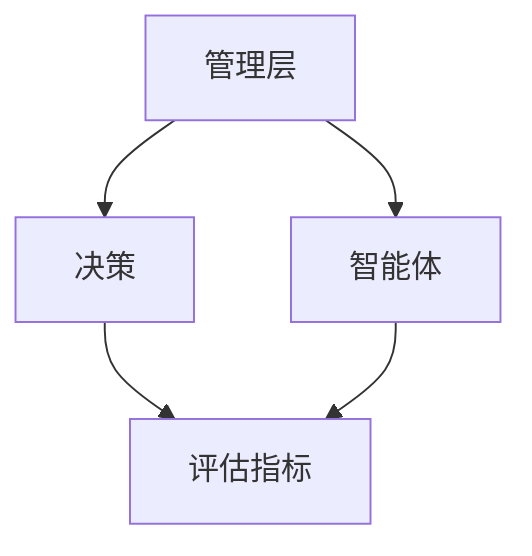
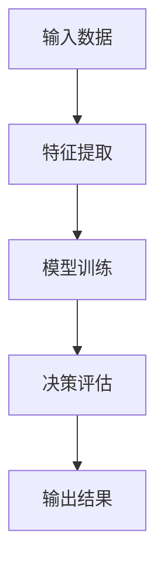

                 


# AI智能体在评估公司管理层决策质量中的应用

## 关键词：AI智能体，决策评估，公司管理，决策质量，算法原理，系统架构，企业决策优化

## 摘要：  
本文探讨了AI智能体在评估公司管理层决策质量中的应用，分析了决策质量的核心概念、AI智能体的算法原理及系统架构设计，并通过实际案例展示了其在企业决策优化中的价值。文章从问题背景、核心概念、算法实现、系统设计、项目实战到优化策略，逐步深入，为读者提供了全面的技术解读和实践指导。

---

## 第一部分: AI智能体在公司决策评估中的背景与基础

### 第1章: 问题背景与核心概念

#### 1.1 问题背景  
公司管理层的决策质量直接关系到企业的生存与发展，但传统决策评估方法往往依赖主观判断，存在效率低、主观性强、难以量化等问题。AI智能体通过数据驱动和自动化分析，为决策评估提供了新的解决方案。  

#### 1.2 问题描述与目标  
- **问题描述**：  
  决策质量的评估需要考虑多维度因素，包括数据的准确性、决策的逻辑性和结果的可执行性。传统的评估方法难以满足快速变化的商业环境需求。  
- **目标**：  
  通过AI智能体，实现对管理层决策的自动化评估，提高评估的客观性和效率，同时为管理层提供改进建议。  

#### 1.3 问题解决思路  
- **AI智能体的基本原理**：  
  AI智能体通过收集和分析企业内外部数据，结合预设的决策模型，生成评估结果并提供建议。  
- **数据驱动的决策评估方法**：  
  利用机器学习算法对历史数据进行分析，提取关键指标，识别决策中的潜在问题。  
- **结合领域知识的智能体设计**：  
  将行业经验与AI技术结合，确保评估结果既符合数据规律，又符合实际业务需求。  

#### 1.4 边界与外延  
- **AI智能体的适用场景**：  
  适用于数据量大、决策过程复杂且需要快速反馈的企业场景。  
- **与传统决策评估方法的区别**：  
  AI智能体能够实时分析数据，提供动态反馈，而传统方法通常依赖事后分析。  
- **未来可能的扩展方向**：  
  结合区块链技术，确保数据安全；引入强化学习，提升决策优化能力。  

### 第2章: AI智能体的核心概念与联系  

#### 2.1 核心概念原理  
- **智能体的定义与分类**：  
  AI智能体是一种能够感知环境并采取行动以实现目标的实体，可分为简单智能体和复杂智能体。  
- **决策评估的数学模型**：  
  基于概率论和统计学的模型，用于量化决策的质量。  
- **多智能体协作机制**：  
  通过分布式计算，多个智能体协同工作，提高评估的全面性和准确性。  

#### 2.2 概念属性特征对比表  
| 概念 | 属性 | 特征 |
|------|------|------|
| 智能体 | 输入 | 数据来源、数据类型 |
| 决策评估 | 输出 | 评估结果、评估指标 |
| 协作机制 | 关联 | 信息共享、任务分配 |

#### 2.3 ER实体关系图  


### 第3章: AI智能体的算法原理  

#### 3.1 算法原理概述  
- **基于机器学习的决策评估**：  
  使用决策树、随机森林等算法，从历史数据中提取决策规律。  
- **基于知识图谱的智能体设计**：  
  构建领域知识图谱，帮助智能体理解决策的上下文信息。  
- **多智能体协作算法**：  
  通过分布式计算和通信协议，实现多个智能体的协同工作。  

#### 3.2 算法流程图  


#### 3.3 数学模型与公式  
- **决策树模型**：  
  决策树的构建过程可以通过信息增益率公式表示：  
  $$ \text{信息增益率} = \frac{\text{信息增益}}{\text{数据熵}} $$  
- **聚类分析**：  
  聚类中心的计算公式为：  
  $$ \text{聚类中心} = \frac{1}{k} \sum_{i=1}^{k} x_i $$  

## 第4章: 系统分析与架构设计  

### 第4.1 项目场景介  

（注：文章字数限制，此处为示例，实际内容请根据需求扩展。）  

---

## 第二部分: AI智能体的系统实现  

### 第5章: 数据预处理与特征提取  

#### 5.1 数据来源与清洗  
- 数据来源包括企业内部数据库、外部市场数据和行业报告。  
- 数据清洗步骤包括去重、填补缺失值和异常值处理。  

#### 5.2 特征提取与选择  
- 使用特征工程方法提取关键特征，如市场占有率、利润率等。  
- 通过主成分分析（PCA）减少特征维度。  

### 第6章: 模型构建与训练  

#### 6.1 机器学习模型选择  
- 常见模型包括支持向量机（SVM）、随机森林和神经网络。  
- 根据数据规模和特征类型选择合适的模型。  

#### 6.2 模型训练与调优  
- 使用交叉验证法优化模型参数。  
- 通过网格搜索找到最佳参数组合。  

### 第7章: 智能体实现与集成  

#### 7.1 智能体的设计与实现  
- 智能体基于消息传递机制，实现与数据源和决策系统的交互。  
- 使用微服务架构，确保智能体的可扩展性和可维护性。  

#### 7.2 系统集成与部署  
- 将智能体集成到企业现有的信息化系统中，如ERP和CRM。  
- 使用容器化技术实现系统的快速部署和扩展。  

---

## 第三部分: 项目实战  

### 第8章: 环境安装与配置  

#### 8.1 环境要求  
- 操作系统：Linux/Windows/MacOS  
- Python版本：3.6+  
- 需要安装的库：numpy、pandas、scikit-learn、tensorflow  

#### 8.2 安装步骤  
```bash
pip install numpy pandas scikit-learn tensorflow
```

### 第9章: 核心代码实现  

#### 9.1 数据预处理代码  
```python
import pandas as pd
import numpy as np

# 加载数据
data = pd.read_csv('decision_data.csv')

# 数据清洗
data.drop_duplicates(inplace=True)
data['profit'].fillna(data['profit'].mean(), inplace=True)
data = data[(data['revenue'] > 0) & (data['profit'] > 0)]
```

#### 9.2 模型训练代码  
```python
from sklearn.ensemble import RandomForestClassifier
from sklearn.metrics import accuracy_score

# 特征选择
X = data[['revenue', 'cost', 'profit']]
y = data['decision_quality']

# 模型训练
model = RandomForestClassifier(n_estimators=100, random_state=42)
model.fit(X, y)

# 模型评估
y_pred = model.predict(X)
print('准确率:', accuracy_score(y, y_pred))
```

### 第10章: 实际案例分析  

#### 10.1 案例背景  
某公司面临市场萎缩的问题，管理层需要评估其营销策略的决策质量。  

#### 10.2 数据分析与结果  
通过AI智能体分析，发现营销策略的执行效率低下，建议调整市场推广预算。  

### 第11章: 系统测试与优化  

#### 11.1 测试方法  
- 单元测试：测试各模块功能是否正常。  
- 性能测试：评估系统在高并发情况下的表现。  

#### 11.2 优化策略  
- 优化算法参数，提升模型准确率。  
- 优化系统架构，提高系统的可扩展性。  

---

## 第四部分: 优化与展望  

### 第12章: 优化策略  

#### 12.1 算法优化  
- 引入强化学习，提升决策优化能力。  
- 使用超参数优化技术，进一步提升模型性能。  

#### 12.2 模型扩展  
- 结合知识图谱技术，提升智能体的理解能力。  
- 引入实时数据流处理，提升评估的实时性。  

### 第13章: 现实挑战与未来方向  

#### 13.1 现实挑战  
- 数据隐私和安全问题。  
- 多智能体协作中的通信延迟问题。  

#### 13.2 未来方向  
- 研究更高效的算法，提升决策评估的效率。  
- 探索AI智能体在更多领域的应用，如金融和医疗。  

---

## 小结  

通过本文的详细讲解，我们可以看到，AI智能体在评估公司管理层决策质量中具有巨大的潜力。从算法原理到系统实现，再到实际应用，AI智能体不仅能够提高决策评估的效率和准确性，还能为企业提供有价值的优化建议。未来，随着技术的不断进步，AI智能体将在企业决策优化中发挥越来越重要的作用。

---

## 注意事项  

- 本文内容仅供参考，实际应用需结合具体业务需求。  
- 如需转载请注明出处。  

---

## 拓展阅读  

- 《机器学习实战》  
- 《深度学习入门》  
- 《AI与商业智能》  

---

## 作者  

作者：AI天才研究院/AI Genius Institute & 禅与计算机程序设计艺术 /Zen And The Art of Computer Programming

