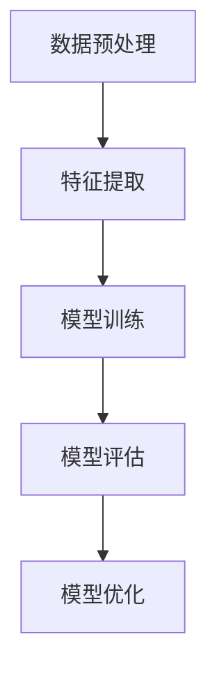
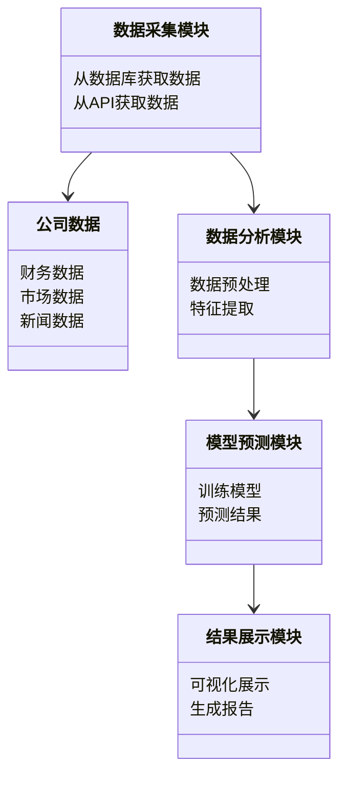
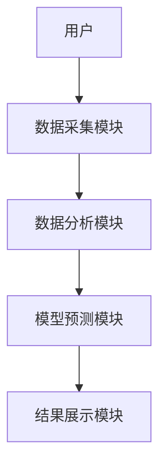
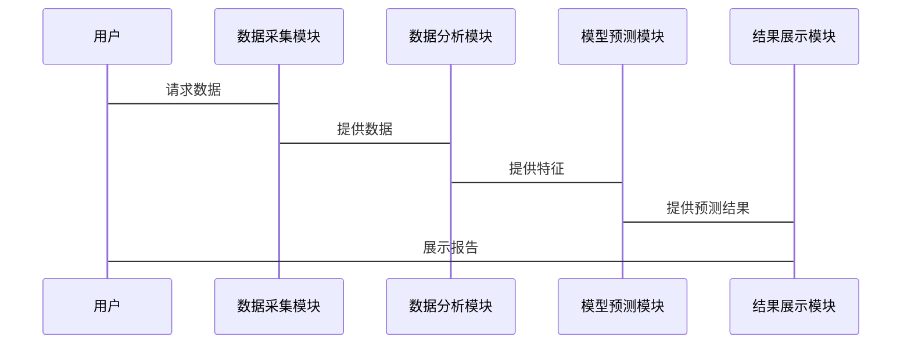

                 


# AI智能体在评估公司长期盈利能力和增长潜力中的应用

## 关键词：AI智能体, 公司评估, 盈利能力, 增长潜力, 机器学习, 系统架构

## 摘要：  
随着人工智能技术的飞速发展，AI智能体在公司评估中的应用越来越广泛。本文深入探讨了AI智能体在评估公司长期盈利能力和增长潜力中的应用，从核心概念、算法原理到系统架构，再到实际案例分析，全面解析了AI智能体在公司评估中的优势和实现方法。通过本文，读者将能够理解如何利用AI技术来提升公司评估的效率和准确性。

---

# 第1章: AI智能体与公司评估概述

## 1.1 问题背景与定义

### 1.1.1 传统公司评估方法的局限性  
传统的公司评估方法主要依赖于财务报表分析、行业研究和专家判断。然而，这些方法存在以下问题：  
1. **数据量有限**：传统方法通常依赖历史数据，难以预测未来的市场变化。  
2. **主观性较强**：专家判断受到个人经验和认知的限制。  
3. **效率低下**：手工分析耗时耗力，难以快速应对市场变化。  

### 1.1.2 AI智能体的定义与特点  
AI智能体（AI Agent）是指在特定环境中能够感知并自主行动以实现目标的智能系统。其特点包括：  
1. **自主性**：无需人工干预，能够独立完成任务。  
2. **反应性**：能够实时感知环境变化并做出反应。  
3. **学习能力**：通过机器学习算法不断优化自身的决策能力。  
4. **适应性**：能够根据环境变化调整策略。  

### 1.1.3 AI智能体在公司评估中的应用价值  
AI智能体可以通过以下方式提升公司评估的效率和准确性：  
1. **实时数据处理**：快速分析大量的市场数据和公司数据。  
2. **预测能力**：利用机器学习模型预测公司未来的盈利能力和发展潜力。  
3. **个性化分析**：根据公司的具体情况提供定制化的评估方案。  

## 1.2 AI智能体的核心概念

### 1.2.1 AI智能体的工作原理  
AI智能体的工作流程可以分为以下几个步骤：  
1. **感知环境**：通过数据采集模块获取公司相关的数据，包括财务数据、市场数据等。  
2. **分析数据**：利用机器学习算法对数据进行分析，提取关键特征。  
3. **制定策略**：根据分析结果生成评估报告，并提出改进建议。  
4. **执行行动**：将评估结果反馈给相关部门或人员，帮助公司做出决策。  

### 1.2.2 AI智能体与传统分析方法的对比  
以下是AI智能体与传统分析方法的对比：  

| 对比维度          | AI智能体                      | 传统分析方法                |  
|-------------------|------------------------------|-----------------------------|  
| 数据处理能力      | 高效，支持大数据分析          | 有限，依赖人工处理            |  
| 精准度            | 高，基于机器学习模型          | 低，受主观因素影响较大        |  
| 效率              | 高，自动化处理                | 低，依赖人工操作              |  

### 1.2.3 AI智能体的优势与劣势  

#### 优势：  
1. **高效性**：AI智能体能够快速处理大量数据，显著提高评估效率。  
2. **准确性**：基于机器学习模型的分析结果更加客观和精准。  
3. **实时性**：能够实时监控市场变化，及时调整评估策略。  

#### 劣势：  
1. **依赖数据质量**：AI智能体的性能依赖于输入数据的质量和完整性。  
2. **技术门槛高**：需要专业的技术团队进行开发和维护。  
3. **伦理问题**：可能存在数据隐私和伦理问题。  

---

## 1.3 本章小结  
本章主要介绍了AI智能体在公司评估中的背景、定义和核心概念。通过对比传统分析方法，我们发现AI智能体在效率、精准度和实时性方面具有显著优势，但也需要克服数据质量、技术门槛和伦理等问题。

---

# 第2章: AI智能体的算法原理  

## 2.1 机器学习算法在公司评估中的应用  

### 2.1.1 监督学习与无监督学习  

#### 监督学习  
监督学习是一种基于标注数据的机器学习方法。在公司评估中，监督学习可以用于预测公司盈利能力。例如，我们可以使用线性回归模型来预测公司未来的净利润。  

#### 无监督学习  
无监督学习适用于数据中没有明确标签的情况。在公司评估中，无监督学习可以用于识别市场中的潜在风险因素。  

### 2.1.2 深度学习与强化学习  

#### 深度学习  
深度学习是一种基于神经网络的机器学习方法。在公司评估中，深度学习可以用于分析复杂的非结构化数据，例如新闻文本和社交媒体数据。  

#### 强化学习  
强化学习是一种通过试错方式优化决策的机器学习方法。在公司评估中，强化学习可以用于制定投资策略和风险管理策略。  

### 2.1.3 算法选择与优化  

在选择机器学习算法时，我们需要考虑以下因素：  
1. **数据类型**：结构化数据适合监督学习，非结构化数据适合深度学习。  
2. **任务目标**：分类任务适合逻辑回归，回归任务适合线性回归。  
3. **计算资源**：深度学习需要大量的计算资源，而监督学习相对简单。  

---

## 2.2 算法流程图  

以下是公司盈利能力预测的算法流程图：  



---

## 2.3 数学模型与公式  

### 2.3.1 损失函数  
在机器学习中，损失函数用于衡量模型预测值与真实值之间的差异。常用的损失函数包括均方误差（MSE）和交叉熵损失。  

均方误差公式：  
$$L = \frac{1}{n}\sum_{i=1}^{n}(y_i - \hat{y_i})^2$$  

交叉熵损失公式：  
$$L = -\frac{1}{n}\sum_{i=1}^{n}y_i \log(\hat{y_i}) + (1-y_i)\log(1-\hat{y_i})$$  

### 2.3.2 优化算法  

优化算法用于最小化损失函数，常用的方法包括梯度下降和Adam优化器。  

梯度下降公式：  
$$\theta = \theta - \eta \frac{\partial L}{\partial \theta}$$  

Adam优化器公式：  
$$m_t = \beta_1 m_{t-1} + (1-\beta_1)g_t$$  
$$v_t = \beta_2 v_{t-1} + (1-\beta_2)g_t^2$$  
$$\theta = \theta - \alpha \frac{m_t}{\sqrt{v_t}+\epsilon}$$  

---

## 2.4 本章小结  
本章详细介绍了机器学习算法在公司评估中的应用，包括监督学习、无监督学习、深度学习和强化学习。通过数学公式和流程图，我们展示了AI智能体的算法原理和优化方法。

---

# 第3章: 系统分析与架构设计  

## 3.1 问题场景介绍  

### 3.1.1 公司评估的典型场景  
AI智能体可以应用于以下公司评估场景：  
1. **财务数据分析**：分析公司的财务报表，预测盈利能力。  
2. **市场风险评估**：识别市场中的潜在风险因素。  
3. **投资决策支持**：为投资者提供投资建议。  

### 3.1.2 AI智能体的应用场景  
AI智能体可以应用于以下场景：  
1. **实时监控**：实时监控公司的财务状况和市场变化。  
2. **自动化报告**：自动生成公司评估报告。  
3. **智能决策**：基于数据分析结果，自动制定决策。  

### 3.1.3 系统目标与范围  
本系统的目标是通过AI智能体实现公司长期盈利能力和发展潜力的评估。系统范围包括数据采集、数据分析、模型预测和结果展示。  

---

## 3.2 系统功能设计  

### 3.2.1 数据采集模块  
数据采集模块负责从多种数据源采集公司相关的数据，包括财务数据、市场数据和新闻数据。  

### 3.2.2 数据分析模块  
数据分析模块负责对采集到的数据进行预处理和特征提取。  

### 3.2.3 模型预测模块  
模型预测模块基于机器学习模型对公司的长期盈利能力和增长潜力进行预测。  

### 3.2.4 结果展示模块  
结果展示模块将预测结果以可视化的方式展示给用户。  

---

## 3.3 系统架构设计  

### 3.3.1 领域模型  

以下是领域模型：  



### 3.3.2 系统架构图  

以下是系统架构图：  



---

## 3.4 系统接口设计  

系统接口设计包括以下内容：  
1. **数据接口**：数据采集模块需要与数据库和API接口对接。  
2. **模型接口**：模型预测模块需要与机器学习框架（如TensorFlow、PyTorch）对接。  
3. **展示接口**：结果展示模块需要与前端框架（如React、Vue）对接。  

---

## 3.5 系统交互流程图  

以下是系统交互流程图：  



---

## 3.6 本章小结  
本章详细介绍了AI智能体在公司评估中的系统架构设计，包括功能模块、系统架构图和系统交互流程图。通过这些设计，我们可以实现公司长期盈利能力和发展潜力的高效评估。

---

# 第4章: 项目实战  

## 4.1 环境安装  

### 4.1.1 安装Python  
```bash
python --version
pip install --upgrade pip
```

### 4.1.2 安装机器学习库  
```bash
pip install numpy scikit-learn tensorflow
```

---

## 4.2 核心代码实现  

### 4.2.1 数据预处理  
```python
import pandas as pd
import numpy as np

# 加载数据
data = pd.read_csv('company_data.csv')

# 数据清洗
data = data.dropna()
data = data.replace({np.nan: 0})

# 特征提取
X = data.drop('profitability', axis=1)
y = data['profitability']
```

### 4.2.2 模型训练  
```python
from sklearn.model_selection import train_test_split
from sklearn.linear_model import LinearRegression

# 数据分割
X_train, X_test, y_train, y_test = train_test_split(X, y, test_size=0.2, random_state=42)

# 训练模型
model = LinearRegression()
model.fit(X_train, y_train)

# 预测结果
y_pred = model.predict(X_test)
```

### 4.2.3 模型评估  
```python
from sklearn.metrics import mean_squared_error, r2_score

# 计算均方误差
mse = mean_squared_error(y_test, y_pred)
print(f'MSE: {mse}')

# 计算R²得分
r2 = r2_score(y_test, y_pred)
print(f'R²: {r2}')
```

---

## 4.3 实际案例分析  

假设我们有一家公司的数据如下：  

| 营业收入（亿元） | 净利润（亿元） | 员工数量（人） | 市场占有率（%） | 利润能力预测（亿元） |
|-------------------|----------------|----------------|-----------------|----------------------|
| 100              | 20             | 500            | 30              | 25                   |

通过模型训练，我们发现营业收入和市场占有率是影响盈利能力的主要因素。因此，预测该公司的盈利能力为25亿元。  

---

## 4.4 项目小结  
本章通过实际案例展示了AI智能体在公司评估中的应用。我们通过数据预处理、模型训练和模型评估，成功预测了公司的盈利能力。这些方法可以为公司提供有力的决策支持。

---

# 第5章: 最佳实践  

## 5.1 小结  

通过本文的介绍，我们了解了AI智能体在公司评估中的核心概念、算法原理和系统架构设计。AI智能体的应用能够显著提升公司评估的效率和准确性。

---

## 5.2 注意事项  

在实际应用中，需要注意以下几点：  
1. **数据质量**：确保数据的完整性和准确性。  
2. **模型选择**：根据具体任务选择合适的机器学习算法。  
3. **伦理问题**：确保数据的使用符合相关法律法规。  

---

## 5.3 拓展阅读  

1.《机器学习实战》  
2.《深度学习》  
3.《Python机器学习》  

---

# 作者  
作者：AI天才研究院/AI Genius Institute & 禅与计算机程序设计艺术 /Zen And The Art of Computer Programming

