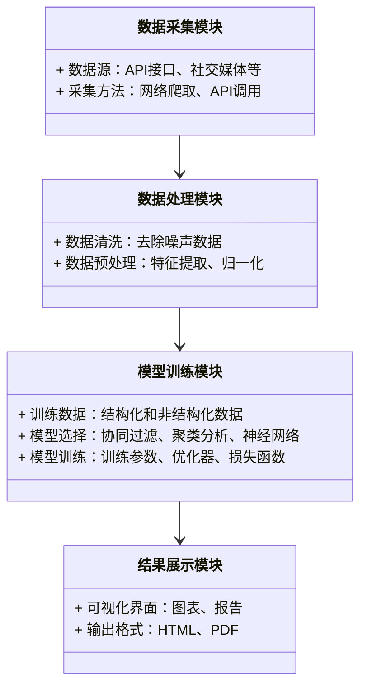
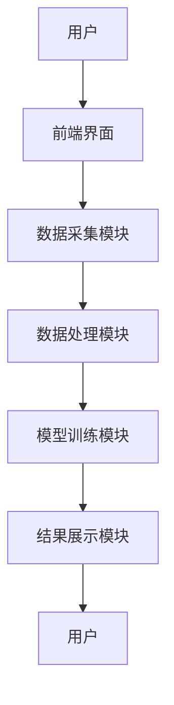
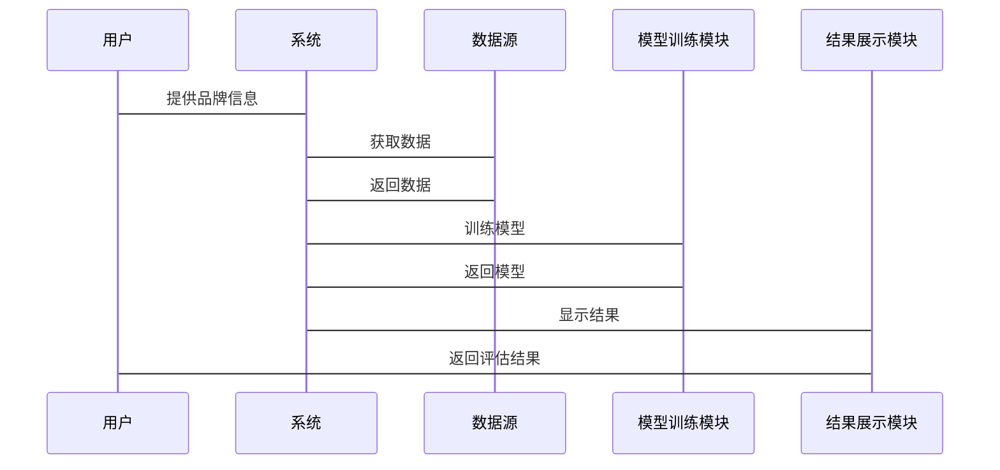

                 


# AI智能体在评估品牌价值中的作用

> 关键词：AI智能体，品牌价值，数据分析，机器学习，深度学习

> 摘要：本文探讨了AI智能体在品牌价值评估中的作用，分析了其核心概念、算法原理、系统架构，并通过实际案例展示了如何利用AI智能体提升品牌价值评估的效率和准确性。文章内容涵盖从背景介绍到系统设计，再到项目实战的完整流程，帮助读者深入了解AI智能体在品牌价值评估中的应用。

---

## 第1章: AI智能体与品牌价值评估的背景

### 1.1 AI智能体的基本概念

#### 1.1.1 什么是AI智能体
AI智能体（Artificial Intelligence Agent）是指能够感知环境并采取行动以实现目标的智能系统。AI智能体可以是软件程序、机器人或其他智能系统，其核心能力包括感知、推理、规划和执行。

#### 1.1.2 AI智能体的核心特征
- **自主性**：能够独立决策和行动。
- **反应性**：能够实时感知环境变化并做出反应。
- **目标导向**：以实现特定目标为导向。
- **学习能力**：通过数据和经验不断优化自身性能。

#### 1.1.3 AI智能体与传统数据分析的区别
传统数据分析依赖于固定的规则和模式，而AI智能体能够主动学习和适应环境，能够处理非结构化数据和复杂场景。

### 1.2 品牌价值评估的现状

#### 1.2.1 品牌价值的传统评估方法
传统品牌价值评估主要依赖于财务数据、市场调研和专家判断，方法较为单一且耗时较长。

#### 1.2.2 传统方法的局限性
- 数据来源单一，难以捕捉实时变化。
- 人工判断主观性强，结果可能存在偏差。
- 处理复杂场景的能力有限。

#### 1.2.3 数字化时代品牌价值评估的新需求
随着数字化和全球化的推进，品牌价值评估需要更加高效、精准和动态化，传统的评估方法已难以满足需求。

### 1.3 AI智能体在品牌价值评估中的作用

#### 1.3.1 AI智能体如何提升品牌价值评估的效率
AI智能体能够快速处理海量数据，实时更新评估结果，显著提高评估效率。

#### 1.3.2 AI智能体如何提高评估的准确性
通过机器学习和深度学习算法，AI智能体能够识别数据中的复杂模式，提高评估结果的准确性。

#### 1.3.3 AI智能体在品牌价值动态变化中的应用
AI智能体能够实时监测市场变化和消费者行为，动态调整评估模型，捕捉品牌价值的变化趋势。

### 1.4 本章小结

---

## 第2章: AI智能体的核心概念与工作原理

### 2.1 AI智能体的定义与分类

#### 2.1.1 基于规则的AI智能体
基于规则的AI智能体通过预定义的规则和逻辑进行推理和决策，适用于简单场景。

#### 2.1.2 基于机器学习的AI智能体
基于机器学习的AI智能体能够从数据中学习模式和规律，适用于复杂场景。

#### 2.1.3 基于深度学习的AI智能体
基于深度学习的AI智能体能够处理非结构化数据，如图像和文本，具有更强的特征提取能力。

### 2.2 品牌价值评估中的关键要素

#### 2.2.1 品牌认知度
品牌认知度是指目标市场对品牌的熟悉程度和记忆程度。

#### 2.2.2 品牌忠诚度
品牌忠诚度是指消费者对品牌的情感依赖和重复购买倾向。

#### 2.2.3 品牌影响力
品牌影响力是指品牌在市场中的传播力和号召力。

### 2.3 AI智能体与品牌价值评估的关系

#### 2.3.1 数据驱动的品牌价值评估
AI智能体通过收集和分析海量数据，为品牌价值评估提供支持。

#### 2.3.2 AI智能体如何处理复杂的品牌数据
AI智能体能够整合结构化和非结构化数据，利用自然语言处理和计算机视觉技术进行分析。

#### 2.3.3 AI智能体在品牌价值预测中的应用
AI智能体能够基于历史数据和实时信息，预测品牌价值的变化趋势。

### 2.4 核心概念对比表

| 概念       | 传统方法                | AI智能体方法               |
|------------|------------------------|---------------------------|
| 数据来源   | 结构化数据为主           | 结构化和非结构化数据       |
| 分析能力   | 单一、固定               | 多样、动态                 |
| 处理效率   | 较低                   | 较高                     |

### 2.5 实体关系图


### 2.6 本章小结

---

## 第3章: 品牌价值评估的数学模型与算法

### 3.1 协同过滤算法

#### 3.1.1 协同过滤算法原理
协同过滤算法基于用户行为的相似性，推荐相似品牌或产品。

#### 3.1.2 协同过滤算法实现

```python
def collaborative_filtering(user_ratings, item_ratings):
    # 计算用户相似度
    user_similarities = cosine_similarity(user_ratings)
    # 推荐相似用户的高评分商品
    recommendations = []
    for user in user_similarities:
        recommendations.extend(user_ratings[user].items())
    return recommendations
```

#### 3.1.3 协同过滤算法优缺点
- 优点：简单易实现，适合推荐系统。
- 缺点：难以处理冷启动问题，计算复杂度较高。

### 3.2 聚类分析算法

#### 3.2.1 聚类分析算法原理
聚类分析算法将品牌按照相似性分为不同的类别，便于后续分析。

#### 3.2.2 聚类分析算法实现

```python
from sklearn.cluster import KMeans

def brand_clustering(brand_features, num_clusters):
    kmeans = KMeans(n_clusters=num_clusters)
    kmeans.fit(brand_features)
    return kmeans.labels_
```

#### 3.2.3 聚类分析算法优缺点
- 优点：能够发现数据中的潜在结构。
- 缺点：需要人工确定聚类数目，结果解释性较差。

### 3.3 神经网络算法

#### 3.3.1 神经网络算法原理
神经网络算法通过多层神经元模拟人脑的神经网络，能够处理复杂的非线性关系。

#### 3.3.2 神经网络算法实现

```python
import tensorflow as tf
from tensorflow.keras import layers

def neural_network_model(input_shape):
    model = tf.keras.Sequential()
    model.add(layers.Dense(64, activation='relu', input_shape=input_shape))
    model.add(layers.Dense(32, activation='relu'))
    model.add(layers.Dense(1, activation='sigmoid'))
    model.compile(optimizer='adam', loss='binary_crossentropy', metrics=['accuracy'])
    return model
```

#### 3.3.3 神经网络算法优缺点
- 优点：能够处理复杂的非结构化数据，识别数据中的深层模式。
- 缺点：计算复杂，需要大量数据和计算资源。

### 3.4 算法流程图


### 3.5 本章小结

---

## 第4章: 系统架构设计与实现

### 4.1 需求分析

#### 4.1.1 系统目标
开发一个基于AI智能体的品牌价值评估系统，能够实时监测市场动态，提供精准的评估结果。

#### 4.1.2 功能需求
- 数据采集模块：收集品牌相关的数据。
- 数据处理模块：清洗和预处理数据。
- 模型训练模块：训练评估模型。
- 结果展示模块：可视化评估结果。

### 4.2 系统架构设计

#### 4.2.1 领域模型设计



#### 4.2.2 系统架构设计



### 4.3 接口设计

#### 4.3.1 数据接口
- 输入接口：接收品牌相关数据。
- 输出接口：返回处理后的数据和模型结果。

#### 4.3.2 模型接口
- 输入接口：接收训练数据。
- 输出接口：返回模型参数和评估结果。

### 4.4 交互流程图



### 4.5 本章小结

---

## 第5章: 项目实战：基于AI智能体的品牌价值评估系统

### 5.1 环境安装

#### 5.1.1 安装Python
```bash
python --version
pip install --upgrade pip
```

#### 5.1.2 安装依赖库
```bash
pip install numpy pandas scikit-learn tensorflow seaborn
```

### 5.2 核心代码实现

#### 5.2.1 数据采集模块

```python
import requests
from bs4 import BeautifulSoup

def fetch_data(url):
    response = requests.get(url)
    soup = BeautifulSoup(response.text, 'html.parser')
    data = []
    for item in soup.find_all('div', class_='brand-info'):
        data.append({
            'name': item.find('h2').text,
            'value': float(item.find('span').text)
        })
    return data
```

#### 5.2.2 数据处理模块

```python
import pandas as pd
from sklearn.preprocessing import StandardScaler

def preprocess_data(data):
    df = pd.DataFrame(data)
    scaler = StandardScaler()
    df['normalized_value'] = scaler.fit_transform(df[['value']])
    return df
```

#### 5.2.3 模型训练模块

```python
from sklearn.neighbors import KNeighborsRegressor

def train_model(train_data):
    model = KNeighborsRegressor(n_neighbors=5)
    model.fit(train_data[['normalized_value']], train_data[['value']])
    return model
```

#### 5.2.4 结果展示模块

```python
import matplotlib.pyplot as plt

def plot_results(predicted, actual):
    plt.scatter(predicted, actual)
    plt.xlabel('Predicted Value')
    plt.ylabel('Actual Value')
    plt.title('Brand Value Prediction')
    plt.show()
```

### 5.3 案例分析

#### 5.3.1 数据采集与处理
假设我们从社交媒体和市场报告中获取了品牌数据，经过清洗和预处理后，数据可用于模型训练。

#### 5.3.2 模型训练与评估
使用K-近邻回归模型进行训练，并评估模型的准确性和效果。

#### 5.3.3 可视化结果
通过图表展示模型预测结果与实际值的对比，分析模型的性能。

### 5.4 项目总结

---

## 第6章: 最佳实践与未来展望

### 6.1 最佳实践

#### 6.1.1 数据质量
确保数据的准确性和完整性，数据来源多样化。

#### 6.1.2 模型选择
根据具体场景选择合适的算法，避免过度复杂的模型。

#### 6.1.3 系统维护
定期更新模型和数据，确保系统的实时性和准确性。

### 6.2 小结

#### 6.2.1 核心要点回顾
- AI智能体能够显著提升品牌价值评估的效率和准确性。
- 机器学习和深度学习算法在品牌价值评估中发挥重要作用。
- 系统架构设计需要考虑数据处理、模型训练和结果展示的模块化。

### 6.3 注意事项

#### 6.3.1 数据隐私
确保数据的隐私和安全，遵守相关法律法规。

#### 6.3.2 模型解释性
避免过于复杂的模型，确保模型结果的可解释性。

#### 6.3.3 技术更新
关注AI领域的最新技术，及时更新系统和模型。

### 6.4 未来展望

#### 6.4.1 AI技术的进一步发展
随着AI技术的进步，品牌价值评估将更加智能化和自动化。

#### 6.4.2 新兴技术的融合
AI智能体将与区块链、物联网等技术融合，推动品牌价值评估的创新发展。

#### 6.4.3 应用场景的拓展
AI智能体将在更多领域发挥重要作用，品牌价值评估将成为智能化决策的重要组成部分。

### 6.5 拓展阅读

#### 6.5.1 推荐书籍
- 《机器学习实战》
- 《深度学习》
- 《自然语言处理实战》

#### 6.5.2 推荐博客和资源
- [Towards Data Science](https://towardsdatascience.com/)
- [Medium - AI专栏](https://medium.com/ai)

---

## 附录

### 附录A: 数据来源与处理

#### 附录A.1 数据来源
- **社交媒体数据**：Twitter、Facebook、Instagram等平台的品牌相关信息。
- **市场报告数据**：行业报告、市场分析报告。
- **新闻数据**：品牌相关的新闻报道和评论。

#### 附录A.2 数据处理工具
- **Python库**：Pandas、NumPy、Scikit-learn、TensorFlow。
- **数据可视化工具**：Matplotlib、Seaborn。
- **网络爬虫工具**：BeautifulSoup、Scrapy。

### 附录B: 工具安装指南

#### 附录B.1 安装Python环境
```bash
python --version
pip install --upgrade pip
```

#### 附录B.2 安装依赖库
```bash
pip install numpy pandas scikit-learn tensorflow seaborn
```

### 附录C: 术语表

#### 附录C.1 核心术语
- **AI智能体**：能够感知环境并采取行动以实现目标的智能系统。
- **品牌价值**：品牌在市场中的综合价值，包括品牌认知度、品牌忠诚度和品牌影响力。
- **机器学习**：通过数据训练模型，使其能够从数据中学习模式和规律。
- **深度学习**：基于人工神经网络的机器学习技术，能够处理复杂的非结构化数据。

### 附录D: 参考文献

#### 附录D.1 参考文献
1. Goodfellow, I., Bengio, Y., & Courville, A. (2016). *Deep Learning*. MIT Press.
2. Bishop, C. M. (2006). *Pattern Recognition and Machine Learning*. Springer.
3.周志华. (2016). *机器学习* [M]. 清华大学出版社.

---

## 作者：AI天才研究院/AI Genius Institute & 禅与计算机程序设计艺术 /Zen And The Art of Computer Programming

---

本文通过详细的分析和实际案例，全面探讨了AI智能体在品牌价值评估中的应用。从背景介绍到系统设计，再到项目实战，为读者提供了从理论到实践的完整指南。希望本文能够为品牌价值评估领域的从业者和研究者提供有价值的参考和启发。

