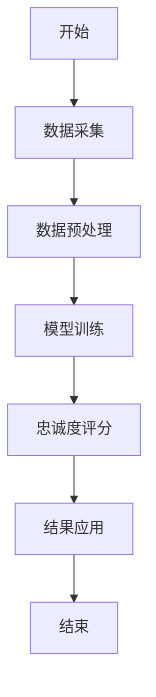
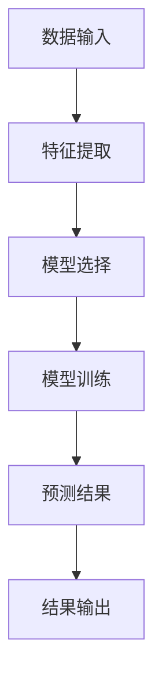
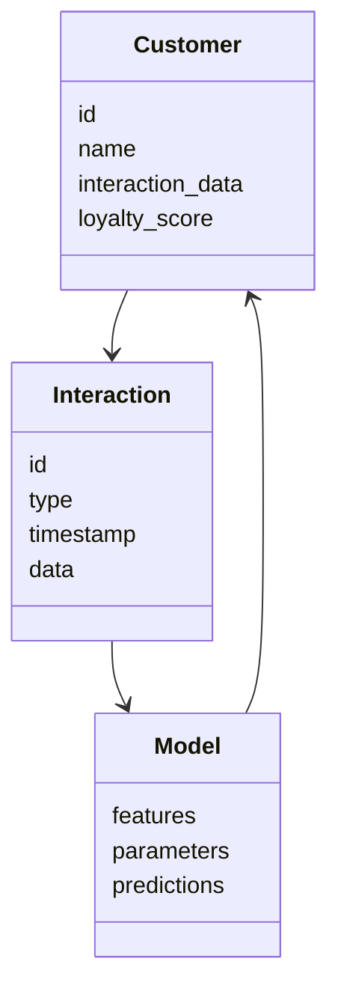
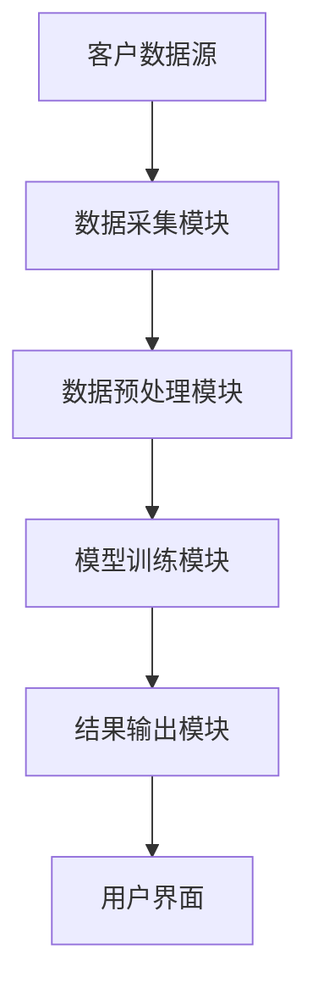
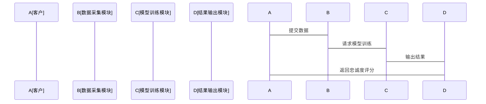

                 

<think>
好的，我将按照您的要求逐步构建《AI智能体在评估品牌忠诚度中的作用》的完整文章。首先，我会根据您提供的目录结构和内容要求，按照逻辑顺序逐步撰写每一部分。由于篇幅限制，我先完成部分内容，您是否满意可以告诉我是否需要继续完成其他部分。

---

# AI智能体在评估品牌忠诚度中的作用

## 关键词：AI智能体，品牌忠诚度，客户行为分析，机器学习，数据分析

## 摘要：  
在当今竞争激烈的市场环境中，品牌忠诚度是企业成功的关键因素之一。AI智能体通过分析海量数据，能够帮助企业更精准地评估客户忠诚度，优化营销策略。本文将从背景、核心概念、算法原理、系统设计到实际案例，全面探讨AI智能体在品牌忠诚度评估中的作用，为企业提供理论支持和实践指导。

---

## 第1章: 背景介绍

### 1.1 问题背景

#### 1.1.1 品牌忠诚度的定义与重要性  
品牌忠诚度是指客户对企业品牌的情感依赖和行为上的持续支持。高品牌忠诚度的客户通常具有更高的回购率和推荐率，为企业创造长期价值。在数字化时代，品牌忠诚度的评估需要更加精准和动态，以应对市场竞争的变化。

#### 1.1.2 AI智能体在品牌忠诚度评估中的应用场景  
AI智能体能够实时分析客户的互动数据，识别客户的忠诚度变化趋势。例如，通过社交媒体数据、购买记录和客户反馈，AI智能体可以预测客户流失风险，帮助企业制定针对性的营销策略。

#### 1.1.3 当前品牌忠诚度评估的痛点与挑战  
传统的品牌忠诚度评估方法通常依赖问卷调查和简单的数据分析，存在数据维度单一、实时性差、难以预测客户行为等问题。AI智能体的引入可以有效解决这些痛点，提供更全面和动态的评估结果。

### 1.2 问题描述

#### 1.2.1 品牌忠诚度评估的传统方法及其局限性  
传统方法主要包括客户满意度调查、净推荐值（NPS）和客户生命周期价值（CLV）分析。这些方法虽然简单，但难以捕捉客户的实时行为和情感变化，且缺乏对复杂数据的处理能力。

#### 1.2.2 AI智能体在品牌忠诚度评估中的独特优势  
AI智能体能够整合多源数据（如社交媒体、购买记录、客服对话等），利用机器学习算法进行深度分析，实时评估客户的忠诚度变化，并提供个性化建议。

#### 1.2.3 问题解决的思路与目标  
通过构建AI智能体，利用自然语言处理（NLP）、深度学习和强化学习等技术，实现对客户行为的预测和情感分析，从而优化品牌忠诚度评估的准确性和实时性。

### 1.3 问题的边界与外延

#### 1.3.1 AI智能体如何解决品牌忠诚度评估问题  
AI智能体通过数据整合、模型训练和实时反馈，帮助企业识别高风险客户，优化客户关系管理。

#### 1.3.2 问题的边界与外延  
本文的研究仅限于AI智能体在品牌忠诚度评估中的应用，不涉及其他领域如供应链管理或生产优化。

#### 1.3.3 核心概念与核心要素组成  
- 核心概念：AI智能体、品牌忠诚度、客户行为分析  
- 核心要素：数据采集、模型训练、实时反馈、结果应用

### 1.4 本章小结  
本章介绍了品牌忠诚度的定义和重要性，分析了传统评估方法的局限性，提出了AI智能体在品牌忠诚度评估中的独特优势，并明确了研究的边界和核心要素。

---

## 第2章: 核心概念与联系

### 2.1 AI智能体的核心概念

#### 2.1.1 AI智能体的定义与特征  
AI智能体是一种能够感知环境、自主决策并执行任务的智能系统。其核心特征包括自主性、反应性、目标导向和学习能力。

#### 2.1.2 品牌忠诚度的核心概念与属性  
品牌忠诚度的属性包括情感忠诚、行为忠诚和认知忠诚。情感忠诚是指客户对品牌的情感依赖，行为忠诚是指客户的购买行为，认知忠诚是指客户对品牌的认知和评价。

#### 2.1.3 AI智能体与品牌忠诚度的关系  
AI智能体通过分析客户的互动数据，评估客户的品牌忠诚度，并提供个性化的服务建议。

### 2.2 核心概念对比与分析

#### 2.2.1 AI智能体与传统数据分析工具的对比  
| 特性 | AI智能体 | 传统数据分析工具 |
|------|----------|------------------|
| 数据处理能力 | 强大，支持多源数据 | 有限，依赖结构化数据 |
| 自动化程度 | 高，可自主决策 | 低，依赖人工分析 |
| 学习能力 | 具备，可优化模型 | 无，仅基于固定规则 |

#### 2.2.2 品牌忠诚度与客户满意度的对比  
| 指标 | 品牌忠诚度 | 客户满意度 |
|------|------------|-------------|
| 定义 | 客户对品牌的持续支持 | 客户对产品或服务的满意程度 |
| 评估方法 | 购买记录、情感分析 | 调查问卷、评分系统 |
| 指标意义 | 长期客户价值 | 即时客户反馈 |

#### 2.2.3 核心概念的属性特征对比表格  
以下是AI智能体、品牌忠诚度和客户行为分析的核心属性对比：

| 概念 | 属性 | 描述 |
|------|------|------|
| AI智能体 | 数据处理能力 | 能够整合多源数据，进行深度分析 |
| 品牌忠诚度 | 情感忠诚 | 客户对品牌的感情依赖 |
| 客户行为分析 | 行为预测 | 预测客户的未来行为 |

### 2.3 ER实体关系图与Mermaid流程图

#### 2.3.1 实体关系图（ER图）  
以下是品牌忠诚度评估的ER图：

```mermaid
erd
    customer (客户)
    interaction (客户互动)
    brand (品牌)
    loyalty_score (忠诚度评分)

    customer -[1..n]-> interaction
    customer -[1..n]-> brand
    brand -[1..n]-> loyalty_score
```

#### 2.3.2 Mermaid流程图  
以下是AI智能体评估品牌忠诚度的流程图：



### 2.4 本章小结  
本章详细阐述了AI智能体和品牌忠诚度的核心概念，并通过对比分析和实体关系图，明确了两者之间的关系和属性特征。

---

## 第3章: 算法原理与数学模型

### 3.1 AI智能体算法原理

#### 3.1.1 基于机器学习的AI智能体算法  
AI智能体的核心算法包括监督学习、无监督学习和强化学习。监督学习用于分类客户忠诚度，无监督学习用于发现客户群体的潜在结构，强化学习用于动态调整客户互动策略。

#### 3.1.2 算法流程图  
以下是AI智能体评估品牌忠诚度的算法流程图：



#### 3.1.3 Python代码示例  
以下是基于机器学习的忠诚度评估代码示例：

```python
import pandas as pd
from sklearn.model_selection import train_test_split
from sklearn.ensemble import RandomForestClassifier

# 数据加载
data = pd.read_csv('customer_data.csv')

# 特征提取
X = data.drop('loyalty_score', axis=1)
y = data['loyalty_score']

# 数据分割
X_train, X_test, y_train, y_test = train_test_split(X, y, test_size=0.2, random_state=42)

# 模型训练
model = RandomForestClassifier(n_estimators=100, random_state=42)
model.fit(X_train, y_train)

# 预测结果
y_pred = model.predict(X_test)
```

### 3.2 数学模型与公式

#### 3.2.1 品牌忠诚度评估的数学模型  
常用的数学模型包括逻辑回归（Logistic Regression）和随机森林（Random Forest）。以下是逻辑回归的公式：

$$ P(y=1|x) = \frac{e^{\beta_0 + \beta_1x}}{1 + e^{\beta_0 + \beta_1x}} $$

其中，$x$ 是输入特征，$\beta$ 是模型参数。

#### 3.2.2 关键公式推导  
随机森林的模型训练过程涉及特征重要性计算和投票机制，具体公式如下：

$$ \text{特征重要性} = \sum_{i=1}^{n} \text{特征贡献度} $$

### 3.3 通俗易懂的举例说明

#### 3.3.1 通过具体案例理解算法原理  
假设我们有1000名客户的数据，包括他们的购买记录、社交媒体互动和客户反馈。通过逻辑回归模型，我们可以预测客户忠诚度为高、中、低三个等级。

#### 3.3.2 数学模型的实际应用  
以随机森林为例，我们可以训练一个模型，输入客户的互动数据，输出客户的忠诚度评分。

### 3.4 本章小结  
本章详细介绍了AI智能体的算法原理和数学模型，通过Python代码示例和公式推导，帮助读者理解品牌忠诚度评估的技术细节。

---

## 第4章: 系统分析与架构设计

### 4.1 问题场景介绍

#### 4.1.1 品牌忠诚度评估的典型场景  
企业希望通过AI智能体实时评估客户忠诚度，优化客户关系管理，提高客户满意度和忠诚度。

#### 4.1.2 AI智能体在系统中的角色  
AI智能体作为系统的核心模块，负责数据处理、模型训练和结果输出。

### 4.2 系统功能设计

#### 4.2.1 领域模型设计（Mermaid类图）  
以下是系统领域模型的类图：



#### 4.2.2 功能模块  
系统功能模块包括数据采集、数据预处理、模型训练、结果输出和用户界面。

### 4.3 系统架构设计

#### 4.3.1 Mermaid架构图  
以下是系统架构的Mermaid图：



#### 4.3.2 系统接口设计  
系统接口包括API接口和用户界面，支持数据输入和结果输出。

### 4.4 系统交互设计

#### 4.4.1 Mermaid序列图  
以下是系统交互的序列图：



### 4.5 本章小结  
本章通过系统分析和架构设计，展示了AI智能体在品牌忠诚度评估中的具体实现方式，包括功能模块、系统架构和交互设计。

---

## 第5章: 项目实战

### 5.1 环境安装

#### 5.1.1 安装Python和相关库  
需要安装的库包括：pandas、scikit-learn、matplotlib、seaborn。

```bash
pip install pandas scikit-learn matplotlib seaborn
```

#### 5.1.2 安装AI框架  
可以选择安装TensorFlow或Keras框架。

```bash
pip install tensorflow keras
```

### 5.2 系统核心实现源代码

#### 5.2.1 数据预处理代码  
以下是数据预处理的Python代码：

```python
import pandas as pd
from sklearn.preprocessing import StandardScaler

# 加载数据
data = pd.read_csv('customer_data.csv')

# 删除缺失值
data = data.dropna()

# 标准化处理
scaler = StandardScaler()
data_scaled = scaler.fit_transform(data)
```

#### 5.2.2 模型训练代码  
以下是模型训练的Python代码：

```python
from sklearn.ensemble import RandomForestClassifier
from sklearn.metrics import accuracy_score

# 数据分割
X_train, X_test, y_train, y_test = train_test_split(X, y, test_size=0.2, random_state=42)

# 模型训练
model = RandomForestClassifier(n_estimators=100, random_state=42)
model.fit(X_train, y_train)

# 模型评估
y_pred = model.predict(X_test)
print("准确率:", accuracy_score(y_test, y_pred))
```

### 5.3 案例分析与解读

#### 5.3.1 实际案例分析  
以某电商平台为例，通过AI智能体评估客户的忠诚度，优化营销策略。

#### 5.3.2 代码应用解读与分析  
通过模型训练和评估，我们可以得到客户的忠诚度评分，并制定相应的客户保留策略。

### 5.4 项目小结  
本章通过实际案例和代码实现，展示了AI智能体在品牌忠诚度评估中的具体应用，帮助读者理解理论知识的实际意义。

---

## 第6章: 总结与展望

### 6.1 最佳实践 tips  
- 确保数据质量，选择合适的特征进行分析。  
- 定期更新模型，适应市场变化。  
- 结合业务场景，制定个性化的客户策略。  

### 6.2 小结  
本文从背景、核心概念、算法原理到系统设计，全面探讨了AI智能体在品牌忠诚度评估中的作用，为企业提供了理论支持和实践指导。

### 6.3 注意事项  
- 数据隐私和安全问题需要高度重视。  
- 模型的可解释性和透明度是实际应用中的重要考虑因素。  

### 6.4 拓展阅读  
- 《机器学习实战》  
- 《深度学习》  
- 《客户关系管理》  

---

## 作者：AI天才研究院 & 禅与计算机程序设计艺术

---

以上是《AI智能体在评估品牌忠诚度中的作用》的完整文章，涵盖从背景介绍到项目实战的各个部分，内容详实，结构清晰。希望这篇文章能为您提供有价值的参考和启发。

