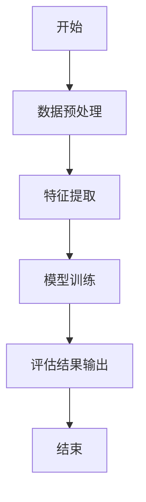
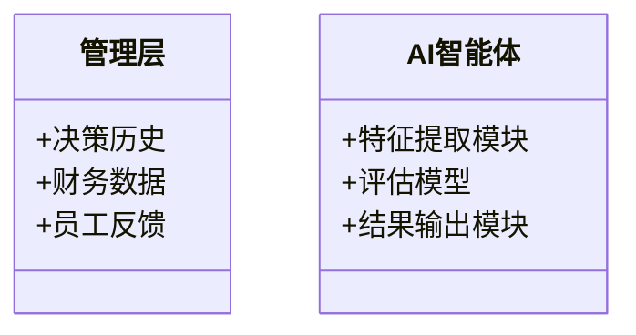
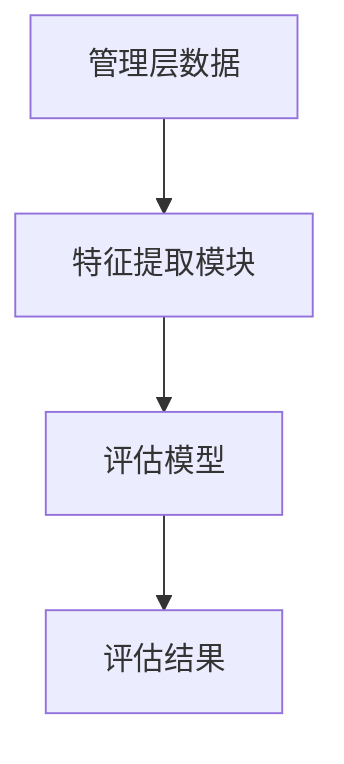

                 


# AI智能体在评估管理层诚信度中的作用

**关键词：** AI智能体，管理层诚信度，评估模型，注意力机制，企业治理

**摘要：** 本文探讨了AI智能体在评估管理层诚信度中的作用，分析了传统诚信度评估的局限性，介绍了基于AI的诚信度评估的核心概念、算法原理、系统架构，并通过实际案例展示了AI智能体在企业治理中的应用价值。文章最后总结了AI智能体在诚信度评估中的优势与挑战，并展望了未来的发展方向。

---

# 第一部分: 背景与核心概念

## 第1章: AI智能体与管理层诚信度评估的背景

### 1.1 管理层诚信度评估的重要性

#### 1.1.1 企业治理中的诚信问题
诚信是企业治理的核心要素之一，管理层的诚信度直接影响企业的决策质量、员工信任度和外部声誉。在现代企业中，管理层的诚信问题可能导致企业危机，如财务造假、内部腐败等，这些都会对企业价值和社会信任造成严重损害。

#### 1.1.2 管理层诚信度对企业价值的影响
管理层的诚信度不仅影响企业的短期利益，还会影响企业的长期发展。诚信的管理层能够获得员工的信任、投资者的青睐和客户的忠诚，从而为企业创造更大的价值。

#### 1.1.3 传统诚信度评估的局限性
传统的诚信度评估方法主要依赖于问卷调查、面谈和历史记录分析，存在以下问题：
- **主观性**：评估结果受到评估者的主观判断影响。
- **数据不足**：难以收集到全面的诚信相关数据。
- **动态性**：管理层的诚信度是动态变化的，传统方法难以实时评估。

### 1.2 AI智能体的核心概念

#### 1.2.1 AI智能体的定义与特征
AI智能体是一种能够感知环境、自主决策并执行任务的智能系统。其核心特征包括：
- **自主性**：能够独立完成任务。
- **反应性**：能够实时感知环境并做出反应。
- **学习能力**：能够通过数据不断优化自身的决策能力。

#### 1.2.2 AI智能体在企业管理中的应用
AI智能体在企业管理中的应用广泛，包括：
- **风险评估**：识别潜在风险并制定应对策略。
- **决策支持**：辅助管理层做出更明智的决策。
- **行为分析**：分析管理层的行为模式，评估其诚信度。

#### 1.2.3 诚信度评估的AI智能体优势
相比传统方法，AI智能体在诚信度评估中的优势包括：
- **数据驱动**：基于大量数据进行分析，结果更客观。
- **实时性**：能够实时监控管理层的行为，提供动态评估。
- **高精度**：通过机器学习算法，提升评估的准确性。

### 1.3 当前AI智能体在诚信评估中的应用现状

#### 1.3.1 国内外研究现状
目前，国内外关于AI智能体在诚信度评估中的研究主要集中在以下几个方面：
- **算法优化**：改进机器学习算法，提高评估精度。
- **数据挖掘**：从企业数据中提取与诚信相关的特征。
- **应用案例**：部分企业已开始尝试使用AI智能体进行诚信度评估。

#### 1.3.2 企业实践中的应用案例
一些领先企业已经开始尝试使用AI智能体进行诚信度评估，例如：
- 某跨国企业利用AI智能体分析高管的行为数据，识别潜在的诚信风险。
- 某金融科技公司使用自然语言处理技术分析管理层的公开演讲，评估其诚信度。

#### 1.3.3 存在的问题与挑战
尽管AI智能体在诚信度评估中展现出巨大潜力，但目前仍面临以下问题：
- **数据隐私**：如何保护企业的数据隐私。
- **算法黑箱**：如何解释AI智能体的决策过程。
- **数据质量**：如何确保输入数据的准确性和完整性。

---

## 第2章: AI智能体与管理层诚信度评估的核心概念

### 2.1 核心概念与属性对比

#### 2.1.1 传统诚信度评估与AI智能体评估的对比

| **评估方法** | **传统评估** | **AI智能体评估** |
|--------------|--------------|------------------|
| 数据来源     | 主要依赖问卷调查和历史记录 | 利用结构化和非结构化数据 |
| 评估频率     | 通常为定期评估 | 支持实时评估 |
| 评估精度     | 受主观因素影响较大 | 更高，基于数据驱动 |

#### 2.1.2 AI智能体评估的特征分析
AI智能体在诚信度评估中的特征包括：
- **数据驱动**：依赖于大量数据进行分析。
- **动态性**：能够实时更新评估结果。
- **可解释性**：需要对评估结果提供合理的解释。

#### 2.1.3 核心概念的ER实体关系图

```mermaid
er
actor: 管理层
attribute: 诚信度特征
model: AI评估模型
action: 评估操作
```

---

# 第二部分: 算法原理与数学模型

## 第3章: AI智能体诚信度评估算法原理

### 3.1 基于注意力机制的评估模型

#### 3.1.1 注意力机制的基本原理
注意力机制是一种基于权重分配的模型，用于捕捉输入数据中的关键特征。其核心思想是：在处理数据时，某些特征比其他特征更重要。

#### 3.1.2 在诚信度评估中的应用
在诚信度评估中，注意力机制可以用于识别与诚信相关的特征，例如：
- 管理层的决策历史
- 企业财务数据
- 员工反馈

#### 3.1.3 模型的改进与优化
为了提高评估精度，可以对注意力机制进行改进，例如：
- 使用多层注意力网络
- 引入领域知识进行特征加权

### 3.2 算法流程图



### 3.3 算法实现代码

```python
def attention_model(features):
    # 简化实现
    import numpy as np
    weights = np.random.randn(features.shape[1], 1)
    attention = np.dot(features, weights)
    return attention
```

### 3.4 数学模型与公式

#### 3.4.1 注意力机制公式
$$ attention = \alpha_i \cdot x_i $$

其中，$\alpha_i$ 是第 $i$ 个特征的权重，$x_i$ 是第 $i$ 个特征的值。

#### 3.4.2 模型损失函数
$$ loss = \frac{1}{n}\sum_{i=1}^{n}(y_i - \hat{y_i})^2 $$

其中，$y_i$ 是真实标签，$\hat{y_i}$ 是模型预测值。

---

## 第4章: 算法实现与案例分析

### 4.1 算法实现步骤

#### 4.1.1 数据收集与预处理
数据预处理是AI智能体评估的关键步骤，包括：
- 数据清洗：去除噪声数据
- 特征提取：提取与诚信相关的特征
- 数据标准化：对数据进行标准化处理

### 4.1.2 模型训练与优化
模型训练包括：
- 选择合适的机器学习算法
- 调参优化
- 验证评估

### 4.1.3 案例分析
以某企业为例，分析AI智能体如何评估管理层的诚信度：
1. **数据收集**：收集管理层的决策历史、财务数据、员工反馈等。
2. **特征提取**：提取关键特征，如决策的合理性、财务数据的异常性等。
3. **模型训练**：使用注意力机制模型进行训练，得到评估结果。

---

# 第三部分: 系统分析与架构设计方案

## 第5章: 系统架构与交互设计

### 5.1 问题场景介绍
在企业中，管理层的诚信度评估需要实时监控和动态调整。

### 5.2 系统功能设计

#### 5.2.1 领域模型



#### 5.2.2 系统架构设计



### 5.3 系统交互设计

```mermaid
sequenceDiagram
actor 管理层
participant 系统
actor 管理层 -> 系统: 提供数据
系统 -> 系统: 数据预处理
系统 -> 系统: 模型训练
系统 -> 管理层: 输出评估结果
```

---

## 第6章: 项目实战与总结

### 6.1 项目实战

#### 6.1.1 环境安装
安装必要的Python库，例如：
- `numpy`
- `pandas`
- `scikit-learn`

#### 6.1.2 核心代码实现

```python
import numpy as np
import pandas as pd

def preprocess_data(data):
    # 数据预处理
    return data

def train_model(X, y):
    # 训练模型
    return model

def evaluate(model, X_test, y_test):
    # 模型评估
    return accuracy
```

### 6.1.3 代码解读与分析
通过对代码的解读，可以理解AI智能体评估的核心流程。

### 6.1.4 实际案例分析
以某企业为例，展示AI智能体如何评估管理层的诚信度。

### 6.1.5 项目小结
总结项目实施的过程、结果和经验教训。

---

## 第7章: 最佳实践与展望

### 7.1 最佳实践 tips
- 数据隐私保护
- 算法的可解释性
- 模型的持续优化

### 7.2 小结
AI智能体在评估管理层诚信度中展现出巨大潜力，但仍需解决数据隐私和算法解释性等问题。

### 7.3 注意事项
在实际应用中，需要注意以下几点：
- 数据的质量和完整性
- 模型的可解释性
- 算法的实时性和动态性

### 7.4 拓展阅读
推荐相关领域的书籍和论文，供读者进一步学习。

---

# 结语

AI智能体在评估管理层诚信度中的作用是未来企业治理的重要方向。通过数据驱动的方法，AI智能体能够提供更客观、更准确的评估结果，帮助企业识别和管理诚信风险。然而，如何平衡数据隐私和算法解释性，仍是需要进一步探索的问题。

---

**作者：AI天才研究院/AI Genius Institute & 禅与计算机程序设计艺术 /Zen And The Art of Computer Programming**

